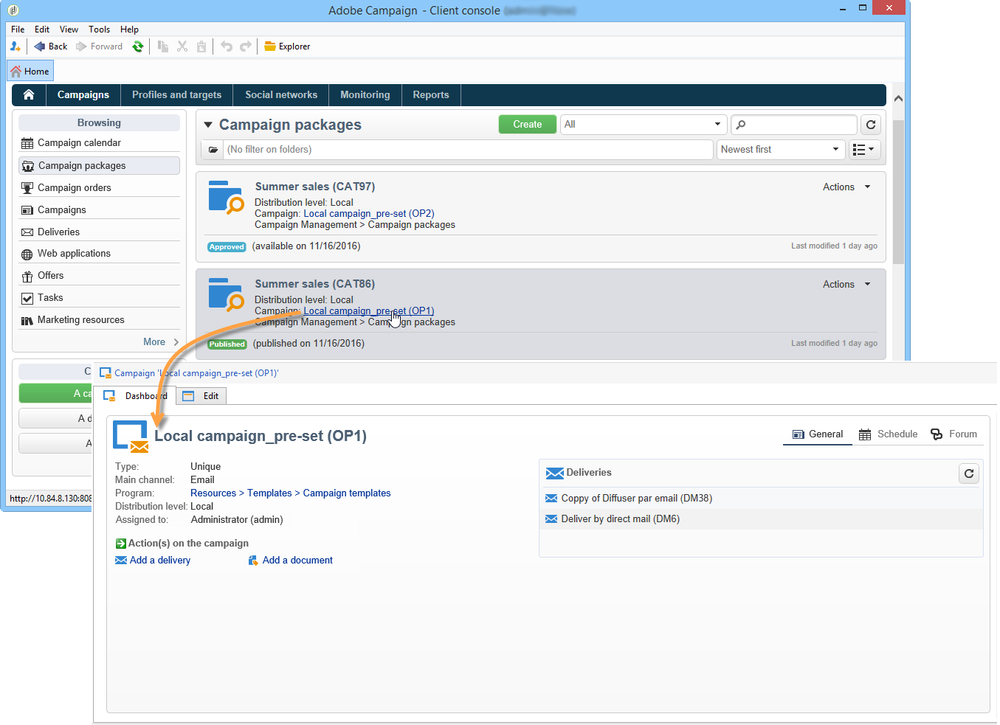

# Acceso a campañas{#accessing-campaigns}

Una vez solicitada una campaña, aprobada la solicitud y alcanzada la fecha de disponibilidad, se puede ejecutar la campaña.

Según el tipo de campaña y las opciones seleccionadas, la campaña se ejecuta de forma local o centralizada.

## Acceso a la campaña {#accessing-the-campaign}

Una vez aprobada la solicitud y alcanzada la fecha de disponibilidad, la campaña se crea de forma local y se puede utilizar. Los operadores locales reciben una notificación de su disponibilidad.

Se añade a los detalles de la solicitud coincidente y se puede editar. El tablero completo permite gestionarlo en un nivel local.

Se puede acceder a la campaña desde la información general de la Campaign, a la que se puede acceder a través del vínculo **[!UICONTROL Campaigns]** en la página principal.

## Ajustes disponibles {#available-settings}

Las entidades locales pueden adaptar el contenido de la campaña según sus necesidades, utilizando todos los elementos del tablero de campaña. Su principal tarea será adaptar el flujo de trabajo de segmentación y personalizar el contenido de envío.

## Ejecución de campañas {#campaign-execution}

Cada entidad local puede ejecutar el flujo de trabajo de campañas y realizar las aprobaciones necesarias según el proceso definido en la plantilla de la campaña.
