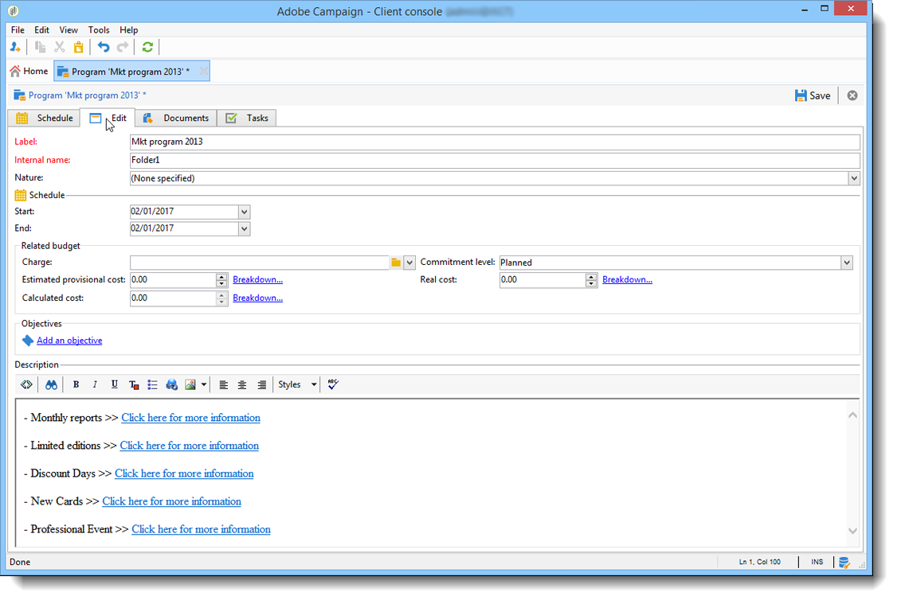
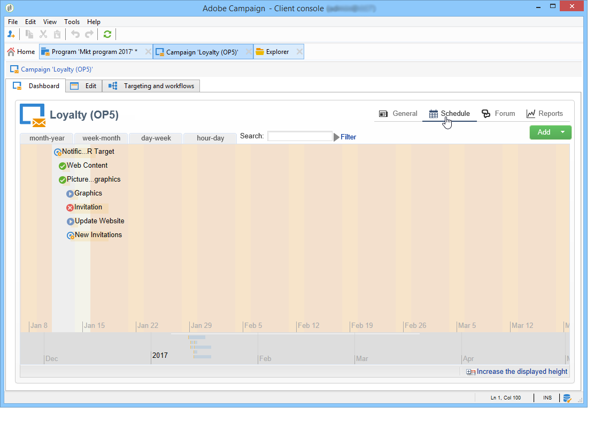

# Acceso a campañas de marketing{#accessing-marketing-campaigns}

Adobe Campaign le permite crear, configurar, ejecutar y analizar campañas de marketing. Todas las campañas de marketing se pueden administrar desde un centro de control unificado.

## Conceptos básicos de Workspace {#workspace-basics}

### Página de inicio {#home-page}

Una vez que esté conectado a Adobe Campaign, examine las distintas funciones mediante vínculos en la barra de navegación.

Los elementos de Campaign se encuentran en la pestaña **[!UICONTROL Campaigns]**: aquí puede ver una descripción general de los programas, campañas de marketing, así como sus subconjuntos. Un programa de marketing consta de campañas, que están formadas de envíos, tareas, recursos vinculados, etc. En el contexto de la administración de campañas de marketing mediante Campaign, la información sobre los envíos, los presupuestos, los revisores y los documentos vinculados se encuentran en las campañas.

El bloque **[!UICONTROL Browsing]** de la pestaña **[!UICONTROL Campaigns]** ofrece varias entradas, según los módulos instalados en la instancia. Por ejemplo, puede acceder a:

* **Calendario de campañas**: calendario de planes, programas de marketing, envíos y campañas. Consulte [Calendario de campañas](#campaign-calendar).
* **Campaigns** (campañas): acceso a las campañas contenidas en todos los programas de marketing.
* **Deliveries** (envíos): acceso a los envíos vinculados a las campañas.
* **Aplicaciones web**: acceso a aplicaciones web (formularios, páginas de destino, etc.)

>[!NOTE]
>
>Para obtener más información sobre el funcionamiento general de Adobe Campaign, los permisos y las funcionalidades de administración de perfiles, consulte [esta sección](../../platform/using/adobe-campaign-workspace.md).
>
>En [esta sección](../../delivery/using/steps-about-delivery-creation-steps.md) se describen todas las funcionalidades relacionadas con canales y envíos.

### Calendario de Campaign {#campaign-calendar}

Cada campaña pertenece a un programa que, a su vez, pertenece a un plan. Se accede a los planes, programas y campañas a través del menú **[!UICONTROL Campaign calendar]** de la pestaña **Campañas**.

Para editar un plan, programa, campaña o entrega, haga clic en su nombre en el calendario y luego haga clic en **[!UICONTROL Open...]** A continuación se muestra en una nueva pestaña, como se muestra a continuación:

Puede filtrar la información que se muestra en el calendario de campañas: haga clic en **[!UICONTROL Filter]** y seleccione los criterios de filtrado.

>[!NOTE]
>
>Cuando filtra una fecha, se muestran todas las campañas con una fecha de inicio posterior a la fecha especificada o con una fecha de finalización anterior a la fecha especificada. Seleccione las fechas utilizando los calendarios a la derecha de cada campo.

También puede utilizar el campo **[!UICONTROL Search]** para filtrar los elementos mostrados.

Los iconos vinculados a cada elemento permiten ver su estado: terminado, en curso, en edición, etc.

### Exploración en un programa de marketing {#browsing-in-a-marketing-program}

Campaign le permite administrar un conjunto de programas creados a partir de diferentes campañas de marketing. Cada campaña contiene envíos y los procesos y recursos asociados.

#### Exploración de un programa {#browsing-a-program}

Al editar un programa, utilice las pestañas que se describen a continuación para explorarlo y configurarlo.

* La pestaña **Programación** muestra el calendario de programas de un mes, una semana o un día según la pestaña en la que haga clic en el encabezado del calendario.

  Si es necesario, puede crear una campaña, un programa o una tarea a través de esta página.

  

* La pestaña **Editar** permite personalizar el programa: nombre, fechas de inicio y finalización, presupuesto, documentos vinculados, etc.

  

#### Exploración de campañas {#browsing-campaigns}

Se puede acceder a las campañas a través del calendario de campañas, de la pestaña **[!UICONTROL Schedule]** del programa o de la lista de campañas.

1. Mediante el calendario de campañas, seleccione la campaña que desee visualizar y luego haga clic en el vínculo **[!UICONTROL Open]**.

   

   La campaña se abre en una nueva pestaña, como se muestra a continuación:

   

1. A través de la pestaña **[!UICONTROL Schedule]** del programa, la forma de editarlo es la misma que a través del calendario de campañas.
1. Mediante el vínculo **[!UICONTROL Campaigns]** de la pestaña **[!UICONTROL Campaigns]**, haga clic en el nombre de la campaña que desee editar.

   

### Control de una campaña {#controlling-a-campaign}

#### Tablero {#dashboard}

Para cada campaña, los trabajos, recursos y envíos están centralizados en una sola pantalla, el panel, que permite administrar las acciones de marketing en colaboración con otros usuarios.

El panel de una campaña se utiliza como interfaz de control. Accede a las principales fases de creación y gestión de campañas directamente: envíos, extracción de archivos, notificaciones, presupuestos, etc.

Con Adobe Campaign, se pueden configurar procesos de colaboración para la creación y aprobación de las distintas etapas de marketing y de comunicación de las campañas: la aprobación del presupuesto, el objetivo, el contenido, etc.

>[!NOTE]
>
>La configuración de las plantillas de campaña se presenta en [Plantillas de campañas](../../campaign/using/marketing-campaign-templates.md#campaign-templates).

#### Programación {#schedule}

Una campaña unifica un conjunto de envíos. Para cada campaña, la programación ofrece una vista global de todos los componentes: esto permite mostrar las tareas y los envíos y acceder a ellos fácilmente.

#### Foro {#forum}

Para cada campaña, los operadores pueden intercambiar mensajes a través de un foro dedicado.

Obtenga más información en los [Foros de debate](../../mrm/using/discussion-forums.md).

#### Informes {#reports}

El vínculo **[!UICONTROL Reports]** permite acceder a los informes de campaña.

>[!NOTE]
>
>Los informes se describen en [esta sección](../../reporting/using/about-adobe-campaign-reporting-tools.md).

#### Configuración {#configuration}

Las campañas se crean mediante plantillas de campaña. Puede configurar plantillas reutilizables para las que algunas opciones están seleccionadas y otras configuraciones ya están guardadas. Para cada campaña, se ofrece la siguiente funcionalidad:

* Referencia a [documentos y recursos](../../campaign/using/marketing-campaign-deliveries.md#managing-associated-documents): puede asociar documentos con la campaña (resumen, informes, imágenes, etc.). Se admiten todos los formatos de documento.
* Definición de costes: para cada campaña, Adobe Campaign permite definir las [entradas de coste y las estructuras de cálculo de costes](../../campaign/using/providers-stocks-and-budgets.md#defining-cost-categories) que se pueden utilizar al crear la campaña de marketing. Por ejemplo: costes de impresión, uso de una agencia externa, alquiler de salas.
* Definición de objetivos: puede definir objetivos cuantificables para una campaña, por ejemplo: número de suscriptores, volumen comercial, etc. Esta información se utiliza más tarde en los informes de campaña.
* Administración de [direcciones semilla](../../delivery/using/about-seed-addresses.md) y [grupos de control](../../campaign/using/marketing-campaign-deliveries.md#defining-a-control-group).
* Administrar aprobaciones: puede seleccionar los tratamientos que desea aprobar y, si es necesario, seleccionar los operadores o grupos de operadores revisores. [Más información](../../campaign/using/marketing-campaign-approval.md#checking-and-approving-deliveries)

>[!NOTE]
>
>Para acceder a las configuraciones de campaña y realizar cambios, en la pestaña **[!UICONTROL Advanced campaign parameters...]**, haga clic en el vínculo **[!UICONTROL Edit]**.

## Uso de la interfaz web {#using-the-web-interface-}

Puede acceder a las pantallas de la consola de Adobe Campaign a través de un explorador de internet para ver todas las campañas y envíos, así como informes e información sobre los perfiles de la base de datos. Este acceso no permite la creación de registros. Según los derechos de los operadores, puede ver o actuar en los datos de la base de datos. Por ejemplo: puede aprobar el contenido de las campañas y su segmentación, reiniciar o detener una entrega, etc.

1. Inicie sesión a través de https://`<your instance>:<port>/view/home`.
1. Utilice los menús para acceder a las descripciones generales.

   

Además de desplazarse por las campañas y verlas, puede realizar estos tipos de tareas:

* Monitorización de la actividad en una instancia
* Participar en los procesos de validación, por ejemplo, aprobar o rechazar un contenido de entrega
* Realizar otras acciones rápidas como, por ejemplo, pausar un flujo de trabajo
* Acceder a todas las funciones de creación de informes
* Participar en debates en foros

Esta tabla resume las acciones que se pueden realizar en las campañas desde un explorador:

| Página  | Acción |
| --- | --- |
| Lista de campañas, envíos, ofertas, etc. | Eliminar un elemento de lista |
| Campaña | Cancelar una campaña |
| Entrega | Aprobar el contenido de entrega y el destino Enviar el contenido de la entrega Confirmar una entrega Pausar y detener un envío |
| Aplicación web | Crear una aplicación web Editar el contenido y las propiedades de la aplicación Guardar el contenido de la aplicación como una plantilla Publicar la aplicación |
| Oferta | Aprobar el contenido de la oferta y los requisitos Desactivación de una oferta en línea |
| Tarea | Finalizar una tarea Cancelar una tarea |
| Recursos de marketing | Aprobar un recurso Bloqueo y desbloqueo de un recurso |
| Paquete de campañas | Enviar un paquete para su aprobación Aprobar o rechazar un paquete Cancelar un paquete |
| Pedido de la campaña | Crear un pedido Aceptar o rechazar un pedido <!-- Je n'ai pas pu créer de campaign order pour vérifier cela. Peut-on accéder à ces fonctionnalités depuis l'accès web ? --> |
| Stock | Eliminar una línea de stock |
| Simulación de oferta | Inicio y parada de una simulación |
| Flujo de trabajo de direccionamiento | Iniciar, pausar y detener un flujo de trabajo |
| Informe | Guardar los datos actuales en el historial de informes |
| Foro | Agregar una conversación Responder a un mensaje en una conversación Siga la conversación y cancele la suscripción |

### Aprobaciones

Las aprobaciones (de un destino o contenido de envío, por ejemplo) se pueden llevar a cabo mediante el acceso a la web.

También puede utilizar el vínculo incluido en los mensajes de notificación. Para obtener más información, consulte [Comprobación y aprobación de envíos](../../campaign/using/marketing-campaign-approval.md#checking-and-approving-deliveries).
