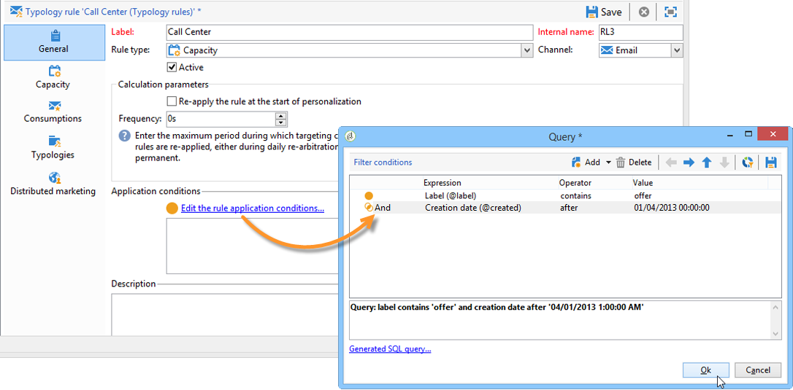

# Aplicación de reglas{#applying-rules}

## Aplicación de una tipología a un envío {#applying-a-typology-to-a-delivery}

Para aplicar las reglas de tipología creadas, debe asociarlas a una tipología y, a continuación, hacer referencia a esta tipología en su envío. Para ello:

1. Cree una tipología de campaña.

   Se puede acceder a las tipologías a través del **[!UICONTROL Administration > Campaign Management > Typology management]** > **[!UICONTROL Typologies]** nodo.

1. Go to the **[!UICONTROL Rules]** tab, click the **[!UICONTROL Add]** button and select the rules to apply with this typology.

   

1. Guarde la tipología: se añade a la lista de tipologías existentes.
1. Abra el envío al que desee aplicar las reglas.
1. Open the delivery properties and access the **[!UICONTROL Typology]** tab.
1. Seleccione la tipología en la lista desplegable.

   

   >[!NOTE]
   >
   >La tipología se puede definir en la plantilla de envío para que se aplique automáticamente a todos los envíos creados con esta plantilla.

## Definición de condiciones de aplicación {#defining-application-conditions}

Puede restringir el campo de aplicación de una regla según sus necesidades (excepto para reglas de control).

Puede configurar las reglas de tipología para que influyan solo sobre algunos envíos a los que están vinculados o ciertos destinatarios a los que va dirigidos un envío.

Para definir las condiciones de aplicación de una regla, haga clic en el **[!UICONTROL Edit the rule application conditions...]** vínculo de la **[!UICONTROL General]** ficha.

A continuación, utilice el editor de consultas para definir las condiciones de filtrado. En el siguiente ejemplo, la regla de capacidad respeta solo los envíos con la palabra “oferta” en su etiqueta o los envíos creados antes del 1 de abril de 2013.

>[!NOTE]
>
>En el caso de las reglas de filtrado, puede seleccionar la condición de aplicación de los criterios de filtrado: pueden depender del envío o de la descripción del envío. Para obtener más información sobre esto, consulte [Acondicionamiento de una regla](../../campaign/using/filtering-rules.md#conditioning-a-filtering-rule)de filtrado.

## Ajuste de la frecuencia de cálculo {#adjusting-calculation-frequency}

La mediación se vuelve a ejecutar automáticamente cada noche a través del flujo de trabajo de limpieza de la base de datos. Sin embargo, los valores se pueden guardar más allá de este periodo.

De hecho, algunos cálculos utilizan valores que no cambian diariamente. Por lo tanto, sería irrelevante recalcular los datos todos los días y sobrecargar la base de datos para nada. Por ejemplo, si un proceso enriquece la base de datos de marketing con puntuaciones de tendencia de los clientes y adquiere información cada semana, no es necesario recalcular los datos basados en estos valores todos los días.

To do this, the **[!UICONTROL Frequency]** field of the **[!UICONTROL General]** tab lets you define a maximum period during which targeting is saved. De forma predeterminada, el valor **0** indica que el cálculo sigue siendo válido hasta la siguiente ejecución de mediación diaria.

To save the results beyond this period, enter a value greater than 12 in the **[!UICONTROL Frequency]** field: once this period expires, all rules are re-applied.

The **[!UICONTROL Re-apply the rule at the start of personalization]** option lets you apply the rule automatically during the personalization phase, including if the period stated in the **[!UICONTROL Frequency]** field is still valid.

## Selección de la fase de la aplicación de regla {#selecting-the-rule-application-phase}

Las reglas de tipología se aplican en una secuencia específica durante las fases de objetivo, análisis y personalización de los envíos correspondientes.

### Orden de ejecución {#execution-order}

En el modo de operación estándar, las reglas se aplican en la siguiente secuencia:

1. Reglas de control, si se aplican al principio del objetivo.
1. Reglas de filtrado:

   * Reglas de aplicación nativas para la revisión de direcciones: dirección definida/dirección no verificada/dirección en lista negra/dirección en cuarentena/calidad de la dirección.
   * Reglas de filtrado definidas por el usuario.
   * Deduplicación sobre la dirección o el identificador (se aplica si es necesario).

1. Reglas de presión.
1. Reglas de capacidad.
1. Reglas de control, si se aplican al final del objetivo.
1. Reglas de control, si se aplican al inicio de la personalización. Si las reglas de usuario (filtrado/presión/capacidad) han caducado y necesitan ser recalculadas, se aplican durante este paso.
1. Reglas de control, si se aplican al final de la personalización.

>[!NOTE]
>
>Si trabaja con el módulo Campaign Interaction, las reglas de elegibilidad se aplican al mismo tiempo que las reglas de filtrado (para ofertas encontradas en las descripciones de envío) o durante la fase de personalización, durante la llamada al motor de ofertas.

You can adapt the execution sequence of rules which have the same type using the appropriate field in the **[!UICONTROL General]** tab of the rule. When several rules are executed during the same message processing phase, you can configure their execution sequence in the **[!UICONTROL Execution sequence]** field.

Por ejemplo, una regla de presión con un orden de ejecución de 20 se ejecuta antes que una regla de presión con un orden de ejecución de 30.

### Reglas de control {#control-rules}

For **[!UICONTROL Control]** rules, you can decide at which point of the delivery life cycle the rule will be applied (before or after targeting, at the start of personalization, at the end of the analysis). Select the value to apply in the drop-down list of the **[!UICONTROL Phase]** field, in the **[!UICONTROL General]** tab of the typology rule.

Los valores posibles son:

* **[!UICONTROL At the start of targeting]**

   Para evitar que el paso de personalización se ejecute en caso de errores, puede aplicar la regla de control aquí.

* **[!UICONTROL After targeting]**

   Si necesita conocer el volumen del destino para aplicar la regla de control, seleccione esta fase.

   For example, the **[!UICONTROL Check proof size]** control rule applies after each targeting stage: this rule prevents message personalization if there are too many proof recipients.

* **[!UICONTROL At the start of personalization]**

   Esta fase debe estar seleccionada si el control afecta a la aprobación de la personalización de mensajes. La personalización del mensaje se lleva a cabo durante la fase de análisis.

* **[!UICONTROL At the end of the analysis]**

   Cuando una comprobación requiera que se complete la personalización de mensajes, seleccione esta fase.

## Configuraciones adicionales {#additional-configurations}

### Control del tráfico SMTP saliente {#control-outgoing-smtp-traffic}

As an option, you can use the **[!UICONTROL Managing affinities with IP addresses]** field to link deliveries to the delivery server (MTA) this affinity. Esto permite limitar el número de correos electrónicos para envíos específicos hacia equipos o direcciones de salida.

>[!NOTE]
>
>Affinity management does not apply for **[!UICONTROL Filtering]** typologies.\
>Las afinidades se definen en el archivo de configuración de la instancia, en el servidor de Adobe Campaign. Para obtener más información, consulte [esta sección](../../installation/using/about-initial-configuration.md).

### Optimización de campaña y marketing distribuido {#campaign-optimization-and-distributed-marketing}

The **[!UICONTROL Distributed Marketing]** tab lets you define the re-mapping of typologies and/or rules which applies when a shared campaign is ordered and/or reserved. Las reglas o tipologías definidas para una entidad local (vinculadas a las reglas o tipologías definidas a nivel de la entidad central) sustituyen a las reglas o tipologías vinculadas a la entidad central. La reasignación le permite adaptar las reglas de la entidad central a las entidades locales que encargan la campaña.

>[!NOTE]
>
>In typologies and typology rules, the **[!UICONTROL Distributed Marketing]** tab is added if your license includes this option: please check you license agreement.\
>Para obtener más información sobre la mercadotecnia distribuida, consulte [Acerca de la mercadotecnia](../../campaign/using/about-distributed-marketing.md)distribuida.

