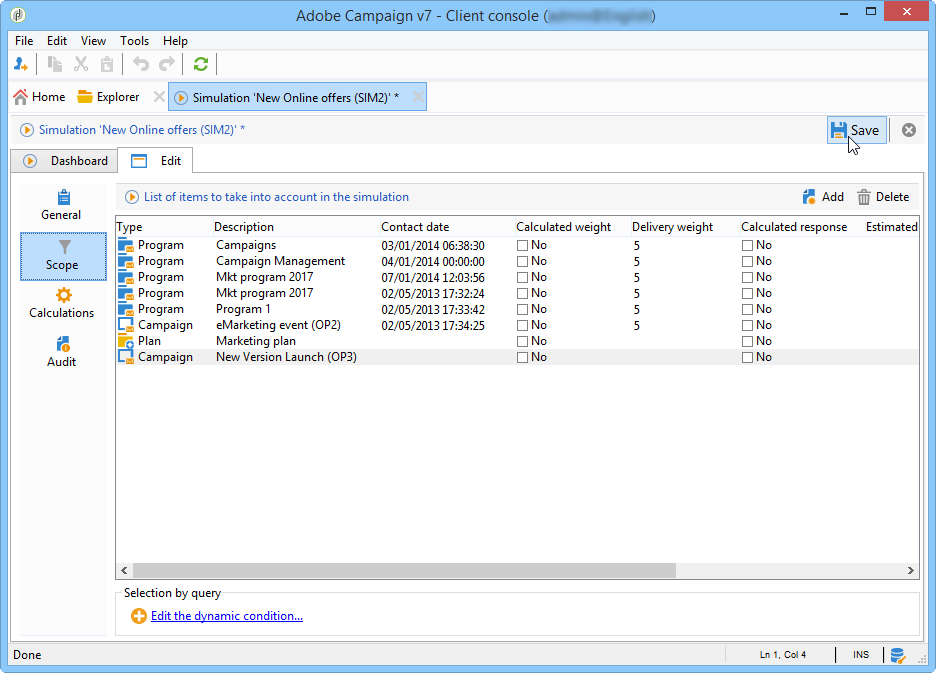

# Simulaciones en Campaign{#campaign-simulations}

## Acerca de las simulaciones {#about-simulations}

La optimización de campañas permite probar la eficacia de un plan de campaña utilizando simulaciones. Esto le permite medir el éxito potencial de una campaña: ingresos generados, volumen de objetivo en función de las reglas de tipología aplicadas, etc.

La simulación permite controlar y comparar el impacto de los envíos.

>[!NOTE]
>
>Los envíos preparados en modo de prueba no se afectan entre sí, por ejemplo al evaluar una campaña en marketing distribuido o siempre que los envíos no estén programados en el calendario provisional.\
>This means that pressure and capacity rules are only applied to deliveries in **[!UICONTROL Target estimation and message personalization]** mode. No se tienen en cuenta las entregas en **[!UICONTROL Estimation and approval of the provisional target]** y en **[!UICONTROL Target evaluation]** modo.\
>The delivery mode is chosen in the **[!UICONTROL Typology]** sub-tab of the delivery properties.

## Configuración de una simulación {#setting-up-a-simulation}

### Creación de una simulación {#creating-a-simulation}

Para crear una simulación, aplique los pasos siguientes:

1. Vaya al **[!UICONTROL Campaigns]** universo, haga clic en el **[!UICONTROL More]** vínculo dentro de la **[!UICONTROL Create]** sección y seleccione la **[!UICONTROL Simulation]** opción.

   

1. Introduzca la plantilla y el nombre de la simulación. Haga clic **[!UICONTROL Save]** para crear la simulación.

   

1. Click the **[!UICONTROL Edit]** tab to configure it.

   

1. In the **[!UICONTROL Scope]** tab, specify the deliveries you want to consider for this simulation. To do this, click the **[!UICONTROL Add]** button and specify the delivery selection mode to take into account.

   

   Puede seleccionar cada envío manualmente u ordenarlos por campaña, programa o plan.

   >[!NOTE]
   >
   >Si selecciona envíos a través de un plan, programa o campaña, Adobe Campaign puede actualizar automáticamente la lista de envíos a tener en cuenta cuando se inicie una simulación. Para ello, marque la **[!UICONTROL Refresh the selection of deliveries each time the simulation is started]** opción.
   >  
   >Si no lo hace, los envíos que no estén disponibles en el plan, programa o campaña cuando se cree la simulación no se tienen en cuenta: los envíos añadidos posteriormente se omiten.

   

1. Seleccione los elementos que desea incluir en el ámbito de simulación. Si es necesario, seleccione varios elementos utilizando las teclas Shift y Ctrl.

   

   Haga clic en **[!UICONTROL Finish]** para aprobar la selección.

   Puede combinar manualmente los envíos seleccionados y los envíos que pertenezcan a planes, programas o campañas.

   

   If necessary, you can use a dynamic condition via the **[!UICONTROL Edit the dynamic condition...]** link

   Haga clic **[!UICONTROL Save]** para aprobar esta configuración.

   >[!CAUTION]
   >
   >Al calcular las simulaciones, solo se tienen en cuenta las entregas cuyo objetivo se haya calculado (estados: **Target listo** o **listo para la entrega**).

1. In the **[!UICONTROL Calculations]** tab, select an analysis dimension such as the recipient schema for example.

   

1. A continuación, puede añadir expresiones.

   

### Ajustes de ejecución {#execution-settings}

The **[!UICONTROL General]** tab of the simulation lets you enter execution settings:

* The **[!UICONTROL Schedule execution for down-time]** option defers the simulation launch to a less busy time period, based on the chosen level of priority. Las simulaciones utilizan recursos de base de datos significativos, por lo que las simulaciones que no son urgentes deben programarse para su ejecución durante la noche, por ejemplo.
* The **[!UICONTROL Priority]** is the level applied to the simulation to delay its triggering.
* **[!UICONTROL Save SQL queries in the log]**. Los registros SQL permiten diagnosticar una simulación si termina con errores. También pueden ayudarle a descubrir por qué una simulación es demasiado lenta. These messages will be visible after the simulation in the **[!UICONTROL SQL logs]** sub-tab of the **[!UICONTROL Audit]** tab.

## Ejecución de una simulación {#executing-a-simulation}

### Inicio de una simulación {#starting-a-simulation}

Una vez definido el ámbito de simulación, puede ejecutarlo.

To do this, open the simulation dashboard and click **[!UICONTROL Start simulation]**.

Once execution is complete, open the simulation and click the **[!UICONTROL Results]** tab to view the targets calculated for each delivery.

1. The **[!UICONTROL Deliveries]** sub-tab lists all deliveries taken into account by the simulation. Muestra dos recuentos:

   * The **[!UICONTROL Initial count]** is the target as it was calculated during its estimation in the delivery.
   * The **[!UICONTROL Final count]** is the number of recipients counted after simulation.

      La diferencia entre los recuentos inicial y final refleja la aplicación de las distintas reglas o filtros configurados antes de la simulación.

      To learn more about this calculation, edit the **[!UICONTROL Exclusions]** sub-tab.

1. The **[!UICONTROL Exclusions]** sub-tab lets you view the exclusion break-down.

   

1. The **[!UICONTROL Alerts]** sub-tab groups all alert messages generated during the simulation. Los mensajes de alerta se pueden enviar en caso de sobrecarga de capacidad (si el número de destinatarios supera la capacidad del conjunto, por ejemplo).
1. The **[!UICONTROL Exploration of the exclusions]** sub-tab lets you create a result analysis table. El usuario debe indicar variables en los ejes de abscisas y ordenadas.

   For an example of analysis table creation, refer to the end of [Exploring results](#exploring-results).

### Consulta de resultados {#viewing-results}

#### Auditoría {#audit}

The **[!UICONTROL Audit]** tab lets you monitor simulation execution. The **[!UICONTROL SQL Logs]** sub-tab is useful for expert users. Muestra los registros de ejecución en formato SQL. These logs are only displayed if the **[!UICONTROL Save SQL queries in the log]** option has been selected in the **[!UICONTROL General]** tab before simulation execution.

#### Exploración de resultados {#exploring-results}

The **[!UICONTROL Exploration of the exclusions]** sub-tab lets you analyze the data resulting from a simulation.

El análisis descriptivo se detalla en [esta sección](../../reporting/using/about-adobe-campaign-reporting-tools.md).

## Resultados de una simulación {#results-of-a-simulation}

The indicators in the **[!UICONTROL Log]** and **[!UICONTROL Results]** tabs provide a first overview of simulation results. For a more detailed view of results, open the **[!UICONTROL Reports]** tab.

### Informes {#reports}

Para analizar el resultado de una simulación, edite sus informes: en ellos se muestran las exclusiones y las causas.

Los siguientes informes se ofrecen de forma predeterminada:

* **[!UICONTROL Detail of simulation exclusions]** :: en este informe se presenta un gráfico detallado de las causas de exclusión de todas las entregas afectadas.
* **[!UICONTROL Simulation summary]** :: este informe muestra las poblaciones excluidas de la simulación a lo largo de las distintas entregas.
* **[!UICONTROL Summary of exclusions linked to the simulation]** :: este informe muestra un gráfico de las exclusiones causadas por la simulación junto con la regla de tipología aplicada y un gráfico que muestra el índice de exclusión por regla.

>[!NOTE]
>
>Puede crear nuevos informes y agregarlos a los ofrecidos. Para obtener más información, consulte [esta sección](../../reporting/using/about-adobe-campaign-reporting-tools.md).

To access reports, click the **[!UICONTROL Reports]** link of the targeted simulation via its dashboard.

You can also edit reports using the **[!UICONTROL Reports]** link accessible from the simulation dashboard.

### Comparación de simulaciones {#comparing-simulations-}

Cada vez que se ejecuta una simulación, el resultado reemplaza los resultados anteriores: no puede mostrar y comparar los resultados de una ejecución a otra.

Para comparar los resultados, debe utilizar los informes. De hecho, Adobe Campaign permite guardar un historial de informes para consultarlos de nuevo más tarde. Este historial se guarda a lo largo del ciclo de vida de las simulaciones.

**Ejemplo:**

1. Cree una simulación sobre un envío al que se aplique la tipología **A**.
1. En la **[!UICONTROL Reports]** ficha, edite uno de los informes disponibles, como **[!UICONTROL Detail of simulation exclusions]** por ejemplo.
1. En la sección superior derecha del informe, haga clic en el icono para crear un nuevo historial.

   

1. Cierre la simulación y cambie la configuración de tipología **A**.
1. Vuelva a ejecutar la simulación y compare el resultado con el que se muestra en el informe para el que se creó el historial.

   

   Puede guardar tantos historiales de informes como sea necesario.

### Ejes de notificación {#reporting-axes}

The **[!UICONTROL Calculations]** tab lets you define reporting axes on the target. Theses axes will be used during result analysis (refer to [Exploring results](#exploring-results)).

>[!NOTE]
>
>Se recomienda definir los ejes de cálculo en las plantillas de simulación en lugar de individualmente para cada simulación.\
>Simulation templates are saved in the **[!UICONTROL Resources > Templates > Simulation templates]** node of the Adobe Campaign tree.

**Ejemplo:**

En el siguiente ejemplo, deseamos crear un eje de informes adicional basado en el estado de los destinatarios (“Cliente”, “Cliente potencial” o ninguno).

1. To define a reporting axis, select the table which contains the information to be processed in the **[!UICONTROL Analysis dimension]** field. Esta información es obligatoria.
1. Aquí, deseamos seleccionar el campo Segmento de la tabla de destinatarios.

   

1. Estas son las opciones disponibles:

   * **[!UICONTROL Generate target overlap statistics]** permite recuperar todas las estadísticas de superposición en el informe de simulación. Las superposiciones son destinatarios a quienes se han dirigido al menos dos envíos dentro de una simulación.

      >[!CAUTION]
      >
      >Si selecciona esta opción, el tiempo de ejecución de la simulación aumenta considerablemente.

   * **[!UICONTROL Keep the simulation work table]** permite mantener seguimientos de simulación.

      >[!CAUTION]
      >
      >El guardado automático de estas tablas requiere una capacidad de almacenamiento importante: asegúrese de que la base de datos es lo suficientemente grande.

When the simulation results are displayed, the information on the selected expression will be displayed in the **[!UICONTROL Overlaps]** sub-tab.

La superposición de destinatarios del envío indican que han estado presentes en al menos dos envíos de una simulación.

>[!NOTE]
>
>This sub-tab is only displayed if the **[!UICONTROL Generate target recovery statistics]** option has been enabled.

The information on reporting axes can be processed in exclusion analysis reports created in the **[!UICONTROL Exploring exclusions]** sub-tab. For more on this, refer to [Exploring results](#exploring-results).
