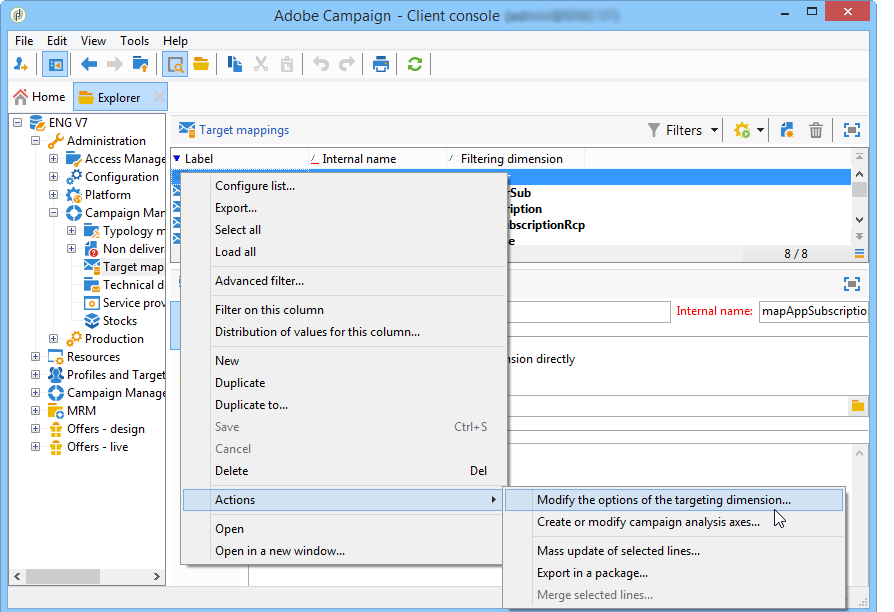

# Configuración{#configuration}

Esta sección está destinada a las personas responsables de configurar la gestión de respuestas. Supone una cierta cantidad de conocimiento sobre la ampliación de esquemas, la definición de flujos de trabajo y la programación SQL.

Esto le permite comprender cómo adaptar el modelo de datos estándar a la naturaleza específica de una tabla de transacciones externa a Adobe Campaign con una tabla simple. Esta tabla simple puede coincidir con tablas simples disponibles en Adobe Campaign o con otra tabla.

La hipótesis de medición se lanza desde el flujo de trabajo del proceso de operación (**[!UICONTROL operationMgt]**). Cada hipótesis representa un proceso independiente ejecutado de forma asíncrona con un estado de ejecución (que se está editando, pendiente, terminado, fallido, etc.) y controlado por un programador que administra restricciones de prioridad, la restricción de la cantidad de procesos simultáneos, la página de la actividad baja y la ejecución automática con la frecuencia.

## Configuración de esquemas {#configuring-schemas}

>[!CAUTION]
>
>No modifique los esquemas estándar de la aplicación, sino que utilice el mecanismo de extensión de esquema. De lo contrario, los esquemas modificados no se actualizarán en el momento de futuras actualizaciones de la aplicación. Esto puede provocar un mal funcionamiento al utilizar Adobe Campaign.

Se requiere la integración de la aplicación antes de utilizar el módulo de reacción para definir las distintas tablas (transacciones, detalles de transacción) que se deben medir así como su relación con las entregas, ofertas y personas.

### Esquemas estándar {#standard-schemas}

El esquema predeterminado **[!UICONTROL nms:remaMatch]** contiene la tabla de registro de reacción, es decir, la relación entre personas, hipótesis y tablas de transacciones. Este esquema se utilizará como esquema de herencia para la tabla de destino final de los registros de reacción.

El esquema **[!UICONTROL nms:remaMatchRcp]** también se considera como estándar, contiene el almacenamiento de registros de reacción para los destinatarios de Adobe Campaign (**[!UICONTROL nms:recipient]**). Para poder utilizarlo, se deberá extender para que se asigne a una tabla de transacción (que contenga compras, etc.).

### Tablas de transacciones y detalles de transacciones {#transaction-tables-and-transaction-details}

La tabla de transacciones debe incluir vínculos directos hacia las personas.

También puede agregar una tabla que contenga detalles de transacciones. Esto no se vincula directamente a las personas.

Si utilizamos un recibo por ejemplo, una tabla de transacción está vinculada a un contacto (tabla de recibo) y una tabla de líneas de recibo solo está vinculada a la tabla de recibo (tabla de detalles). A continuación, puede configurar la hipótesis directamente en el nivel en el que la tabla de líneas de recibo está vinculada a la tabla de recepción.

>[!NOTE]
>
>Si desea mantener el identificador de recibo que describe el comportamiento esperado en la hipótesis, puede ampliar la plantilla de tabla nms:remaMatchRcp para añadir el identificador (en este caso, no se vincula ningún cálculo de ROI a estos campos).

Recomendamos añadir una fecha de evento.

El esquema siguiente muestra las uniones entre las distintas tablas una vez completada la configuración:


### El Gestor de respuestas con los destinatarios de Adobe Campaign {#response-management-with-adobe-campaign-recipients}

En este ejemplo, integramos una tabla de compras en nuestro módulo de gestión de respuestas mediante la tabla de destinatarios de Adobe Campaign (**[!UICONTROL nms:recipient]**).

La tabla de registros de respuesta de un destinatario **[!UICONTROL nms:remaMatchRcp]** se amplía para agregar un vínculo al esquema de tabla de compras. En el ejemplo siguiente, la tabla de compra se llama **demo:purchase**.

1. Mediante el explorador de Adobe Campaign, seleccione **[!UICONTROL Administration]** > **[!UICONTROL Campaign management]** > **[!UICONTROL Target mappings]**.
1. Haga clic con el botón secundario en **Destinatario** y luego seleccione **[!UICONTROL Actions]** y **[!UICONTROL Modify the options of the targeting dimensions]**.

   

1. Puede personalizar **[!UICONTROL Extension namespace]** en la siguiente ventana y, a continuación, haga clic en **[!UICONTROL Next]**.

   

1. En la categoría **[!UICONTROL Response management]**, asegúrese de que la casilla **[!UICONTROL Generate a storage schema for reactions]** está seleccionada.

   A continuación, haga clic en **[!UICONTROL Define additional fields...]** para seleccionar las tablas de transacción relacionadas y añada los campos deseados a la extensión del esquema nms:remaMatchRcp.

   

El esquema creado tiene este aspecto:

```
<srcSchema _cs="Reactions (Recipients) (cus)" entitySchema="xtk:srcSchema" extendedSchema="nms:remaMatchRcp" 
img="nms:remaMatch.png" implements="xtk:persist" label="Reactions (Recipients)" mappingType="sql"
name="remaMatchRcp" namespace="cus">  
 <element label="Reactions (Recipients)" name="remaMatchRcp">    
  <key internal="true" name="match">      
   <keyfield xlink="hypothesis"/>      
   <keyfield xlink="broadLog"/>      
   <keyfield xlink="proposition"/>    
  </key>    
  <attribute label="Quantity" name="quantity" type="long"/>    
  <element name="purchase" target="demo:purchase" type="link"/>    
  <element name="hypothesis" revLabel="Reactions (Recipients)" revLink="remaMatchRcp"/>    
  <element applicableIf="HasPackage('nms:coreInteraction')" label="Proposition" name="proposition" target="nms:propositionRcp" type="link"/>   
  <element desc="Message (Delivery log)" label="Message" name="broadLog" target="nms:broadLogRcp" type="link"/>    
  <element label="Respondent" name="responder" target="nms:recipient" type="link"/>  
 </element>  
 <createdBy _cs="Administrator (admin)"/>  
 <modifiedBy _cs="Administrator (admin)"/>
</srcSchema>
```

### Gestión de respuestas con una tabla de destinatarios personalizada {#response-management-with-a-personalized-recipient-table}

En este ejemplo, integramos una tabla de compras en nuestro módulo de gestión de respuestas utilizando una tabla de individuos distinta a la tabla de destinatarios disponible en Adobe Campaign.

* Crear un nuevo esquema de registro de respuestas derivado del esquema **[!UICONTROL nms:remaMatch]**.

   Dado que la tabla de personas es diferente de la de los destinatarios de Adobe Campaign, es necesario crear un nuevo esquema de registros de respuestas basado en el esquema **[!UICONTROL nms:remaMatch]**. Luego complételo con vínculos hacia los registros de envío y la tabla de compras.

   En el siguiente ejemplo, utilizaremos el esquema **demo:broadLogPers** y la tabla de transacciones **demo:purchase**:

   ```
   <srcSchema desc="Linking of a recipient transaction to a hypothesis"    
   img="nms:remaMatch.png" label="Responses on persons" labelSingular="Responses on a person" name="remaMatchPers" namespace="nms">
     <element name="remaMatchPers" template="nms:remaMatch">
       <key internal="true" name="match">
         <keyfield xlink="hypothesis"/>
        <keyfield xlink="purchase"/>
       </key>
   
       <element name="hypothesis" revLabel="Response logs for persons" revLink="remaMatchPers"/>
       <element applicableIf="HasPackage('nms:interaction')" label="Proposition" name="proposition"
                target="demo:propositionPers" type="link"/>
       <element label="Delivery log" name="broadLog" target="demo:broadLogPers" type="link"/>
     </element>
   </srcSchema>
   ```

* Modificar el formulario de hipótesis en el esquema **[!UICONTROL nms:remaHypothesis]**.

   De forma predeterminada, la lista de registros de respuestas se puede ver en los registros de destinatarios. Por lo tanto, deberá modificar el formulario de hipótesis para poder ver los nuevos registros de respuestas creados durante el paso anterior.

   Por ejemplo:

   ```
    <container type="visibleGroup" visibleIf="[context/@remaMatchStorage]= 'demo:remaMatchPers'">
                 <input hideEditButtons="true" img="nms:remaMatch.png" nolabel="true" refresh="true"
                  toolbarCaption="Responses generated by the hypothesis" type="linklist"
                  xpath="remaMatchPers">
             <input xpath="[.]"/>
             <input xpath="@controlGroup"/>
           </input>
      </container> 
   ```

## Administración de indicadores {#managing-indicators}

El módulo Gestor de respuestas incluye una lista de indicadores predefinidos. Sin embargo, puede agregar otros indicadores de medición personalizados.

Para ello, debe ampliar la tabla de hipótesis insertando dos campos para cada nuevo indicador:

* el primero para la población de destino,
* el segundo para el grupo de control.

Por ejemplo:

```
<srcSchema entitySchema="xtk:srcSchema" extendedSchema="nms:remaHypothesis" label="Measurement hypothesis" 
md5="1D4DED54FF8EC2432AED6736EDE6F547" name="remaHypothesis" namespace="demo" xtkschema="xtk:srcSchema">  
    <element name="remaHypothesis">    
        <element name="indicators">      
            <!-- Quantity -->      
            <attribute label="Total contacted" name="contactReactedTotalQuantity" type="long"/>
            <attribute label="Total number of people in the control group" name="proofReactedTotalquantity" type="long"/> 
        </element> 
    </element>
</srcSchema>
```
