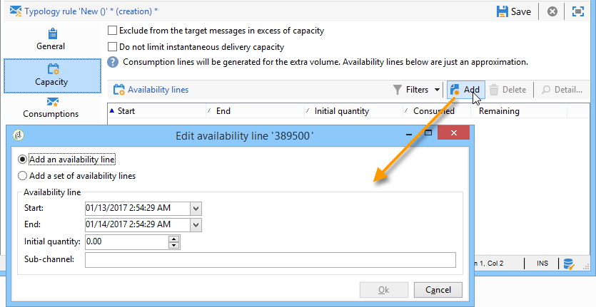
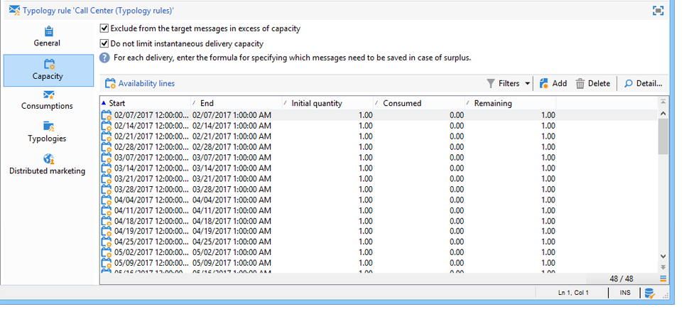

# Reglas de coherencia{#consistency-rules}

## Acerca de las reglas de coherencia {#about-consistency-rules}

Adobe Campaign garantiza comunicaciones coherentes gracias a un conjunto de reglas contenidas en tipologías de campaña. Su objetivo es controlar los envíos que se realizan a los destinatarios como, por ejemplo, volumen, tipo, relevancia, etc.

Las reglas de **capacidad**, por ejemplo, pueden evitar la sobrecarga en la plataforma correspondiente de envío de mensajes. Por ejemplo, las ofertas especiales que contienen un vínculo de descarga no deben enviarse a demasiadas personas a la vez para evitar saturar el servidor; las campañas telefónicas no deben superar la capacidad de procesamiento de los centros de llamadas, etc. For more on this, refer to [Controlling capacity](#controlling-capacity).

## Control de la capacidad {#controlling-capacity}

Antes de enviar mensajes, debe asegurarse de que su organización tiene la capacidad de procesar el envío (infraestructura física), las respuestas que puede generar el envío (mensajes entrantes) y el número de llamadas que se realizan para ponerse en contacto con los suscriptores (capacidad de procesamiento del centro de llamadas), por ejemplo.

To do this, you need to create **[!UICONTROL Capacity]** typology rules.

En el siguiente ejemplo, creamos una regla de tipología para una campaña de fidelización telefónica. Restringimos el número de mensajes a 20 por día, es decir, la capacidad de procesamiento diaria de un centro de llamadas. Una vez aplicada la regla a dos envíos, podemos monitorizar el consumo mediante registros.

Para diseñar una regla de capacidad nueva, siga los pasos a continuación:

1. Bajo el **[!UICONTROL Administration > Campaign management > Typology management > Typology rules]** nodo, haga clic en **[!UICONTROL New]**.
1. Seleccione un tipo **[!UICONTROL Capacity]** de regla.

   

1. In the **[!UICONTROL Capacity]** tab, create the availability lines: in our example, these are time periods during which calls can be made. Seleccione un periodo de 24 horas e introduzca 150 en la cantidad inicial, lo que significa que el centro de llamadas puede gestionar 150 llamadas al día.

   

   >[!NOTE]
   >
   >Las líneas de disponibilidad solo tienen fines informativos. Si necesita excluir mensajes cuando se alcance el límite de capacidad, consulte [esta sección](#exclude-messages-when-capacity-limit-reached).

1. Asocie esta regla a una tipología y luego haga referencia a la misma en su envío para aplicar esta regla de capacidad. Para obtener más información, consulte [esta sección](../../campaign/using/applying-rules.md#applying-a-typology-to-a-delivery).
1. You can monitor consumption from the rule **[!UICONTROL Consumptions]** and **[!UICONTROL Capacity]** tabs.

   When a rule is used in a delivery, the **[!UICONTROL Consumed]** and **[!UICONTROL Remaining]** columns provide information on the load, as shown below:

   

   Para obtener más información, consulte [esta sección](#monitoring-consumption).

## Definición de la carga máxima {#defining-the-maximum-load}

Para definir la carga máxima, debe definir las líneas de disponibilidad. To do this, two options are available: you can manually create one or more availability lines (refer to [Adding availability lines one by one](#adding-availability-lines-one-by-one)) or create availability ranges. La frecuencia de estos períodos de tiempo se puede automatizar (consulte [Agregar un conjunto de líneas](#add-a-set-of-availability-lines)de disponibilidad).

### Adición de líneas de disponibilidad una por una {#adding-availability-lines-one-by-one}

Para crear una línea de disponibilidad, haga clic en el **[!UICONTROL Add]** botón y seleccione **[!UICONTROL Add an availability line]**. Introduzca el periodo de disponibilidad y la carga disponible.

Añada tantas líneas como requiera su capacidad de procesamiento.

### Adición de un conjunto de líneas de disponibilidad {#add-a-set-of-availability-lines}

Para definir períodos de disponibilidad para un tiempo determinado, haga clic en el **[!UICONTROL Add]** botón y seleccione la **[!UICONTROL Add a set of availability lines]** opción. Indique una duración para cada periodo de tiempo y el número de periodos que desea crear.

To automate the frequency of page creation, click the **[!UICONTROL Change]** button and define time period scheduling.

Por ejemplo, defina una programación para crear periodos de disponibilidad para todos los días laborables a una velocidad de 10 llamadas por hora entre 9 a. m. y 5 p. m. Para ello, siga los siguientes pasos:

1. Seleccione el tipo de periodicidad y los días y horas de validez:

   

1. Indique las fechas de validez:

   

1. Compruebe la programación antes de aprobarla:

   

The **[!UICONTROL Forecasting]** workflow automatically creates all matching lines.

>[!NOTE]
>
>Recomendamos la creación de líneas de disponibilidad a través de las importaciones de archivos. Esta pestaña le permite consultar y comprobar las líneas de consumo.

## Exclusión de mensajes al alcanzar el límite de capacidad {#exclude-messages-when-capacity-limit-reached}

Las líneas de disponibilidad solo tienen fines informativos. Para excluir mensajes excesivos, marque la **[!UICONTROL Exclude from the target messages in excess of capacity]** opción. Esto evita que se supere la capacidad. Para la misma población que en el ejemplo anterior, es posible que el consumo y la capacidad restante no superen la cantidad inicial:

El número de mensajes que se va a procesar se reparte de forma equitativa durante el intervalo de disponibilidad definido. Esto es especialmente relevante para los centros de llamadas, ya que el número máximo de llamadas al día es limitado. In the case of email deliveries, the **[!UICONTROL Do not limit instantaneous delivery capacity]** option lets you ignore this availability range and send your emails at the same time.

>[!NOTE]
>
>En caso de sobrecarga, los mensajes guardados se seleccionan según la fórmula definida en las propiedades de envío.

## Monitorización del consumo {#monitoring-consumption}

De forma predeterminada, las reglas de capacidad solo tienen fines ilustrativos. Seleccione la **[!UICONTROL Exclude messages in excess of capacity from the target]** opción para evitar que se supere la carga definida. En este caso, los mensajes sobrantes se excluyen automáticamente de los envíos utilizando esta regla de tipología.

To monitor consumptions, view the values displayed in the **[!UICONTROL Consumed]** column of the **[!UICONTROL Capacity]** tab in the typology rule.

To view consumption lines, click the **[!UICONTROL Consumptions]** tab in the rule.
