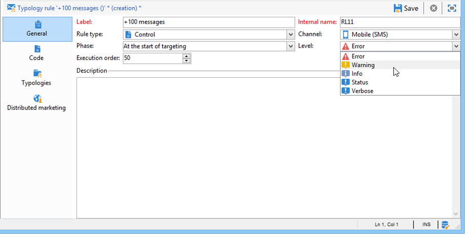

# Reglas de control{#control-rules}

## Reglas de control de análisis y mediación {#analysis-and-arbitration-control-rules}

Las reglas de control permiten garantizar la validez y calidad de los mensajes antes del envío: visualización de caracteres, tamaño de SMS, formato de dirección, etc.

Un conjunto de reglas predeterminadas permite realizar comprobaciones habituales. Estas comprobaciones (que aparecen en negrita en la interfaz) son:

* **[!UICONTROL Object approval]** (correo electrónico): comprueba que el objeto y la dirección del remitente no contienen caracteres especiales que puedan causar problemas en determinados agentes de correo.
* **[!UICONTROL URL label approval]** (correo electrónico): comprueba que cada URL de seguimiento tiene una etiqueta.
* **[!UICONTROL URL approval]** (correo electrónico): comprueba las direcciones URL de seguimiento (presencia del carácter &quot;&amp;&quot;).
* **[!UICONTROL Message size approval]** (móvil): comprueba el tamaño de los mensajes SMS.
* **[!UICONTROL Validity period check]** (correo electrónico): comprueba que el período de validez de la entrega es lo suficientemente largo como para enviar todos los mensajes.
* **[!UICONTROL Proof size check]** (todos los canales): genera un mensaje de error si la población de destino de prueba supera los 100 destinatarios.
* **[!UICONTROL Wave scheduling check]** (correo electrónico): comprueba que la última oleada de entregas está programada para iniciarse antes del final del período de validez, si la entrega se desglosa en varias olas.
* **[!UICONTROL Unsubscription link approval]** (correo electrónico): comprueba la presencia de al menos una URL de cancelación de suscripción (exclusión) en cada contenido (HTML y texto).

## Creación de una regla de control {#creating-a-control-rule}

Es posible crear nuevas reglas de control para adaptarlas a sus necesidades. To do this, create a **[!UICONTROL Control]** typology rule and enter the control formula in SQL in the **[!UICONTROL Code]** tab.

**Ejemplo:**

En el siguiente ejemplo creamos una regla para evitar que una oferta SMS se envíe a más de 100 destinatarios. Esta regla se vincula a una tipología de campaña y luego a los envíos de SMS para los que la oferta relacionada está disponible.

Siga estos pasos:

1. Cree una regla de **[!UICONTROL Control]** tipología. Seleccione un nivel **[!UICONTROL Warning]** de alerta.

   

1. In the **[!UICONTROL Code]** tab, enter the script to apply the desired threshold, as shown below:

   

   Esta secuencia de comandos activa una advertencia si el envío supera los 100 destinatarios:

   ```
   if( delivery.FCP == false && delivery.properties.toDeliver > 100 ) { logWarning("Significant number of SMS to deliver (" + delivery.properties.toDeliver + "). Please make sure the target is correct.") return false; } return true
   ```

1. Vincule esta regla a una tipología de campaña y haga referencia a la tipología en el envío de SMS correspondiente.

   

1. Durante el análisis de envío, se aplica la regla y se crea una advertencia si procede.

   

   Sin embargo, el envío está listo para realizarse.

   Si aumenta el nivel de alerta, esto impide que se inicie el envío.

   

   At the end of the analysis, the **[!UICONTROL Confirm delivery]** button will not be available.

   

