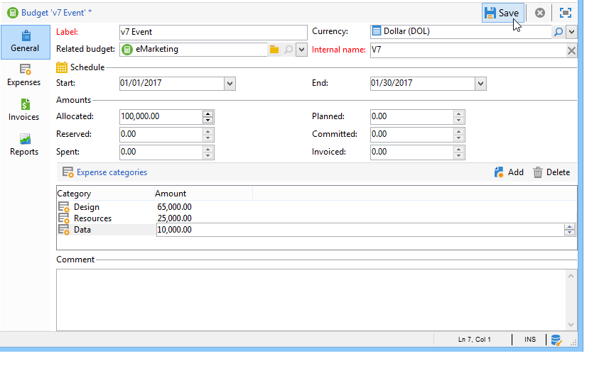

# Control de costes{#controlling-costs}

## Acerca del control de costes {#about-cost-control}

Adobe Campaign permite controlar los costes de marketing programados, comprometidos y facturados y descomponerlos por categoría mediante el módulo Gestor de recursos de marketing.

Los costes comprometidos para los distintos procesos de una campaña se cobran a un presupuesto establecido de antemano por el departamento de marketing. Las cantidades se pueden desglosar en varias categorías para facilitar la comprensión de la información y proporcionar informes más detallados sobre las inversiones de marketing.

La administración y el seguimiento de presupuestos están centralizados en un nodo específico del árbol de Adobe Campaign. Esto permite controlar las cantidades asignadas, reservadas, comprometidas y gastadas desde la misma vista y para todos los presupuestos.

Se deben aplicar los pasos siguientes para implementar la administración del presupuesto utilizando MRM:

1. Definición del presupuesto

   Para obtener más información, consulte [Creación de un presupuesto](#creating-a-budget).

1. Definición del método de cálculo de costes

   Las estructuras de costes se definen para los proveedores de servicios. [Crear un proveedor de servicios y sus categorías de costes](../../campaign/using/providers--stocks-and-budgets.md#creating-a-service-provider-and-its-cost-categories).

1. Definición de costes de campaña (entregas/tareas)

   Los costes incurridos por las solicitudes y las tareas se introducen de forma individual o global para la plantilla de campaña. [Cálculo de costes y stock](../../campaign/using/marketing-campaign-deliveries.md#calculation-of-costs-and-stocks).

1. Consolidación

   Según el estado de progreso de las tareas, entregas y campañas, los costes se calculan y se transfieren al presupuesto correspondiente.

   When the creation of the campaign is sufficiently advanced, the progress status of the campaign budget can be changed to **[!UICONTROL Specified]**. El coste calculado del programa se introduce automáticamente con el coste calculado de la campaña. [Compromiso, cálculo y cobro de costes](#cost-commitment--calculation-and-charging).

## Creación de un presupuesto {#creating-a-budget}

Budgets are created in the map, via the **[!UICONTROL Campaign management > Budgets]** node. The **[!UICONTROL New]** button in the toolbar lets you create a budget.

* Adición de un nuevo presupuesto

   Click the **[!UICONTROL New]** icon, name and save the budget.

* Introducción de la cantidad inicial

   Indique la cantidad asignada en el campo correspondiente. Las demás cantidades se introducen automáticamente. Consulte [Cálculo de importes](#calculating-amounts).

* Definición del periodo de validez

   Especifique las fechas de inicio y finalización. Esta información es meramente ilustrativa.

* Gastos

   Cree las categorías de gastos a las que se pueden vincular los costes asignados a este presupuesto para campañas, tareas, etc. Consulte [Categorías de gastos](#expense-categories).

   

>[!NOTE]
>
>Puede seleccionar un presupuesto relacionado.
>
>Para obtener más información, consulte [Vinculación de un presupuesto a otro](#linking-a-budget-to-another).

### Cálculo de cantidades {#calculating-amounts}

Cada presupuesto se define por una cantidad inicial que se reducirá con los costes de las diversas campañas, entregas o tareas relacionadas una vez que se han programado o llevado a cabo. El estado de las cantidades (programadas, reservadas, comprometidas, invertidas o facturadas) depende del tipo de coste y del nivel de compromiso definido en la campaña, entrega o tarea.

>[!NOTE]
>
>The amounts entered for the categories must match the budget envelope defined in the **[!UICONTROL Allocated]** field.

Para las campañas, según el nivel de compromiso, se puede planear, comprometer o reservar un coste para una acción futura.

>[!CAUTION]
>
>When a campaign is created, the progress status in **[!UICONTROL Budget]** must be set to **[!UICONTROL Defined]** for the costs to be taken into account on execution. If the status is **[!UICONTROL Being edited]**, the costs will not be consolidated.
>   
>The option **[!UICONTROL Commitment level]** represents a projection of costs into the future before they are charged to the budget. Según el progreso de una campaña, tarea o entrega, puede optar por asignar un nivel de compromiso más alto o más bajo (1. Planificado, 2. Reservado, 3. Comprometido) utilizando el cuadro combinado.

Por ejemplo: el coste previsto estimado de una campaña Web es de 45 000 euros.

For the campaign, when the budget creation status is set to **[!UICONTROL Defined]**, the real cost of the campaign (or, if none, the computed cost) will be carried over into the budget totals.

According to the level of commitment of the campaign budget, the amount will be entered in the **[!UICONTROL Planned]**, **[!UICONTROL Reserved]** or **[!UICONTROL Committed]** field.

Se puede modificar el nivel de compromiso:

* in the **campaign** level, in the **[!UICONTROL Budget]** window, found in the **[!UICONTROL Edit]** tab. Es donde se configuran los presupuestos, los costes y los gastos.
* in the **tasks** level, in the **[!UICONTROL Expenses and revenues]** window.

When the budget is **[!UICONTROL Reserved]**, the update is performed automatically for the charged budget.

El procedimiento es el mismo en el nivel de tarea.

When an expenditure gives rise to an invoice and the invoice is paid, its amount is then entered in the **[!UICONTROL Invoiced]** field.

### Categorías de gastos {#expense-categories}

Las cantidades se pueden distribuir en varias categorías de gastos para facilitar la comprensión de los datos y para obtener información más detallada sobre las inversiones de marketing. The expense categories are defined during budget creation, via the **[!UICONTROL Budgets]** node of the tree.

To add a category, click the **[!UICONTROL Add]** button in the lower section of the window.

Puede seleccionar una categoría de las existentes o definir una nueva categoría introduciéndola directamente en el campo. Cuando confirme la información introducida, un mensaje de confirmación le permite agregar esta categoría a la lista de categorías existentes y asociarla con una naturaleza en caso necesario. Esta información se utiliza en los informes de presupuesto.

### Vinculación de un presupuesto a otro {#linking-a-budget-to-another}

Puede vincular un presupuesto a un presupuesto principal. To do this, select the main budget in the **[!UICONTROL related budget]** field of the secondary budgets.

Se agrega una pestaña adicional al presupuesto principal para mostrar la lista de presupuestos relacionados.

Esta información se transfiere a los informes de presupuesto.

## Adición de líneas de gastos {#adding-expense-lines}

Las líneas de gastos se añaden automáticamente al presupuesto. Se crean durante el análisis de entrega y cuando finaliza una tarea.

Para cada campaña, entrega o tarea, los costes generados se agrupan en las líneas de coste del presupuesto al que se cobran. Estas líneas de gasto se crean según las líneas de coste del proveedor de servicios correspondiente y calculan a través de las estructuras de coste asociadas.

Cada línea de coste contiene la siguiente información:

* La campaña y la entrega o tarea con la que está relacionado
* La cantidad calculada a partir de las estructuras de coste o el coste provisional estimado
* Coste real de la entrega o la tarea correspondientes
* La línea de factura correspondiente (solo MRM)
* Lista de los costes calculados por categoría de coste (si existe una estructura de coste)

En el ejemplo anterior, la línea de gastos editada contiene los costes calculados para la entrega de **nuevas tarjetas** para la campaña de **Loyalty Spring Pack.** When the delivery is edited, the **[!UICONTROL Direct Mail]** tab lets you see how the expense line is calculated.

El cálculo de costes de esta entrega se basa en las categorías de costes seleccionadas para el proveedor de servicios:

Según las categorías de costes seleccionadas, se aplican las estructuras de costes correspondientes para calcular las líneas de costes. En este ejemplo, para el proveedor de servicios correspondiente, las estructuras de coste son las siguientes:

>[!NOTE]
>
>Las categorías y estructuras de coste se presentan en [Creación de un proveedor de servicios y sus categorías de coste](../../campaign/using/providers--stocks-and-budgets.md#creating-a-service-provider-and-its-cost-categories).

## Compromiso, cálculo y cobro de costes {#cost-commitment--calculation-and-charging}

Los costes se pueden comprometer para entregas y tareas. El estado de un coste se actualiza en función del progreso del proceso con el que se relacione.

### Proceso de cálculo de costes {#cost-calculation-process}

Los costos se dividen en tres categorías:

1. Coste estimado provisional

   El coste estimado provisional es una estimación de los costes de los procesos de la campaña. Mientras se esté editando, las cantidades introducidas no se consolidan. It must have **[!UICONTROL Specified]** status for the amounts input to be taken into account in the calculations.

   Esta cantidad se introduce de forma manual y puede dividirse en varias categorías de gastos. To bread down a cost, click the **[!UICONTROL Breakdown...]** link, and then the **[!UICONTROL Add]** button to define a new amount.

   

   Puede asociar cada coste con una categoría para que el desglose del coste por categoría de gastos se pueda ver más tarde en el presupuesto relacionado y en los informes de presupuesto.

1. Coste calculado

   El coste calculado depende del elemento en cuestión (campaña, entrega, tarea, etc.) y su estado (en proceso de edición, en curso, terminado). En cualquier caso, si se especifica el coste real, el coste calculado utiliza esa cantidad.

   Si no se indica el coste real, se aplican las siguientes reglas:

   * Para una campaña que se está editando, el coste calculado es el coste estimado provisional de la campaña o, si el coste no está definido, el coste calculado es la suma de todos los costes provisionales de las solicitudes y tareas de la campaña. Si la campaña termina, el coste calculado de la campaña es la suma de todos los costes calculados.
   * En el caso de las entregas que aún no se hayan analizado, el coste calculado es el coste estimado provisional. Si ya se ha realizado el análisis, el coste calculado es la suma de todos los costes calculados desde el servicio, teniendo en cuenta estructuras de costes y el número de destinatarios objetivo.
   * Para una tarea en curso, el coste calculado utiliza el coste estimado provisional. Si la tarea ha finalizado, el coste calculado es la suma de todos los costes calculados a partir de las estructuras de coste del proveedor de servicios y el número de días completados.
   * Para el plan de marketing, como en el programa, el coste calculado es la suma de los costes calculados para las campañas. Si no se especifican estos costes, el coste calculado utiliza los costes estimados provisionales.
   >[!NOTE]
   >
   >The **[!UICONTROL Breakdown]** link lets you view the details of the calculation and the last cost calculation date.

1. Coste real

   El coste real se introduce de forma manual y, si es necesario, se desglosa en distintas categorías de gastos.

### Cálculo y cobro {#calculation-and-charging}

Los costes se calculan a través de las estructuras de coste y se cobran según los presupuestos seleccionados en las campañas, las entregas o las tareas correspondientes.

Se puede realizar una verificación de las cantidades comprometidas a las campañas a través de la aprobación del presupuesto. Se pueden crear tareas adicionales de control de estilo en una campaña para configurar otras aprobaciones. Consulte [Tipos de tareas](../../campaign/using/creating-and-managing-tasks.md#types-of-task).

### Ejemplo {#example}

Creemos una campaña con:

* Entrega de correo directo con las estructuras de coste de un proveedor de servicios
* Una tarea con un coste fijo
* Una tarea con un coste diario

#### Paso 1: Creación del presupuesto {#step-1---creating-the-budget}

1. Create a new budget via the **[!UICONTROL Campaign management > Budgets]** node.

1. Define a budget of 10,000 Euros in the **[!UICONTROL Allocated]** field of the **[!UICONTROL Amounts]** section. Añada dos categorías de gastos en la sección inferior de la ventana:

#### Paso 2: Configuración del proveedor de servicios y definición de las estructuras de coste {#step-2---configuring-the-service-provider-and-defining-the-cost-structures}

1. Cree un proveedor de servicios y una plantilla de servicio con su estructura de coste del nodo **[!UICONTROL Administration > Campaigns]**. Para obtener más información sobre esto, consulte [Crear un proveedor de servicios y sus categorías de costes](../../campaign/using/providers--stocks-and-budgets.md#creating-a-service-provider-and-its-cost-categories).

   For direct mail deliveries, create cost categories **[!UICONTROL Envelopes]** (types 114x229 and 162x229), **[!UICONTROL Postage]** and **[!UICONTROL Print]** (types A3 and A4). A continuación, cree las siguientes estructuras de coste:

   

1. Agregue un coste fijo (en las categorías de coste) cuyo cálculo sea fijo y cuya cantidad esté vacía (en la estructura de coste correspondiente) y que se especifique individualmente para cada entrega.

   

   Para las tareas, cree las dos siguientes categorías de coste:

   * **[!UICONTROL Room reservation]** (Habitación pequeña y habitación grande), con una estructura de costes **fija** de 300 y 500 euros:
   

   * **[!UICONTROL Creation]** (**Tipo de plantilla** de contenido), con una estructura de costes **diarios** de 300 euros:
   

#### Paso 3: Asignación del presupuesto a la campaña {#step-3---charging-the-budget-in-the-campaign}

1. Cree una campaña y seleccione el presupuesto creado en el paso 1.

   >[!NOTE]
   >
   >De manera predeterminada, el presupuesto seleccionado para el programa se aplica a todas las campañas del programa.

   

1. Especifique el coste provisional estimado, con desglose:

   

1. Click **[!UICONTROL Ok]** and then **[!UICONTROL Save]** to confirm this information. El coste calculado de la campaña se actualiza con el coste provisional estimado.

#### Paso 4: Creación de la entrega de correo directo {#step-4---creating-the-direct-mail-delivery}

1. Cree un flujo de trabajo para la campaña y coloque las actividades de consulta para seleccionar el objetivo (deben especificarse las direcciones postales de los destinatarios).

1. Cree una entrega de correo directo y seleccione el proveedor de servicios creado en el paso 2: las categorías de coste se muestran automáticamente.

1. Sobrescriba el coste de los sobres y agregue un coste fijo. Seleccione también las categorías que le interesen.

   

   >[!NOTE]
   >
   >Si no se utiliza una de las categorías de coste, esta no genera gastos.

1. Inicie el flujo de trabajo que acaba de crear para iniciar el análisis y calcular los costes.

   

1. Si la aprobación del presupuesto está habilitada para esta campaña, apruebe el presupuesto desde el panel. Puede comprobar la aprobación de las categorías de coste.

   

La línea de gastos relativa a la entrega se agrega en la pestaña **[!UICONTROL Edit > Budget]** de la campaña. Edítela para ver los detalles del cálculo.

El coste calculado para la entrega se actualiza con esta información:

Al editar el coste calculado, puede comprobar el desglose del coste y el estado y la fecha del cálculo de los costes.

#### Paso 5: Creación de tareas {#step-5---creating-tasks}

A esta campaña, agregaremos las dos tareas para las que se crearon las estructuras de costo anteriormente (consulte [Paso 2 - Configurar el proveedor de servicios y definir las estructuras de coste](#step-2---configuring-the-service-provider-and-defining-the-cost-structures)). To do this, in the campaign dashboard, click the **[!UICONTROL Add a task]** button. Name the task and click **[!UICONTROL Save]**.

1. La tarea se agrega entonces a la lista. Debe editarla para configurarla.

1. In the **[!UICONTROL Properties]** tab, select the service and the corresponding cost category:

   

1. Next, click the **[!UICONTROL Expenses and revenue]** icon of the task and specify the estimated provisional cost.

   

   Una vez que se ha guardado la tarea, el coste calculado se especifica con el valor introducido para el coste provisional estimado.

   When the task is completed (status **[!UICONTROL Finished]** ), the calculated cost is automatically updated with the cost of the Large Room as entered in its cost structure. Este coste también aparece en esta categoría en el desglose.

1. A continuación, cree una segunda tarea siguiendo el mismo procedimiento, programada para cinco días y relacionada con la estructura de coste creada anteriormente.

   

   Cuando finalice la tarea, el coste calculado se especifica con el valor de la estructura de coste relacionada, por ejemplo: 1500 euros en nuestro ejemplo (5 días x 300 euros):

   

#### Paso 6: Actualización del estado del presupuesto de la campaña {#step-6---update-the-campaign-budget-status}

When the campaign is configured, its status can be updated by setting it to **[!UICONTROL Specified]**. El coste calculado de la campaña indica la suma de los costes calculados de la entrega y las tareas de la campaña:

#### Aprobación del presupuesto {#budget-approval}

Cuando se activa la aprobación, un vínculo especial permite aprobar el presupuesto desde el panel de campañas. Este vínculo se muestra cuando se ha iniciado el flujo de trabajo de objetivos, y requiere la aprobación de la entrega de correo directo.

Puede hacer clic en el vínculo para conceder o rechazar la aprobación, o utilizar el vínculo del mensaje de correo electrónico de notificación si se ha activado la notificación para esta campaña.

Cuando el presupuesto se ha aprobado y ha concluido la entrega, los costes se cargan automáticamente mediante un flujo de trabajo técnico especial.

## Pedidos y facturas {#orders-and-invoices}

En el contexto de MRM, puede guardar pedidos con un proveedor de servicios y emitir facturas. El ciclo de vida completo de estos pedidos y facturas se puede administrar mediante la interfaz de Adobe Campaign.

### Creación de pedidos {#order-creation}

To save a new order with a service provider, click the **[!UICONTROL MRM > Orders]** node of the tree, and then click the **[!UICONTROL New]** button.

Especifique el número de pedido, el proveedor de servicios y la cuantía total del pedido.

### Emisión y seguimiento de facturas {#issuing-and-tracking-invoices}

Para cada proveedor de servicios, puede guardar facturas y definir su estado y el presupuesto cargado.

Las facturas se crean y almacenan en el nodo **[!UICONTROL MRM > Invoices]** de Adobe Campaign.

Una factura consta de líneas de factura cuyo total permite calcular la cuantía automáticamente. These lines are created manually from the **[!UICONTROL Invoice lines]** tab. Pueden asociarse con una solicitud para cargar la información a los pedidos.

The invoices of each service provider are displayed in the **[!UICONTROL Invoices]** tab of the profile:

The **[!UICONTROL Details]** tab lets you display the content of the invoice.

Click **[!UICONTROL Add]** to create a new invoice.
