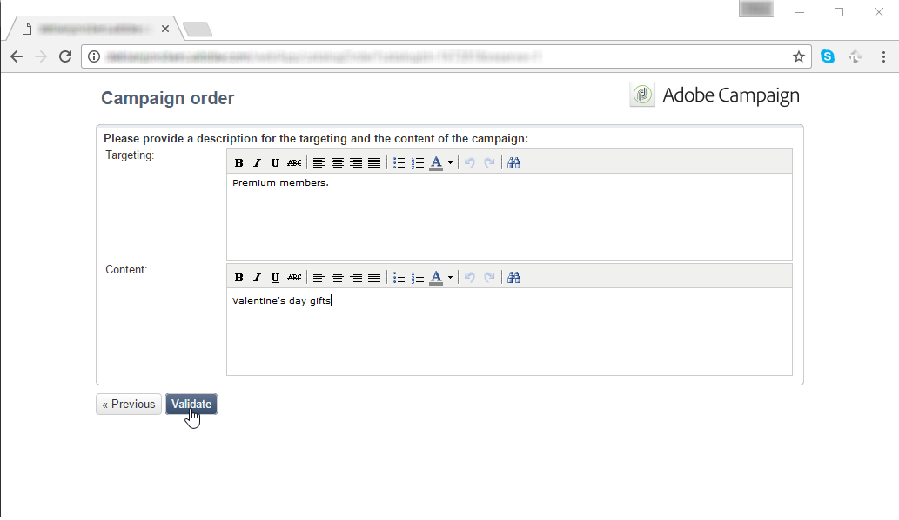
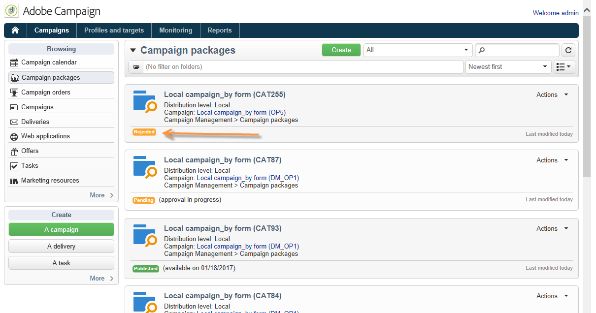

# Creación de una campaña local{#creating-a-local-campaign}

Una campaña local es una instancia creada a partir de una plantilla a la que se hace referencia en la lista de **[!UICONTROL campaign packages]** con una **programación de ejecución determinada**. Su objetivo es utilizar una comunicación local mediante una plantilla de campaña configurada por la entidad central. Las principales fases para implementar una operación local son las siguientes:

**Para la entidad central**

1. Creación de una plantilla de campaña local.
1. Creación de un paquete de campaña a partir de una plantilla.
1. Publicación de un paquete de campaña.
1. Aprobación de solicitudes.

**Para la entidad local.**

1. Solicitud de la campaña.
1. Ejecución de campañas.

## Creación de una plantilla de campaña local {#creating-a-local-campaign-template}

Para crear un paquete de campañas, primero debe crear la **plantilla de campaña** a través del nodo **[!UICONTROL Resources > Templates]**.

To create a new local template, duplicate the default **[!UICONTROL Local campaign (opLocal)]** template.

Asigne un nombre a la plantilla de campaña y complete los campos disponibles.

In the campaign window, click the **[!UICONTROL Edit]** tab, then click the **[!UICONTROL Advanced campaign settings...]** link.

### Interfaz web {#web-interface}

En la pestaña **Distributed Marketing**, se puede elegir el tipo de interfaz web y especificar los valores y parámetros predeterminados que se introducen cuando una entidad local realiza una solicitud.

La interfaz web corresponde a un formulario que la entidad local rellena al solicitar la campaña.

Seleccione el tipo de interfaz web que se aplicará a las campañas creadas a partir de la plantilla:

Hay cuatro tipos de interfaces web disponibles:

* **[!UICONTROL By brief]**: la entidad local debe proporcionar una descripción de las configuraciones de campaña. Una vez aprobada la solicitud, la entidad central se configura y ejecuta la campaña en su totalidad.

   

* **[!UICONTROL By form]**: la entidad local tiene acceso a un formulario web en el que, según la plantilla utilizada, pueden editar el contenido, el objetivo, su tamaño máximo, así como la creación y extracción de fechas utilizando campos de personalización. La entidad local puede evaluar el objetivo y obtener una vista previa del contenido desde este formulario web.

   

   The form offered is specified in a Web application that must be selected in a drop-down list from the **[!UICONTROL Web Interface]** field in the template&#39;s **[!UICONTROL Advanced campaign settings...]** link. Consultar [Creación de una campaña local (por formulario)](../../campaign/using/examples.md#creating-a-local-campaign--by-form-).

   >[!NOTE]
   >
   >La aplicación web utilizada es un ejemplo. Debe crear una aplicación web específica para poder utilizar un formulario. Consulte la [API](../../configuration/using/about-web-services.md).

   

* **[!UICONTROL By external form]**: la entidad local tiene acceso a los parámetros de campaña en su extranet (no en Adobe Campaign). Estos parámetros son idénticos a los de una campaña local (por formulario) o **local campaign (by form)**.
* **[!UICONTROL Pre-set]**: la entidad local solicita la campaña utilizando el formulario predeterminado sin localizarlo.

   

### Valores predeterminados {#default-values}

Select the **[!UICONTROL Default values]** to be completed by local entities. Por ejemplo:

* fechas de contacto y extracción,
* características de objetivo (segmento de edad, etc.).

Complete los **[!UICONTROL Parent marketing program]** campos y **[!UICONTROL Charge]** .

### Aprobaciones {#approvals}

From the **[!UICONTROL Advanced parameters for campaign entry]** link, you can specify the maximum number of reviewers.

La entidad local deberá introducir los revisores cuando se solicite la campaña.

Si no desea asignar nombres a los revisores de una campaña, escriba 0.

### Documentos {#documents}

Puede permitir que los operadores de la entidad local vinculen los documentos (archivos de texto, hojas de cálculo, imágenes, descripciones de campañas, etc.) a la campaña local al crear la solicitud. The **[!UICONTROL Advanced parameters for campaign entry...]** link lets you restrict the number of documents. To do this, simply enter the maximum number allowed in the **[!UICONTROL Number of documents]** field.

Al solicitar un paquete de campaña, el formulario sugiere vincular tantos documentos como se indica en el campo correspondiente de la plantilla.

Si no desea mostrar un campo de carga de documento, escriba **[!UICONTROL 0]** en el campo **[!UICONTROL Number of documents]**.

>[!NOTE]
>
>El **[!UICONTROL Advanced parameters for campaign entry]** se puede desactivar marcando **[!UICONTROL Do not display the page used to enter the campaign parameters]**.

### Flujo de trabajo {#workflow}

En la **[!UICONTROL Targeting and workflows]** ficha, cree el flujo de trabajo de campaña que recopila los **[!UICONTROL Default values]** especificados en la **[!UICONTROL Advanced campaign settings...]** y crea los envíos.

Double click the **[!UICONTROL Query]** activity to configure it according to the specified **[!UICONTROL Default values]**.

### Entrega {#delivery}

In the **[!UICONTROL Audit]** tab, click the **[!UICONTROL Detail...]** icon to view the **[!UICONTROL Scheduling]** for the selected delivery.

El icono **[!UICONTROL Scheduling]** permite configurar la fecha de contacto y ejecución de la entrega.

Si es necesario, configure el tamaño máximo de la entrega:

Localice el código HTML de la entrega. For example, in **[!UICONTROL Delivery > Current order > Additional fields]**, use the **[!UICONTROL Age segment]** field to locate the delivery according to the age of the target.

Guarde la plantilla de campaña. Ahora puede usarlo desde la vista **Paquetes de campaña** en **Campaña**, haciendo clic en el botón **[!UICONTROL Create]**.

>[!NOTE]
>
>Las plantillas de campaña y la configuración general se describen en [Plantillas de campaña](../../campaign/using/marketing-campaign-templates.md#campaign-templates).

## Creación del paquete de campaña {#creating-the-campaign-package}

Para que la plantilla de campaña esté disponible para las entidades locales, debe añadirla a la lista. Para ello, la agencia central necesita crear un nuevo paquete.

Siga estos pasos:

1. In the **[!UICONTROL Navigation]** section on the **Campaigns** page, click the **[!UICONTROL Campaign packages]** link.
1. Haga clic en el botón **[!UICONTROL Create]**.

   

1. La sección encima de la ventana permite seleccionar la plantilla de paquete de campaña especificada [anteriormente](#creating-a-local-campaign-template).

   De forma predeterminada, la **[!UICONTROL New local campaign package (localEmpty)]** plantilla se utiliza para campañas locales.

1. Especifique la etiqueta, la carpeta y el programa de ejecución para el paquete de campaña.

### Fechas {#dates}

Las fechas de inicio y finalización definen el periodo de visibilidad de la campaña en la lista de paquetes de campañas.

La fecha de disponibilidad es la fecha en que la campaña estará disponible para las entidades locales (para que las soliciten).

>[!CAUTION]
>
>Si una entidad local no reserva la campaña antes de la fecha límite, no podrá utilizarla.

Esta información se encuentra en el mensaje de notificación enviado a las agencias locales, como se muestra a continuación:

### Audiencia {#audience}

For a local campaign, the central entity can specify the local entities involved by checking the **[!UICONTROL Limit the package to a set of local entities]**.

### Ajustes adicionales {#additional-settings}

Una vez guardado el paquete, la entidad central puede editarla desde la pestaña **[!UICONTROL Edit]**.

Desde la pestaña **[!UICONTROL General]**, la entidad central puede:

* configure the campaign package reviewer(s) from the **[!UICONTROL Approval parameters...]** link,
* revisar la programación de ejecución,
* añadir o eliminar entidades locales.

>[!NOTE]
>
>De manera predeterminada, cada entidad puede solicitar una **campaña local** solo una vez.
>   
>Check the **[!UICONTROL Enable multiple creation]** option to allow several local campaigns to be created from the campaign package.

### Notificaciones {#notifications}

Cuando una campaña está disponible o cuando se llega a la fecha límite de registro, se envía un mensaje a los operadores del grupo de notificación local. Para obtener más información, consulte [Entidades organizativas](../../campaign/using/about-distributed-marketing.md#organizational-entities).

## Solicitud de una campaña {#ordering-a-campaign}

Las entidades locales pueden acceder a los paquetes de campañas una vez que se han aprobado y ha comenzado su periodo de implementación. Las entidades locales reciben un correo electrónico que le informa de que hay un nuevo paquete de campaña disponible (en cuanto se alcanza su fecha de disponibilidad).

>[!NOTE]
>
>Si se especificaron entidades locales al crear el paquete de campaña, estas serán las únicas que recibirán una notificación. Si no se especifica ninguna entidad local, todas las entidades locales recibirán una notificación.

Para utilizar una campaña proporcionada por la entidad central, la entidad local debe solicitarla.

Para solicitar una campaña:

1. Click **[!UICONTROL Order campaign]** in the notification message, or the corresponding button in Adobe Campaign.

   Introduzca su ID y contraseña para solicitar la campaña. La interfaz está formada por un conjunto de páginas definidas en una aplicación web.

   >[!NOTE]
   >
   >Las aplicaciones web se detallan en la guía de las [funcionalidades web](../../web/using/about-web-applications.md).

1. Introduzca la información necesaria en la primera página (etiqueta de orden y comentario) y haga clic en **[!UICONTROL Next]**.

   

1. Complete los parámetros disponibles y apruebe la solicitud.

1. Se envía una notificación al administrador de la entidad organizativa a la que pertenece la entidad local para aprobar la solicitud.

   

1. La información se devuelve a las entidades local y central. Aunque las entidades locales solo pueden ver sus propias solicitudes, la entidad central puede ver todas las solicitudes de cualquier entidad local, como se muestra a continuación:

   

   Los operadores pueden mostrar detalles de la solicitud:

   

   La pestaña **[!UICONTROL Edit]** contiene información introducida por la entidad local al solicitar la campaña.

   

1. La entidad central debe aprobar la solicitud.

   

   Para obtener más información, consulte la sección [Proceso de aprobación](#approval-process).

1. El operador local recibe una notificación cuando la campaña está disponible: la disponibilidad de la campaña puede encontrarse en la lista de paquetes de campañas dentro de **Campaign.** La campaña entonces se puede utilizar. Para obtener más información, consulte [Acceso a campañas](../../campaign/using/accessing-campaigns.md).

   The **[!UICONTROL Start targeting with order approval]** option lets the local entity run the campaign as soon as the order has been approved.

   

## Aprobación de una solicitud {#approving-an-order}

Para confirmar una solicitud de campaña, la entidad central debe aprobarla.

The **[!UICONTROL Campaign orders]** overview, accessed via the **Campaigns** universe lets you view the status of campaign orders and approve them.

>[!NOTE]
>
>Las entidades locales pueden realizar cambios en la solicitud hasta que se apruebe.

### Proceso de aprobación {#approval-process}

#### Notificación por correo electrónico {#email-notification}

Cuando una entidad local solicita una campaña, sus revisores reciben notificaciones por correo electrónico, como se muestra a continuación:

>[!NOTE]
>
>Para saber cómo seleccionar revisores, consulte la sección [Revisores](#reviewers). Pueden aceptar o rechazar la solicitud.

#### Aprobación a través de la consola de Adobe Campaign {#approving-via-the-adobe-campaign-console}

Las solicitudes también se pueden aprobar a través de la consola, en la información general de la solicitud de la campaña. To approve an order, select it and click **[!UICONTROL Approve the order]**.

>[!NOTE]
>
>La campaña todavía se puede editar y volver a configurar hasta que se alcance la fecha de disponibilidad de la campaña. Las entidades locales también pueden rechazar la campaña haciendo clic en el botón **[!UICONTROL Cancel]**.

#### Creación de una campaña {#creating-a-campaign}

Una vez aprobada la solicitud de una campaña, la entidad local puede configurarla y ejecutarla.

Para obtener más información, consulte [Acceso a campañas](../../campaign/using/accessing-campaigns.md).

### Rechazar una aprobación {#rejecting-an-approval}

El operador de aprobación puede rechazar una solicitud o un paquete de campaña.

Si el revisor rechaza una solicitud, se envía la notificación correspondiente automáticamente a las respectivas entidades locales: muestra el comentario introducido por el operador que rechazó la aprobación.

La información se muestra en la lista de página de paquetes de campañas o en la página de solicitud de campañas. Si tienen acceso a la consola de Adobe Campaign, se notificará a las entidades locales sobre este rechazo.

Pueden ver el comentario relacionado en la pestaña **[!UICONTROL Edit]** del paquete de la campaña.

### Revisores {#reviewers}

Cada vez que se necesita una aprobación, los revisores reciben una notificación por correo electrónico.

Para cada entidad local, se seleccionan los revisores para la aprobación de solicitudes y campañas. Para obtener más información sobre la selección de revisores locales, consulte [Entidades organizativas](../../campaign/using/about-distributed-marketing.md#organizational-entities).

>[!NOTE]
>
>Para que esta selección sea posible, la aprobación de solicitudes no debe ser eficaz.

### Cancelación de una solicitud {#canceling-an-order}

La agencia central puede cancelar una solicitud utilizando el botón **[!UICONTROL Delete]** situado en el panel de solicitudes.

This cancels the campaign in the **[!UICONTROL Campaign orders]** view.
