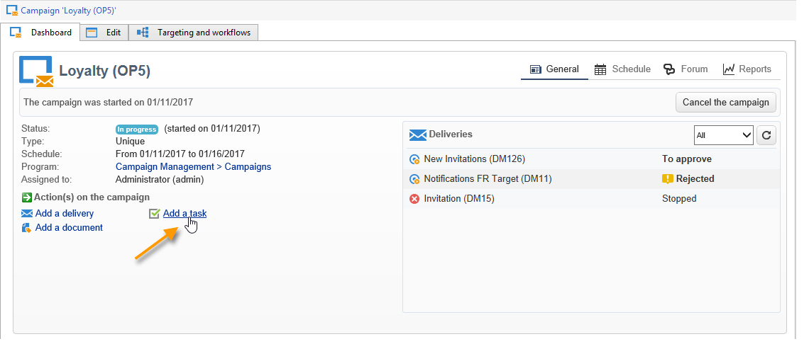
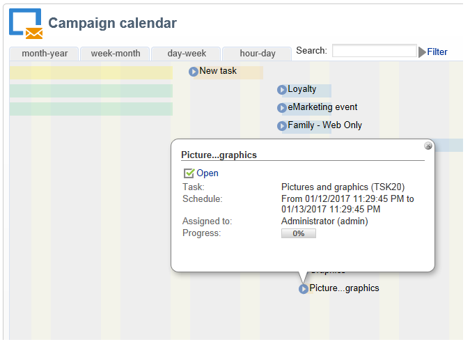
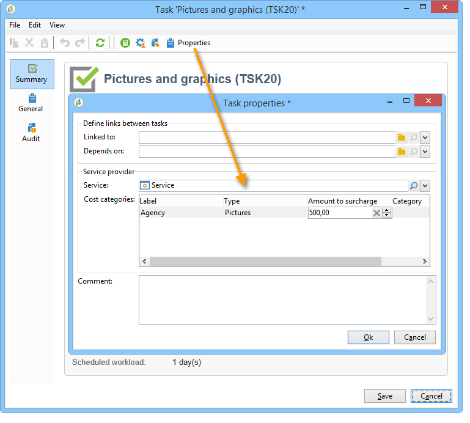
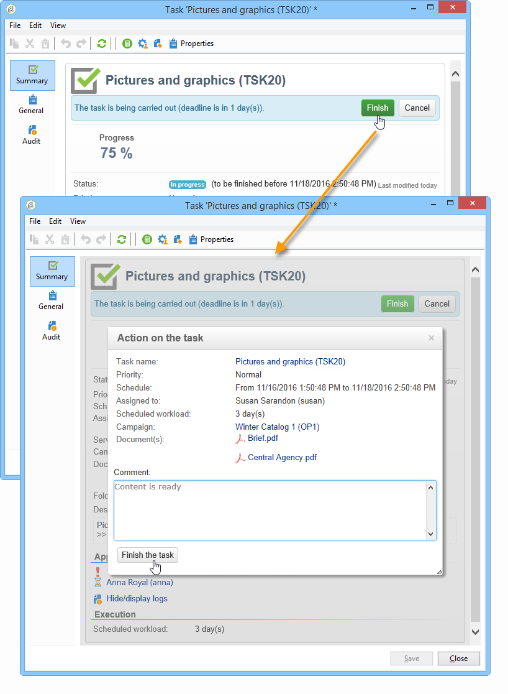

# Creación y administración de tareas{#creating-and-managing-tasks}

## Acerca de las tareas {#about-tasks}

Adobe Campaign le permite crear tareas y gestionar su ciclo de vida completo directamente desde la aplicación. La implementación de programas y campañas se puede dividir en tareas asignadas a operadores de Adobe Campaign o a proveedores de servicios externos. Este modo de operación le permite crear un entorno de colaboración abierto que incluye todos los participantes del programa y participantes externos.

Se pueden crear, ver y monitorizar las tareas de la lista de tareas o del panel de campañas. También se pueden consultar y rastrear en las programaciones del plan de marketing, programas y campañas.

Las tareas se adjuntan a la campaña y pueden tener dependencias, es decir, tareas asociadas. Cada tarea tiene un estado, prioridad, carga estimada y costes relacionados.

Todas las tareas se agrupan en una lista accesible a través del entorno de **Campaign.** For more on this, refer to [Accessing tasks](#accessing-tasks).

Pueden mostrarse en la programación del programa al que pertenecen.

## Acceso a tareas {#accessing-tasks}

### Visualización de tareas {#displaying-tasks}

The tasks are displayed in the task list accessible via the **[!UICONTROL Campaigns]** universe.

Puede ver todas las tareas del operador conectado.

Para obtener más información sobre esto, consulte el estado [Ejecución de una tarea](#execution-status-of-a-task) y el estado [Progreso de una tarea](#progress-status-of-a-task).

### Filtrado de tareas {#filtering-tasks}

When you display this view, it is automatically filtered in order to display only **[!UICONTROL operator tasks]**. También puede filtrar las tareas utilizando los campos de la parte superior de la ventana.

### Tareas de edición {#editing-tasks}

Haga clic en una tarea para editarla.

## Creación de una columna nueva {#creating-a-new-task}

To create a task, click the **[!UICONTROL Tasks]** link in the Campaigns universe and select **[!UICONTROL Create]**.

Introduzca al menos el nombre de la tarea y seleccione la campaña a la que está vinculada. También debe especificar las fechas de inicio y finalización. Estos tres datos son obligatorios.

Haga clic **[!UICONTROL Save]** para crear la tarea.

También puede crear una tarea a través del panel de una campaña: en este caso, se vincula automáticamente a la campaña a partir de la cual se creó.

Después de crear una tarea, esta se agrega a la programación de campañas y a la lista de tareas. To edit a task, select it from the schedule or click its name in the task overview, and click the **[!UICONTROL Open]** link.

Para configurarlo, debe indicar:

* El administrador y los participantes: consulte [Administrador y participantes](#manager-and-participants).
* La programación de creación: consulte la programación [de](#execution-schedule)ejecución.
* Costes comprometidos: consulte [Gastos e ingresos](#expenses-and-revenues).

It is also possible to ad reviewers (refer to [Reviewers](#reviewers)) and referenced documents (refer to [Documents referenced](#documents-referenced)).

Task life cycle is presented in [Life cycle](#life-cycle).

### Administrador y participantes {#manager-and-participants}

Solo el operador de cargo de una tarea está autorizado para cerrarla.

De forma predeterminada, cuando un operador de Adobe Campaign crea una tarea, se le asigna automáticamente. To select a different operator, use the **[!UICONTROL Assigned to]** field.

>[!NOTE]
>
>La administración del operador se explica en [esta sección](../../platform/using/access-management.md).

Puede especificar los operadores implicados en la realización de la tarea. Estos operadores no están autorizados a cerrar la tarea. Solo pueden aprobar la tarea asignada.

They are selected using the **[!UICONTROL Resources]** icon in the task toolbar. Click **[!UICONTROL Add]** and select the concerned operators.

Click **[!UICONTROL Ok]** and then input the usage rate: this represents the load assigned to the operator for the duration of task execution. Esta tasa es solo indicativa y se expresa como un porcentaje.

Por ejemplo, para una tarea cuya programación de ejecución esté configurada a 10 días, un operador cuya tasa de uso es del 50 % se moviliza en relación con esta tarea para la mitad de su jornada de trabajo durante los 10 días.

Para cada operador, puede introducir una carga de trabajo programada y una carga de trabajo real. Estas duraciones también son únicamente para fines informativos.

Se puede configurar un recordatorio, que se envía automáticamente a todos los operadores implicados en la tarea antes de su fecha de finalización.

You can view the Adobe Campaign operator profile via the **[!UICONTROL Edit link]** icon.

El panel del operador permite comprobar la carga de trabajo (otras tareas en curso).

### Revisores {#reviewers}

Además de los participantes, puede definir operadores que revisan la tarea una vez que la persona responsable la haya cerrado. To do this, click the **[!UICONTROL Enable task approval]** option in the lower left-hand section of the **[!UICONTROL Resources]** window. Puede ser un operador individual, un grupo de operadores o una lista de operadores.

To specify a list of operators, click the **[!UICONTROL Edit...]** link to the right of the first reviewer and add as many operators as necessary, as shown below:

Puede definir una programación de aprobación para la tarea en la sección inferior de la ventana de configuración del revisor. De forma predeterminada, los revisores tienen tres días a partir de la fecha de envío para aprobar la tarea. Se puede configurar un recordatorio, que se envía a los operadores correspondientes automáticamente antes de la fecha límite de aprobación.

La persona responsable de la tarea puede asignarse la tarea de aprobarla, incluso si ya se han asignado otros operadores para hacerlo. Si no se ha definido ningún revisor, las notificaciones se envían a la persona responsable de la tarea. All other Adobe Campaign operators with **[!UICONTROL Administrator]** rights can also approve the task. Sin embargo, no reciben notificaciones.

### Documentos de referencia {#documents-referenced}

It&#39;s possible to add documents and marketing resources to a task (for more on this, refer to [Managing marketing resources](../../campaign/using/managing-marketing-resources.md)). To do so, open the task and click the **[!UICONTROL Documents]** icon in the task toolbar.

Click **[!UICONTROL Add]** and select the document to be added to your task. Aplique el mismo proceso para los recursos de marketing.

Los documentos de referencia aparecen en las notificaciones enviadas a los operadores implicados en la tarea, así como en el panel de tareas.

### Programación de ejecución {#execution-schedule}

The validity period of a task is indicated in the **[!UICONTROL Start]** and **[!UICONTROL End]** fields. La carga programada indica la carga de trabajo que se lleva a cabo durante el periodo. Se expresa en días o en horas.

>[!NOTE]
>
>The life cycle of a task is presented in [Life cycle](#life-cycle).

The **[!UICONTROL Workload performed]** field also expressed in days and hours, lets you manually update the progress of the task with respect to the scheduled workload.

The **[!UICONTROL Progress status]** of the task, expressed as a percentage, is updated automatically based on the tasks carried out by the operators involved. Se puede introducir de forma manual.

Esta información se puede ver en el panel de tareas.

También se puede ver en la pestaña de campaña.

If the task execution schedule end date has been reached but the task is not completed, the task will be **[!UICONTROL Late]**. También se muestra un mensaje de advertencia a los operadores.

Para obtener más información sobre esto, consulte Estado de [progreso de una tarea](#progress-status-of-a-task).

### Gastos e ingresos {#expenses-and-revenues}

Puede definir los gastos relacionados y prever los ingresos de cada tarea. Ambos se calculan y después se consolidan para la campaña a la que acompaña la tarea.

To specify this information, click the **[!UICONTROL Expenses and revenue]** icon in the task toolbar.

De manera predeterminada, el presupuesto cargado es el presupuesto de la campaña a la que acompaña la tarea. Se muestra en los detalles de la tarea.

>[!NOTE]
>
>Para obtener más información sobre gastos y presupuestos, consulte Compromiso de [costos, cálculo y cobro](../../campaign/using/controlling-costs.md#cost-commitment--calculation-and-charging).

En esta ventana, también puede definir los objetivos que desea alcanzar. Los objetivos se expresan en términos de ingresos previstos para la tarea.

### Proveedores de servicios {#service-providers}

Un proveedor de servicios externos puede participar en la administración de una tarea.

Para ello, edite las propiedades de la tarea y seleccione el proveedor de servicios que desee. Las categorías de costes asociadas al proveedor de servicios se enumeran automáticamente en la sección central de la ventana.

Para obtener más información sobre esto, consulte [Creación de un proveedor de servicios y sus categorías](../../campaign/using/providers--stocks-and-budgets.md#creating-a-service-provider-and-its-cost-categories)de costes.

Seleccione las categorías de costes relacionadas con la ejecución de la tarea. Para ello, seleccione el tipo de costes y, si fuera necesario, añada una cantidad de recargo.

>[!NOTE]
>
>The method for managing budgets and costs is presented in [Controlling costs](../../campaign/using/controlling-costs.md).

Al seleccionar un proveedor de servicios, este se muestra en el panel de tareas:

### Tareas atrasadas {#late-tasks}

A task is late if it has reached its end date without its status changing to **[!UICONTROL Finished]**. De forma predeterminada, no se avisa a ningún operador cuando una tarea está atrasada. Puede configurar el envío de un correo electrónico de notificación: se puede notificar a todos los operadores aunque no estén implicados en la tarea.

Go to the **[!UICONTROL Resources]** box and add the operator to the **[!UICONTROL Assignation]** field. Para notificar a varias personas, seleccione un grupo de operadores.

### Notificaciones iniciales {#initial-notifications}

Cuando crea o modifica una tarea con una fecha de inicio futura, Adobe Campaign ofrece la opción de enviar un mensaje de correo electrónico a la persona a cargo de la tarea para que sepa cuándo se inicia esta.

Sin embargo, si queda mucho tiempo para la tarea que está creando, es preferible programar la notificación para que se envíe antes del inicio de la tarea. Por ejemplo, si la tarea se inicia dentro de un mes, puede notificar a la persona a cargo una semana antes de comenzar.

To schedule a notification, go to the **[!UICONTROL Resources]** box and use the **[!UICONTROL Initial notification]** field.

* Para las tareas dentro de las campañas, seleccione una fecha y una hora específicas.
* For tasks within campaign templates, the notification time is expressed as the time remaining before the task starts (for instance, if you enter 2d in the **[!UICONTROL Initial notification]** field, the email will be sent 2 days before the task start date).

Si ha programado una notificación, al guardar la tarea, Adobe Campaign le ofrece igualmente la opción de enviar una notificación inmediata. Puede optar por enviarla, lo que no elimina la notificación programada.

### Tarea vinculada a un programa {#task-linked-to-a-program}

Puede crear tareas directamente en un programa para administrar las acciones que pertenecen a su organización general y no a una campaña específica (por ejemplo, una reunión para analizar el tema de las próximas campañas dentro del programa). La tarea aparece en la programación.

Para crear una tarea vinculada directamente a un programa:

1. Open the program schedule: on the home page, go to **[!UICONTROL Campaigns > Browse > Other choices > Programs]**. La programación general del programa se abre en la sección derecha de la ventana.
1. En la programación, haga clic en el programa deseado: junto a él aparece una ventana.
1. En esta ventana, haga clic en **[!UICONTROL Open]**. Esto abre la programación del programa.
1. Haga clic en el **[!UICONTROL Add]** botón sobre la programación a la derecha y luego haga clic en **[!UICONTROL Add a task]**.

### Disponibilidad de operadores {#operator-availability}

En el panel de tareas, un icono junto al nombre del operador indica que ya está trabajando en otra tarea o evento durante el periodo que abarca la tarea. (Task which the operator is in charge of or involved in: he appears in the **[!UICONTROL Assigned to]** field or in the task **[!UICONTROL Resources]** box).

### Tarea en un flujo de trabajo {#task-in-a-workflow}

Using a **[!UICONTROL Task]** element in a campaign workflow enables you to define two scenarios depending on whether or not the task is approved.

En los flujos de trabajo de campaña, la actividad se encuentra en la **[!UICONTROL Task]** ficha **[!UICONTROL Flow control]** .

## Tipos de tarea {#types-of-task}

Al crear tareas a través de una campaña, puede crear tareas específicas. El tipo de tarea se define en la plantilla seleccionada.

Se pueden programar las siguientes tareas:

* **[!UICONTROL Control task]**, consulte las tareas [de control](#control-tasks),
* **[!UICONTROL Marketing resource creation task]**, consulte la [tarea](#grouping-task)Agrupación,
* **[!UICONTROL Grouping task]**, consulte la [tarea](#grouping-task)Agrupación,
* **[!UICONTROL Notification task]**, consulte la tarea Notificación.

>[!NOTE]
>
>**[!UICONTROL Control task]** y **[!UICONTROL Grouping]** las tareas **solo** se pueden crear mediante el tablero de campañas.\
>Se muestran en el mapa de tareas del operador al que se asignan. Consulte [Acceso a tareas](#accessing-tasks).

### Tareas de control {#control-tasks}

A **[!UICONTROL Control task]** is linked to delivery approval: approval of targeting, content, extraction file, budget or proof.

Una vez creada, la tarea se agrega al panel de campañas.

A continuación, puede editarla y especificar sus parámetros.

### Tarea de creación de recursos de marketing {#marketing-resource-creation-task}

Se puede utilizar una tarea de creación de recursos de marketing para administrar la creación y publicación de un recurso de marketing. Si administra un recurso a través de una tarea y no a través del propio recurso, puede:

* Controlar el proceso de creación de recursos mediante una campaña.
* Ver el proceso de creación de recursos en una programación.
* Gestionar el proceso de creación de recursos (recordatorios, notificaciones).
* Calcular y controlar los costes vinculados a la creación de recursos.
* Aprobar y publicar el recurso mediante la tarea (si la opción correspondiente está activada).

#### Interacción entre la tarea y su recurso vinculado {#interaction-between-the-task-and-its-linked-resource}

La tarea de creación de recursos de marketing interactúa con el recurso vinculado. Esto significa que:

* La programación de la creación de recursos y los costes vinculados se gestionan a través de la tarea.
* Los operadores pueden trabajar en el recurso con normalidad (descarga o carga, bloqueo y desbloqueo): esto no afecta a la tarea.
* Resource approval and publication can be carried out via the task: if the **[!UICONTROL Publish the marketing resource]** option is enabled, the resource is approved and published automatically once the task is finished. Si la opción no está activada, la tarea y el recurso no interactúan: la modificación de una no afecta al otro, y viceversa.

   Puede utilizar una serie de tareas vinculadas para definir un ciclo de aprobación completo. Check the **[!UICONTROL Publish the marketing resource]** option only for the last task: all tasks will need to be finished in order for the resource to be published. Además, al crear una tarea secundaria de recursos de marketing, el recurso se selecciona automáticamente en la tarea secundaria.

   * **Mediante el recurso**: si envía el recurso para su aprobación o lo aprueba, eso no afecta a la tarea.
   * **Mediante la tarea**: si la **[!UICONTROL Publish the marketing resource]** opción está marcada en la tarea, el recurso se aprueba y publica automáticamente una vez finalizada la tarea (véase más arriba). Si la opción no está activada, la tarea y el recurso no interactúan: la modificación de una no afecta al otro, y viceversa.

#### Configuración de una tarea de creación de recursos de marketing {#configuring-a-marketing-resource-creation-task}

La persona que revisa la tarea no es necesariamente la misma persona que revisa el contenido definido en el recurso. However, if the **[!UICONTROL Publish the marketing resource]** option is checked (see below), the task reviewer is authorized to approve the resource content, as finishing the task automatically approves the resource (or, if no reviewer is defined, the task manager).

In the **[!UICONTROL Marketing resource]** field, define the resource you want to manage via this task. Se puede:

* Select an existing resource: the drop-down list offers all resources with the status **[!UICONTROL Being edited]**.
* Creación de un recurso: haga clic en el **[!UICONTROL Select the link]** icono y, a continuación, haga clic en el **[!UICONTROL Create]** icono.

The **[!UICONTROL Publish the marketing resource]** option lets you automate resource publishing: once the task is **[!UICONTROL Finished]**, the status of the resource automatically switches to **[!UICONTROL Published]**, even if it was neither submitted for approval or approved, including if the reviewer who completes the task isn&#39;t the content reviewer defined in the resource.

The **[!UICONTROL Publish the resource]** button is made available and the resource publishing reviewer receives a notification email to let him know that it is ready to be published. In the **[!UICONTROL Edit > Tracking]** tab, reviewing and publishing by the task reviewer become visible. Si se ha definido un flujo de trabajo de posprocesamiento de recursos, este se ejecuta en este momento.

### Tarea de agrupamiento {#grouping-task}

The **[!UICONTROL Grouping task]** type task lets you group several tasks and synchronize the management of their progress and their approval.

Las tareas de agrupamiento no tienen costes ni recursos vinculados.

Todas las tareas agrupadas a una tarea de agrupación se pueden ver en su propio panel. Esto le permite filtrar la lista de tareas para mostrar solo las que le interesen.

Las tareas de agrupamiento incluyen un enlace que permite crear fácilmente una tarea agrupada.

Para crear una tarea agrupada basada en una tarea de agrupación, vaya al panel de campañas y haga clic en el nombre de la tarea de agrupación para mostrar su descripción y luego haga clic en **[!UICONTROL Add a task]**.

However, if you have already created a task that you want to link to a grouping task, you can do it via the **[!UICONTROL Linked to]** field of the **[!UICONTROL Properties]** box.

### Tarea de notificación {#notification-task}

Las tareas de notificación permiten programar envíos de correo electrónico (a un operador, un grupo de operadores, un proveedor de servicios, etc.). Esto permite programar recordatorios, por ejemplo para notificar a alguien que una campaña finaliza pronto o para enviar documentos antes de que una campaña comience, de manera que los operadores puedan prepararse. Esto significa que puede realizar un seguimiento de las comunicaciones dentro de la campaña o el programa y prestar especial atención a las acciones realizadas.

#### Ciclo de vida {#life-cycle}

Las tareas de notificación no requieren aprobación. Esto significa que su ciclo de vida es más sencillo que el de una tarea estándar:

Una tarea de notificación puede tener los siguientes estados:

* **[!UICONTROL Scheduled]** hasta que se haya enviado el correo electrónico
* **[!UICONTROL In progress]** una vez enviado el correo electrónico y hasta que se llegue a la fecha de finalización
* **[!UICONTROL Finished]** una vez alcanzada la fecha de finalización.

#### Configuración {#configuration}

Durante la creación, se deben introducir los siguientes elementos en la tarea:

* **[!UICONTROL Assigned to]** :: el operador o el grupo de operadores que recibirán el correo electrónico. Si asigna la tarea una vez enviado el correo electrónico, este no se envía al operador nuevo (para esto, debe volver a ejecutar la tarea y cambiar su fecha inicial).
* **Fecha de inicio de la tarea**: fecha en la que se envía el mensaje de correo electrónico de notificación. Esta fecha debe ser futura en el momento de la registrar la tarea.
* **Fecha** de finalización de la tarea: fecha en la que cambia el estado de la tarea a **[!UICONTROL Finished]**. De forma predeterminada, la fecha de finalización es idéntica a la fecha de inicio. Sin embargo, la asignación de una duración a la tarea permite simbolizar la cantidad de tiempo que el operador debe invertir en la programación, si fuera necesario.
* **[!UICONTROL Description]** :: el texto introducido aquí aparecerá en el cuerpo del correo electrónico de notificación.

   

Puede agregar un archivo adjunto a la tarea y al correo electrónico de notificación. To do this, click the **[!UICONTROL Documents]** icon in the toolbar in the upper right-hand corner.

## Ciclo de vida {#life-cycle-1}

### enlaces entre tareas {#links-between-tasks}

The **[!UICONTROL Properties]** button in each task enables you to define the links between tasks in a campaign. You can split tasks into subtasks using a grouping task (see [Linked tasks](#linked-tasks)), or define dependencies between the tasks (see [Grouping tasks](#grouping-tasks)).

#### Tareas vinculadas {#linked-tasks}

Use the **[!UICONTROL Linked task]** field to associate tasks with a grouping task. Consulte [Tipos de tareas](#types-of-task).

En el ejemplo siguiente, la aprobación de destinatarios se divide en cuatro subtareas.

Cada subtarea es una tarea estándar vinculada a la tarea principal.

#### Tareas de agrupamiento {#grouping-tasks}

Use the **[!UICONTROL Grouped to]** field to make the execution of a task depend on the execution of another task.

La dependencia entre tareas se representa mediante flechas en el panel de campañas.

En el caso de las tareas agrupadas, Adobe Campaign asigna automáticamente la fecha de finalización de la tarea principal a la tarea secundaria como fecha de inicio. Por ejemplo, si una tarea de **creación de invitación** finaliza el 15 de octubre a las 3:30 p. m., la tarea secundaria **envío de correo electrónico de invitación** comienza el 15 de octubre a las 3:30 p. m.

Moreover, if you postpone the end of a parent task, some of its child tasks may be affected: these are the child tasks whose status is **[!UICONTROL Scheduled]** and whose start date is earlier than the new end date of the parent task. La duración de la tarea sigue siendo la misma. Si la fecha de inicio de una tarea secundaria es posterior a la nueva fecha de finalización de la tarea principal, la tarea secundaria no se ve afectada.

**Ejemplo**

Una tarea principal programada para finalizar el 9 de octubre a las 5 p. m. tiene dos tareas secundarias, la tarea A y la tarea B. La tarea A está programada para empezar el 10 de octubre a las 2 p. m. y la tarea B está programada para el 12 de octubre a las 8 a. m.

Posponemos la tarea principal: ahora termina el 11 de octubre a la 1 p. m. Solo se pospone la tarea A, que comienza el 11 de octubre a la 1 p. m.

### Estado de ejecución de una tarea {#execution-status-of-a-task}

Los estados de tareas pueden verse en el mapa de tareas. El estado de ejecución de una tarea se actualiza automáticamente según las acciones del operador.

Una tarea puede ser: **[!UICONTROL Scheduled]**, **[!UICONTROL In progress]**, **[!UICONTROL Finished]**, **[!UICONTROL Canceled]**, **[!UICONTROL Pending approval]** o **[!UICONTROL Rejected]**.

* When a task is created, it is **[!UICONTROL Scheduled]** if its start date is in the future. Mantiene este estado hasta que se llega a su fecha de inicio.
* Once it has been started, the task is **[!UICONTROL In progress]**. When the person in charge of the task closes it, it changes to **[!UICONTROL Finished]**.
* If a reviewer has been defined, the task will be **[!UICONTROL Pending approval]** once the person in charge of it closes it and until the reviewer approves it. If the reviewer rejects it, the task will be **[!UICONTROL Rejected]**.
* A task can be canceled by the person responsible for it via the dashboard or the **[!UICONTROL Task map]** by clicking the **[!UICONTROL Cancel]** button.
* Para programar una tarea, escriba una fecha de inicio futura. A continuación, puede enviar una primera notificación a los operadores de Adobe Campaign implicados en realización de la tarea. See [Complete task life cycle](#complete-task-life-cycle).

>[!NOTE]
>
>* El estado de la tarea se actualiza automáticamente.
>* Incluso si el periodo de validez ha terminado, las tareas que no se hayan cerrado aparecen en la lista de tareas en curso. Una advertencia notifica a los operadores de que la tarea está atrasada.
>

### Estado de progreso de una tarea {#progress-status-of-a-task}

In addition to its execution status, a task can be associated with a progress status: **[!UICONTROL Late]**, **[!UICONTROL To approve]**, **[!UICONTROL To do today]** or **[!UICONTROL To do this week]**. Esta información se introduce automáticamente según la programación de tareas.

Puede filtrar la lista de tareas por estado de progreso o del proceso.

For more on this, refer to [Accessing tasks](#accessing-tasks).

### Ciclo de vida completo de la tarea {#complete-task-life-cycle}

A continuación, se muestran las fases del ciclo de vida completo de una tarea para el que la persona a cargo ha definido participantes y revisores.

1. La persona a cargo crea la tarea e introduce los distintos campos. Para obtener más información sobre esto, consulte [Creación de una nueva tarea](#creating-a-new-task).

   Al crear y editar una tarea **programada en el futuro** (siempre que no se alcance la fecha de inicio de la tarea), es posible enviar una notificación a los participantes y a los administradores para que sepan que se ha programado una nueva tarea.

   

   To send this first notification, click **[!UICONTROL Yes]**. Esta notificación le informa sobre la siguiente tarea e incluye detalles sobre el contenido y el número de días restantes hasta su fecha límite.

   When a task is created and scheduled for the future, its status is **[!UICONTROL Scheduled]**.

1. En la fecha de inicio de la tarea, la persona responsable y los participantes reciben una notificación que les informa de que la tarea se ha iniciado. Su estado cambia a **[!UICONTROL In progress]**.
1. Después de completar la sección asignada a ellos, los participantes pueden aprobar la tarea, ya sea:

   * mediante el correo electrónico de notificación.
   * mediante la consola o la interfaz web en el panel de tareas.

      

1. Cada vez que un participante aprueba un trabajo, se actualiza el estado de progreso de la tarea.

   

1. El revisor recibe un correo electrónico de notificación que le informa de que el operador ha finalizado la sección asignada.

   Puede seguir el progreso en el panel de tareas.

   

1. Una vez que la persona a cargo de la tarea decide que esta se ha completado, puede cerrarla con el enlace incluido en el mensaje de correo electrónico de notificación enviado cuando se inició la tarea, así como mediante la consola o la interfaz.

   

   >[!NOTE]
   >
   >La persona a cargo de una tarea puede cerrarla en cualquier momento, incluso si faltan aprobaciones. El estado de progreso cambia a 100 % de forma automática.

1. The task status changes to **[!UICONTROL To approve]**, and a notification is sent to the reviewer.

   Este aprueba la tarea por medio del correo electrónico de notificación, la consola o la interfaz Web.

   Puede actuar a través del panel de campañas:

   

   También puede utilizar el botón de aprobación de tareas:

   

   >[!NOTE]
   >
   >The task status will only change to **[!UICONTROL To approve]** if you have enabled the **[!UICONTROL Enable task validation]** option in the **[!UICONTROL Resources]** window of the task.\
   >If the reviewer rejects the task, its status changes to **[!UICONTROL Rejected]**, and the task life cycle starts again automatically.

1. The task status changes to **[!UICONTROL Finished]**. Se envía una notificación a todos los implicados.

   >[!NOTE]
   >
   >Una vez finalizada la tarea, la persona a cargo puede reiniciar el ciclo de vida. To do this, open the task and click the **[!UICONTROL Reset task to execute it again...]** link at the bottom of the dashboard.

