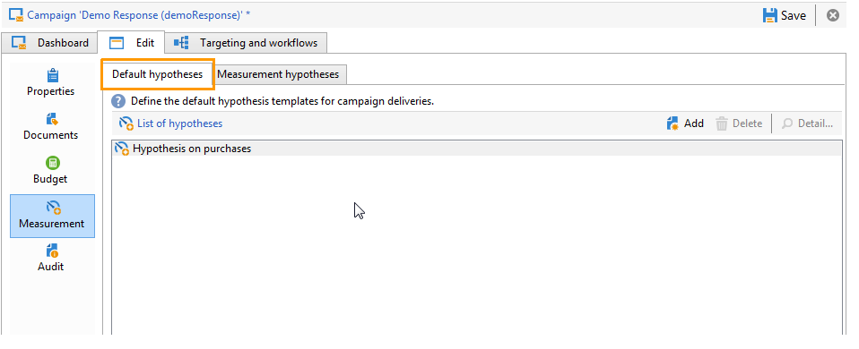
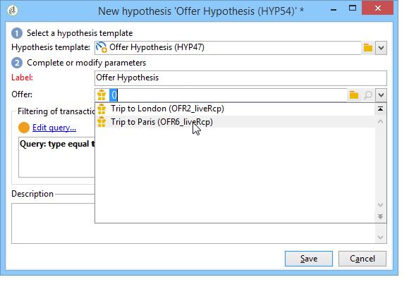

# Crear hipótesis{#creating-hypotheses}

Existen varias formas para crear y vincular hipótesis a una oferta o entrega de campaña:

* Mediante la carpeta **[!UICONTROL Measurement hypotheses]**, creando una nueva hipótesis basada en una plantilla existente y vinculándola con una entrega existente.
* Mediante la pestaña **[!UICONTROL Edit]** > **[!UICONTROL Measurement]** de una campaña.
* Mediante la opción **[!UICONTROL Measurement]** de una entrega creada a partir de una campaña.

Las hipótesis solo se pueden calcular una vez que se haya iniciado la campaña de marketing y los destinatarios hayan recibido la entrega. Si la hipótesis se basa en una propuesta de oferta, la última debe estar presente y permanecer activa. Las hipótesis de oferta y entrega se crean mediante la carpeta **[!UICONTROL Measurement hypotheses]** y se basan en una plantilla de hipótesis. Sin embargo, es posible hacer referencia a una hipótesis directamente en la entrega o la campaña antes de que comience la campaña. En este caso, la hipótesis se calculará automáticamente una vez que se inicie la campaña de marketing, según la configuración de ejecución (para obtener más información, consulte).

## Cree una hipótesis sobre la marcha en un envío {#creating-a-hypothesis-on-the-fly-on-a-delivery}

Para crear una hipótesis en una entrega existente, aplique el siguiente proceso:

>[!NOTE]
>
>Esta operación solo es posible para envíos pendientes.

1. En el árbol de Adobe Campaign, vaya a **[!UICONTROL Campaign management > Measurement hypotheses]**.
1. Haga clic en el botón **[!UICONTROL New]** o haga clic con el botón derecho en la lista de hipótesis y seleccione **[!UICONTROL New]** en la lista desplegable.

   

1. En la ventana de hipótesis, seleccione una plantilla creada previamente (consulte).

   

   El contexto de hipótesis tal como se definió en el modelo seleccionado se muestra en la ventana.

   >[!NOTE]
   >
   >Los ajustes definidos en la plantilla y no visibles en este paso se mantendrán también en la memoria y se vuelven a asignar a la hipótesis en curso.

   

1. Seleccione la entrega para la que desea crear una hipótesis.

   

1. Puede personalizar la hipótesis mediante la edición de las pestañas **[!UICONTROL General]**, **[!UICONTROL Transactions]** y **[!UICONTROL Scope]**. Para más información, consulte [Creación de un modelo de hipótesis](../../campaign/using/hypothesis-templates.md#creating-a-hypothesis-model).
1. Inicie la hipótesis haciendo clic en **[!UICONTROL Start]**.

   Se crea un flujo de trabajo automáticamente para realizar la medición. El nombre se define automáticamente según la configuración de hipótesis.

   >[!CAUTION]
   >
   >Puede acceder a esta opción si ha marcado la casilla **[!UICONTROL Keep execution workflow]**.\
   >Esta opción debe activarse solo para fines de depuración, en caso de error al ejecutar la hipótesis. Los flujos de trabajo generados automáticamente se guardan en la carpeta **[!UICONTROL Administration]** > **[!UICONTROL Production]** > **[!UICONTROL Objects created automatically]** > **[!UICONTROL Campaign workflows]** del explorador de Adobe Campaign.
   > 
   >Además, los flujos de trabajo generados automáticamente no se deben modificar. No se tendrá en cuenta ninguna modificación para realizar cálculos más adelante.
   >
   >Si ha comprobado esta opción, elimine el flujo de trabajo una vez que se haya ejecutado.

   

   Una vez finalizado el cálculo, los indicadores de medición se actualizan automáticamente.

   

1. Si es necesario, cambie la configuración y vuelva a iniciar la hipótesis.

## Hacer referencia a una hipótesis en un envío de campaña {#referencing-a-hypothesis-in-a-campaign-delivery}

Puede hacer referencia a una hipótesis en una campaña de marketing antes de que se inicie. En este caso, la hipótesis se iniciará automáticamente una vez realizado la entrega, según la configuración de ejecución definida en la plantilla de hipótesis. Para crear una hipótesis en una entrega, aplique el siguiente proceso:

1. Según sus necesidades, puede crear una o más plantillas de tipo **[!UICONTROL Delivery]**, tal como se describe en [esta sección](../../campaign/using/hypothesis-templates.md#creating-a-hypothesis-model)
1. Cree una campaña de marketing y flujos de trabajo de segmentación.
1. En la ventana de envío, haga clic en el icono **[!UICONTROL Delivery measurement]**.
1. Seleccione la plantilla de hipótesis (la consulta configurada en el modelo se muestra en la ventana de hipótesis).

   La hipótesis se calculará automáticamente una vez finalizada la campaña, según las fechas configuradas en el modelo (consulte).[Configurar la ejecución de una plantilla de hipótesis](../../campaign/using/hypothesis-templates.md#hypothesis-template-execution-settings)

   

## Añadir una hipótesis predeterminada a los envíos para una campaña {#adding-a-default-hypothesis-to-deliveries-for-a-campaign}

Puede hacer referencia directamente a una hipótesis en el nivel de campaña. En este caso, la hipótesis se vincula automáticamente a todas las entregas creadas en la campaña. Para ello:

1. Vaya a la pestaña **[!UICONTROL Edit]** de la campaña.
1. En la sección de medición, haga clic en la pestaña **[!UICONTROL Default hypotheses]**.

   

1. Haga clic en **[!UICONTROL Add]** y seleccione una plantilla de hipótesis.

   

   Ahora se hará referencia a una hipótesis basada en esta plantilla por defecto en cada nueva entrega de la campaña.

   

Los resultados de la hipótesis pueden verse en las pestañas **[!UICONTROL General]** y **[!UICONTROL Reactions]** de la hipótesis (consulte [Seguimiento de hipótesis](../../campaign/using/hypothesis-tracking.md))

Para obtener más información, también puede consultar [esta muestra](#example--creating-a-hypothesis-linked-to-a-delivery).

## Crear una hipótesis sobre una oferta {#creating-a-hypothesis-on-an-offer}

Crear una hipótesis sobre una propuesta de oferta es similar a crear una hipótesis de entrega sobre la marcha. La hipótesis se puede ejecutar siempre que la oferta esté activa. El periodo de cálculo se basa en la fecha de la propuesta de oferta. Cuando la hipótesis le permite vincular un destinatario a una compra, el estado de la propuesta de oferta susceptible de ser aceptada puede cambiar automáticamente (para obtener más información, consulte).[Transacciones](../../campaign/using/hypothesis-templates.md#transactions)

1. Cree uno o más modelos de tipo **[!UICONTROL Offer]** como se describe en [esta sección](../../campaign/using/hypothesis-templates.md#creating-a-hypothesis-model).
1. Vaya al nodo **[!UICONTROL Campaign management > Measurement hypotheses]**.
1. Cree una hipótesis de **[!UICONTROL Offers]** seleccionando el modelo creado anteriormente.

   

   La consulta creada en el modelo aparece en la ventana.

   

1. Elija la oferta para la que desea crear una hipótesis.

   

1. Refine la consulta si es necesario.
1. Haga clic en **[!UICONTROL Start]** para ejecutar la hipótesis.
1. Los resultados de la hipótesis pueden verse en las pestañas **[!UICONTROL General]** y **[!UICONTROL Reactions]** (consulte [Seguimiento de hipótesis](../../campaign/using/hypothesis-tracking.md)).

   Se hace referencia a las hipótesis realizadas en una oferta en la pestaña **[!UICONTROL Measurement]**.

   

   Si la opción **[!UICONTROL Update offer proposition status]** se activó en la plantilla de hipótesis, el estado de la propuesta de oferta cambia automáticamente, por lo tanto proporciona comentarios sobre el impacto de la campaña (para obtener más información, consulte [Transacciones](../../campaign/using/hypothesis-templates.md#transactions)).

## Ejemplo: crear una hipótesis vinculada a un envío {#example--creating-a-hypothesis-linked-to-a-delivery}

En este ejemplo, queremos crear una hipótesis vinculada a una entrega. Esta hipótesis se basará en el modelo creado anteriormente (consulte [esta muestra](../../campaign/using/hypothesis-templates.md#example--creating-a-hypothesis-template-on-a-delivery)). Luego, afinaremos la consulta heredada del modelo para hacer una hipótesis sobre un artículo específico de la tabla de compras.

1. Cree una campaña y un envío (para obtener más información, consulte [Creación de campañas de marketing](../../campaign/using/setting-up-marketing-campaigns.md#creating-a-campaign)).

   En nuestro ejemplo, utilizaremos una entrega de correo postal.

1. Configurar una dirección semilla: la plantilla de hipótesis creada anteriormente se configuró para tener en cuenta un grupo de control en los resultados de la reacción.

   

   >[!NOTE]
   >
   >Para obtener más información, consulte [Definir un grupo de control](../../campaign/using/marketing-campaign-deliveries.md#defining-a-control-group).

1. Abra el **[!UICONTROL Direct mail delivery]** y haga clic en el icono **[!UICONTROL Delivery measurement]** y, a continuación, haga clic en **[!UICONTROL Add]**.

   

1. Elija la plantilla de hipótesis creada anteriormente en la lista desplegable.

   

   Se muestra la consulta creada en el modelo.

   

1. Haga clic en **[!UICONTROL Edit query...]** y refine la consulta indicando el producto al que se vinculará la hipótesis.

   

   Puede comprobar que la hipótesis está vinculada al envío en la pestaña **[!UICONTROL Edit]** > **[!UICONTROL Measurement]** de la campaña.

   

1. Inicie el flujo de trabajo de objetivos y ejecute las comprobaciones necesarias hasta que finalice la campaña (para obtener más información, consulte [esta sección](../../campaign/using/marketing-campaign-deliveries.md#starting-a-delivery)).

   

1. En el árbol de Adobe Campaign, vaya al nodo **[!UICONTROL Campaign management > Measurement hypotheses]** para comprobar los indicadores calculados por la hipótesis.

   

