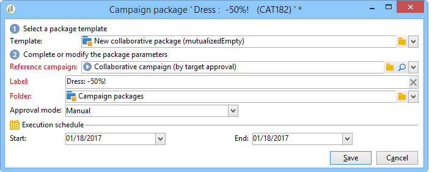
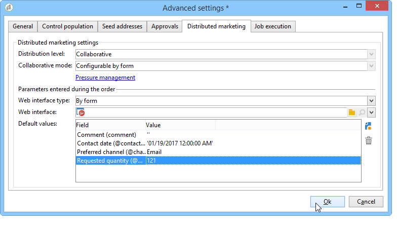

# Ejemplos{#examples}

## Creación de una campaña local (por formulario) {#creating-a-local-campaign--by-form-}

La interfaz web **Por tipo de formulario** implica utilizar una **aplicación web**. Según su configuración, esta aplicación web puede contener cualquier tipo de elementos personalizados definidos. Por ejemplo, puede sugerir enlaces para evaluar el objetivo, el presupuesto, el contenido, etc. mediante API dedicadas.

>[!NOTE]
>
>Las API se detallan en un documento dedicado, cuyo acceso depende de su contrato. Consulte la [API](../../configuration/using/about-web-services.md).
>
>La aplicación web utilizada en este ejemplo no es una aplicación web incluida con Adobe Campaign. Para utilizar un formulario en una campaña, debe crear la aplicación web dedicada.

When creating the campaign template, click the **[!UICONTROL Zoom]** icon within the **[!UICONTROL Web interface]** option of the **[!UICONTROL Advanced campaign settings...]** link to access details of the Web application.


>[!NOTE]
>
>Los parámetros de la aplicación web solo están disponibles en la plantilla de campaña.

In the **[!UICONTROL Edit]** tab, select the **Campaign order** activity and open it to access its content.


En este ejemplo, la actividad de la **solicitud de campaña** incluye:

* campos introducidos por la entidad local durante la solicitud,

   

* enlaces que permiten a la entidad local evaluar la campaña (por ejemplo: el objetivo, el presupuesto, el contenido, etc.),

   

* secuencias de comandos que permiten calcular y mostrar el resultado de estas evaluaciones.

   

En este ejemplo se utilizan las siguientes API:

* Para la evaluación de destino,

   ```
   var res = nms.localOrder.EvaluateTarget(ctx.localOrder);
   ```

* Para la evaluación del presupuesto,

   ```
   var res = nms.localOrder.EvaluateDeliveryBudget(ctx.@deliveryId, NL.XTK.parseNumber(ctx.@compt));
   ```

* Para la evaluación de contenido,

   ```
   var res = nms.localOrder.EvaluateContent(ctx.localOrder, ctx.@deliveryId, "html", resSeed.@id);
   ```

## Creación de una campaña de colaboración (por aprobación de destino) {#creating-a-collaborative-campaign--by-target-approval-}

### Introducción {#introduction}

Usted es el responsable de marketing de una gran marca de moda que tiene una tienda en línea y varias tiendas por todo Estados Unidos. Ahora que ha llegado la primavera, decide crear una oferta especial que otorgue a sus mejores clientes un 50% de descuento en todos los vestidos del catálogo.

Esta oferta está dirigida a los mejores clientes de sus tiendas de EE. UU., es decir, aquellos que han gastado más de 300 $ desde el comienzo del año.

Por tanto, decide utilizar Distributed Marketing para crear una campaña de colaboración (por aprobación de destino) que le permitirá seleccionar los mejores clientes (agrupados por región), que recibirán el envío de correo electrónico con la oferta especial.

La primera parte de este ejemplo ilustra las entidades locales que reciben la notificación de creación de campañas y cómo pueden utilizarla para evaluar la campaña y solicitarla.

La segunda parte de este ejemplo explica cómo crear la campaña.

Los pasos son los siguientes:

**Para la entidad local.**

1. Utilice la notificación de creación de campañas para acceder a la lista de contactos seleccionados por la entidad central.
1. Seleccione los contactos y apruebe la participación.

**Para la entidad central:**

1. Cree una **[!UICONTROL Data distribution]** actividad.
1. Cree la campaña de colaboración.
1. Publique la campaña.

### Lado de la entidad local {#local-entity-side}

1. Las entidades locales seleccionadas para participar en la campaña recibirán una notificación por correo electrónico.

   

1. By clicking the **[!UICONTROL Access your contact list and approve targeting]** link, the local entity is given access (via Web browser) to the list of clients selected for the campaign.

   

1. La entidad local desmarca ciertos contactos de la lista porque ya se han puesto en contacto con una oferta similar desde el inicio del año.

   

Una vez aprobadas las comprobaciones, la campaña puede iniciarse automáticamente.

### Lado de la entidad central {#central-entity-side}

#### Creación de una actividad de distribución de datos {#creating-a-data-distribution-activity}

1. To set up a collaborative campaign (by target approval) you must first create a **[!UICONTROL Data distribution activity]**. Haga clic en el **[!UICONTROL New]** icono del **[!UICONTROL Resources > Campaign management > Data distribution]** nodo.

   

1. In the **[!UICONTROL General]** tab, you must specify:

   * el **[!UICONTROL Targeting dimension]**. Aquí se lleva a cabo la **distribución de datos** para los **destinatarios**.
   * el **[!UICONTROL Distribution type]**. Puede elegir un **Tamaño fijo** o un **Tamaño como porcentaje**.
   * el **[!UICONTROL Assignment type]**. Seleccione la opción **Local entity**.
   * el **[!UICONTROL Distribution type]**. Here, it is the **[!UICONTROL Origin (@origin)]** field present in the Recipient table that lets you identify the relationship between the contact and the local entity.
   * Campo **[!UICONTROL Approval storage]** . Seleccione la opción **Local approval of recipient**.

1. In the **[!UICONTROL Breakdown]** tab, specify:

   * the **[!UICONTROL Distribution field value]**, which corresponds to the local entities involved in the upcoming campaign.
   * la entidad local **[!UICONTROL label]**.
   * the **[!UICONTROL Size]** (fixed or as a percentage). El **valor predeterminado 0** implica la selección de todos los destinatarios vinculados a la entidad local.
   

1. Guarde la nueva distribución de datos.

#### Creación de una campaña de colaboración {#creating-a-collaborative-campaign}

1. Desde el **[!UICONTROL Campaign management > Campaign]** nodo, cree un nuevo **[!UICONTROL collaborative campaign (by target approval)]**.
1. In the **[!UICONTROL Targeting and workflows]** tab, create a workflow for your campaign. This must contain a **Split** activity in which the **[!UICONTROL Record count limitation]** is defined by the **[!UICONTROL Data distribution]** activity.

   

1. Add a **[!UICONTROL Local approval]** action where you can specify:

   * el contenido del mensaje que se envía a las entidades locales en la notificación,
   * el recordatorio de aprobación,
   * el procesamiento esperado para la campaña.
   

1. Guarde el registro.

#### Publicación de la campaña {#publishing-the-campaign}

Ahora puede añadir un **paquete de campaña** desde **Campaign**.

1. Elige tu **[!UICONTROL Reference campaign]**. En la **[!UICONTROL Edit]** ficha del paquete, puede seleccionar el **[!UICONTROL Approval mode]** que se va a utilizar en la campaña:

   * en el modo **Manual**, las entidades locales participan en la campaña si aceptan la invitación de la entidad central. Pueden eliminar contactos previamente configurados si lo desean y se necesita la aprobación del administrador para confirmar su participación en la campaña.
   * en el modo **automático**, las entidades locales deben participar en la campaña, a menos que no estén registrados en ella. Pueden eliminar contactos sin aprobación.
   

1. In the **[!UICONTROL Description]** tab, you can add a description for your campaign as well as any documents to be sent to the local entities.

   

1. Apruebe el paquete de campaña y, a continuación, inicie el flujo de trabajo para publicar el paquete y ponerlo a disposición de todas las entidades locales de la lista de paquetes.

   

## Creación de una campaña de colaboración (por formulario) {#creating-a-collaborative-campaign--by-form-}

### Introducción {#introduction-1}

Usted es el responsable de marketing de una gran marca de cosméticos que tiene una tienda en línea y varias tiendas por todo Estados Unidos. Para dar salida a sus existencias de invierno y dejar espacio para sus nuevas existencias, decide crear una oferta especial dirigida a dos categorías de clientes: a personas mayores de 30 años, a quienes le ofrecerá productos para pieles sensibles, y a personas menores de 30 años, a quienes ofrecerá productos de cuidados de la piel más básicos.

Por ello, decide utilizar Distributed Marketing para crear una campaña de colaboración (por formulario) que le permitirá seleccionar clientes de sus diferentes tiendas según los intervalos de edad. Estos clientes recibirán un correo electrónico con una oferta especial que se habrá personalizado según su intervalo de edad.

La primera parte de este ejemplo ilustra las entidades locales que reciben la notificación de creación de campañas y cómo pueden utilizarla para evaluar la campaña y solicitarla.

La segunda parte de este ejemplo explica cómo crear la campaña.

Los pasos son los siguientes:

**Para la entidad local.**

1. Utilice la notificación de creación de campañas para acceder al formulario en línea.
1. Personalice la campaña (objetivo, contenido, volumen de envío).
1. Compruebe estos campos y cámbielos si es necesario.
1. Apruebe su participación.
1. El administrador de la entidad local (o de la entidad central) aprueba la configuración y participación.

**Para la entidad central:**

1. Cree la campaña de colaboración.
1. Configure the **[!UICONTROL Advanced campaign settings...]** as you would for a local campaign.
1. Configure el flujo de trabajo de campaña y el envío tal como lo haría para una campaña local.
1. Actualice el formulario web.
1. Cree el paquete de campaña y publíquelo.

### Lado de la entidad local {#local-entity-side-1}

1. Las entidades locales seleccionadas para participar en la campaña reciben una notificación por correo electrónico que les informa de su participación en la campaña.

   

1. Las entidades locales completan el formulario personalizado y:

   * evalúan el objetivo y el presupuesto,
   * previsualizan el contenido de envío,
   * aprobar su participación.

      

1. El operador de validación de solicitudes aprueba su participación.

   

### Lado de la entidad central {#central-entity-side-1}

1. Para implementar una campaña de colaboración (por formulario), debe crear una campaña con la plantilla de campaña de **Collaborative campaign (by form)**.

   

1. In the campaign&#39;s **[!UICONTROL Edit]** tab, click the **[!UICONTROL Advanced campaign settings...]** link to configure it as a local campaign. Consulte [Creación de una campaña local (por formulario)](#creating-a-local-campaign--by-form-).

   

1. Configure el flujo de trabajo de la campaña y el formulario web. Consulte [Creación de una campaña local (por formulario)](#creating-a-local-campaign--by-form-).
1. Cree su paquete de campaña especificando el calendario de ejecución y las entidades locales involucradas.

   

1. Finalize the package configuration by selecting the approval mode in the **[!UICONTROL Edit]** tab.

   

1. From the **[!UICONTROL Description]** tab, you can enter a campaign package description, a notification message to be sent to local entities when the package is published, and attach any informative documents to your campaign package.

   

1. Apruebe el paquete para publicarlo.

   

