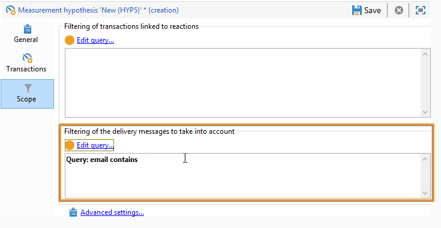
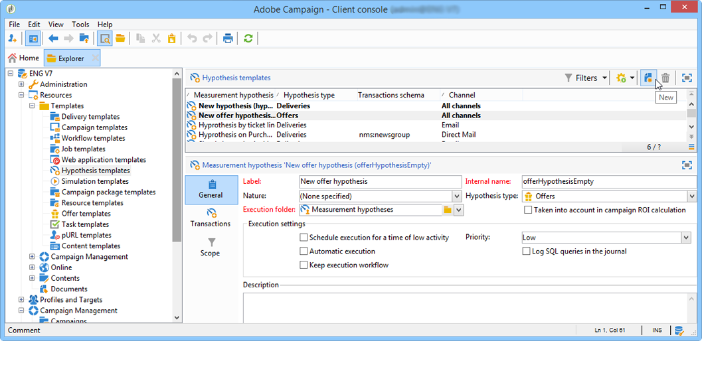

# Plantillas de Hipótesis{#hypothesis-templates}

## Creación de un modelo de hipótesis {#creating-a-hypothesis-model}

La configuración de la plantilla de hipótesis permite definir el contexto para medir las reacciones, ya sea para una entrega o para una oferta. Aquí es donde se hace referencia a las distintas tablas de medición, incluidas las usadas para definir relaciones entre individuos, hipótesis y la tabla de transacciones.

Para crear una plantilla de hipótesis, aplique los siguientes pasos:

1. En el Explorador de Adobe Campaign, haga clic en **[!UICONTROL Resources>Templates>Hypothesis templates]**.

   

1. Haga clic en **[!UICONTROL New]** o haga clic con el botón secundario en la lista de plantillas y elija **[!UICONTROL New]** en la lista desplegable.
1. Introduzca la etiqueta de hipótesis.
1. Especifique si la plantilla está destinada a hipótesis en ofertas o envíos a través de **[!UICONTROL Hypothesis type]**.
1. Para plantillas de **[!UICONTROL Delivery]**, especifique si se deben realizar mediciones con o sin un grupo de control (para más información, consulte [Propiedades de una plantilla de hipótesis](#properties-of-a-hypothesis-template)).
1. Para plantillas de **[!UICONTROL Delivery]**, puede elegir un canal específico o decidir aplicar la plantilla a todos los canales disponibles en Adobe Campaign mediante el uso de la lista desplegable de **[!UICONTROL Channel]** (para más información, consulte [Propiedades de una plantilla de hipótesis](#properties-of-a-hypothesis-template)).
1. Seleccione el **[!UICONTROL Execution folder]** en el que desea crear y ejecutar automáticamente la hipótesis que se creará a partir de esta plantilla.
1. Elija la configuración de ejecución (para obtener más información sobre esto, consulte [Configuración de ejecución de plantilla de hipótesis](#hypothesis-template-execution-settings)).
1. Especifique el periodo de cálculo de hipótesis (para obtener más información sobre esto, consulte [Configuración de ejecución de plantilla de hipótesis](#hypothesis-template-execution-settings)).

   >[!CAUTION]
   >
   >Este periodo se determina a partir de la fecha de contacto.

1. En la ficha **[!UICONTROL Transactions]** especifique las tablas y los campos requeridos para el cálculo de hipótesis (para más información, consulte [Actas](#transactions)).
1. Si la plantilla está configurada para hipótesis de **[!UICONTROL Offer]**, puede activar la opción **[!UICONTROL Update offer proposition status]**: en este caso, seleccione el estado de la propuesta de oferta que desea cambiar.
1. Especifique el ámbito de la aplicación de hipótesis (para más información, consulte [Perímetro de la hipótesis](#hypothesis-perimeter)).
1. Si es necesario, utilice una secuencia de comandos para completar el filtro (para obtener más información, consulte [Perímetro de la hipótesis](#hypothesis-perimeter)).

### Propiedades de una plantilla de hipótesis {#properties-of-a-hypothesis-template}

La pestaña plantilla **[!UICONTROL General]** le permite especificar las opciones generales de plantilla. Los campos disponibles son:

* **[!UICONTROL Hypothesis type]**: le permite determinar si la plantilla debe estar destinada a hipótesis sobre envíos u ofertas.

   También puede optar por crear una hipótesis que se aplicará a los envíos y a las ofertas.

   >[!NOTE]
   >
   >Si la plantilla se aplica a las ofertas, la opción **[!UICONTROL Update offer proposition status]** está disponible en la pestaña **[!UICONTROL Transactions]**.

* **[!UICONTROL Measurement with control group]**: permite establecer el estado de un grupo de control para la entrega o la campaña e incluirla en indicadores de medición. El grupo de control, que no recibe envíos, le permite medir el impacto de la campaña después de la entrega, comparándolo con la población objetivo que recibió la entrega.

   >[!NOTE]
   >
   >Si la plantilla está configurada para tener un grupo de control en cuenta pero no se define ningún grupo en la entrega, los resultados se basarán únicamente en los destinatarios seleccionados.

   Para obtener más información sobre la definición y configuración de un grupo de control, consulte [Definición de un grupo](../../campaign/using/marketing-campaign-deliveries.md#defining-a-control-group) de control.

* **[!UICONTROL Channel]**: puede elegir un canal específico o hacer que la plantilla de hipótesis esté disponible para todos los canales de la consola de Adobe Campaign seleccionando **[!UICONTROL All channels]** en la lista desplegable. Si configura la plantilla para un canal específico, le permite filtrar automáticamente los envíos por canal al crear la hipótesis (consulte [Creando hipótesis](../../campaign/using/creating-hypotheses.md)).

   

* **[!UICONTROL Execution folder]**: permite especificar la carpeta de ejecución de la hipótesis.
* **[!UICONTROL Taken into account in campaign ROI calculation]**: utiliza el resultado de la hipótesis en el cálculo de ROI de la campaña relacionada.

### Configuración de ejecución de plantillas de hipótesis {#hypothesis-template-execution-settings}

La pestaña **[!UICONTROL General]** de la plantilla también permite especificar los parámetros de la ejecución de hipótesis. Las opciones disponibles son las siguientes:

* **[!UICONTROL Schedule execution for a time of low activity]**: permite programar el inicio de la hipótesis para optimizar el rendimiento de Adobe Campaign. Cuando se activa esta opción, el flujo de trabajo de procesamiento de las campañas ejecuta el cálculo de hipótesis durante el tiempo de espera.

   

* **[!UICONTROL Priority]**: nivel aplicado a la hipótesis para agotar las solicitudes de cálculo de hipótesis si hay ejecuciones simultáneas.

   

* **[!UICONTROL Automatic execution]**: si es necesario, permite programar el cálculo de hipótesis (por ejemplo, si desea actualizar los indicadores regularmente hasta el final de la entrega).

   

   Para especificar una programación, aplique el siguiente proceso:

   1. Haga clic en el vínculo **[!UICONTROL Frequency of execution...]** y luego en el botón **[!UICONTROL Change...]**.

      

   1. Configure la frecuencia, los eventos relacionados y el periodo de validez.

      

   1. Haga clic en **[!UICONTROL Finish]** para guardar la programación.

      

* **[!UICONTROL Log SQL queries in journal]**: esta función está reservada para usuarios expertos. Le permite añadir una pestaña a la auditoría de hipótesis de medición para mostrar consultas SQL. Esto permite detectar posibles errores que se pueden dar en una simulación.
* **[!UICONTROL Keep execution workflow]**: permite mantener el flujo de trabajo generado automáticamente al principio del cálculo de hipótesis. En las hipótesis creadas a partir de una plantilla que tiene esta opción activada, el flujo de trabajo generado permite hacer un seguimiento del proceso.

   >[!CAUTION]
   >
   >Esta opción debe activarse solo para fines de depuración, en caso de error al ejecutar la hipótesis.\
   >Además, los flujos de trabajo generados automáticamente no se deben modificar. No se tendrá en cuenta ninguna modificación para realizar cálculos más adelante.\
   >Si ha comprobado esta opción, elimine el flujo de trabajo una vez que se haya ejecutado.

### Transacciones {#transactions}

Esta pestaña contiene los distintos campos y tablas que permiten guardar el historial de reacciones del destinatario en términos de transacciones. Consulte la guía de [configuración](../../configuration/using/about-schema-reference.md) para obtener más información sobre las tablas dedicadas a la gestión de respuestas.

* **[!UICONTROL Schema (reaction log storage)]**: seleccione la tabla de limpieza del destinatario. La tabla predeterminada de Adobe Campaign es **NmsRemaMatchRcp**.
* **[!UICONTROL Transaction schema]**: elija la tabla a la que se referirán las hipótesis, es decir, la transacción o la tabla de compras.
* **[!UICONTROL Querying schema]**: elija los criterios de filtro para la hipótesis.
* **[!UICONTROL Link to individuals]**: elija el vínculo entre las personas y la tabla utilizada como esquema de transacción.
* **[!UICONTROL Link to the household]**: seleccione el vínculo al hogar en el esquema de transacciones si desea incluir a todos los miembros de un hogar en una hipótesis. Este campo es opcional.
* **[!UICONTROL Transaction date]**: este campo es opcional pero recomendado, ya que permite definir un periodo para el cálculo de hipótesis.
* **[!UICONTROL Measurement period]**: le permite configurar las fechas de inicio y finalización durante las cuales se ejecutan las hipótesis y se recuperan las líneas de compra.

   Cuando la hipótesis está vinculada a una entrega, la medición se activa automáticamente unos días después de la fecha de contacto para los envíos de correo directo, o después de la fecha de entrega para envíos de correo electrónico o SMS.

   

   Si la hipótesis se inicia sobre la marcha, se puede forzar si quisiera activarla inmediatamente. De lo contrario, se activa automáticamente en función de la fecha de finalización del cálculo configurada, que se basa en la fecha de creación de la hipótesis (consulte [Creación de una hipótesis sobre la marcha en una entrega](../../campaign/using/creating-hypotheses.md#creating-a-hypothesis-on-the-fly-on-a-delivery)).

* **[!UICONTROL Transaction/Margin amount]**: estos campos son opcionales y permiten calcular los indicadores de facturación automáticamente (consulte [Indicadores](../../campaign/using/hypothesis-tracking.md#indicators)).
* **[!UICONTROL Unit amount]**: permite configurar una cantidad para calcular ingresos (consulte [Indicadores](../../campaign/using/hypothesis-tracking.md#indicators)).

   

* **[!UICONTROL Additional measures and data]**: permite especificar medidas o ejes de informes adicionales de los campos en las distintas tablas.
* **[!UICONTROL Update offer proposition status]**: permite cambiar el estado de la propuesta de oferta si la hipótesis identifica un destinatario de la oferta.

   

### Perímetro de hipótesis {#hypothesis-perimeter}

Una vez que haya definido la tabla de transacciones y los campos a los que se referirá la hipótesis, puede refinar el alcance de sus hipótesis especificando las transacciones y envíos específicos utilizando filtros. También puede utilizar una secuencia de comandos de JavaScript para indicar explícitamente el producto al que se hace referencia en la tabla de transacciones.

* **Filtering on transactions**: en la pestaña **[!UICONTROL Scope]**, puede configurar un filtro en la hipótesis. Para ello:

   1. Haga clic en el vínculo **[!UICONTROL Edit query]**.

      

   1. Especifique las condiciones del filtro.

      

   1. Seleccione la transacción a la que quiere vincular la hipótesis.

      

* **Filter on recipients**: en la pestaña **[!UICONTROL Scope]**, puede limitar la hipótesis a cualquier información vinculada a un mensaje (entrega, destinatario, dirección de correo electrónico, servicio, etc.):

   1. Haga clic en el vínculo **[!UICONTROL Add a filter]** luego en **[!UICONTROL Edit query]**.

      

   1. Especifique las condiciones del filtro.

      

   1. Haga clic en **[!UICONTROL Finish]** para guardar la consulta.

      

* **Script**: puede utilizar una secuencia de comandos de JavaScript para sobrecargar dinámicamente la configuración de hipótesis durante su ejecución.

   Para ello, haga clic en el vínculo **[!UICONTROL Advanced settings]** e introduzca la secuencia de comandos deseada.

   >[!NOTE]
   >
   >Esta opción es para usuarios expertos.

   

## Ejemplo: Creación de una plantilla de hipótesis para una entrega {#example--creating-a-hypothesis-template-on-a-delivery}

En este ejemplo, vamos a crear una plantilla de hipótesis para una entrega de correo postal. La tabla de transacciones (**Purchases** en nuestro ejemplo) en la que se basarán las hipótesis contiene líneas de compra vinculadas a artículos o productos. Queremos configurar nuestro modelo para crear hipótesis sobre artículos o productos en la tabla de compras.

1. En el explorador de Adobe Campaign, vaya al directorio **[!UICONTROL Resources > Templates > Hypothesis templates]**.
1. Haga clic en **[!UICONTROL New]** para crear una plantilla.

   

1. Cambie la etiqueta de la plantilla.

   

1. Seleccione **[!UICONTROL Deliveries]** como tipo de hipótesis.
1. Especifique que la entrega puede contener un grupo de control comprobando el cuadro correspondiente.
1. Seleccione el canal **[!UICONTROL Direct mail]** (Correo postal).

   >[!NOTE]
   >
   >Debido a que la plantilla es específica para los envíos de correo directo, las hipótesis creadas utilizando este modelo pueden no estar vinculadas a ningún otro tipo de entrega.

1. En la pestaña **[!UICONTROL Transactions]**, seleccione la tabla de reacciones de destinatarios.

   

1. En el campo **[!UICONTROL Transactions schema]**, seleccione la tabla de compra.

   

1. Seleccione las líneas de compra en el campo **[!UICONTROL Querying schema]**.

   

1. Seleccione los destinatarios vinculados a la tabla de compra.

   

1. Seleccione el campo vinculado a la fecha de compra.

   Esto permite definir un intervalo de tiempo para hipótesis. Este paso no es obligatorio; sin embargo, es recomendable.

   

1. Configure el periodo de cálculo de 5 a 25 días.

   

1. En la pestaña **[!UICONTROL Scope]**, haga clic en **[!UICONTROL Edit query]** para crear un filtro de hipótesis.

   

   La plantilla creada le permite ejecutar hipótesis sobre los productos o artículos de la tabla de compra.

1. Haga clic en **[!UICONTROL Save]** para guardar la plantilla.
