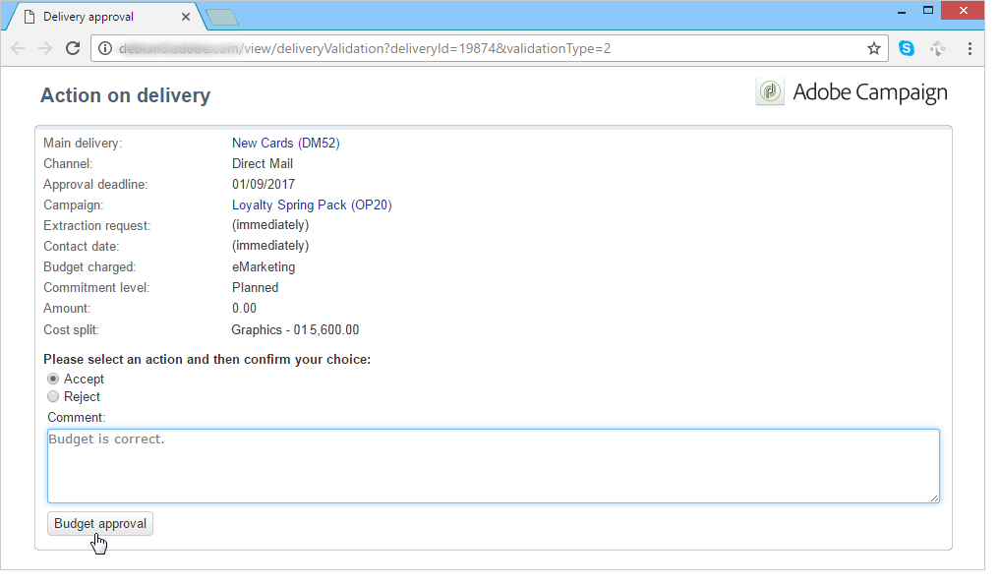
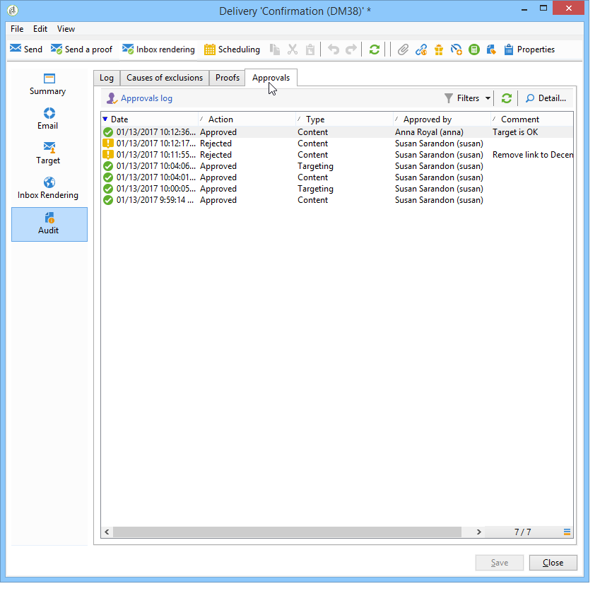

# Aprobación de campañas de marketing {#approving-marketing-campaigns}

## Proceso de aprobación {#approval-process}

Cada paso de un envío puede estar sujeto a la aprobación para garantizar una monitorización y un control completos de los distintos procesos de la campaña: objetivos, contenido, presupuesto, extracción y envío de una prueba.

>[!NOTE]
>
>Debe comprobar que los revisores tienen los derechos adecuados para la aprobación. Compruebe también que su zona de seguridad está definida correctamente.

Los correos electrónicos de notificación se envían a los operadores de Adobe Campaign, que son revisores designados, para informarles de una solicitud de aprobación.

El procedimiento de aprobación se presenta en [Comprobación y aprobación de entregas](#checking-and-approving-deliveries).

>[!NOTE]
>
>Solo el propietario del envío puede iniciar un envío. In order for another operator (or operator group) to be able to start a delivery, you have to add them as reviewers in the **[!UICONTROL Delivery start:]** field.\
>Consulte también [Selección de revisores](#selecting-reviewers).

### Principio de funcionamiento {#operating-principle-}

Por ejemplo, el correo electrónico estándar para la aprobación del presupuesto es el siguiente:

Los operadores revisores pueden entonces elegir si aprueban o no el paso en cuestión.

Una vez que el operador aprueba su elección, la aprobación o el rechazo del trabajo se reenvían al panel de envío.

The information is also available in the approval logs of the campaign (Accessed via the **[!UICONTROL Edit > Tracking > Approvals]** tab):

Estas notificaciones se envían a los operadores implicados en cada proceso para el cual se activó la aprobación.

Las aprobaciones pueden habilitarse para la plantilla de campaña, para cada campaña individualmente o para un envío.

All jobs requiring approval are selected in the campaign template ( **[!UICONTROL Properties]** > **[!UICONTROL Advanced campaign settings...]** > **[!UICONTROL Approvals]** tab), as are the operators in charge of approval (they will receive notifications, unless this option is not enabled). For more on this, refer to [Approving processes](#approving-processes).

These settings can be overridden for each campaign created using this template, and individually for each campaign delivery: click the **[!UICONTROL Properties]** button, then the **[!UICONTROL Approvals]** tab.

En el ejemplo siguiente, el contenido del envío no requiere aprobaciones:

### Selección de revisores {#selecting-reviewers}

Para cada tipo de aprobación, se seleccionan los operadores o grupos de operadores a cargo de la aprobación de la lista desplegable en el envío. Additional operators can be added using the **[!UICONTROL Edit...]** link. Esta ventana también le permite editar la fecha límite de la aprobación.

Si no se especifica ningún revisor, el administrador de campaña es el responsable de la aprobación y recibe las notificaciones. The campaign manager is specified in the **[!UICONTROL Edit > Properties]** tab of the campaign:

>[!NOTE]
>
>All other Adobe Campaign operators with **[!UICONTROL Administrator]** rights can also approve jobs, but they will not receive notifications.\
>De forma predeterminada, el administrador de campaña no puede realizar la aprobación o iniciar los envíos si se han definido los operadores de aprobación. Puede modificar este funcionamiento y conceder al administrador de campaña autorización para aprobar o iniciar envíos creando la opción **NmsCampaign_Activate_OwnerConfirmation** con **1** como valor.

### Modos de aprobación {#approval-modes}

#### Aprobación mediante el panel {#approval-via-the-dashboard}

Para aprobar un trabajo a través de la consola o la interfaz Web, haga clic en el enlace correspondiente en el panel de campañas. Los trabajos también se pueden aprobar mediante el seguimiento del envío o mediante el panel de envío.

Compruebe la información que desea aprobar, seleccione si acepta o rechaza la aprobación y, si lo considera necesario, introduzca un comentario. Haga clic **[!UICONTROL Ok]** para guardar.

>[!NOTE]
>
>Si un operador ya ha aprobado un proceso, el enlace de aprobación no aparece como disponible.

#### Aprobación mediante mensajes de notificación {#approval-via-notification-messages}

Click the link available in the notification message (see [Notifications](#notifications)). Se le pide que se identifique como se muestra a continuación:

Seleccione **[!UICONTROL Accept]** o **[!UICONTROL Reject]** introduzca un comentario si es necesario.

Haga clic **[!UICONTROL Validate]**.

>[!NOTE]
>
>Si se han producido advertencias durante el proceso, se muestra un aviso en la notificación.

#### Seguimiento de la aprobación {#approval-tracking}

La información está disponible en varios lugares:

* En el registro de aprobación de campaña, **[!UICONTROL Approvals]** subficha de la **[!UICONTROL Edit > Tracking]** ficha:

   

* En el registro de envío de campaña, **[!UICONTROL Deliveries]** subficha de la **[!UICONTROL Edit > Tracking]** ficha:

   

* The approval status for each delivery can be viewed by clicking the **[!UICONTROL Hide/show log]** option of the **[!UICONTROL Summary]** tab.

   

* This information can also be accessed via the **[!UICONTROL Tracking > Approvals]** tab of each delivery:

   

>[!NOTE]
>
>Una vez que un operador ha aprobado o rechazado un trabajo, los otros operadores revisores ya no pueden modificar la aprobación.

#### Aprobación automática y manual {#automatic-and-manual-approval}

Al crear un flujo de trabajo de objetivo, si la aprobación es automática (modo predeterminado), Adobe Campaign muestra el enlace de aprobación o envía una notificación en cuanto se requiere una aprobación.

To choose the approval mode (manual or automatic), click the **[!UICONTROL Edit > Properties]** tab of the campaign or campaign template, then click **[!UICONTROL Advanced campaign settings...]** and finally the **[!UICONTROL Approvals]** tab.

>[!NOTE]
>
>El modo de aprobación seleccionado se aplica a todos los envíos de la campaña.

Cuando se crea un flujo de trabajo como objetivo, la aprobación manual le permite evitar la creación de enlaces de aprobación o enviar notificaciones automáticamente. The campaign dashboard then offers a **[!UICONTROL Submit targeting for approval]** link to launch the approval process manually.

Un mensaje de confirmación permite autorizar aprobaciones en los trabajos seleccionados para esta entrega.

Los botones de aprobación se muestran en el panel de campañas (para este envío), en el panel de envío y en el seguimiento de envíos. Si las notificaciones están habilitadas, se envían en paralelo.

Este método de activación de aprobaciones le permite trabajar en los objetivos sin enviar notificaciones falsas a los revisores.

### Notificaciones {#notifications}

Las notificaciones son mensajes de correo electrónico específicos enviados a los revisores para informarles de que un proceso está pendiente de aprobación. Cuando el operador hace clic en el enlace del mensaje, aparece una página de autenticación y, después de iniciar sesión, el operador puede ver la información y aprobar o rechazar el trabajo. También se puede introducir un comentario en la ventana de aprobación.

El contenido de los correos electrónicos de notificación se puede personalizar. Consulte Contenido [de notificación](#notification-content).

#### Activación o desactivación de la notificación {#enabling-disabling-notification}

De manera predeterminada, los mensajes de notificación se envían si la aprobación del trabajo relacionado está habilitada en la plantilla de campaña, la campaña o el envío. Sin embargo, las notificaciones se pueden deshabilitar para que solo sea posible autorizar las aprobaciones desde la consola.

Para ello, edite la ventana de aprobación de la plantilla de campaña o campaña ( **[!UICONTROL Edit > Properties]** > **[!UICONTROL Advanced campaign settings...]** > **[!UICONTROL Approvals]** ficha) y seleccione **[!UICONTROL Do not enable notification sending]**.

#### Contenido de la notificación {#notification-content}

El contenido de la notificación se define en una plantilla específica: **[!UICONTROL Notification of validations for the marketing campaign]**. This template is saved in the **[!UICONTROL Administration > Campaign management > Technical delivery templates]** folder of the Adobe Campaign tree.

## Comprobación y aprobación de los envíos {#checking-and-approving-deliveries}

Adobe Campaign permite configurar procesos de aprobación para las principales etapas de la campaña de marketing en modo colaborativo.

Para los envíos de correo directo, los operadores de Adobe Campaign pueden ver el archivo de extracción antes de enviarlo al enrutador y, si es necesario, pueden cambiar el formato y volver a iniciar la extracción. See [Approving an extraction file](#approving-an-extraction-file).

Para cada campaña puede aprobar el objetivo de envío, el contenido (consulte [Aprobación de contenido](#approving-content)) y los costos. Los operadores de Adobe Campaign responsables de la aprobación pueden ser notificados por correo electrónico y aceptar o rechazar la aprobación a través de la consola o de una conexión web. Consulte [Aprobación de procesos](#approving-processes).

Cuando se hayan completado estas fases de validación, se puede iniciar el envío. Consulte [Inicio de un envío](../../campaign/using/marketing-campaign-deliveries.md#starting-a-delivery).

>[!NOTE]
>
>For further information about approval modes and tracking, see [Approval process](#approval-process).

### Aprobación de procesos {#approving-processes}

Las etapas que requieren aprobación aparecen en el tablero de campañas (a través de la consola de la interfaz web). También aparecen en la tabla de seguimiento de envíos y en el panel de envíos.

At this point, the status of the campaign is **[!UICONTROL To validate]**.

>[!NOTE]
>
>* Para seleccionar los procesos sujetos a aprobación, modifique la plantilla de campaña. For more on this, refer to [Campaign templates](../../campaign/using/marketing-campaign-templates.md#campaign-templates).
   >
   >
* Also refer to the section on the [Approval process](#approval-process).

>[!NOTE]
>
>In a targeting workflow, if an error linked to a configuration issue occurs during message preparation, the **[!UICONTROL Restart message preparation]** link is shown on the dashboard. Corrija el error y haga clic en este enlace para reiniciar la preparación del mensaje a la vez que se omite la etapa de selección.

En cada envío de la campaña, puede aprobar los siguientes procesos:

* **Objetivos, contenido y presupuesto**

   When the **[!UICONTROL Enable target approval]**, **[!UICONTROL Enable content approval]** or **[!UICONTROL Enable budget approval]** options are selected in the job approval settings window, the relevant links are shown in the campaign dashboard for the concerned deliveries.

   >[!NOTE]
   >
   >La aprobación del presupuesto solo está disponible si la aprobación de objetivos está habilitada en la ventana de configuración de aprobación. El enlace para la aprobación del presupuesto solo se muestra una vez analizado el objetivo. Además, este enlace se muestra junto con el enlace para la aprobación de objetivos.

   Si las **[!UICONTROL Assign content editing]** opciones o **[!UICONTROL External content approval]** están seleccionadas en la ventana de configuración de aprobación, el tablero mostrará los **[!UICONTROL Available content]** vínculos y **[!UICONTROL External content approval]** .

   La aprobación de contenido permite acceder a las pruebas enviadas.

* **Aprobación de extracción (envío de correo directo)**

   When **[!UICONTROL Enable extraction approval]** is selected in the approval settings window, the extracted file must be approved before the router can be notified.

   An **[!UICONTROL Approve content]** link is available on the campaign dashboard as shown below:

   

   Los archivos de extracción se pueden previsualizar mediante el cuadro de aprobación y, a continuación, ser aceptados o rechazados.

   

   >[!NOTE]
   >
   >La vista previa del archivo de extracción solo tiene en cuenta una muestra de los datos. El archivo de salida completo no se carga.

* **Aprobación de envíos asociados**

   The **[!UICONTROL Enable individual approval of each associated delivery]** option is used for one main delivery associated with secondary deliveries. De forma predeterminada, esta opción no está seleccionada para que se pueda realizar una aprobación general del envío principal. Si se selecciona esta opción, cada envío debe aprobarse de forma individual.

   

#### Selección de procesos para aprobar {#choosing-the-processes-to-be-approved}

Las fases de aprobación se definen con la plantilla asociada a la campaña. Debe seleccionar los elementos que desea aprobar en la plantilla y especificar los operadores de Adobe Campaign responsables de estas aprobaciones. For more on this, refer to [Campaign templates](../../campaign/using/marketing-campaign-templates.md#campaign-templates).

>[!NOTE]
>
>La configuración de aprobación para la campaña o la plantilla de campaña se aplican a todos los envíos futuros vinculados a esta campaña. Los cambios de configuración no se aplican a los envíos anteriores.

Esta información se puede sobrescribir en cada campaña y cada envío.

For a campaign, click the **[!UICONTROL Edit > Properties]** tab, then the **[!UICONTROL Advanced campaign settings...]** link, and finally the **[!UICONTROL Approvals]** sub-tab to access the approvals configuration page.

Puede seleccionar y deseleccionar los procesos para aprobar y designar a los operadores de Adobe Campaign responsables de la aprobación. Pueden ser operadores individuales, grupos de operadores o una lista de operadores.

To select a list of operators, click the **[!UICONTROL Edit...]** link to the right of the field designating the first reviewer and add as many operators as necessary, as shown below:

>[!NOTE]
>
>* Si se define una lista de revisores, el trabajo se aprueba en cuanto un revisor lo acepte. El enlace de aprobación correspondiente, en ese caso, ya no se ofrece en el panel. Cuando se activa el envío de notificaciones, si otro revisor hace clic en el enlace de aprobación incluido en el mensaje de notificación, se le notifica que otro operador ya ha aprobado el trabajo.
>* Puede definir una programación de aprobación para la campaña en la sección inferior de la ventana de edición del revisor. De forma predeterminada, los revisores tienen tres días a partir de la fecha de envío para aprobar un proceso. Es posible configurar un recordatorio que se envíe automáticamente a los operadores antes de la fecha límite de aprobación.
>* Puede agregar recordatorios en esta sección.
>

For each delivery, click the **[!UICONTROL Audit]** button and the **[!UICONTROL Approvals]** tab to view and edit approval dates and automatic reminders.

>[!NOTE]
>
>Esta pestaña está disponible una vez que se ha iniciado el proceso de aprobación del contenido.

### Aprobación de contenido {#approving-content}

>[!CAUTION]
>
>Para aprobar un contenido, es obligatorio un ejecutar un ciclo de prueba. Las pruebas permiten aprobar la visualización de información, personalizar los datos y comprobar que los enlaces funcionan. Para obtener más información sobre la creación de una prueba y su ciclo de vida, consulte la sección [envío de mensajes](../../delivery/using/steps-validating-the-delivery.md#sending-a-proof).
>
>Las funcionalidades de aprobación de contenido detalladas a continuación están diseñadas para añadirse al envío de prueba.

Es posible configurar un ciclo de aprobación de contenido. To do this, select the **[!UICONTROL Enable content approval]** option in the approval settings window. Los pasos principales del ciclo de aprobación de contenido son:

1. After creating a new delivery, the campaign manager clicks the **[!UICONTROL Submit content]** link on the campaign dashboard to start the content approval cycle.

   

   >[!NOTE]
   >
   >If the **[!UICONTROL Enable the sending of proofs]** option (for email deliveries) or **[!UICONTROL Enable the sending and approval of proofs]** (for direct mail deliveries) options were selected in the approval settings window, proofs will be sent automatically.

1. Se envía un correo electrónico de notificación a la persona responsable del contenido, que puede elegir si lo aprueba o no:

   * mediante el correo electrónico de notificación:

      

      >[!NOTE]
      >
      >El correo electrónico de notificación contiene un enlace a las pruebas que ya se han enviado y posiblemente a una representación del mensaje para los distintos entornos limitados si la opción **Deliverability** está habilitada para esta instancia.

   * a través de la consola o interfaz web, el seguimiento de envío, el panel de envío o el panel de campaña:

      

      >[!NOTE]
      >
      >This campaign dashboard lets you view the list of proofs that have been sent, by clicking the **[!UICONTROL Inbox rendering...]** link. To view their content, click the **[!UICONTROL Detail]** icon to the right of the list.

      

1. Se envía un mensaje de correo electrónico de notificación a la persona responsable de la campaña para informarles de si el contenido ha sido aprobado o no.

   >[!NOTE]
   >
   >La persona responsable de la campaña puede volver a iniciar el ciclo de aprobación de contenido en cualquier momento. To do this, click the link on the **[!UICONTROL Content status]** line of the campaign dashboard (at delivery level), then click **[!UICONTROL Reset content approval to submit it again]**.

   

#### Asignación de la edición de contenido {#assign-content-editing}

Esta opción le permite definir a alguien a cargo de la edición de contenido, como un webmaster. If the **[!UICONTROL Assign content editing]** option is selected in the approval settings window, several approval steps are added between delivery creation and delivery of the notification email to the person in charge of content:

1. After creating a new delivery, the person responsible for the campaign clicks the **[!UICONTROL Submit content editing]** link in the campaign dashboard to start the content editing cycle.

   

1. La persona responsable de la edición de contenido recibirá un correo electrónico que les informará de que el contenido está disponible.

   

1. Pueden iniciar sesión en la consola, abrir el envío y editarlo utilizando un asistente simplificado para cambiar el asunto, el contenido HTML y el contenido de texto y enviar pruebas.

   

   >[!NOTE]
   >
   >If the **[!UICONTROL Enable the sending of proofs]** option (for email deliveries) or **[!UICONTROL Enable the sending and approval of proofs]** (for direct mail deliveries) options were selected in the approval settings window, proofs will be sent automatically.

1. Una vez que la persona de la edición de contenido ha terminado de realizar cambios en el contenido del envío, puede permitir el acceso al contenido.

   Para ello, puede hacer lo siguiente:

   * click the **[!UICONTROL Available content]** link via the Adobe Campaign console.

      

   * haga clic en el enlace del mensaje de notificación y, a continuación, apruebe la disponibilidad del contenido.

      

      El operador puede añadir un comentario antes de enviar el contenido a la persona a cargo de la campaña.

      

      El mensaje de notificación permite que el revisor apruebe o rechace el contenido.

      

#### Aprobación de contenido externo {#external-content-approval}

Esta opción le permite definir un operador externo encargado de aprobar la representación de entrega, como coherencia de la comunicación de la marca, tasas, etc. Cuando se selecciona la **[!UICONTROL External content approval]** opción en la ventana de configuración de aprobación, se agregan varios pasos de aprobación entre la aprobación del contenido y el envío de la notificación a la persona a cargo de la campaña:

1. El administrador de contenido externo recibe un mensaje de correo electrónico de notificación que indica que el contenido se ha aprobado y se solicita la aprobación externa.
1. El correo electrónico de notificación contiene enlaces a las pruebas enviadas, lo que le permite ver el procesamiento del envío, y un botón para aprobar o rechazar el contenido del envío.

   >[!NOTE]
   >
   >Estos enlaces solo están disponibles si se han enviado una o más pruebas. De lo contrario, el procesamiento del envío solo está disponible a través de la consola o de la interfaz web.

   

### Aprobación de un archivo de extracción {#approving-an-extraction-file}

En el caso de envíos sin conexión, Adobe Campaign genera un archivo de extracción que, según cómo se configure, se envía al enrutador. El contenido depende de la plantilla de exportación utilizada.

When the content, targeting and budget have been approved, the delivery changes to **[!UICONTROL Extraction pending]** until the extraction workflow for the campaigns is launched.

On the extraction request date, the extraction file is created and the delivery status changes to **[!UICONTROL File to approve]**.

Puede ver el contenido del archivo extraído (haciendo clic en su nombre), aprobarlo o, si es necesario, cambiar el formato y volver a iniciar la extracción con los enlaces del panel.

Una vez aprobado el archivo, puede enviar el correo electrónico de notificación al enrutador. Para obtener más información sobre esto, consulte [Inicio de una entrega](../../campaign/using/marketing-campaign-deliveries.md#starting-an-offline-delivery)sin conexión.
