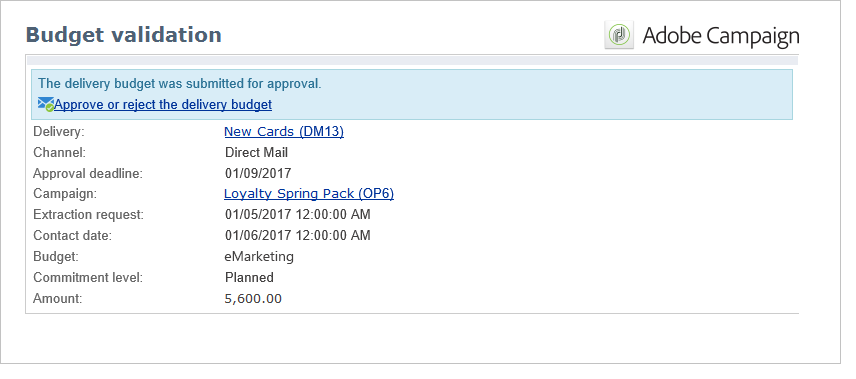
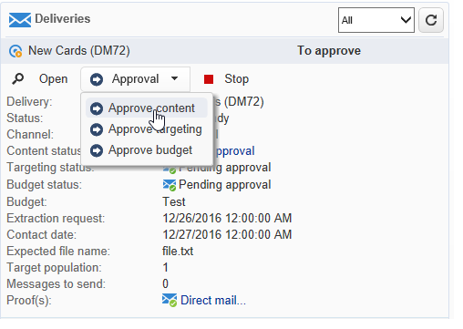
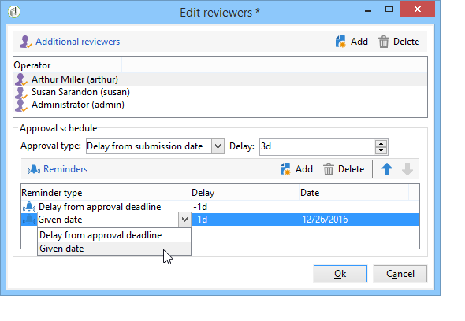

# Aprobación de campañas de marketing {#approving-marketing-campaigns}

## Proceso de aprobación {#approval-process}

Cada paso de una entrega puede estar sujeto a la aprobación para garantizar una monitorización y un control completos de los distintos procesos de la campaña: objetivos, contenido, presupuesto, extracción y entrega de una prueba.

>[!NOTE]
>
>Debe comprobar que los revisores tienen los derechos correctos para la aprobación. Compruebe también que su zona de seguridad está definida correctamente.

Los correos electrónicos de notificación se envían a los operadores de Adobe Campaign, que son revisores designados, para informarles de una solicitud de aprobación.

El procedimiento de aprobación se presenta en [Checking and approving deliveries](#checking-and-approving-deliveries).

>[!NOTE]
>
>Solo el propietario de la entrega puede iniciar una entrega. Para que otro operador (o grupo de operadores) pueda iniciar una entrega, debe añadirlos como revisores en el campo **[!UICONTROL Delivery start:]**.\
>Consulte también [Selección de revisores](#selecting-reviewers).

### Principio de funcionamiento {#operating-principle-}

Por ejemplo, el correo electrónico estándar para la aprobación del presupuesto es el siguiente:

Los operadores revisores pueden entonces elegir si aprueban o no el paso en cuestión.

Una vez que el operador aprueba su elección, la aprobación o el rechazo del trabajo se reenvían al panel de entrega.

La información también está disponible en los registros de aprobación de la campaña (a través de la pestaña **[!UICONTROL Edit > Tracking > Approvals]**):

Estas notificaciones se envían a los operadores implicados en cada proceso para el cual se activó la aprobación.

Las aprobaciones pueden habilitarse para la plantilla de campaña, para cada campaña individualmente o para una entrega.

Todos los trabajos que requieren aprobación están seleccionados en la plantilla de campaña (pestaña **[!UICONTROL Properties]** > **[!UICONTROL Advanced campaign settings...]** > **[!UICONTROL Approvals]**), de la misma forma que los operadores de aprobación (reciben notificaciones, a menos que esta opción no esté habilitada). Para obtener más información, consulte los [Procesos de aprobación](#approving-processes).

Esta configuración se puede sobrescribir para cada campaña creada con esta plantilla e individualmente para cada entrega de campaña: haga clic en el botón **[!UICONTROL Properties]** y luego en la pestaña **[!UICONTROL Approvals]**.

En el ejemplo siguiente, el contenido de la entrega no requiere aprobaciones:

### Selección de revisores {#selecting-reviewers}

Para cada tipo de aprobación, se seleccionan los operadores o grupos de operadores a cargo de la aprobación de la lista desplegable en la entrega. Se pueden agregar operadores adicionales mediante el vínculo **[!UICONTROL Edit...]**. Esta ventana también le permite editar la fecha límite de la aprobación.

Si no se especifica ningún revisor, el administrador de campaña es el responsable de la aprobación y recibe las notificaciones. El administrador de campaña se especifica en la pestaña **[!UICONTROL Edit > Properties]** de la campaña:

>[!NOTE]
>
>Todos los demás operadores de Adobe Campaign con derechos de **[!UICONTROL Administrator]** también pueden aprobar trabajos, pero no reciben notificaciones.\
>De forma predeterminada, el administrador de campaña no puede realizar la aprobación o iniciar las entregas si se han definido los operadores de aprobación. Puede modificar este funcionamiento y conceder al administrador de campaña autorización para aprobar o iniciar entregas creando la opción **NmsCampaign_Activate_OwnerConfirmation** con **1** como valor.

### Modos de aprobación {#approval-modes}

#### Aprobación mediante el panel {#approval-via-the-dashboard}

Para aprobar un trabajo a través de la consola o la interfaz Web, haga clic en el vínculo correspondiente en el panel de campañas. Los trabajos también se pueden aprobar mediante el seguimiento de la entrega o mediante el panel de entrega.

Compruebe la información que desea aprobar, seleccione si acepta o rechaza la aprobación y, si lo considera necesario, introduzca un comentario. Haga clic en **[!UICONTROL Ok]** para guardar.

>[!NOTE]
>
>Si un operador ya ha aprobado un proceso, el vínculo de aprobación no aparece como disponible.

#### Aprobación mediante mensajes de notificación {#approval-via-notification-messages}

Haga clic en el vínculo disponible en el mensaje de notificación (consulte [Notificaciones](#notifications)). Se le pide que se identifique como se muestra a continuación:

Seleccione **[!UICONTROL Accept]** o **[!UICONTROL Reject]** e introduzca un comentario si lo considera necesario.

Haga clic en **[!UICONTROL Validate]**.

>[!NOTE]
>
>Si se han producido advertencias durante el proceso, se muestra un aviso en la notificación.

#### Seguimiento de la aprobación {#approval-tracking}

La información está disponible en varios lugares:

* En el registro de aprobación de la campaña, en la subpestaña **[!UICONTROL Approvals]** dentro de la pestaña **[!UICONTROL Edit > Tracking]**:

   

* En el registro de entrega de la campaña, en la subpestaña **[!UICONTROL Deliveries]** dentro de la pestaña **[!UICONTROL Edit > Tracking]**:

   

* Para ver el estado de aprobación de cada entrega, haga clic en la opción **[!UICONTROL Hide/show log]** en la pestaña **[!UICONTROL Summary]**.

   

* También se puede acceder a esta información a través de la pestaña **[!UICONTROL Tracking > Approvals]** de cada entrega:

   

>[!NOTE]
>
>Una vez que un operador ha aprobado o rechazado un trabajo, los otros operadores revisores ya no pueden modificar la aprobación.

#### Aprobación automática y manual {#automatic-and-manual-approval}

Al crear un flujo de trabajo de objetivo, si la aprobación es automática (modo predeterminado), Adobe Campaign muestra el vínculo de aprobación o envía una notificación en cuanto se requiere una aprobación.

Para seleccionar el modo de aprobación (manual o automático), haga clic en la pestaña **[!UICONTROL Edit > Properties]** en la campaña o plantilla de campaña y luego haga clic en **[!UICONTROL Advanced campaign settings...]** y finalmente en la pestaña **[!UICONTROL Approvals]**.

>[!NOTE]
>
>El modo de aprobación seleccionado se aplica a todas las entregas de la campaña.

Cuando se crea un flujo de trabajo como objetivo, la aprobación manual le permite evitar la creación de vínculos de aprobación o enviar notificaciones automáticamente. A continuación, el panel de campaña le ofrece un vínculo **[!UICONTROL Submit targeting for approval]** para iniciar el proceso de aprobación manualmente.

Los mensajes de confirmación le permiten autorizar las aprobaciones en los trabajos seleccionados para esta entrega.

Los botones de aprobación se muestran en el panel de campañas (para esta entrega), en el panel de entrega y en el seguimiento de entregas. Si las notificaciones están habilitadas, se envían en paralelo.

Este método de activación de aprobaciones le permite trabajar en los objetivos sin enviar notificaciones falsas a los revisores.

### Notificaciones {#notifications}

Las notificaciones son mensajes de correo electrónico específicos enviados a los revisores para informarles de que un proceso está pendiente de aprobación. Cuando el operador hace clic en el vínculo del mensaje, aparece una página de autenticación y, después de iniciar sesión, el operador puede ver la información y aprobar o rechazar el trabajo. También se puede introducir un comentario en la ventana de aprobación.

El contenido de los correos electrónicos de notificación se puede personalizar. Consulte [Contenido de notificación](#notification-content).

#### Activación o desactivación de la notificación {#enabling-disabling-notification}

De manera predeterminada, los mensajes de notificación se envían si la aprobación del trabajo relacionado está habilitada en la plantilla de campaña, la campaña o la entrega. Sin embargo, las notificaciones se pueden deshabilitar para que solo sea posible autorizar las aprobaciones desde la consola.

Para ello, edite la ventana de aprobación de la plantilla de campaña o la campaña (pestaña **[!UICONTROL Edit > Properties]** > **[!UICONTROL Advanced campaign settings...]** > **[!UICONTROL Approvals]**) y seleccione **[!UICONTROL Do not enable notification sending]**.

#### Contenido de la notificación {#notification-content}

El contenido de la notificación se define en una plantilla específica: **[!UICONTROL Notification of validations for the marketing campaign]**. Esta plantilla se guarda en la carpeta **[!UICONTROL Administration > Campaign management > Technical delivery templates]** del árbol de carpetas de Adobe Campaign.

## Comprobación y aprobación de las entregas {#checking-and-approving-deliveries}

Adobe Campaign permite configurar los procesos de aprobación para las etapas principales de la campaña de marketing en modo de colaboración.

Para las entregas de correo directo, los operadores de Adobe Campaign pueden ver el archivo de extracción antes de enviarlo al enrutador y, si es necesario, pueden cambiar el formato y volver a iniciar la extracción. Consulte [Aprobación de un archivo de extracción](#approving-an-extraction-file).

Para cada campaña, puede aprobar el objetivo de entrega, los contenidos (consulte [Aprobar contenido](#approving-content)) y los costes. Los operadores de Adobe Campaign responsables de la aprobación pueden ser notificados por correo electrónico y aceptar o rechazar la aprobación a través de la consola o de una conexión web. Consulte [Aprobación de procesos](#approving-processes).

Cuando se hayan completado estas fases de validación, se puede iniciar la entrega. Consulte [Inicio de una entrega](../../campaign/using/marketing-campaign-deliveries.md#starting-a-delivery).

>[!NOTE]
>
>Para obtener más información sobre los modos de aprobación y el seguimiento, consulte [Proceso de aprobación](#approval-process).

### Aprobación de procesos {#approving-processes}

Las etapas que requieren aprobación aparecen en el panel de campañas (a través de la consola de la interfaz web). También aparecen en la tabla de seguimiento de entregas y en el panel de entregas.

En este punto, el estado de la campaña es **[!UICONTROL To validate]**.

>[!NOTE]
>
>* Para seleccionar los procesos sujetos a aprobación, modifique la plantilla de campaña. Para obtener más información, consulte [Plantillas de campaña](../../campaign/using/marketing-campaign-templates.md#campaign-templates).
>
>* También consulte la sección en [Proceso de aprobación](#approval-process).

>[!NOTE]
>
>En un flujo de trabajo de objetivos, si se produce un error vinculado a un problema de configuración durante la preparación del mensaje, en el panel aparece el vínculo **[!UICONTROL Restart message preparation]**. Corrija el error y haga clic en este vínculo para reiniciar la preparación del mensaje a la vez que se omite la etapa de selección.

En cada entrega de la campaña, puede aprobar los siguientes procesos:

* **Objetivos, contenido y presupuesto**

   Cuando se seleccionan las opciones **[!UICONTROL Enable target approval]**, **[!UICONTROL Enable content approval]** o **[!UICONTROL Enable budget approval]** en la ventana de configuración de aprobación del trabajo, los vínculos relevantes se muestran en el panel de campaña para las entregas correspondientes.

   >[!NOTE]
   >
   >La aprobación del presupuesto solo está disponible si la aprobación de objetivos está habilitada en la ventana de configuración de aprobación. El vínculo para la aprobación del presupuesto solo se muestra una vez analizado el objetivo. Además, este vínculo se muestra junto con el vínculo para la aprobación de objetivos.

   Si las opciones **[!UICONTROL Assign content editing]** o **[!UICONTROL External content approval]** están seleccionadas en la ventana de configuración de aprobación, el panel muestra los vínculos **[!UICONTROL Available content]** y **[!UICONTROL External content approval]**.

   La aprobación de contenido permite acceder a las pruebas enviadas.

* **Aprobación de extracción (entrega de correo directo)**

   Cuando se selecciona **[!UICONTROL Enable extraction approval]** en la ventana de configuración de aprobación, el archivo extraído debe aprobarse antes de que se pueda notificar al enrutador.

   Un vínculo **[!UICONTROL Approve content]** está disponible en el panel de campañas como se muestra a continuación:

   

   Los archivos de extracción se pueden previsualizar mediante el cuadro de aprobación y, a continuación, ser aceptados o rechazados.

   

   >[!NOTE]
   >
   >La vista previa del archivo de extracción solo tiene en cuenta una muestra de los datos. El archivo de salida completo no se carga.

* **Aprobación de entregas asociados**

   La opción **[!UICONTROL Enable individual approval of each associated delivery]** se utiliza para una entrega principal asociado con entregas secundarios. De forma predeterminada, esta opción no está seleccionada para que se pueda realizar una aprobación general de la entrega principal. Si se selecciona esta opción, cada entrega debe aprobarse de forma individual.

   

#### Selección de procesos para aprobar {#choosing-the-processes-to-be-approved}

Las fases de aprobación se definen para la plantilla asociada a la campaña. Debe seleccionar los elementos que desea aprobar en la plantilla y especificar los operadores de Adobe Campaign responsables de estas aprobaciones. Para obtener más información, consulte [Plantillas de campaña](../../campaign/using/marketing-campaign-templates.md#campaign-templates).

>[!NOTE]
>
>La configuración de aprobación para la campaña o la plantilla de campaña se aplican a todas las entregas futuros vinculados a esta campaña. Los cambios de configuración no se aplican a las entregas anteriores.

Esta información se puede sobrescribir en cada campaña y cada entrega.

Para una campaña, haga clic en la pestaña **[!UICONTROL Edit > Properties]**, luego en el vínculo **[!UICONTROL Advanced campaign settings...]**, y por último, en la subpestaña **[!UICONTROL Approvals]**, lo que le permite acceder a la página de configuración de las aprobaciones.

Puede seleccionar y deseleccionar los procesos para aprobar y designar a los operadores de Adobe Campaign responsables de la aprobación. Pueden ser operadores individuales, grupos de operadores o una lista de operadores.

Para seleccionar una lista de operadores, haga clic en el vínculo **[!UICONTROL Edit...]** que aparece a la derecha del campo que contiene el primer revisor, y añada tantos operadores como sea necesario, como se muestra a continuación:

>[!NOTE]
>
>* Si se define una lista de revisores, el trabajo se aprueba en cuanto un revisor lo acepte. El vínculo de aprobación correspondiente, en ese caso, ya no se ofrece en el panel. Cuando se activa la entrega de notificaciones, si otro revisor hace clic en el vínculo de aprobación incluido en el mensaje de notificación, se le notifica que otro operador ya ha aprobado el trabajo.
>* Puede definir una programación de aprobación para la campaña en la sección inferior de la ventana de edición del revisor. De forma predeterminada, los revisores tienen tres días a partir de la fecha de entrega para aprobar un proceso. Es posible configurar un recordatorio que se envíe automáticamente a los operadores antes de la fecha límite de aprobación.
>* Puede agregar recordatorios en esta sección.
>

Para cada entrega, haga clic en el botón **[!UICONTROL Audit]** y en la pestaña **[!UICONTROL Approvals]** para ver y editar las fechas de aprobación y los recordatorios automáticos.

>[!NOTE]
>
>Esta pestaña está disponible una vez que se ha iniciado el proceso de aprobación del contenido.

### Aprobación de contenido {#approving-content}

>[!CAUTION]
>
>Para aprobar un contenido, es obligatorio un ejecutar un ciclo de prueba. Las pruebas permiten aprobar la visualización de información, personalizar los datos y comprobar que los vínculos funcionan. Para obtener más información sobre la creación de una prueba y su ciclo de vida, consulte la sección [Envío de mensajes](../../delivery/using/steps-validating-the-delivery.md#sending-a-proof).
>
>Las funcionalidades de aprobación de contenido detalladas a continuación están diseñadas para añadirse a la entrega de prueba.

Se puede configurar un ciclo de aprobación de contenido. Para ello, seleccione la opción **[!UICONTROL Enable content approval]** en la ventana de configuración de aprobación. Los pasos principales del ciclo de aprobación de contenido son:

1. Después de crear una nueva entrega, el administrador de campañas hace clic en el vínculo **[!UICONTROL Submit content]** del panel de campañas para iniciar el ciclo de aprobación de contenido.

   

   >[!NOTE]
   >
   >Si la opción **[!UICONTROL Enable the sending of proofs]** (para entregas de correo electrónico) o **[!UICONTROL Enable the sending and approval of proofs]** (para entregas de correo directo) se seleccionó en la ventana de configuración de aprobación, las pruebas se envían automáticamente.

1. Se envía un correo electrónico de notificación a la persona responsable del contenido, que puede elegir si lo aprueba o no:

   * mediante el correo electrónico de notificación:

      

      >[!NOTE]
      >
      >El correo electrónico de notificación contiene un vínculo a las pruebas que ya se han enviado y posiblemente a una representación del mensaje para los distintos entornos limitados si la opción **Deliverability** está habilitada para esta instancia.

   * a través de la consola o interfaz web, el seguimiento de entrega, el panel de entrega o el panel de campaña:

      

      >[!NOTE]
      >
      >Este panel de campaña le permite ver la lista de pruebas que se han enviado haciendo clic en el vínculo **[!UICONTROL Inbox rendering...]**. Para ver el contenido, haga clic en el icono **[!UICONTROL Detail]** a la derecha de la lista.

      

1. Se envía un correo electrónico de notificación a la persona responsable de la campaña en el que se indica si el contenido se ha aprobado o no.

   >[!NOTE]
   >
   >La persona responsable de la campaña puede volver a iniciar el ciclo de aprobación de contenido en cualquier momento. Para ello, haga clic en el vínculo en la línea **[!UICONTROL Content status]** del panel de campañas (al nivel de entrega) y luego haga clic en **[!UICONTROL Reset content approval to submit it again]**.

   

#### Asignación de la edición de contenido {#assign-content-editing}

Esta opción le permite definir a alguien a cargo de la edición de contenido, como un webmaster. Si se selecciona la opción **[!UICONTROL Assign content editing]** en la ventana de configuración de aprobación, se añaden varios pasos de aprobación entre la creación de la entrega y la entrega del correo electrónico de notificación a la persona responsable del contenido:

1. Después de crear una nueva entrega, la persona responsable de la campaña hace clic en el vínculo **[!UICONTROL Submit content editing]** en el panel de campaña para iniciar el ciclo de edición de contenido.

   

1. La persona responsable de la edición de contenido recibirá un correo electrónico que les informará de que el contenido está disponible.

   

1. Pueden iniciar sesión en la consola, abrir la entrega y editarlo utilizando un asistente simplificado para cambiar el asunto, el contenido HTML y el contenido de texto y enviar pruebas.

   

   >[!NOTE]
   >
   >Si la opción **[!UICONTROL Enable the sending of proofs]** (para entregas de correo electrónico) o **[!UICONTROL Enable the sending and approval of proofs]** (para entregas de correo directo) se seleccionó en la ventana de configuración de aprobación, las pruebas se envían automáticamente.

1. Una vez que la persona de la edición de contenido ha terminado de realizar cambios en el contenido de la entrega, puede permitir el acceso al contenido.

   Para ello, pueden hacer lo siguiente:

   * Haga clic en el vínculo **[!UICONTROL Available content]** a través de la consola de Adobe Campaign.

      

   * haga clic en el vínculo del mensaje de notificación y, a continuación, apruebe la disponibilidad del contenido.

      

      El operador puede añadir un comentario antes de enviar el contenido a la persona a cargo de la campaña.

      

      El mensaje de notificación permite que el revisor apruebe o rechace el contenido.

      

#### Aprobación de contenido externo {#external-content-approval}

Esta opción le permite definir un operador externo encargado de aprobar la representación de entrega, como coherencia de la comunicación de la marca, tasas, etc. Si se selecciona la opción **[!UICONTROL External content approval]** en la ventana de configuración de aprobación, se añaden varios pasos de aprobación entre la creación de la entrega y la entrega del correo electrónico de notificación a la persona responsable de la campaña:

1. El administrador de contenido externo recibe un mensaje de correo electrónico de notificación que indica que el contenido se ha aprobado y se solicita la aprobación externa.
1. El correo electrónico de notificación contiene vínculos a las pruebas enviadas, lo que le permite ver el procesamiento de la entrega, y un botón para aprobar o rechazar el contenido de la entrega.

   >[!NOTE]
   >
   >Estos vínculos solo están disponibles si se han enviado una o más pruebas. De lo contrario, el procesamiento de la entrega solo está disponible a través de la consola o de la interfaz web.

   

### Aprobación de un archivo de extracción {#approving-an-extraction-file}

En el caso de entregas sin conexión, Adobe Campaign genera un archivo de extracción que, según cómo se configure, se envía al enrutador. El contenido depende de la plantilla de exportación utilizada.

Cuando se aprueba el contenido, el objetivo y el presupuesto, la entrega cambia a **[!UICONTROL Extraction pending]** hasta que se inicia el flujo de trabajo de extracción de las campañas.

En la fecha de la solicitud de extracción, se crea el archivo de extracción y el estado de la entrega cambia a **[!UICONTROL File to approve]**.

Puede ver el contenido del archivo extraído (haciendo clic en su nombre), aprobarlo o, si es necesario, cambiar el formato y volver a iniciar la extracción con los vínculos del panel.

Una vez aprobado el archivo, puede enviar el correo electrónico de notificación al enrutador. Para obtener más información, consulte [Iniciar una entrega sin conexión](../../campaign/using/marketing-campaign-deliveries.md#starting-an-offline-delivery).
