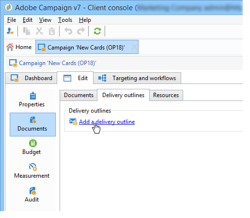
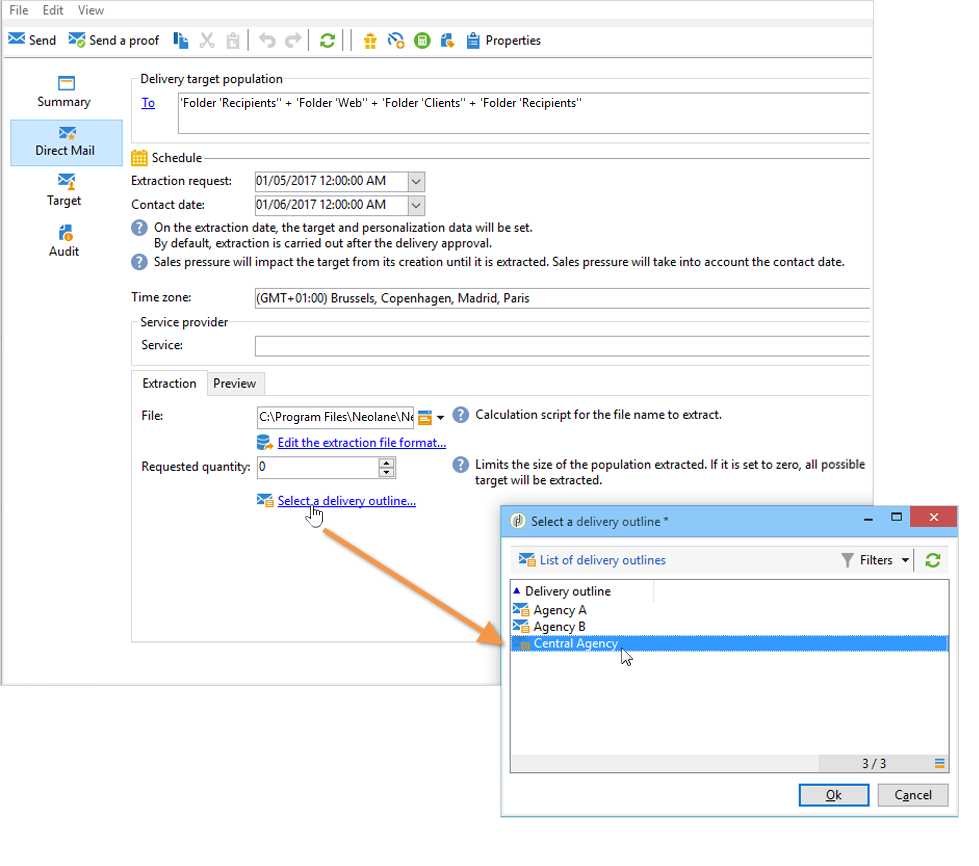
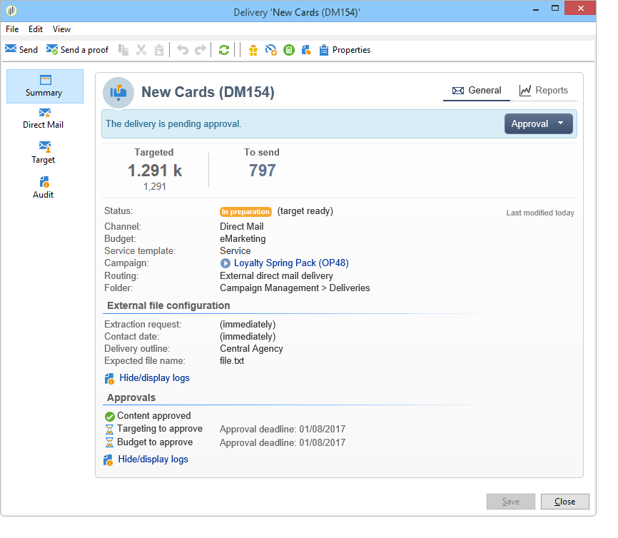

# Administración de documentos asociados {#managing-associated-documents}

Puede asociar varios documentos a una campaña: informes, fotos, páginas web, diagramas, etc. Estos documentos pueden tener cualquier formato (Microsoft Word, PowerPoint, PNG, JPG, Acrobat PDF, etc.).

>[!IMPORTANT]
>
>Esta capacidad está reservada para documentos y recursos pequeños.

En una campaña también se puede hacer referencia a otros elementos, como cupones promocionales, ofertas especiales relacionadas con una marca o tienda específica, etc. Cuando estos elementos se incluyen en una descripción, pueden asociarse con una entrega de correo postal. Consulte [Asociación y estructuración de recursos vinculados a través de una descripción de entrega](#associating-and-structuring-resources-linked-via-a-delivery-outline).

>[!NOTE]
>
>Si está utilizando el módulo Campaign Marketing Resource Management, también puede administrar una biblioteca de recursos de marketing disponibles para varios participantes para trabajar en colaboración. [Más información](../../campaign/using/managing-marketing-resources.md).

## Adición de documentos {#adding-documents}

Los documentos se pueden asociar en el nivel de campaña (documentos contextuales) o en el de programa (documentos generales).

La pestaña **[!UICONTROL Documents]** contiene:

* Lista de todos los documentos necesarios para el contenido (plantilla, imágenes, etc.) que Adobe Campaign puede descargar localmente con los derechos adecuados,
* Documentos que contienen información para el enrutador, si los hay.

Los documentos están vinculados al programa o a la campaña a través de la pestaña **[!UICONTROL Edit > Documents]**.

También puede agregar un documento a una campaña a través del enlace que aparece en su panel.

Haga clic en el icono **[!UICONTROL Details]** para ver el contenido de un archivo y añadir información:

En el panel, los documentos asociados a la campaña se agrupan en la sección **[!UICONTROL Document(s)]**, como en el siguiente ejemplo:

También pueden editarse y modificarse desde esta vista.

## Asociación y estructuración de recursos vinculados a través de una descripción del envío {#associating-and-structuring-resources-linked-via-a-delivery-outline}

>[!NOTE]
>
>Las definiciones de la entrega se utilizan principalmente en el contexto de las campañas de correo directo.

Una descripción de la entrega denota un conjunto estructurado de elementos (documentos, tiendas, cupones promocionales, etc.) creado por la compañía y para una campaña en particular.

Estos elementos se agrupan en descripciones de envío y cada descripción de envío concreta se asocia a un envío; se hace referencia en el archivo de extracción enviado al **proveedor de servicios** para que se asocie al envío. Por ejemplo, puede crear una descripción de envío que haga referencia a una filial y a los folletos de marketing que utiliza.

Para una campaña, las descripciones de envío permiten estructurar los elementos externos que deben asociarse al envío según determinados criterios: sucursal relacionada, oferta promocional concedida, invitación a un evento local, etc.

### Creación de una descripción {#creating-an-outline}

Para crear una descripción, haga clic en la subpestaña **[!UICONTROL Delivery outlines]** dentro de la pestaña **[!UICONTROL Edit > Documents]** de la campaña correspondiente.

>[!NOTE]
>
>Si no puede ver esta pestaña, significa que esta característica no está disponible para la campaña. Consulte la configuración de la plantilla de campaña.
>   
>Para obtener más información sobre las plantillas, consulte [esta sección](../../campaign/using/marketing-campaign-templates.md#campaign-templates).

Después, haga clic **[!UICONTROL Add a delivery outline]** y cree la jerarquía de descripciones para la campaña:

1. Haga clic con el botón derecho del ratón en la raíz del árbol y seleccione **[!UICONTROL New > Delivery outlines]**.
1. Haga clic con el botón derecho en la descripción que acaba de crear y seleccione **[!UICONTROL New > Item]** o **[!UICONTROL New > Personalization fields]**.

Una descripción puede contener elementos y campos de personalización, recursos y ofertas:

* Los elementos pueden ser documentos físicos, por ejemplo, a los que se hace referencia y que se describen aquí y se adjuntan al envío.
* Los campos de personalización permiten crear elementos de personalización relacionados con las entregas en lugar de con los destinatarios. Por lo tanto, es posible crear valores que se utilizarán en entregas para un objetivo específico (oferta de bienvenida, descuento, etc.) Se crean en Adobe Campaign y se importan en el esquema mediante el enlace **[!UICONTROL Import personalization fields...]**.

   

   También pueden crearse directamente en la descripción haciendo clic en el icono **[!UICONTROL Add]** a la derecha del área de la lista.

   

* Los recursos son recursos de marketing generados en el panel de recursos de marketing, al que se accede mediante el vínculo **[!UICONTROL Resources]** de la pestaña **[!UICONTROL Campaigns]**.

   

   >[!NOTE]
   >
   >Para obtener más información sobre recursos de marketing, consulte [esta sección](../../campaign/using/managing-marketing-resources.md).

### Selección de una descripción {#selecting-an-outline}

Para cada envío, puede seleccionar la descripción que desea asociar desde la sección reservada para la descripción de la extracción, como en el siguiente ejemplo:

El esquema seleccionado se muestra en la sección inferior de la ventana. Se puede editar mediante el icono a la derecha del campo o modificar mediante la lista desplegable:

La pestaña **[!UICONTROL Summary]** de la entrega también muestra esta información:

### Resultado de la extracción {#extraction-result}

En el archivo extraído y enviado al proveedor de servicios, el nombre de la descripción y, en este caso, sus características (coste, descripción, etc.) se añaden al contenido de la plantilla de exportación asociada con el proveedor de servicios.

En el siguiente ejemplo, la etiqueta, el coste estimado y la descripción asociada con la entrega se añaden al archivo de extracción.

El modelo de exportación debe estar asociado al proveedor de servicios seleccionado para la entrega. Consulte [esta sección](../../campaign/using/providers--stocks-and-budgets.md#creating-service-providers-and-their-cost-structures).

>[!NOTE]
>
>Para obtener más información, consulte [esta sección](../../platform/using/get-started-data-import-export.md).
