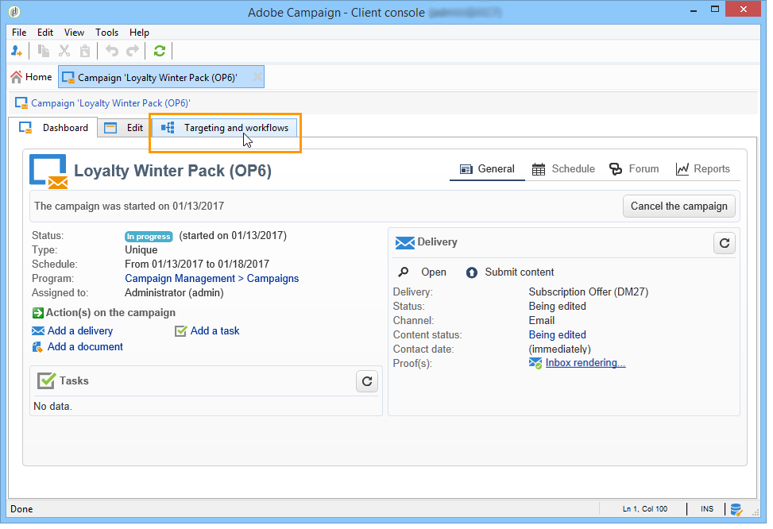
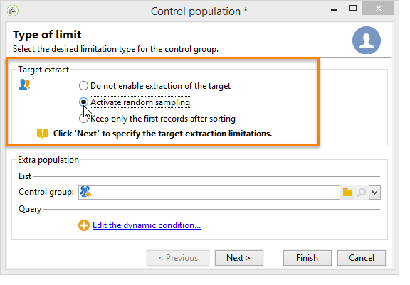

# Entregas de campañas de marketing {#marketing-campaign-deliveries}

las entregas se pueden crear a través del panel de la campaña, un flujo de trabajo de la campaña o directamente a través de la descripción general de las entregas.

Cuando se crean a partir de una campaña, las entregas se vincularán a esta campaña y se consolidarán en el nivel de la campaña.

[ Descubra esta función en vídeo](#create-email-video)

## Creación de envíos {#creating-deliveries}

Para crear una entrega vinculada a una campaña, haga clic en el enlace **[!UICONTROL Add a delivery]** en el panel de la campaña.

Las configuraciones sugeridas se adecúan a los diferentes tipos de envío: correo postal, correo electrónico, canales móviles. [Más información](../../delivery/using/steps-about-delivery-creation-steps.md).

## Selección de la población objetivo {#selecting-the-target-population}

Para cada entrega, puede definir lo siguiente:

* Audiencia: obtenga más información sobre [Creación de la audiencia en un flujo de trabajo](#building-the-main-target-in-a-workflow) y [Selección de la población objetivo](#selecting-the-target-population).
* Grupo de control: obtenga más información sobre [Definición de un grupo de control](#defining-a-control-group).
* Direcciones semilla: obtenga más información sobre [esta sección](../../delivery/using/about-seed-addresses.md).

Parte de esta información se hereda de la [plantilla](../../campaign/using/marketing-campaign-templates.md#campaign-templates).

Para crear el destino de la entrega, puede definir criterios de filtrado para los destinatarios en la base de datos. Este modo de selección de destinatario se presenta en [esta sección](../../delivery/using/steps-defining-the-target-population.md).

**Ejemplo: enviar mensajes a un grupo**

Puede importar una población a una lista y luego establecer como objetivo esta lista en las entregas.

1. Para ello, edite la entrega correspondiente y haga clic en el enlace **[!UICONTROL To]** para cambiar la población de destino.

1. En la pestaña **[!UICONTROL Main target]**, seleccione la opción **[!UICONTROL Defined via the database]** y haga clic en **[!UICONTROL Add]** para seleccionar destinatarios.

1. Seleccione **[!UICONTROL A list of recipients]** y haga clic en **[!UICONTROL Next]** para seleccionarlo.

### Creación de la audiencia en un flujo de trabajo {#building-the-main-target-in-a-workflow}

El objetivo principal de una entrega también se puede definir en el flujo de trabajo de objetivos: este entorno gráfico permite crear un objetivo utilizando consultas, pruebas y operadores: unión, deduplicación, uso compartido, etc. [Más información](../../workflow/using/architecture.md).

>[!IMPORTANT]
>
>No se pueden crear más de 28 flujos de trabajo en una campaña. Más allá de este límite, los flujos de trabajo adicionales no se ven en la interfaz y pueden dar lugar a errores.

#### Creación del flujo de trabajo {#creating-a-targeting-workflow}

El objetivo se puede crear mediante una combinación de condiciones de filtrado en una secuencia gráfica de un flujo de trabajo. Puede crear poblaciones y subpoblaciones según lo necesite. Para mostrar el editor de flujo de trabajo, haga clic en la pestaña **[!UICONTROL Targeting and workflows]** del panel de campañas.

La población de destino se extrae de la base de datos de Adobe Campaign a través de una o varias consultas ubicadas en un flujo de trabajo. Para aprender a crear una consulta, consulte [esta sección](../../workflow/using/query.md).

Puede iniciar consultas y compartir poblaciones mediante cuadros como Unión, Intersección, Compartir, Exclusión, etc.

Seleccione los objetos de las listas a la izquierda del espacio de trabajo y enlácelos para crear el objetivo.

En el diagrama, vincule las consultas de objetivo y de programación necesarias para la creación del objetivo en el diagrama. Puede ejecutar el objetivo mientras la creación está en curso para comprobar la población extraída de la base de datos.

>[!NOTE]
>
>En [esta sección](../../workflow/using/query.md) puede ver ejemplos y explicaciones del procedimiento de definición de consultas.

La sección izquierda del editor contiene una biblioteca de objetos gráficos que representan actividades. La primera pestaña contiene las actividades de objetivos, y la segunda pestaña contiene las actividades de control de flujo, que se utilizan a menudo para coordinar las actividades de objetivos.

Es posible acceder a las funciones de formato y ejecución del flujo de trabajo de objetivos mediante la barra de herramientas del editor de diagramas.

>[!NOTE]
>
>Las actividades disponibles para crear el diagrama, así como todas las funciones de visualización y presentación, se describen en la guía [Automatización con flujos de trabajo](../../workflow/using/architecture.md).

Puede crear varios flujos de trabajo de objetivos para una sola campaña. Para agregar un flujo de trabajo:

1. Vaya a la sección superior izquierda de la zona de creación del flujo de trabajo, haga clic con el botón derecho del ratón y seleccione **[!UICONTROL Add]**. También puede utilizar el botón **[!UICONTROL New]** situado encima de esta zona.

   

1. Seleccione la plantilla **[!UICONTROL New workflow]** y asigne un nombre a este flujo de trabajo.
1. Haga clic en **[!UICONTROL OK]** para confirmar la creación del flujo de trabajo y, a continuación, cree el diagrama para este flujo de trabajo.

#### Ejecución de un flujo de trabajo {#executing-a-workflow}

Los flujos de trabajo de destino se pueden iniciar manualmente mediante el botón **[!UICONTROL Start]** de la barra de herramientas, siempre que tenga los derechos adecuados.

Los objetivos se pueden programar para la ejecución automática según una programación (programador) o un evento (señal externa, importación de archivos, etc.).

Las acciones relacionadas con la ejecución del flujo de trabajo de destino (inicio, parada, pausa, etc.) son procesos **asincrónicos**: el comando se guarda y se aplica en cuanto el servidor esté disponible para su aplicación.

Los iconos de la barra de herramientas permiten realizar acciones en cuanto a la ejecución del flujo de trabajo de destino.

* Inicio o reinicio

   * El icono **[!UICONTROL Start]** permite iniciar el flujo de trabajo de destino. Al hacer clic en este icono, todas las actividades sin transición de entrada se activan (excepto los saltos de extremo final).

      

      El servidor tiene en cuenta la solicitud, tal como muestra su estado:

      

      El estado del proceso cambia a **[!UICONTROL Started]**.

   * Puede reiniciar el flujo de trabajo de destino mediante el icono correspondiente de la barra de herramientas. Este comando puede resultar útil si el icono **[!UICONTROL Start]** no está disponible, por ejemplo cuando el flujo de trabajo de destino está detenido. En este caso, haga clic en el icono **[!UICONTROL Restart]** para anticipar el reinicio. El servidor tiene en cuenta la solicitud, como se muestra en el estado siguiente:

      

      A continuación, el proceso introduce el estado **[!UICONTROL Started]**.

* Detener o pausar

   * Los iconos de la barra de herramientas permiten detener o pausar un flujo de trabajo de objetivos en curso.

      Al hacer clic en **[!UICONTROL Pause]**, las operaciones en curso **[!UICONTROL are not]** no se pausan, pero no se inicia ninguna otra actividad hasta el siguiente reinicio.

      

      El servidor tiene en cuenta el comando, como muestra su estado:

      

      También puede pausar un flujo de trabajo de objetivos automáticamente cuando su ejecución alcanza una actividad determinada. Para ello, haga clic con el botón derecho en la actividad desde la que desea pausar el flujo de trabajo de objetivos y seleccione **[!UICONTROL Enable but do not execute]**.

      

      Esta configuración se muestra mediante un icono especial.

      

      >[!NOTE]
      >
      >Esta opción es útil durante el diseño avanzado de campañas y las fases de prueba.

      Haga clic en **[!UICONTROL Start]** para reanudar la ejecución.

   * Haga clic en el icono **[!UICONTROL Stop]** para detener la ejecución en curso.

      

      El servidor tiene en cuenta el comando, como muestra su estado:

      
   También puede detener automáticamente un flujo de trabajo de objetivos cuando la ejecución alcance una actividad. Para ello, haga clic con el botón derecho en la actividad desde la que desea detener el flujo de trabajo de objetivos y seleccione **[!UICONTROL Do not activate]**.

   

   

   Esta configuración se muestra mediante un icono especial.

   >[!NOTE]
   >
   >Esta opción es útil durante el diseño avanzado de campañas y las fases de prueba.

* Interrupción incondicional

   En el explorador, seleccione **[!UICONTROL Administration > Production > Object created automatically > Campaign workflows]** para acceder y utilizar cada flujo de trabajo de campaña.

   Puede detener el flujo de trabajo de forma incondicional haciendo clic en el icono **[!UICONTROL Actions]** y seleccionando Interrupción **[!UICONTROL Unconditional]**. Esta acción finaliza el flujo de trabajo de la campaña.

   

### Definición de un grupo de control {#defining-a-control-group}

Un grupo de control es una población que no recibe la entrega; se utiliza para rastrear el comportamiento tras la entrega y el impacto de la campaña estableciendo una comparación con el comportamiento de la población de destino que recibió la entrega.

El grupo de control se puede extraer del objetivo principal o provenir de un grupo o consulta específicos.

#### Activación del grupo de control para una campaña {#activating-the-control-group-for-a-campaign}

Puede definir un grupo de control al nivel de la campaña, en cuyo caso se aplica el grupo de control a cada entrega de la campaña correspondiente.

1. Edite la campaña en cuestión y haga clic en la pestaña **[!UICONTROL Edit]** .
1. Haga clic **[!UICONTROL Advanced campaign settings]**.

   

1. Seleccione la opción **[!UICONTROL Enable and edit control group configuration]**.
1. Haga clic en **[!UICONTROL Edit...]** para configurar el grupo de control.

   

El procedimiento de configuración se presenta en [Extracción del grupo de control a partir del objetivo principal](#extracting-the-control-group-from-the-main-target) y [Adición de una población](#adding-a-population).

#### Activación del grupo de control para una entrega {#activating-the-control-group-for-a-delivery}

Puede definir un grupo de control al nivel de la entrega, en cuyo caso se aplica el grupo de control a cada entrega de la campaña correspondiente.

De manera predeterminada, la configuración del grupo de control definida al nivel de campaña se aplica a todas las entregas de dicha campaña. Sin embargo, puede adaptar el grupo de control para una entrega individual.

>[!NOTE]
>
>Si ha definido un grupo de control para una campaña y lo configura para una entrega relacionada con esta campaña, solo se aplica el grupo de control definido para la entrega.

1. Edite la entrega en cuestión y, a continuación, haga clic en el vínculo **[!UICONTROL To]** en la sección **[!UICONTROL Email parameters]**.

   

1. Haga clic en la pestaña **[!UICONTROL Control group]** y seleccione **[!UICONTROL Enable and edit control group configuration]**.
1. Haga clic en **[!UICONTROL Edit...]** para configurar el grupo de control.

El procedimiento de configuración se presenta en [Extracción del grupo de control a partir del objetivo principal](#extracting-the-control-group-from-the-main-target) y [Adición de una población](#adding-a-population).

#### Extracción del grupo de control a partir del objetivo principal {#extracting-the-control-group-from-the-main-target}

Puede extraer destinatarios del objetivo principal de la entrega. En este caso, los destinatarios se toman del objetivo de las acciones de envío afectadas por esta configuración. Esta extracción puede ser aleatoria o puede ser el resultado de la ordenación de los destinatarios.

Para extraer un grupo de control, habilite el grupo de control para la campaña o entrega y seleccione una de las siguientes opciones: **[!UICONTROL Activate random sampling]** o **[!UICONTROL Keep only the first records after sorting]**.

* **[!UICONTROL Activate random sampling]**: esta opción aplica muestreo aleatorio a los destinatarios en la población de destino. Si establece el umbral en 100, el grupo de control se compone de 100 destinatarios seleccionados aleatoriamente desde la población de destino. El muestreo aleatorio depende del motor de la base de datos.
* **[!UICONTROL Keep only the first records after sorting]**: esta opción permite definir una limitación basada en uno o varios órdenes de clasificación. Si selecciona el campo **[!UICONTROL Age]** como criterio de clasificación y, a continuación, define 100 como umbral, el grupo de control se compone de los 100 destinatarios más jóvenes. Por ejemplo, podría resultar interesante definir un grupo de control que incluya destinatarios que realizan pocas compras o destinatarios que realizan compras frecuentes y comparar su comportamiento con el de los destinatarios contactados.

Haga clic en **[!UICONTROL Next]** para definir el orden de clasificación (si es necesario) y seleccione el modo de limitación de destinatarios.

Esta configuración equivale a una actividad de uso compartido en el flujo de trabajo, lo que permite desglosar el objetivo en subconjuntos. El grupo de control es uno de estos subconjuntos. Consulte [esta sección](../../workflow/using/architecture.md) para obtener más información.

### Adición de un grupo de control {#adding-a-population}

Puede definir una nueva población para utilizarla como grupo de control. Puede crear esta población a partir de un grupo de destinatarios o a través de una consulta específica.

>[!NOTE]
>
>El editor de consultas de Adobe Campaign se muestra en [esta sección](../../workflow/using/query.md).

## Inicio de envíos {#starting-a-delivery}

Una vez que se hayan realizado todas las aprobaciones, la entrega está listo para ser iniciado. El procedimiento de envío depende del tipo de envío. Para las entregas por correo electrónico o por canal móvil, consulte [Inicio de una entrega en línea](#starting-an-online-delivery) y para las entregas por correo directo, consulte [Inicio de una entrega sin conexión](#starting-an-offline-delivery).

### Inicio de una entrega en línea {#starting-an-online-delivery}

Una vez concedidas todas las solicitudes de aprobación, el estado de entrega cambia a **[!UICONTROL Pending confirmation]** y el operador puede iniciarlo. Si corresponde, el operador de Adobe Campaign (o grupo de operadores) designado como revisor para iniciar la entrega recibe una notificación avisando de que una entrega está listo para iniciarse.

>[!NOTE]
>
>Si se designa un operador o grupo de operadores específico para iniciar una entrega en las propiedades del mismo, también puede permitir que el operador a cargo de la entrega lo pueda confirmar. Para ello, active la opción **NMS_ActivateOwnerConfirmation** introduciendo **1** como valor. Las opciones se administran desde el nodo **[!UICONTROL Administration]** > **[!UICONTROL Platform]** > **[!UICONTROL Options]** en el explorador de Adobe Campaign.
>  
>Para desactivar esta opción, introduzca **0** como valor. El proceso de confirmación de envío funcionará de forma predeterminada: solo el operador o grupo de operadores designados para la entrega en las propiedades de envío (o un administrador) puede confirmar y llevar a cabo la entrega.

La información también aparece en el panel de campañas. El enlace **[!UICONTROL Confirm delivery]** le permite iniciar la entrega.

Un mensaje de confirmación le permite asegurar esta acción.

### Inicio de una entrega sin conexión {#starting-an-offline-delivery}

Una vez concedidas todas las aprobaciones, el estado de entrega cambia a **[!UICONTROL Pending extraction]**. Los archivos de extracción se crean mediante un flujo de trabajo especial que, en una configuración predeterminada, se inicia automáticamente cuando una entrega de correo directo está pendiente de extracción. Cuando un proceso está en curso, se muestra en el panel y se puede editar a través de su enlace.

>[!NOTE]
>
>Los flujos de trabajo técnicos relacionados con el paquete de Campaña se presentan en [Lista de flujos de trabajo técnicos](../../workflow/using/about-technical-workflows.md).

**Paso 1: Aprobación de archivos**

Una vez ejecutado correctamente el flujo de trabajo de extracción, debe aprobar el archivo de extracción (siempre que se haya seleccionado la aprobación del archivo de extracción en la configuración de envío).

Para obtener más información sobre esto, consulte [Aprobación de un archivo de extracción](../../campaign/using/marketing-campaign-approval.md#approving-an-extraction-file).

**Paso 2: Aprobación del mensaje al proveedor de servicios**

* Una vez aprobado el archivo de extracción, puede generar la prueba del correo electrónico de notificación del enrutador. Este mensaje de correo electrónico se crea en función de una plantilla de envío. Debe ser aprobado.

   >[!NOTE]
   >
   >Este paso solo está disponible si la entrega y la aprobación de las pruebas se han activado en la ventana de aprobaciones.

* Haga clic en el botón **[!UICONTROL Send a proof]** para crear las pruebas.

   El objetivo de la prueba debe haberse definido previamente.

   Puede crear tantas pruebas como sea necesario. Se accede a ellas a través del enlace **[!UICONTROL Direct mail...]** en los detalles del envío.

   

* El estado de entrega cambia a **[!UICONTROL To submit]**. Haga clic en el botón **[!UICONTROL Submit proofs]** para ejecutar el proceso de aprobación.

   

* El estado de entrega cambia a **[!UICONTROL Proof to validate]** y un botón permite aceptar o rechazar la aprobación.

   

   Puede aceptar o rechazar esta aprobación o volver al paso de extracción.

   

* El archivo de extracción se envía al enrutador y se finaliza la entrega.

### Cálculo de costes y existencias {#calculation-of-costs-and-stocks}

La extracción de archivos inicia dos operaciones: cálculo de presupuesto y cálculo de existencias. Las entradas del presupuesto se actualizan.

* La pestaña **[!UICONTROL Budget]** le permite administrar los presupuestos de la campaña. El total de las entradas de costes se muestra en el campo **[!UICONTROL Calculates cost]** de la pestaña principal de la campaña y del programa al que pertenece. Las cantidades también se reflejan en el presupuesto de la campaña.

   El coste real se calcula a partir de la información proporcionada por el enrutador. Solo se facturan los mensajes que se han enviado realmente.

* Las existencias se definen en el nodo **[!UICONTROL Administration > Campaign management > Stocks]** y las estructuras de coste en el nodo **[!UICONTROL Administration > Campaign management > Service providers]**.

   Las líneas de existencias se pueden ver en la sección existencias. Para definir las existencias iniciales, abra una línea de existencias. Las existencias se reducen cada vez que se produce una entrega. Puede definir un nivel de alerta y notificaciones.

>[!NOTE]
>
>Para obtener más información sobre los cálculos de costos y la gestión de existencias, véase [Proveedores, saldos y presupuestos](../../campaign/using/providers--stocks-and-budgets.md).

## Gestión de documentos asociados {#managing-associated-documents}

Puede asociar varios documentos a una campaña: informe, fotografía, página web, diagrama, etc. Estos documentos pueden tener cualquier formato (Microsoft Word, PowerPoint, PNG, JPG, Acrobat PDF, etc.). Para vincular documentos a una campaña, consulte [Agregar documentos](#adding-documents).

>[!IMPORTANT]
>
>Este modo está reservado para documentos pequeños.

En una campaña también puede hacer referencia a otros elementos, tales como cupones promocionales, ofertas especiales relacionadas con una filial o tienda específica, etc. Cuando estos elementos se incluyen en un contorno, pueden asociarse a una entrega de correo directo. Consulte [Asociación y estructuración de recursos vinculados a través de una descripción de entrega](#associating-and-structuring-resources-linked-via-a-delivery-outline).

>[!NOTE]
>
>Si está utilizando MRM, también puede administrar una biblioteca de recursos de marketing disponibles para varios participantes para trabajar en colaboración. [Gestión de los recursos de marketing](../../campaign/using/managing-marketing-resources.md).

### Adición de documentos {#adding-documents}

Los documentos se pueden asociar a nivel de campaña (documentos contextuales) o a nivel de programa (documentos generales).

La pestaña **[!UICONTROL Documents]** contiene:

* Lista de todos los documentos necesarios para el contenido (plantilla, imágenes, etc.) que Adobe Campaign puede descargar localmente con los derechos adecuados,
* Documentos que contienen información para el enrutador, si los hay.

Los documentos están vinculados al programa o a la campaña a través de la pestaña **[!UICONTROL Edit > Documents]**.

También puede agregar un documento a una campaña a través del enlace que aparece en su panel.

Haga clic en el icono **[!UICONTROL Details]** para ver el contenido de un archivo y añadir información:

En el panel, los documentos asociados a la campaña se agrupan en la sección **[!UICONTROL Document(s)]**, como en el siguiente ejemplo:

También pueden editarse y modificarse desde esta vista.

### Asociación y estructuración de recursos vinculados a través de una descripción de envío {#associating-and-structuring-resources-linked-via-a-delivery-outline}

>[!NOTE]
>
>Las definiciones de la entrega se utilizan principalmente en el contexto de las campañas de correo directo.

Una descripción de la entrega denota un conjunto estructurado de elementos (documentos, ramas, tiendas, cupones promocionales, etc.) creados en la empresa y en una campaña determinada.

Estos elementos se agrupan en descripciones de envío y cada descripción de envío concreta se asocia a una entrega; se hace referencia en el archivo de extracción enviado al **proveedor de servicios** para que se asocie al envío. Por ejemplo, puede crear una descripción de envío que haga referencia a una filial y a los folletos de marketing que utiliza.

Para una campaña, las descripciones de envío permiten estructurar los elementos externos que deben asociarse al envío según determinados criterios: sucursal relacionada, oferta promocional concedida, invitación a un evento local, etc.

#### Creación de una descripción {#creating-an-outline}

Para crear una descripción, haga clic en la subpestaña **[!UICONTROL Delivery outlines]** dentro de la pestaña **[!UICONTROL Edit > Documents]** de la campaña correspondiente.

>[!NOTE]
>
>Si no puede ver esta pestaña, significa que esta característica no está disponible para la campaña. Consulte la configuración de la plantilla de campaña.
>   
>Para obtener más información, consulte [Plantillas de campaña](../../campaign/using/marketing-campaign-templates.md#campaign-templates).

Después, haga clic **[!UICONTROL Add a delivery outline]** y cree la jerarquía de descripciones para la campaña:

1. Haga clic con el botón derecho del ratón en la raíz del árbol y seleccione **[!UICONTROL New > Delivery outlines]**.
1. Haga clic con el botón derecho en la descripción que acaba de crear y seleccione **[!UICONTROL New > Item]** o **[!UICONTROL New > Personalization fields]**.

Una descripción puede contener elementos y campos de personalización, recursos y ofertas:

* Los elementos pueden ser documentos físicos, por ejemplo, a los que se hace referencia y que se describen aquí y se adjuntan al envío.
* Los campos de personalización permiten crear elementos de personalización relacionados con las entregas en lugar de con los destinatarios. Por lo tanto, es posible crear valores que se utilizarán en entregas para un objetivo específico (oferta de bienvenida, descuento, etc.) Se crean en Adobe Campaign y se importan en el esquema mediante el enlace **[!UICONTROL Import personalization fields...]**.

   

   También pueden crearse directamente en la descripción haciendo clic en el icono **[!UICONTROL Add]** a la derecha del área de la lista.

   

* Los recursos son recursos de marketing generados en el panel de recursos de marketing, al que se accede mediante el enlace **[!UICONTROL Resources]** en el entorno de **[!UICONTROL Campaigns]**.

   

   >[!NOTE]
   >
   >Para obtener más información sobre los recursos de mercadotecnia, consulte [Administración de recursos de marketing](../../campaign/using/managing-marketing-resources.md).

#### Selección de una descripción {#selecting-an-outline}

Para cada envío, puede seleccionar la descripción que desea asociar desde la sección reservada para la descripción de la extracción, como en el siguiente ejemplo:

El esquema seleccionado se muestra en la sección inferior de la ventana. Se puede editar mediante el icono a la derecha del campo o modificar mediante la lista desplegable:

La pestaña **[!UICONTROL Summary]** de la entrega también muestra esta información:

#### Resultado de la extracción {#extraction-result}

En el archivo extraído y enviado al proveedor de servicios, el nombre de la descripción y, en este caso, sus características (coste, descripción, etc.) se añaden al contenido de la plantilla de exportación asociada con el proveedor de servicios.

En el siguiente ejemplo, la etiqueta, el coste estimado y la descripción asociada con la entrega se añaden al archivo de extracción.

El modelo de exportación debe estar asociado al proveedor de servicios seleccionado para la entrega. Consulte [Creación de proveedores de servicios y sus estructuras de costes](../../campaign/using/providers--stocks-and-budgets.md#creating-service-providers-and-their-cost-structures).

>[!NOTE]
>
>Para obtener más información sobre las exportaciones, consulte la sección [Introducción](../../platform/using/generic-imports-and-exports.md).

#### Videotutorial {#create-email-video}

En este vídeo se explica cómo crear una campaña y un correo electrónico en Adobe Campaign Classic.

>[!VIDEO](https://video.tv.adobe.com/v/25604?quality=12)

Hay disponibles más vídeos de procedimientos para Campaign Classic [aquí](https://experienceleague.adobe.com/docs/campaign-classic-learn/tutorials/overview.html?lang=es).