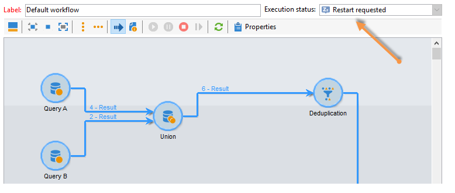

# Entregas de campañas de marketing {#marketing-campaign-deliveries}

Los envíos se pueden crear a través del panel de la campaña, un flujo de trabajo de la campaña o directamente a través de la descripción general de los envíos.

## Creación de envíos {#creating-deliveries}

To create a delivery linked to a campaign, click the **[!UICONTROL Add a delivery]** link in the campaign dashboard.

Las configuraciones sugeridas se adecúan a los diferentes tipos de envío (correo directo, correo electrónico, canales móviles, fax o teléfono).

>[!NOTE]
>
>Para obtener más información sobre la creación y configuración de los envíos, consulte la sección [envío de mensajes](../../delivery/using/communication-channels.md).

## Selección de la población objetivo {#selecting-the-target-population}

Para cada envío, el administrador de campañas define:

* El objetivo principal. Para obtener más información sobre esto, consulte [Generación del objetivo principal en un flujo de trabajo](#building-the-main-target-in-a-workflow) y [Selección de la población](#selecting-the-target-population)objetivo.
* El grupo de control. Para obtener más información sobre esto, consulte [Definición de un grupo](#defining-a-control-group)de control.
* Las direcciones sembradas. Para obtener más información, consulte [esta sección](../../delivery/using/about-seed-addresses.md).

Parte de esta información se hereda de la plantilla.

>[!NOTE]
>
>Las plantillas de campaña se presentan en plantillas de campaña.

Para crear el destino del envío, puede definir criterios de filtrado para los destinatarios en la base de datos. Este modo de selección de destinatarios se presenta en la sección [envío de mensajes](../../delivery/using/steps-defining-the-target-population.md).

### Ejemplo: Envío a un grupo de destinatarios {#example--delivering-to-a-group-of-recipients}

Puede importar una población a una lista y luego establecer como objetivo esta lista en los envíos.

1. To do this, edit the concerned delivery and click the **[!UICONTROL To]** link to change the targeted population.

1. En la **[!UICONTROL Main target]** ficha, seleccione la **[!UICONTROL Defined via the database]** opción y haga clic en **[!UICONTROL Add]** para seleccionar destinatarios.

1. Elija **[!UICONTROL A list of recipients]** y haga clic **[!UICONTROL Next]** para seleccionarlo.

### Creación del objetivo principal en un flujo de trabajo {#building-the-main-target-in-a-workflow}

El objetivo principal de un envío también se puede definir en el flujo de trabajo de objetivos: este entorno gráfico permite crear un objetivo utilizando consultas, pruebas y operadores: unión, deduplicación, uso compartido, etc.

La guía [automatización con flujos de trabajo](../../workflow/using/executing-a-workflow.md#architecture) incluye una descripción detallada del funcionamiento del módulo de flujos de trabajo.

>[!CAUTION]
>
>En la misma campaña, no se pueden configurar más de 28 flujos de trabajo. Más allá de este límite, los flujos de trabajo adicionales no se ven en la interfaz y pueden dar lugar a errores.

#### Creación de un flujo de trabajo de objetivos {#creating-a-targeting-workflow}

El objetivo se puede crear mediante una combinación de condiciones de filtrado en una secuencia gráfica de un flujo de trabajo. Puede crear poblaciones y subpoblaciones según lo necesite. To display the workflow editor, click the **[!UICONTROL Targeting and workflows]** tab in the campaign dashboard.

La población de destino se extrae de la base de datos de Adobe Campaign a través de una o varias consultas ubicadas en un flujo de trabajo. Para aprender a crear una consulta, consulte [esta sección](../../workflow/using/query.md).

Puede iniciar consultas y compartir poblaciones mediante cuadros como Unión, Intersección, Compartir, Exclusión, etc.

Seleccione los objetos de las listas a la izquierda del espacio de trabajo y enlácelos para crear el objetivo.

En el diagrama, vincule las consultas de objetivo y de programación necesarias para la creación del objetivo en el diagrama. Puede ejecutar el objetivo mientras la creación está en curso para comprobar la población extraída de la base de datos.

>[!NOTE]
>
>Examples and procedure for defining queries are presented in [this section](../../workflow/using/query.md).

La sección izquierda del editor contiene una biblioteca de objetos gráficos que representan actividades. La primera pestaña contiene las actividades de objetivos, y la segunda pestaña contiene las actividades de control de flujo, que se utilizan a menudo para coordinar las actividades de objetivos.

Es posible acceder a las funciones de formato y ejecución del flujo de trabajo de objetivos mediante la barra de herramientas del editor de diagramas.

>[!NOTE]
>
>Las actividades disponibles para crear el diagrama, así como todas las funciones de visualización y presentación, se describen en la guía [Automatización con flujos de trabajo](../../workflow/using/executing-a-workflow.md#architecture).

Puede crear varios flujos de trabajo de objetivos para una sola campaña. Para agregar un flujo de trabajo:

1. Go to the upper left-hand section of the workflow creation zone, right-click, and select **[!UICONTROL Add]**. You can also use the **[!UICONTROL New]** button located above this zone.

   

1. Select the **[!UICONTROL New workflow]** template and name this workflow.
1. Click **[!UICONTROL OK]** to confirm creation of the workflow, and then create the diagram for this workflow.

#### Ejecución de un flujo de trabajo {#executing-a-workflow}

Targeting workflows can be launched manually via the **[!UICONTROL Start]** button in the toolbar, provided that you have the appropriate rights.

Los objetivos se pueden programar para la ejecución automática según una programación (programador) o un evento (señal externa, importación de archivos, etc.).

Las acciones relacionadas con la ejecución del flujo de trabajo de destino (inicio, parada, pausa, etc.) son procesos **asincrónicos**: el comando se guarda y se aplica en cuanto el servidor esté disponible para su aplicación.

Los iconos de la barra de herramientas permiten realizar acciones en cuanto a la ejecución del flujo de trabajo de destino.

* Inicio o reinicio

   * The **[!UICONTROL Start]** icon lets you launch the targeting workflow. Al hacer clic en este icono, todas las actividades sin transición de entrada se activan (excepto los saltos de extremo final).

      

      El servidor tiene en cuenta la solicitud, tal como muestra su estado:

      

      The process status changes to **[!UICONTROL Started]**.

   * Puede reiniciar el flujo de trabajo de destino mediante el icono correspondiente de la barra de herramientas. This command may be useful if the **[!UICONTROL Start]** icon is not available, for example when targeting workflow stopping is in progress. In this case, click the **[!UICONTROL Restart]** icon to anticipate the restart. El servidor tiene en cuenta la solicitud, como se muestra en el estado siguiente:

      

      A continuación, el proceso introduce **[!UICONTROL Started]** el estado.

* Detener o pausar

   * Los iconos de la barra de herramientas permiten detener o pausar un flujo de trabajo de objetivos en curso.

      When you click **[!UICONTROL Pause]**, operations in progress **[!UICONTROL are not]** paused, but no other activity is launched until the next restart.

      

      El servidor tiene en cuenta el comando, como muestra su estado:

      

      También puede pausar un flujo de trabajo de objetivos automáticamente cuando su ejecución alcanza una actividad determinada. To do this, right-click the activity from which targeting workflow is to be paused, and select **[!UICONTROL Enable but do not execute]**.

      

      Esta configuración se muestra mediante un icono especial.

      

      >[!NOTE]
      >
      >Esta opción es útil durante el diseño avanzado de campañas y las fases de prueba.

      Haga clic en **[!UICONTROL Start]** para reanudar la ejecución.

   * Click the **[!UICONTROL Stop]** icon to stop the execution in progress.

      

      El servidor tiene en cuenta el comando, como muestra su estado:

      
   También puede detener automáticamente un flujo de trabajo de objetivos cuando la ejecución alcance una actividad. To do this, right-click the activity from which targeting workflow will be stopped, and select **[!UICONTROL Do not activate]**.

   

   

   Esta configuración se muestra mediante un icono especial.

   >[!NOTE]
   >
   >Esta opción es útil durante el diseño avanzado de campañas y las fases de prueba.

* Interrupción incondicional

   In the Explorer, select **[!UICONTROL Administration > Production > Object created automatically > Campaign workflows]** to access and act on every campaign workflows.

   You can unconditionally stop your workflow by clicking the **[!UICONTROL Actions]** icon and selecting **[!UICONTROL Unconditional]** stop. Esta acción finaliza el flujo de trabajo de la campaña.

   

### Definición de un grupo de control {#defining-a-control-group}

Un grupo de control es una población que no recibe el envío; se utiliza para rastrear el comportamiento tras el envío y el impacto de la campaña estableciendo una comparación con el comportamiento de la población de destino que recibió el envío.

El grupo de control se puede extraer del objetivo principal o provenir de un grupo o consulta específicos.

#### Activación del grupo de control para una campaña {#activating-the-control-group-for-a-campaign}

Puede definir un grupo de control a nivel de campaña, en cuyo caso se aplicará el grupo de control a cada entrega de la campaña en cuestión.

1. Edite la campaña en cuestión y haga clic en la **[!UICONTROL Edit]** ficha.
1. Haga clic **[!UICONTROL Advanced campaign settings]**.

   

1. Seleccione la **[!UICONTROL Enable and edit control group configuration]** opción.
1. Haga clic en **[!UICONTROL Edit...]** para configurar el grupo de control.

   

El procedimiento de configuración se presenta en [Extracción del grupo de control del destino](#extracting-the-control-group-from-the-main-target) principal y [Adición de una población](#adding-a-population).

#### Activación del grupo de control para una entrega {#activating-the-control-group-for-a-delivery}

Puede definir un grupo de control en el nivel de entrega, en cuyo caso el grupo de control se aplicará a cada entrega de la campaña en cuestión.

De manera predeterminada, la configuración del grupo de control definida al nivel de campaña se aplica a todos los envíos de dicha campaña. Sin embargo, puede adaptar el grupo de control para un envío individual.

>[!NOTE]
>
>Si ha definido un grupo de control para una campaña y lo configura para un envío relacionado con esta campaña, solo se aplica el grupo de control definido para el envío.

1. Edite el envío en cuestión y haga clic en el **[!UICONTROL To]** vínculo de la **[!UICONTROL Email parameters]** sección.

   

1. Haga clic en la **[!UICONTROL Control group]** ficha y, a continuación, seleccione **[!UICONTROL Enable and edit control group configuration]**.
1. Haga clic **[!UICONTROL Edit...]** para configurar el grupo de control

El procedimiento de configuración se presenta en [Extracción del grupo de control del destino](#extracting-the-control-group-from-the-main-target) principal y [Adición de una población](#adding-a-population).

#### Extracción del grupo de control a partir del objetivo principal {#extracting-the-control-group-from-the-main-target}

Puede extraer destinatarios del objetivo principal del envío. En este caso, los destinatarios se toman del objetivo de las acciones de envío afectadas por esta configuración. Esta extracción puede ser aleatoria o puede ser el resultado de la ordenación de los destinatarios.

To extract a control group, enable the control group for the campaign or delivery and select one of the following options: **[!UICONTROL Activate random sampling]** or **[!UICONTROL Keep only the first records after sorting]**.

* **[!UICONTROL Activate random sampling]** :: esta opción aplica muestreo aleatorio a los destinatarios de la población objetivo. Si establece el umbral en 100, el grupo de control se compone de 100 destinatarios seleccionados aleatoriamente desde la población de destino. El muestreo aleatorio depende del motor de la base de datos.
* **[!UICONTROL Keep only the first records after sorting]** :: esta opción le permite definir una limitación en función de uno o varios pedidos de clasificación. If you select the **[!UICONTROL Age]** field as a sorting criterion and then define 100 as a threshold, the control group will be made up of the 100 youngest recipients. Por ejemplo, podría resultar interesante definir un grupo de control que incluya destinatarios que realizan pocas compras o destinatarios que realizan compras frecuentes y comparar su comportamiento con el de los destinatarios contactados.

Click **[!UICONTROL Next]** to define the sorting order (if necessary) and select the recipient limitation mode.

Esta configuración equivale a una actividad de uso compartido en el flujo de trabajo, lo que permite desglosar el objetivo en subconjuntos. El grupo de control es uno de estos subconjuntos. Consulte [esta sección](../../workflow/using/executing-a-workflow.md#architecture) para obtener más información.

### Adición de una población {#adding-a-population}

Puede definir una nueva población para utilizarla como grupo de control. Puede crear esta población a partir de un grupo de destinatarios o a través de una consulta específica.

>[!NOTE]
>
>El editor de consultas de Adobe Campaign se muestra en [esta sección](../../workflow/using/query.md).

## Inicio de envíos {#starting-a-delivery}

Una vez que se hayan realizado todas las aprobaciones, el envío está listo para ser iniciado. El procedimiento de envío depende del tipo de envío. Para las entregas por correo electrónico o por canal móvil, consulte [Inicio de una entrega](#starting-an-online-delivery)en línea y para las entregas por correo directo, consulte [Inicio de una entrega](#starting-an-offline-delivery)sin conexión.

### Inicio de un envío en línea {#starting-an-online-delivery}

Once all approval requests have been granted, the delivery status changes to **[!UICONTROL Pending confirmation]** and can be started by an operator. Si corresponde, el operador de Adobe Campaign (o grupo de operadores) designado como revisor para iniciar el envío recibe una notificación avisando de que un envío está listo para iniciarse.

>[!NOTE]
>
>Si se designa un operador o grupo de operadores específico para iniciar un envío en las propiedades del mismo, también puede permitir que el operador a cargo del envío lo pueda confirmar. Para ello, active la opción **NMS_ActivateOwnerConfirmation** introduciendo **1** como valor. Las opciones se administran desde el nodo **[!UICONTROL Administration]** > **[!UICONTROL Platform]** > **[!UICONTROL Options]** en el explorador de Adobe Campaign.
>  
>Para desactivar esta opción, introduzca **0** como valor. El proceso de confirmación de envío funcionará de forma predeterminada: solo el operador o grupo de operadores designados para el envío en las propiedades de envío (o un administrador) puede confirmar y llevar a cabo el envío.

La información también aparece en el panel de campañas. The **[!UICONTROL Confirm delivery]** link lets you start the delivery.

Un mensaje de confirmación le permite asegurar esta acción.

### Inicio de un envío sin conexión {#starting-an-offline-delivery}

Once all approvals have been granted, the delivery status changes to **[!UICONTROL Pending extraction]**. Los archivos de extracción se crean mediante un flujo de trabajo especial que, en una configuración predeterminada, se inicia automáticamente cuando un envío de correo directo está pendiente de extracción. Cuando un proceso está en curso, se muestra en el panel y se puede editar a través de su enlace.

>[!NOTE]
>
>Los flujos de trabajo técnicos relacionados con los procesos de campaña se presentan en la [lista de flujos de trabajo](../../workflow/using/campaign.md)de los procesos de campaña.

**Paso 1: Aprobación de archivos**

Una vez ejecutado correctamente el flujo de trabajo de extracción, debe aprobar el archivo de extracción (siempre que se haya seleccionado la aprobación del archivo de extracción en la configuración de envío).

Para obtener más información sobre esto, consulte [Aprobación de un archivo](../../campaign/using/marketing-campaign-approval.md#approving-an-extraction-file)de extracción.

**Paso 2: Aprobación del mensaje al proveedor de servicios**

* Una vez aprobado el archivo de extracción, puede generar la prueba del correo electrónico de notificación del enrutador. Este mensaje de correo electrónico se crea en función de una plantilla de envío. Debe ser aprobado.

   >[!NOTE]
   >
   >Este paso solo está disponible si el envío y la aprobación de las pruebas se han activado en la ventana de aprobaciones.

* Haga clic en el **[!UICONTROL Send a proof]** botón para crear las pruebas.

   El objetivo de la prueba debe haberse definido previamente.

   Puede crear tantas pruebas como sea necesario. These are accessed via the **[!UICONTROL Direct mail...]** link of the delivery detail.

   

* El estado de entrega cambia a **[!UICONTROL To submit]**. Click the **[!UICONTROL Submit proofs]** button to start the approval process.

   

* The delivery status changes to **[!UICONTROL Proof to validate]** and a button lets you accept or reject approval.

   

   Puede aceptar o rechazar esta aprobación o volver al paso de extracción.

   

* El archivo de extracción se envía al enrutador y se finaliza el envío.

### Cálculo de costes y existencias {#calculation-of-costs-and-stocks}

La extracción de archivos inicia dos operaciones: cálculo de presupuesto y cálculo de existencias. Las entradas del presupuesto se actualizan.

* The **[!UICONTROL Budget]** tab lets you manage the budgets for the campaign. The total of the cost entries is shown in the **[!UICONTROL Calculates cost]** field of the campaign&#39;s main tab and the program it belongs to. Las cantidades también se reflejan en el presupuesto de la campaña.

   El coste real se calcula a partir de la información proporcionada por el enrutador. Solo se facturan los mensajes que se han enviado realmente.

* Las existencias se definen en el **[!UICONTROL Administration > Campaign management > Stocks]** nodo del árbol y las estructuras de costo en el **[!UICONTROL Administration > Campaign management > Service providers]** nodo.

   Las líneas de existencias se pueden ver en la sección existencias. Para definir la existencias iniciales, abra una línea de existencias. Las existencias se reducen cada vez que se produce un envío. Puede definir un nivel de alerta y notificaciones.

>[!NOTE]
>
>Para obtener más información sobre los cálculos de costos y la gestión de existencias, véase [Proveedores, saldos y presupuestos](../../campaign/using/providers--stocks-and-budgets.md).

## Gestión de documentos asociados {#managing-associated-documents}

Puede asociar varios documentos a una campaña: informe, fotografía, página web, diagrama, etc. Estos documentos pueden tener cualquier formato (Microsoft Word, PowerPoint, PNG, JPG, Acrobat PDF, etc.). To link documents with a campaign, see [Adding documents](#adding-documents).

>[!CAUTION]
>
>Este modo está reservado para documentos pequeños.

En una campaña también puede hacer referencia a otros elementos, tales como cupones promocionales, ofertas especiales relacionadas con una filial o tienda específica, etc. Cuando estos elementos se incluyen en un contorno, pueden asociarse a un envío de correo directo. See [Associating and structuring resources linked via a delivery outline](#associating-and-structuring-resources-linked-via-a-delivery-outline).

>[!NOTE]
>
>Si está utilizando MRM, también puede administrar una biblioteca de recursos de marketing disponibles para varios participantes para trabajar en colaboración. Consulte [Administración de recursos](../../campaign/using/managing-marketing-resources.md)de mercadotecnia.

### Adición de documentos {#adding-documents}

Los documentos se pueden asociar a nivel de campaña (documentos contextuales) o a nivel de programa (documentos generales).

La **[!UICONTROL Documents]** ficha contiene:

* Lista de todos los documentos necesarios para el contenido (plantilla, imágenes, etc.) que Adobe Campaign puede descargar localmente con los derechos adecuados,
* Documentos que contienen información para el enrutador, si los hay.

The documents are linked to the program or the campaign via the **[!UICONTROL Edit > Documents]** tab.

También puede agregar un documento a una campaña a través del enlace que aparece en su panel.

Click the **[!UICONTROL Details]** icon to view the content of a file and to add information:

In the dashboard, documents associated with the campaign are grouped in the **[!UICONTROL Document(s)]** section, as in the following example:

También pueden editarse y modificarse desde esta vista.

### Asociación y estructuración de recursos vinculados a través de una descripción de envío {#associating-and-structuring-resources-linked-via-a-delivery-outline}

>[!NOTE]
>
>Los esquemas de envío se utilizan exclusivamente en el contexto de las campañas de correo directo.

Una descripción del envío denota un conjunto estructurado de elementos (documentos, ramas, tiendas, cupones promocionales, etc.) creados en la empresa y en una campaña determinada.

Estos elementos se agrupan en descripciones de envío y cada descripción de envío concreta se asocia a un envío; se hace referencia en el archivo de extracción enviado al **proveedor de servicios** para que se asocie al envío. Por ejemplo, puede crear una descripción de envío que haga referencia a una filial y a los folletos de marketing que utiliza.

Para una campaña, las descripciones de envío permiten estructurar los elementos externos que deben asociarse al envío según determinados criterios: sucursal relacionada, oferta promocional concedida, invitación a un evento local, etc.

#### Creación de una descripción {#creating-an-outline}

To create an outline, click the **[!UICONTROL Delivery outlines]** sub-tab in the **[!UICONTROL Edit > Documents]** tab of the concerned campaign.

>[!NOTE]
>
>Si no puede ver esta pestaña, significa que esta característica no está disponible para la campaña. Consulte la configuración de la plantilla de campaña.
>   
>For more on this, refer to [Campaign templates](../../campaign/using/marketing-campaign-templates.md#campaign-templates).

Next, click **[!UICONTROL Add a delivery outline]** and create the hierarchy of outlines for the campaign:

1. Right-click the root of the tree and select **[!UICONTROL New > Delivery outlines]**.
1. Haga clic con el botón derecho en el contorno que acaba de crear y seleccione **[!UICONTROL New > Item]** o **[!UICONTROL New > Personalization fields]**.

Una descripción puede contener elementos y campos de personalización, recursos y ofertas:

* Los elementos pueden ser documentos físicos, por ejemplo, a los que se hace referencia y que se describen aquí y se adjuntan al envío.
* Los campos de personalización permiten crear elementos de personalización relacionados con los envíos en lugar de con los destinatarios. Por lo tanto, es posible crear valores que se utilizarán en entregas para un objetivo específico (oferta de bienvenida, descuento, etc.) Se crean en Adobe Campaign y se importan en el esquema a través del **[!UICONTROL Import personalization fields...]** vínculo.

   

   They can also be created directly in the outline by clicking the **[!UICONTROL Add]** icon to the right of the list zone.

   

* The resources are marketing resources generated in the marketing resource dashboard accessed via the **[!UICONTROL Resources]** link of the **[!UICONTROL Campaigns]** universe.

   

   >[!NOTE]
   >
   >Para obtener más información sobre los recursos de mercadotecnia, consulte [Administración de recursos](../../campaign/using/managing-marketing-resources.md)de mercadotecnia.

#### Selección de una descripción {#selecting-an-outline}

Para cada envío, puede seleccionar la descripción que desea asociar desde la sección reservada para la descripción de la extracción, como en el siguiente ejemplo:

El esquema seleccionado se muestra en la sección inferior de la ventana. Se puede editar mediante el icono a la derecha del campo o modificar mediante la lista desplegable:

The **[!UICONTROL Summary]** tab of the delivery also displays this information:

#### Resultado de la extracción {#extraction-result}

En el archivo extraído y enviado al proveedor de servicios, el nombre de la descripción y, en este caso, sus características (coste, descripción, etc.) se añaden al contenido de la plantilla de exportación asociada con el proveedor de servicios.

En el siguiente ejemplo, la etiqueta, el coste estimado y la descripción asociada con el envío se añaden al archivo de extracción.

El modelo de exportación debe estar asociado al proveedor de servicios seleccionado para el envío. See [Creating service providers and their cost structures](../../campaign/using/providers--stocks-and-budgets.md#creating-service-providers-and-their-cost-structures).

>[!NOTE]
>
>Para obtener más información sobre las exportaciones, consulte la sección [Introducción](../../platform/using/generic-imports-and-exports.md).
