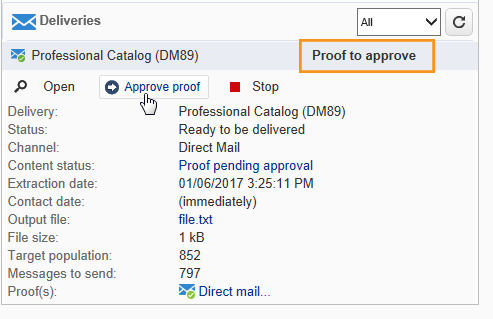

# Entregas de campañas de marketing {#marketing-campaign-deliveries}

las entregas se pueden crear a través del panel de la campaña, un flujo de trabajo de la campaña o directamente a través de la descripción general de las entregas.

Cuando se crean a partir de una campaña, las entregas se vincularán a esta campaña y se consolidarán en el nivel de la campaña.

[ Descubra esta función en vídeo](#create-email-video)

## Creación de envíos {#creating-deliveries}

Para crear una entrega vinculada a una campaña, haga clic en el enlace **[!UICONTROL Add a delivery]** en el panel de la campaña.

Las configuraciones sugeridas se adecúan a los diferentes tipos de envío: correo postal, correo electrónico, canales móviles. [Más información](../../delivery/using/steps-about-delivery-creation-steps.md).

## Inicio de envíos {#starting-a-delivery}

Una vez que se hayan realizado todas las aprobaciones, la entrega está listo para ser iniciado. El procedimiento de envío depende del tipo de envío. Para las entregas por correo electrónico o por canal móvil, consulte [Inicio de una entrega en línea](#starting-an-online-delivery) y para las entregas por correo directo, consulte [Inicio de una entrega sin conexión](#starting-an-offline-delivery).

### Inicio de una entrega en línea {#starting-an-online-delivery}

Una vez concedidas todas las solicitudes de aprobación, el estado de entrega cambia a **[!UICONTROL Pending confirmation]** y el operador puede iniciarlo. Si corresponde, el operador de Adobe Campaign (o grupo de operadores) designado como revisor para iniciar la entrega recibe una notificación avisando de que una entrega está listo para iniciarse.

>[!NOTE]
>
>Si se designa un operador o grupo de operadores específico para iniciar una entrega en las propiedades del mismo, también puede permitir que el operador a cargo de la entrega lo pueda confirmar. Para ello, active la opción **NMS_ActivateOwnerConfirmation** introduciendo **1** como valor. Las opciones se administran desde el nodo **[!UICONTROL Administration]** > **[!UICONTROL Platform]** > **[!UICONTROL Options]** en el explorador de Adobe Campaign.
>  
>Para desactivar esta opción, introduzca **0** como valor. El proceso de confirmación de envío funcionará de forma predeterminada: solo el operador o grupo de operadores designados para la entrega en las propiedades de envío (o un administrador) puede confirmar y llevar a cabo la entrega.

La información también aparece en el panel de campañas. El enlace **[!UICONTROL Confirm delivery]** le permite iniciar la entrega.

Un mensaje de confirmación le permite asegurar esta acción.

### Inicio de una entrega sin conexión {#starting-an-offline-delivery}

Una vez concedidas todas las aprobaciones, el estado de entrega cambia a **[!UICONTROL Pending extraction]**. Los archivos de extracción se crean mediante un flujo de trabajo especial que, en una configuración predeterminada, se inicia automáticamente cuando una entrega de correo directo está pendiente de extracción. Cuando un proceso está en curso, se muestra en el panel y se puede editar a través de su enlace.

>[!NOTE]
>
>Los flujos de trabajo técnicos relacionados con el paquete de Campaign se presentan en [Lista de flujos de trabajo técnicos](../../workflow/using/about-technical-workflows.md).

**Paso 1: Aprobación de archivos**

Una vez ejecutado correctamente el flujo de trabajo de extracción, debe aprobar el archivo de extracción (siempre que se haya seleccionado la aprobación del archivo de extracción en la configuración de envío).

Para obtener más información sobre esto, consulte [Aprobación de un archivo de extracción](../../campaign/using/marketing-campaign-approval.md#approving-an-extraction-file).

**Paso 2: Aprobación del mensaje al proveedor de servicios**

* Una vez aprobado el archivo de extracción, puede generar la prueba del correo electrónico de notificación del enrutador. Este mensaje de correo electrónico se crea en función de una plantilla de envío. Debe ser aprobado.

   >[!NOTE]
   >
   >Este paso solo está disponible si la entrega y la aprobación de las pruebas se han activado en la ventana de aprobaciones.

* Haga clic en el botón **[!UICONTROL Send a proof]** para crear las pruebas.

   El objetivo de la prueba debe haberse definido previamente.

   Puede crear tantas pruebas como sea necesario. Se accede a ellas a través del enlace **[!UICONTROL Direct mail...]** en los detalles del envío.

   

* El estado de entrega cambia a **[!UICONTROL To submit]**. Haga clic en el botón **[!UICONTROL Submit proofs]** para ejecutar el proceso de aprobación.

   

* El estado de entrega cambia a **[!UICONTROL Proof to validate]** y un botón permite aceptar o rechazar la aprobación.

   

   Puede aceptar o rechazar esta aprobación o volver al paso de extracción.

   

* El archivo de extracción se envía al enrutador y se finaliza la entrega.

### Cálculo de costes y existencias {#calculation-of-costs-and-stocks}

La extracción de archivos inicia dos operaciones: cálculo de presupuesto y cálculo de existencias. Las entradas del presupuesto se actualizan.

* La pestaña **[!UICONTROL Budget]** le permite administrar los presupuestos de la campaña. El total de las entradas de costes se muestra en el campo **[!UICONTROL Calculates cost]** de la pestaña principal de la campaña y del programa al que pertenece. Las cantidades también se reflejan en el presupuesto de la campaña.

   El coste real se calcula a partir de la información proporcionada por el enrutador. Solo se facturan los mensajes que se han enviado realmente.

* Las existencias se definen en el nodo **[!UICONTROL Administration > Campaign management > Stocks]** y las estructuras de coste en el nodo **[!UICONTROL Administration > Campaign management > Service providers]**.

   Las líneas de existencias se pueden ver en la sección existencias. Para definir las existencias iniciales, abra una línea de existencias. Las existencias se reducen cada vez que se produce una entrega. Puede definir un nivel de alerta y notificaciones.

>[!NOTE]
>
>Para obtener más información sobre los cálculos de costos y la gestión de existencias, véase [Proveedores, saldos y presupuestos](../../campaign/using/providers--stocks-and-budgets.md).

## Gestión de documentos asociados {#managing-associated-documents}

Puede asociar varios documentos a una campaña: informe, fotografía, página web, diagrama, etc. Estos documentos pueden tener cualquier formato (Microsoft Word, PowerPoint, PNG, JPG, Acrobat PDF, etc.). Aprenda a vincular documentos con una campaña [en esta sección](../../campaign/using/marketing-campaign-assets.md).

>[!IMPORTANT]
>
>Este modo está reservado para documentos pequeños.

En una campaña también puede hacer referencia a otros elementos, tales como cupones promocionales, ofertas especiales relacionadas con una filial o tienda específica, etc. Cuando estos elementos se incluyen en un contorno, pueden asociarse a una entrega de correo directo. [Más información](#associating-and-structuring-resources-linked-via-a-delivery-outline).

>[!NOTE]
>
>Si está utilizando MRM, también puede administrar una biblioteca de recursos de marketing disponibles para varios participantes para trabajar en colaboración. [Gestión de los recursos de marketing](../../campaign/using/managing-marketing-resources.md).

### Adición de documentos {#adding-documents}

Los documentos se pueden asociar en el nivel de campaña (documentos contextuales) o en el de programa (documentos generales).

La pestaña **[!UICONTROL Documents]** contiene:

* Lista de todos los documentos necesarios para el contenido (plantilla, imágenes, etc.) que Adobe Campaign puede descargar localmente con los derechos adecuados,
* Documentos que contienen información para el enrutador, si los hay.

Los documentos están vinculados al programa o a la campaña a través de la pestaña **[!UICONTROL Edit > Documents]**.

También puede agregar un documento a una campaña a través del enlace que aparece en su panel.

Haga clic en el icono **[!UICONTROL Details]** para ver el contenido de un archivo y añadir información:

En el panel, los documentos asociados a la campaña se agrupan en la sección **[!UICONTROL Document(s)]**, como en el siguiente ejemplo:

También pueden editarse y modificarse desde esta vista.

### Asociación y estructuración de recursos vinculados a través de una descripción de envío {#associating-and-structuring-resources-linked-via-a-delivery-outline}

>[!NOTE]
>
>Las definiciones de la entrega se utilizan principalmente en el contexto de las campañas de correo directo.

Una descripción de la entrega denota un conjunto estructurado de elementos (documentos, ramas, tiendas, cupones promocionales, etc.) creados en la empresa y en una campaña determinada.

Estos elementos se agrupan en descripciones de envío y cada descripción de envío concreta se asocia a una entrega; se hace referencia en el archivo de extracción enviado al **proveedor de servicios** para que se asocie al envío. Por ejemplo, puede crear una descripción de envío que haga referencia a una filial y a los folletos de marketing que utiliza.

Para una campaña, las descripciones de envío permiten estructurar los elementos externos que deben asociarse al envío según determinados criterios: sucursal relacionada, oferta promocional concedida, invitación a un evento local, etc.

#### Creación de una descripción {#creating-an-outline}

Para crear una descripción, haga clic en la subpestaña **[!UICONTROL Delivery outlines]** dentro de la pestaña **[!UICONTROL Edit > Documents]** de la campaña correspondiente.

>[!NOTE]
>
>Si no puede ver esta pestaña, significa que esta característica no está disponible para la campaña. Consulte la configuración de la plantilla de campaña.
>   
>Para obtener más información, consulte [Plantillas de campaña](../../campaign/using/marketing-campaign-templates.md#campaign-templates).

Después, haga clic **[!UICONTROL Add a delivery outline]** y cree la jerarquía de descripciones para la campaña:

1. Haga clic con el botón derecho del ratón en la raíz del árbol y seleccione **[!UICONTROL New > Delivery outlines]**.
1. Haga clic con el botón derecho en la descripción que acaba de crear y seleccione **[!UICONTROL New > Item]** o **[!UICONTROL New > Personalization fields]**.

Una descripción puede contener elementos y campos de personalización, recursos y ofertas:

* Los elementos pueden ser documentos físicos, por ejemplo, a los que se hace referencia y que se describen aquí y se adjuntan al envío.
* Los campos de personalización permiten crear elementos de personalización relacionados con las entregas en lugar de con los destinatarios. Por lo tanto, es posible crear valores que se utilizarán en entregas para un objetivo específico (oferta de bienvenida, descuento, etc.) Se crean en Adobe Campaign y se importan en el esquema mediante el enlace **[!UICONTROL Import personalization fields...]**.

   

   También pueden crearse directamente en la descripción haciendo clic en el icono **[!UICONTROL Add]** a la derecha del área de la lista.

   

* Los recursos son recursos de marketing generados en el panel de recursos de marketing, al que se accede mediante el vínculo **[!UICONTROL Resources]** en la pestaña **[!UICONTROL Campaigns]**.

   

   >[!NOTE]
   >
   >Para obtener más información sobre los recursos de mercadotecnia, consulte [Administración de recursos de marketing](../../campaign/using/managing-marketing-resources.md).

#### Selección de una descripción {#selecting-an-outline}

Para cada envío, puede seleccionar la descripción que desea asociar desde la sección reservada para la descripción de la extracción, como en el siguiente ejemplo:

El esquema seleccionado se muestra en la sección inferior de la ventana. Se puede editar mediante el icono a la derecha del campo o modificar mediante la lista desplegable:

La pestaña **[!UICONTROL Summary]** de la entrega también muestra esta información:

#### Resultado de la extracción {#extraction-result}

En el archivo extraído y enviado al proveedor de servicios, el nombre de la descripción y, en este caso, sus características (coste, descripción, etc.) se añaden al contenido de la plantilla de exportación asociada con el proveedor de servicios.

En el siguiente ejemplo, la etiqueta, el coste estimado y la descripción asociada con la entrega se añaden al archivo de extracción.

El modelo de exportación debe estar asociado al proveedor de servicios seleccionado para la entrega. Consulte [Creación de proveedores de servicios y sus estructuras de costes](../../campaign/using/providers--stocks-and-budgets.md#creating-service-providers-and-their-cost-structures).

>[!NOTE]
>
>Para obtener más información sobre las exportaciones, consulte la sección [Introducción](../../platform/using/get-started-data-import-export.md).

#### Videotutorial {#create-email-video}

En este vídeo se explica cómo crear una campaña y un correo electrónico en Adobe Campaign.

>[!VIDEO](https://video.tv.adobe.com/v/25604?quality=12)

Puede encontrar disponibles más vídeos de procedimientos para Campaign [aquí](https://experienceleague.adobe.com/docs/campaign-classic-learn/tutorials/overview.html?lang=es).
