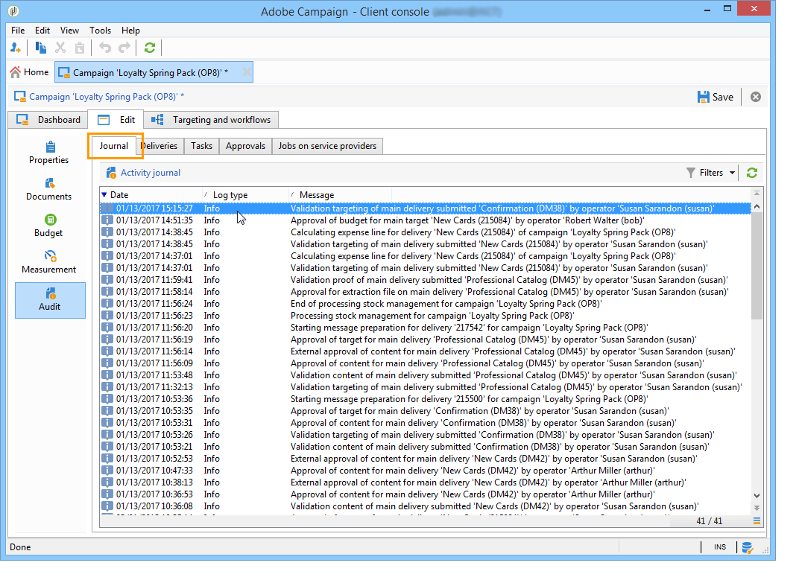

# Monitorización de campañas de marketing {#monitoring-marketing-campaigns}

## Seguimiento de una campaña {#tracking-a-campaign}

En cada campaña, la pestaña **[!UICONTROL Tracking]** permite ver todos los trabajos y sus estados. Desde esta pestaña puede acceder a la siguiente información:

* El diario de actividad muestra los trabajos realizados en la campaña en general: creación de flujo de trabajo o inicio, aprobación, extracción, etc.

   

* La subpestaña **[!UICONTROL Deliveries]** contiene todas las entregas de la campaña que pueden editarse desde esta vista. Para ello, seleccione la entrega y haga clic en el icono **[!UICONTROL Detail]**.

   

* La subpestaña **[!UICONTROL Tasks]** agrupa todas las tareas vinculadas a la campaña. Esta vista permite editarlas o eliminarlas. Las tareas están disponibles mediante la aplicación MRM. Se detallan en [esta sección](../../campaign/using/creating-and-managing-tasks.md).

   

* Los flujos de trabajo creados para generar mensajes para proveedores de servicios se muestran en la subpestaña **[!UICONTROL Jobs on service providers]**. Haga clic en el icono **[!UICONTROL Detail]** para mostrar el flujo de trabajo seleccionado.

   

## Seguimiento de envío {#delivery-tracking}

La lista de envíos está disponible a través del vínculo **[!UICONTROL Deliveries]** del nodo Campaign.

Para cada envío, esta lista le permite acceder a los indicadores clave: estado, número de destinatarios dirigidos, campañas vinculadas, etc.

Para comprobar el estado de una entrega, edite y vea su panel y pestañas.

>[!NOTE]
>
>La información sobre los detalles del envío está disponible en [esta sección](../../delivery/using/about-message-tracking.md).

## Seguimiento de ejecución {#execution-tracking}

Puede consultar el estado de las entregas haciendo clic en **[!UICONTROL Deliveries]**, desde la página principal de Adobe Campaign. Consulte [Seguimiento de envíos](#delivery-tracking).

La información sobre los procesos ejecutados en una campaña se recopila en la pestaña **[!UICONTROL Edit > Audit]** de la campaña. Ahí puede ver la lista de envíos en la campaña. [Más información](#tracking-a-campaign).
