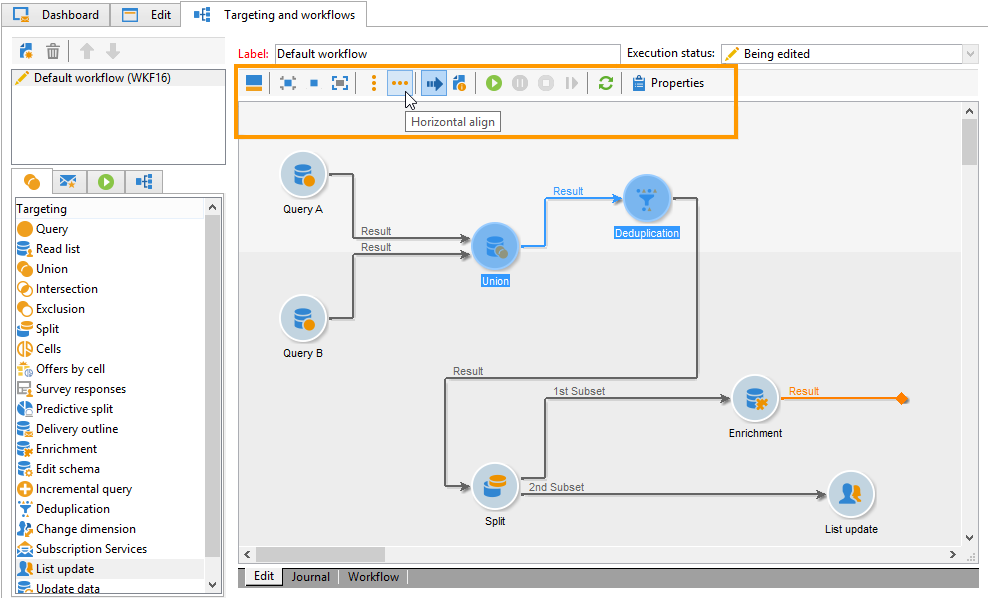
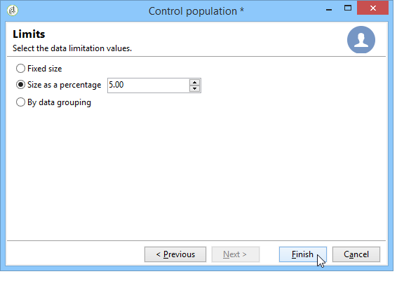

# Selección de la audiencia de las campañas {#marketing-campaign-deliveries}

En una campaña de marketing, puede definir lo siguiente por envío:

* Audiencia: obtenga más información sobre la [Creación de la audiencia en un flujo de trabajo](#building-the-main-target-in-a-workflow) y [Selección de la población objetivo](#selecting-the-target-population).
* Un grupo de control: obtenga más información en [esta sección](#defining-a-control-group).
* Direcciones semilla: obtenga más información en [esta sección](../../delivery/using/about-seed-addresses.md).

Parte de esta información se hereda de la [plantilla de campaña](../../campaign/using/marketing-campaign-templates.md#campaign-templates).

Para crear el destino de la entrega, puede definir criterios de filtrado para los destinatarios en la base de datos. Este modo de selección de destinatario se presenta en [esta sección](../../delivery/using/steps-defining-the-target-population.md).

## Enviar a un grupo

Puede importar una población a una lista y luego establecer como objetivo esta lista en las entregas. Para realizar esto, siga los pasos a continuación:

1. Para ello, edite la entrega correspondiente y haga clic en el vínculo **[!UICONTROL To]** para cambiar la población de destino.

1. En la pestaña **[!UICONTROL Main target]**, seleccione la opción **[!UICONTROL Defined via the database]** y haga clic en **[!UICONTROL Add]** para seleccionar destinatarios.

1. Seleccione **[!UICONTROL A list of recipients]** y haga clic en **[!UICONTROL Next]** para seleccionarlo.

## Creación de la audiencia en un flujo de trabajo de campaña {#building-the-main-target-in-a-workflow}

El objetivo principal de una entrega también se puede definir en el flujo de trabajo de campaña: este entorno gráfico permite crear un objetivo utilizando consultas, pruebas y operadores: unión, deduplicación, uso compartido, etc.

>[!IMPORTANT]
>
>No debe añadir más de 28 flujos de trabajo en una campaña. Más allá de este límite, los flujos de trabajo adicionales no se ven en la interfaz y pueden dar lugar a errores.

### Creación del flujo de trabajo {#creating-a-targeting-workflow}

El objetivo se puede crear mediante una combinación de condiciones de filtrado en una secuencia gráfica de un flujo de trabajo. Puede crear poblaciones y subpoblaciones según lo necesite. Para mostrar el editor de flujo de trabajo, haga clic en la pestaña **[!UICONTROL Targeting and workflows]** del panel de campañas.

La población de destino se extrae de la base de datos de Adobe Campaign a través de una o varias consultas ubicadas en un flujo de trabajo. Para aprender a crear una consulta, consulte [esta sección](../../workflow/using/query.md).

Puede iniciar consultas y compartir poblaciones mediante cuadros como Unión, Intersección, Compartir, Exclusión, etc.

Seleccione los objetos de las listas a la izquierda del espacio de trabajo y enlácelos para crear el objetivo.

En el diagrama, vincule las consultas de objetivo y de programación necesarias para la creación del objetivo en el diagrama. Puede ejecutar el objetivo mientras la creación está en curso para comprobar la población extraída de la base de datos.

>[!NOTE]
>
>En [esta sección](../../workflow/using/query.md) puede ver ejemplos y explicaciones del procedimiento de definición de consultas.

La sección izquierda del editor contiene una biblioteca de objetos gráficos que representan actividades. La primera pestaña contiene las actividades de objetivos, y la segunda pestaña contiene las actividades de control de flujo, que se utilizan a menudo para coordinar las actividades de objetivos.

Es posible acceder a las funciones de formato y ejecución del flujo de trabajo de objetivos mediante la barra de herramientas del editor de diagramas.

>[!NOTE]
>
>Las actividades disponibles para crear el diagrama, así como todas las funciones de visualización y presentación, se describen en la guía [Automatización con flujos de trabajo](../../workflow/using/architecture.md).

Puede crear varios flujos de trabajo de objetivos para una sola campaña. Para agregar un flujo de trabajo:

1. Vaya a la sección superior izquierda de la zona de creación del flujo de trabajo, haga clic con el botón derecho del ratón y seleccione **[!UICONTROL Add]**. También puede utilizar el botón **[!UICONTROL New]** situado encima de esta zona.

   

1. Seleccione la plantilla **[!UICONTROL New workflow]** y asigne un nombre a este flujo de trabajo.
1. Haga clic en **[!UICONTROL OK]** para confirmar la creación del flujo de trabajo y, a continuación, cree el diagrama para este flujo de trabajo.

### Ejecución de un flujo de trabajo {#executing-a-workflow}

Los flujos de trabajo de destino se pueden iniciar manualmente mediante el botón **[!UICONTROL Start]** de la barra de herramientas, siempre que tenga los derechos adecuados.

Los objetivos se pueden programar para la ejecución automática según una programación (programador) o un evento (señal externa, importación de archivos, etc.).

Las acciones relacionadas con la ejecución del flujo de trabajo de destino (inicio, parada, pausa, etc.) son procesos **asincrónicos**: el comando se guarda y se aplica en cuanto el servidor esté disponible para su aplicación.

Los iconos de la barra de herramientas permiten realizar acciones en cuanto a la ejecución del flujo de trabajo de destino.

* Inicio o reinicio

   * El icono **[!UICONTROL Start]** permite iniciar el flujo de trabajo de destino. Al hacer clic en este icono, todas las actividades sin transición de entrada se activan (excepto los saltos de extremo final).

      

      El servidor tiene en cuenta la solicitud, tal como muestra su estado:

      

      El estado del proceso cambia a **[!UICONTROL Started]**.

   * Puede reiniciar el flujo de trabajo de destino mediante el icono correspondiente de la barra de herramientas. Este comando puede resultar útil si el icono **[!UICONTROL Start]** no está disponible, por ejemplo cuando el flujo de trabajo de destino está detenido. En este caso, haga clic en el icono **[!UICONTROL Restart]** para anticipar el reinicio. El servidor tiene en cuenta la solicitud, como se muestra en el estado siguiente:

      

      A continuación, el proceso introduce el estado **[!UICONTROL Started]**.

* Detener o pausar

   * Los iconos de la barra de herramientas permiten detener o pausar un flujo de trabajo de objetivos en curso.

      Al hacer clic en **[!UICONTROL Pause]**, las operaciones en curso **[!UICONTROL are not]** no se pausan, pero no se inicia ninguna otra actividad hasta el siguiente reinicio.

      

      El servidor tiene en cuenta el comando, como muestra su estado:

      

      También puede pausar un flujo de trabajo de objetivos automáticamente cuando su ejecución alcanza una actividad determinada. Para ello, haga clic con el botón derecho en la actividad desde la que desea pausar el flujo de trabajo de objetivos y seleccione **[!UICONTROL Enable but do not execute]**.

      

      Esta configuración se muestra mediante un icono especial.

      

      >[!NOTE]
      >
      >Esta opción es útil durante el diseño avanzado de campañas y las fases de prueba.

      Haga clic en **[!UICONTROL Start]** para reanudar la ejecución.

   * Haga clic en el icono **[!UICONTROL Stop]** para detener la ejecución en curso.

      

      El servidor tiene en cuenta el comando, como muestra su estado:

      
   También puede detener automáticamente un flujo de trabajo de objetivos cuando la ejecución alcance una actividad. Para ello, haga clic con el botón derecho en la actividad desde la que desea detener el flujo de trabajo de objetivos y seleccione **[!UICONTROL Do not activate]**.

   

   

   Esta configuración se muestra mediante un icono especial.

   >[!NOTE]
   >
   >Esta opción es útil durante el diseño avanzado de campañas y las fases de prueba.

* Interrupción incondicional

   En el explorador, seleccione **[!UICONTROL Administration > Production > Object created automatically > Campaign workflows]** para acceder y utilizar cada flujo de trabajo de campaña.

   Puede detener el flujo de trabajo de forma incondicional haciendo clic en el icono **[!UICONTROL Actions]** y seleccionando Interrupción **[!UICONTROL Unconditional]**. Esta acción finaliza el flujo de trabajo de la campaña.

   

## Adición de un grupo de control {#defining-a-control-group}

Un grupo de control es una población que no recibe la entrega; se utiliza para rastrear el comportamiento tras la entrega y el impacto de la campaña estableciendo una comparación con el comportamiento de la población de destino que recibió la entrega.

El grupo de control se puede extraer del objetivo principal o provenir de un grupo o consulta específicos.

### Activación del grupo de control para una campaña {#activating-the-control-group-for-a-campaign}

Puede definir un grupo de control en el nivel de la campaña, en cuyo caso se aplica el grupo de control a cada entrega de la campaña correspondiente.

1. Edite la campaña en cuestión y haga clic en la pestaña **[!UICONTROL Edit]** .
1. Haga clic **[!UICONTROL Advanced campaign settings]**.

   

1. Seleccione la opción **[!UICONTROL Enable and edit control group configuration]**.
1. Haga clic en **[!UICONTROL Edit...]** para configurar el grupo de control.

   

El procedimiento de configuración se presenta en [Extracción del grupo de control a partir del objetivo principal](#extracting-the-control-group-from-the-main-target) y [Adición de una población](#adding-a-population).

### Activación del grupo de control para una entrega {#activating-the-control-group-for-a-delivery}

Puede definir un grupo de control al nivel de la entrega, en cuyo caso se aplica el grupo de control a cada entrega de la campaña correspondiente.

De manera predeterminada, la configuración del grupo de control definida al nivel de campaña se aplica a todas las entregas de dicha campaña. Sin embargo, puede adaptar el grupo de control para una entrega individual.

>[!NOTE]
>
>Si ha definido un grupo de control para una campaña y lo configura para una entrega relacionada con esta campaña, solo se aplica el grupo de control definido para la entrega.

1. Edite la entrega en cuestión y, a continuación, haga clic en el vínculo **[!UICONTROL To]** en la sección **[!UICONTROL Email parameters]**.

   

1. Haga clic en la pestaña **[!UICONTROL Control group]** y seleccione **[!UICONTROL Enable and edit control group configuration]**.
1. Haga clic en **[!UICONTROL Edit...]** para configurar el grupo de control.

El procedimiento de configuración se presenta en [Extracción del grupo de control a partir del objetivo principal](#extracting-the-control-group-from-the-main-target) y [Adición de una población](#adding-a-population).

### Extracción del grupo de control a partir del objetivo principal {#extracting-the-control-group-from-the-main-target}

Puede extraer destinatarios del objetivo principal de la entrega. En este caso, los destinatarios se toman del objetivo de las acciones de envío afectadas por esta configuración. Esta extracción puede ser aleatoria o puede ser el resultado de la ordenación de los destinatarios.

Para extraer un grupo de control, habilite el grupo de control para la campaña o entrega y seleccione una de las siguientes opciones: **[!UICONTROL Activate random sampling]** o **[!UICONTROL Keep only the first records after sorting]**.

* **[!UICONTROL Activate random sampling]**: esta opción aplica muestreo aleatorio a los destinatarios en la población de destino. Si establece el umbral en 100, el grupo de control se compone de 100 destinatarios seleccionados aleatoriamente desde la población de destino. El muestreo aleatorio depende del motor de la base de datos.
* **[!UICONTROL Keep only the first records after sorting]**: esta opción permite definir una limitación basada en uno o varios órdenes de clasificación. Si selecciona el campo **[!UICONTROL Age]** como criterio de clasificación y, a continuación, define 100 como umbral, el grupo de control se compone de los 100 destinatarios más jóvenes. Por ejemplo, podría resultar interesante definir un grupo de control que incluya destinatarios que realizan pocas compras o destinatarios que realizan compras frecuentes y comparar su comportamiento con el de los destinatarios contactados.

Haga clic en **[!UICONTROL Next]** para definir el orden de clasificación (si es necesario) y seleccione el modo de limitación de destinatarios.

Esta configuración equivale a una actividad de uso compartido en el flujo de trabajo, lo que permite desglosar el objetivo en subconjuntos. El grupo de control es uno de estos subconjuntos. Consulte [esta sección](../../workflow/using/architecture.md) para obtener más información.

### Uso de una nueva población como grupo de control {#adding-a-population}

Puede definir una nueva población para utilizarla como grupo de control. Puede crear esta población a partir de un grupo de destinatarios o a través de una consulta específica.

>[!NOTE]
>
>El editor de consultas de Adobe Campaign se muestra en [esta sección](../../workflow/using/query.md).

#### Videotutorial {#create-email-video}

En este vídeo se explica cómo crear una campaña y un correo electrónico en Adobe Campaign.

>[!VIDEO](https://video.tv.adobe.com/v/25604?quality=12)

Puede encontrar disponibles más vídeos de procedimientos para Campaign [aquí](https://experienceleague.adobe.com/docs/campaign-classic-learn/tutorials/overview.html?lang=es).
