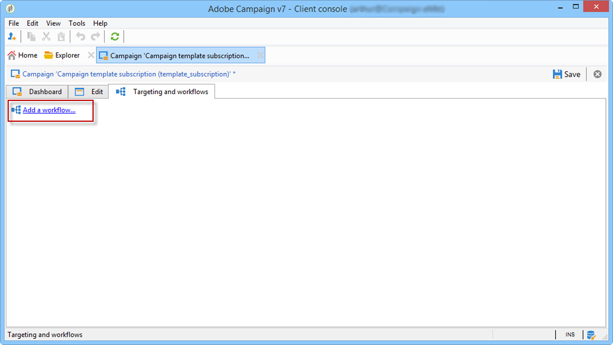
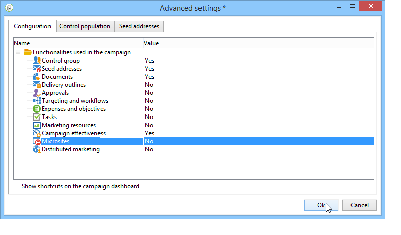
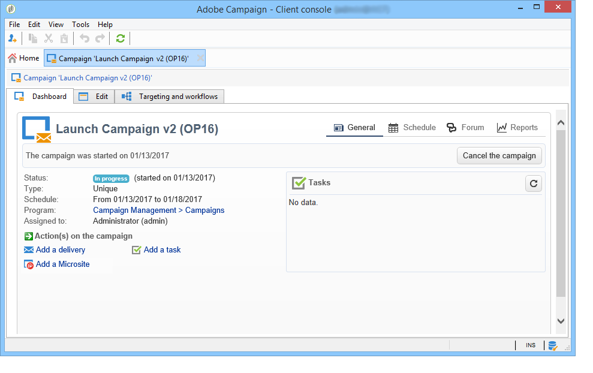

# Creación y configuración de plantillas de campaña {#campaign-templates}

Todas las campañas de marketing se basan en una plantilla que almacena las características y capacidades principales. Las plantillas de campaña están centralizadas en el nodo **[!UICONTROL Resources > Templates > Campaign templates]**. Se proporciona una plantilla predeterminada como estándar. Permite crear una nueva campaña utilizando todos los módulos disponibles (documentos, tareas, direcciones semilla, etc.); sin embargo, los módulos ofrecidos dependen de los derechos y de la configuración de la plataforma de Adobe Campaign.

>[!NOTE]
>
>El árbol se muestra al hacer clic en el icono **[!UICONTROL Explorer]** de la página de inicio.

Se proporciona una plantilla para crear una campaña sin ninguna configuración específica definida. Puede crear y configurar las plantillas de campañas y luego crear campañas a partir de estas plantillas.

 Para obtener más información sobre la creación de campañas, vea [este vídeo](../../campaign/using/marketing-campaign-deliveries.md#create-email-video).

## Creación de una plantilla de campaña {#creating-or-duplicating-a-campaign-template}

Para crear una plantilla de campaña, siga estos pasos:

1. Abra el **Explorer** de Campaign.
1. En **Resources > Templates > Campaign templates**, haga clic en **New** en la barra de herramientas de la lista de plantillas.

   

1. Introduzca la etiqueta de la nueva plantilla de campaña.
1. Haga clic en **Save** y vuelva a abrir la plantilla.
1. En la pestaña **Edit**, introduzca **Internal name** y otros valores, si es necesario.
1. Seleccione **Advanced campaign settings** para agregar un flujo de trabajo a la plantilla de campaña.

   

1. Cambie el valor de **Targeting and workflows** a **Yes**.

   

1. En la pestaña **Targeting and workflows**, haga clic en **Add a workflow...**

   

1. Complete el campo **Label** y haga clic en **Ok**.
1. Cree su flujo de trabajo según sus necesidades.
1. Haga clic en **Save**. La plantilla está lista para utilizarse en una campaña.

También puede **duplicar** la plantilla predeterminada para reutilizar y adaptar su configuración.

Las distintas pestañas y subpestañas de la plantilla de campaña permiten acceder a su configuración, tal y como se describe en [Configuración general](#general-configuration).

## Selección de módulos {#select-modules}

El vínculo **[!UICONTROL Advanced campaign settings...]** permite habilitar y deshabilitar los trabajos de las campañas en función de esta plantilla. Seleccione las funciones que desee habilitar en las campañas creadas en función de esta plantilla.

Si no se selecciona una capacidad, los elementos correspondientes al proceso (menús, iconos, opciones, pestañas, subpestañas, etc.) no aparecerán en la interfaz de la plantilla ni en las campañas basadas en esta plantilla. Las pestañas a la izquierda de los detalles de la campaña generalmente coinciden con los procesos seleccionados en la plantilla. Por ejemplo: si no se selecciona **Expenses and Objectives**, la pestaña correspondiente **[!UICONTROL Budget]** no se muestra en las campañas basadas en esta plantilla.

Además, los accesos directos a las ventanas de configuración se añaden al panel de campañas. Cuando una funcionalidad está habilitada, un vínculo directo le permite acceder a ella desde el panel de campañas.

Por ejemplo, con la configuración siguiente:

Los siguientes vínculos se muestran en el panel de campañas (no se encuentra el vínculo **[!UICONTROL Add a task]**):

Se muestran solo las siguientes pestañas:

Sin embargo, con este tipo de configuración:

Se muestran los siguientes vínculos y pestañas:

## Tipología de módulos {#typology-of-enabled-modules}

* **Grupo de control**

   Cuando se selecciona este módulo, se añade una pestaña adicional a la configuración avanzada de la plantilla y a las campañas basadas en esta plantilla. La configuración se puede definir mediante la plantilla o bien por separado para cada campaña. Obtenga más información sobre los grupos de control en [esta sección](../../campaign/using/marketing-campaign-deliveries.md#defining-a-control-group).

   

* **Direcciones semilla**

   Cuando se selecciona este módulo, se añade una pestaña adicional a la configuración avanzada de la plantilla y a las campañas basadas en esta plantilla. La configuración se puede definir mediante la plantilla o bien por separado para cada campaña. Obtenga más información sobre las direcciones semilla en [esta sección](../../delivery/using/about-seed-addresses.md).

   

* **Documentos**

   Cuando se selecciona este módulo, se añade una pestaña adicional a la pestaña **[!UICONTROL Edition]** de la plantilla y a las campañas basadas en esta plantilla. Los documentos adjuntos se pueden agregar desde la plantilla o bien por separado para cada campaña. Obtenga más información sobre los documentos en [esta sección](../../campaign/using/marketing-campaign-deliveries.md#managing-associated-documents).

   

* **Descripción**

   Cuando se selecciona este módulo, se añade una subpestaña **[!UICONTROL Delivery outlines]** a la pestaña **[!UICONTROL Documents]** para definir los esquemas de entrega de la campaña. Obtenga más información sobre los esquemas de entrega en [esta sección](../../campaign/using/marketing-campaign-deliveries.md#associating-and-structuring-resources-linked-via-a-delivery-outline).

   

* **Establecimiento de objetivos y flujos de trabajo**

   Al seleccionar el módulo de **[!UICONTROL Targeting and workflows]**, se añade una pestaña para permitirle crear uno o más flujos de trabajo para las campañas basadas en esta plantilla. Los flujos de trabajo también se pueden configurar por separado para cada campaña basada en esta plantilla. Obtenga más información sobre los flujos de trabajo de campañas en [esta sección](../../campaign/using/marketing-campaign-deliveries.md#building-the-main-target-in-a-workflow).

   

   Cuando este módulo está habilitado, se añade una pestaña a la configuración avanzada de la campaña para definir la secuencia de ejecución del proceso.

   

* **Aprobación**

   Si selecciona **[!UICONTROL Approval]**, puede seleccionar los procesos de aprobación, así como los operadores asignados al proceso de aprobación. Obtenga más información sobre aprobaciones en [esta sección](../../campaign/using/marketing-campaign-approval.md#selecting-reviewers).

   

   Puede elegir si desea habilitar o no la aprobación del proceso mediante la pestaña **[!UICONTROL Approvals]** de la sección de configuración avanzada de plantillas. Los trabajos para los que se ha seleccionado la aprobación deben estar aprobados para poder autorizar la entrega de los mensajes.

   Debe asociar un operador revisor o un grupo de operadores a cada aprobación habilitada.

* **Gastos y objetivos**

   Cuando se selecciona este módulo, se añade una pestaña **[!UICONTROL Budget]** a los detalles de la plantilla y las campañas basadas en esta plantilla, de modo que se pueda seleccionar el presupuesto asociado.

   

## Propiedades y ejecución {#general-configuration}

### Propiedades de plantilla {#template-properties}

Cuando crea una plantilla de campaña, debe introducir la siguiente información:

* Introduzca la **etiqueta** de la plantilla: esta etiqueta se asigna de forma predeterminada a todas las campañas creadas mediante esta plantilla.
* Seleccione la **naturaleza** de la campaña en la lista desplegable. Los valores disponibles en esta lista son los guardados en la enumeración **[!UICONTROL natureOp]**.

   >[!NOTE]
   >
   >Para obtener más información sobre las enumeraciones, consulte la sección [Introducción](../../platform/using/managing-enumerations.md).

* Seleccione el **tipo de campaña**: única, recurrente o periódica. De manera predeterminada, las plantillas de campaña se aplican a las campañas únicas. Las campañas recurrentes y periódicas se detallan en [esta sección](../../campaign/using/setting-up-marketing-campaigns.md#recurring-and-periodic-campaigns).
* Especifique la duración de la campaña, es decir, el número de días durante los que se desarrolla la campaña. Al crear una campaña basada en esta plantilla, las fechas de inicio y finalización de la campaña se rellenan automáticamente.

   Si la campaña es recurrente, debe especificar las fechas de inicio y finalización de la campaña directamente en la plantilla.

* Especifique el **programa relacionado** de la plantilla: las campañas basadas en esta plantilla se vinculan al programa seleccionado.

### Parámetros de ejecución de plantilla {#template-execution-parameters}

El vínculo **[!UICONTROL Advanced campaign settings...]** permite configurar las opciones avanzadas de la plantilla para procesar el destinatario de la entrega (grupo de control, direcciones semilla, etc.) y la configuración de la medición de campañas y la ejecución del flujo de trabajo.

## Seguimiento de la ejecución de campañas{#campaign-reverse-scheduling}

Puede crear una programación para una campaña y rastrear logros, por ejemplo, para preparar una programación de evento para una fecha específica. Las plantillas de campaña ahora le permiten calcular la fecha de inicio de una tarea según la fecha de finalización de una campaña.

En el cuadro de configuración de tarea, vaya al área **[!UICONTROL Implementation schedule]** y marque la casilla **[!UICONTROL The start date is calculated based on the campaign end date]**. (en este caso, “fecha de inicio” es la fecha de inicio de la tarea). Vaya al campo **[!UICONTROL Start]** e introduzca un intervalo: la tarea comienza antes de la fecha de finalización de la campaña. Si introduce un periodo más largo que el establecido para la campaña, la tarea comenzará antes de la campaña.

Al crear una campaña utilizando esta plantilla, la fecha de inicio de la tarea se calcula automáticamente. Sin embargo, puede cambiarla más adelante.
