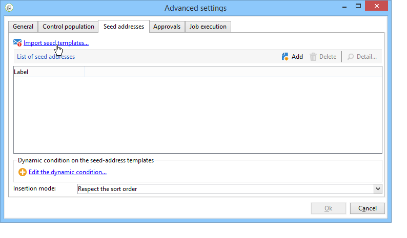

# Plantillas de campañas de marketing {#campaign-templates}

Las plantillas de campaña están centralizadas en el **[!UICONTROL Resources > Templates > Campaign templates]** nodo. Se proporciona una plantilla predeterminada como estándar. Permite crear una nueva campaña utilizando todos los módulos disponibles (documentos, tareas, direcciones sembradas, etc.); sin embargo, los módulos ofrecidos dependen de los derechos y de la configuración de la plataforma de Adobe Campaign.

## Creación o duplicación de una plantilla de campaña {#creating-or-duplicating-a-campaign-template}

Para crear una nueva plantilla, realice los pasos siguientes:

1. Abra el **Explorer** de Campaign.
1. En **Resources > Templates > Campaign templates**, haga clic en **New** en la barra de herramientas de la lista de plantillas.

   

1. Introduzca la etiqueta de la nueva plantilla de campaña.
1. Haga clic en **Save** y vuelva a abrir la plantilla.
1. En la pestaña **Edit**, introduzca **Internal name** y otros valores, si es necesario.
1. Seleccione **Advanced campaign settings** para agregar un flujo de trabajo a la plantilla de campaña.

   

1. Cambie el valor de **Targeting and workflows** a **Yes**.

   

1. En la pestaña **Targeting and workflows**, haga clic en **Add a workflow...**.

   

1. Complete el campo **Label** y haga clic en **Ok**.
1. Cree su flujo de trabajo según sus necesidades.
1. Haga clic en **Save**. La plantilla está lista para utilizarse en una campaña.

También puede duplicar la plantilla predeterminada para reutilizar y adaptar su configuración.

The various tabs and sub-tabs of the campaign template allow you to access its settings, described in [General configuration](#general-configuration).

## Configuración de una plantilla de campaña {#configuring-a-campaign-template}

Las campañas se basan en modelos que comparten un conjunto de parámetros predefinidos.

In a default configuration, the campaign templates are centralized in the **[!UICONTROL Resources > Templates > Campaign templates]** node of the Adobe Campaign tree.

>[!NOTE]
>
>The tree is displayed when you click the **[!UICONTROL Explorer]** icon on the home page.

Se proporciona una plantilla lista para usar para crear una campaña para la que no se ha definido una configuración específica. Puede crear y configurar las plantillas de campañas y luego crear campañas a partir de estas plantillas.

The creation and configuration of campaign templates are presented in [Campaign templates](#campaign-templates).

Para obtener más información sobre la creación de campañas, consulte el vídeo [Creación de una campaña y un correo electrónico](https://docs.campaign.adobe.com/doc/AC/en/Videos/Videos.html).

## Configuración de los módulos disponibles {#configuration-of-the-available-modules}

### Selección de módulos {#module-selection}

The **[!UICONTROL Advanced campaign settings...]** link lets you enable and disable jobs for the campaigns based on this template. Seleccione las funciones que desee habilitar en las campañas creadas en función de esta plantilla.

Si no se selecciona una función, los elementos correspondientes del proceso (menús, iconos, opciones, pestañas, subpestañas, etc.) no aparecen en la interfaz de la plantilla ni en las campañas basadas en esta plantilla. Las pestañas a la izquierda de los detalles de la campaña generalmente coinciden con los procesos seleccionados en la plantilla. For example, if **Expenses and objectives** is not selected, the corresponding **[!UICONTROL Budget]** tab will not be shown in campaigns based on this template.

Además, los accesos directos a las ventanas de configuración se añaden al panel de campañas. Cuando una funcionalidad está habilitada, un enlace directo le permite acceder a ella desde el panel de campañas.

Por ejemplo, con la configuración siguiente:

The following links are displayed in the campaign dashboard (the **[!UICONTROL Add a task]** link is missing):

Y solo se mostrarán las fichas siguientes:

Sin embargo, con este tipo de configuración:

Se muestran los siguientes enlaces y pestañas:

### Tipología de módulos habilitados {#typology-of-enabled-modules}

* **Grupo de control**

   Cuando se selecciona este módulo, se añade una pestaña adicional a la configuración avanzada de la plantilla y a las campañas basadas en esta plantilla. La configuración se puede definir mediante la plantilla o por separado para cada campaña.

   

* **Direcciones sembradas**

   Cuando se selecciona este módulo, se añade una pestaña adicional a la configuración avanzada de la plantilla y a las campañas basadas en esta plantilla. La configuración se puede definir mediante la plantilla o por separado para cada campaña.

   

* **Documentos**

   When this module is selected, an additional tab is added to the **[!UICONTROL Edition]** tab of the template and the campaigns based on this template. Los documentos adjuntos se pueden agregar desde la plantilla o individualmente para cada campaña.

   

* **Descripción**

   When this module is selected, a **[!UICONTROL Delivery outlines]** sub-tab is added to the **[!UICONTROL Documents]** tab in order to define delivery outlines for the campaign.

   

* **Establecimiento de objetivos y flujos de trabajo**

   When you select the **[!UICONTROL Targeting and workflows]** module, a tab is added to let you create one or more workflows for campaigns based on this template. Los flujos de trabajo también se pueden configurar individualmente para cada campaña basada en esta plantilla.

   

   Cuando este módulo está habilitado, se añade una pestaña a la configuración avanzada de la campaña para definir la secuencia de ejecución del proceso.

   

* **Aprobación**

   If you select the **[!UICONTROL Approval]**, you can select the processes to approve as well as the operators in charge of approvals.

   

* **Gastos y objetivos**

   When this module is selected, a **[!UICONTROL Budget]** tab is added to the details of the template and campaigns based on this template so that the associated budget can be selected.

   

### Aprobación de trabajos {#approval-of-jobs}

You may choose whether or not to enable process approval via the **[!UICONTROL Approvals]** tab of the templates advanced settings section. Los trabajos para los que se ha seleccionado la aprobación deben estar aprobados para poder autorizar el envío de los mensajes.

Debe asociar un operador revisor o un grupo de operadores a cada aprobación habilitada.

## Configuración general {#general-configuration}

### Propiedades de plantilla {#template-properties}

Cuando crea una plantilla de campaña, debe introducir la siguiente información:

* Introduzca la **etiqueta** de la plantilla: esta etiqueta se asigna de forma predeterminada a todas las campañas creadas mediante esta plantilla.
* Seleccione la **naturaleza** de la campaña en la lista desplegable. The values available in this list are those saved in the **[!UICONTROL natureOp]** enumeration.

   >[!NOTE]
   >
   >Para obtener más información sobre las enumeraciones, consulte la sección [Introducción](../../platform/using/managing-enumerations.md).

* Seleccione el **tipo de campaña**: única, recurrente o periódica. De manera predeterminada, las plantillas de campaña se aplican a las campañas únicas. Las campañas periódicas y periódicas se detallan a continuación: Campañas periódicas y periódicas.
* Especifique la duración de la campaña, es decir, el número de días durante los que se desarrolla la campaña. Al crear una campaña basada en esta plantilla, las fechas de inicio y finalización de la campaña se rellenan automáticamente.

   Si la campaña es recurrente, debe especificar las fechas de inicio y finalización de la campaña directamente en la plantilla.

* Especifique el **programa relacionado** de la plantilla: las campañas basadas en esta plantilla se vinculan al programa seleccionado.

### Parámetros de ejecución de plantilla {#template-execution-parameters}

El **[!UICONTROL Advanced campaign settings...]** vínculo permite configurar las opciones avanzadas de la plantilla para procesar el destino de entrega (grupo de control, direcciones de inicio, etc.) y la configuración de la medición de campañas y la ejecución del flujo de trabajo.

## Programación inversa de la campaña {#campaign-reverse-scheduling}

Puede crear una programación inversa para una campaña, como por ejemplo para preparar un evento cuya fecha se conoce de antemano. Las plantillas de campaña ahora le permiten calcular la fecha de inicio de una tarea según la fecha de finalización de una campaña.

En el cuadro de configuración de la tarea, vaya al **[!UICONTROL Implementation schedule]** área y marque la **[!UICONTROL The start date is calculated based on the campaign end date]** casilla. (en este caso, “fecha de inicio” es la fecha de inicio de la tarea). Go to the **[!UICONTROL Start]** field and enter an interval: the task will start this long before the campaign end date. Si introduce un periodo más largo que el establecido para la campaña, la tarea comenzará antes de la campaña.

Al crear una campaña utilizando esta plantilla, la fecha de inicio de la tarea se calcula automáticamente. Sin embargo, puede cambiarla más adelante.
