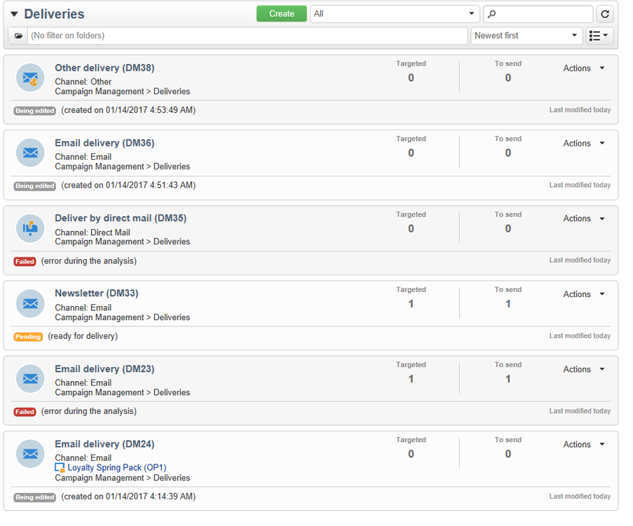
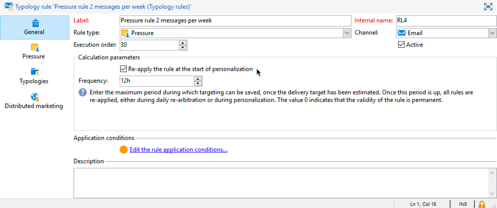

# Reglas de presión{#pressure-rules}

## Acerca de la fatiga de marketing {#about-marketing-fatigue}

La implementación de la gestión de la presión de las ventas permite evitar la saturación de la población de la base de datos, también conocida como fatiga de marketing. Para ello, puede definir un número máximo de mensajes por destinatario. También le permite implementar reglas de mediación entre campañas para enviar el mejor mensaje al público objetivo.

Las reglas de **presión** para administrar la fatiga de marketing pueden consistir, por ejemplo, en restringir el número de correos que se envían a una población a un máximo de dos, en seleccionar la comunicación que mejor se adapte a los intereses de un grupo de suscriptores, en evitar enviar un SMS a un cliente insatisfecho, etc.

Las campañas se seleccionan según los umbrales definidos y el peso del mensaje.

* Un umbral es la cantidad más alta de envíos autorizados para un destinatario determinado durante un periodo determinado. Puede ser fijo o variable. Se define o calcula en la configuración de reglas de tipología. Consulte Número [máximo de mensajes](#maximum-number-of-messages).
* El peso del envío le permite identificar los envíos de mayor prioridad dentro del marco de la gestión de presión. Los mensajes con mayor peso son prioritarios. Consulte [Peso](#message-weight)del mensaje.

La mediación consiste en asegurarse de que las campañas programadas cuyo peso sea mayor que la campaña en curso no saturen los perfiles: si este es el caso, el perfil se excluye del envío.

Los criterios de mediación (peso o umbral del mensaje) pueden variar en función de dos tipos de información:

* preferencias de destinatario, que es información genérica: suscripciones al boletín informativo, estado del destinatario (cliente o cliente potencial),
* comportamiento del destinatario: compras, enlaces visitados, etc.

La regla de mediación para definir los mensajes aptos se aplica durante la fase de análisis. Para cada destinatario y para el período correspondiente, el mensaje se enviará si la fórmula siguiente es verdadera: **(número de mensajes enviados) + (número de mensajes con mayor peso) &lt; umbral**.

De lo contrario, el destinatario será **[!UICONTROL Excluded by arbitration]**. Para obtener más información sobre esto, consulte [Exclusión después del arbitraje](#exclusion-after-arbitration).

## Creación de una regla de presión {#creating-a-pressure-rule}

Para configurar la mediación entre campañas utilizando Adobe Campaign, comience creando tipologías de campaña y definiendo reglas de tipología vinculadas (Reglas de **presión** ).

To create and configure a **[!UICONTROL Pressure]** typology rule, apply the following steps:

1. In the list of campaign typology rules, click the **[!UICONTROL New]** icon above the list.

   

1. In the **[!UICONTROL General]** tab of the new rule, select a **Pressure** type rule and enter a name and description for it.

   

1. Cambie el orden de ejecución si es necesario. When multiple typology rules are applied as a **[!UICONTROL Typology]** set, the lower ordered rules are applied first. For more on this, refer to [Execution order](../../campaign/using/applying-rules.md#execution-order).
1. In the **[!UICONTROL Calculation parameters]** section, define a frequency if you want to save targeting beyond the next daily re-arbitration execution. Para obtener más información sobre esto, consulte [Ajuste de la frecuencia](../../campaign/using/applying-rules.md#adjusting-calculation-frequency)de cálculo.
1. Click the **[!UICONTROL Pressure]** tab and choose the calendar period during which the typology rule applies.

   

   La regla se aplica a los envíos cuya fecha de contacto se incluya en el periodo de interés.

   >[!NOTE]
   >
   >Scheduled deliveries are only taken into account if the **[!UICONTROL Take the deliveries into account in the provisional calendar]** option is selected. For more on this, refer to [Setting the period](#setting-the-period).

1. Defina el método para calcular el número más alto de mensajes.

   El umbral representa el número máximo de mensajes que se pueden enviar a un destinatario durante el periodo en cuestión.

   De forma predeterminada, el umbral es constante y es necesario indicar un número máximo de mensajes autorizados por la regla.

   

   To define a variable threshold, select the **[!UICONTROL Depends on the recipient]** value in the **[!UICONTROL Type of threshold]** field and use the icon on the right to open the expression editor.

   

   Para obtener más información sobre esto, consulte [Número máximo de mensajes](#maximum-number-of-messages).

1. Especifique el método para calcular el peso del envío.

   Cada envío tiene un peso, es decir, un valor que representa su nivel de prioridad: esto permite la mediación entre las campañas. El peso se calcula mediante la fórmula definida en la regla de tipología o en sus propiedades. For more on this, refer to [Message weight](#message-weight).

1. De forma predeterminada, todos los mensajes tienen en cuenta el cálculo de umbral. The **[!UICONTROL Restriction]** tab lets you filter the messages concerned by the typology rule:

   * La sección superior de esta pestaña le permite restringir los destinatarios que le interesen.
   * La sección inferior de esta pestaña le permite filtrar los mensajes que se van a contar.

      En el siguiente ejemplo, solo se tienen en cuenta los destinatarios guardados en la carpeta **NewContacts** y los envíos que comienzan con **Newsletter**.
   

1. The **[!UICONTROL Typologies]** tab lets you view the campaign typologies which apply this rule or link the rule to one or more existing typologies. Para obtener más información, consulte [Aplicación de tipologías](../../campaign/using/about-campaign-typologies.md#applying-typologies).

## Definición de umbrales y pesos {#defining-thresholds-and-weights}

### Número máximo de mensajes {#maximum-number-of-messages}

Cada regla de presión define un umbral, es decir, un número máximo de mensajes que se pueden enviar a un destinatario durante un periodo de tiempo determinado. Una vez alcanzado este umbral, no se pueden realizar más envíos hasta el final del periodo. Este proceso permite excluir automáticamente un destinatario de un envío si un mensaje supera el umbral establecido, evitando así saturar al destinatario.

Los valores de umbral pueden ser constantes o calculados mediante una fórmula con variables. Esto significa que, para un periodo determinado, los umbrales pueden variar de un destinatario a otro o incluso en un mismo destinatario.

>[!CAUTION]
>
>La introducción de **0** como umbral evita todos los envíos a la población destinataria durante el periodo en cuestión.

**Ejemplo:**

Puede indexar el número de mensajes autorizados según el segmento al que pertenezca el destinatario. Esto significa que un destinatario que pertenece al segmento Web puede recibir más mensajes que otros destinatarios. An **[!UICONTROL Iif (@origin='Web', 5, 3)]** type formula authorizes the delivery of 5 messages to recipients and 3 for other segments. La configuración resultante es la siguiente:

Para definir el umbral, puede utilizar una dimensión vinculada a la dimensión de objetivo: por ejemplo, para incluir mensajes enviados a los perfiles de destinatario almacenados en la tabla de visitantes (para obtener más información sobre la tabla de visitantes, consulte [esta sección](../../web/using/use-case--creating-a-refer-a-friend-form.md)) o para evitar que se envíe más de un mensaje por semana a una misma familia (lo que puede hacer referencia a varias direcciones de correo electrónico) identificada en una dimensión vinculada a los destinatarios.

To do so, select the **[!UICONTROL Count messages on a linked dimension]** option, then select the visitor or the contact table.

### Peso del mensaje {#message-weight}

Cada envío tiene un peso que representa su nivel de prioridad. De forma predeterminada, el peso de un envío se establece en 5. Las reglas de presión permiten definir el peso de los envíos a los que se aplican.

El peso puede ser fijo o calcularse mediante una fórmula para adaptarse a los destinatarios. Por ejemplo, puede definir el peso de un envío en función de los intereses del destinatario.

>[!CAUTION]
>
>The weight defined in a typology rule can be overloaded individually for each delivery, in the **[!UICONTROL Properties]** tab. Click the **[!UICONTROL Typology]** tab to select the campaign typology and, if necessary, specify the weight to be applied.\
>Sin embargo, el peso declarado en una regla de tipología no se utiliza para calcular una regla de tipología B: este peso afecta únicamente a los envíos que utilizan la regla A.

**Ejemplo:**

En el ejemplo siguiente, queremos vincular el peso de los boletines de noticias sobre música con la puntuación de tendencia de sus destinatarios. Para ello:

1. Cree un nuevo campo para almacenar las puntuaciones de tendencia de los receptores. El campo, en este caso **@Music**, se enriquece con las respuestas a los sondeos y encuestas en línea, los datos de seguimiento recopilados, etc.
1. Cree una regla de tipología para calcular el peso del mensaje en función de este campo.

   

1. Aplique esta regla a los mensajes con el siguiente asunto: boletines informativos, ofertas especiales, etc. El peso de estos envíos y, por lo tanto, su nivel de prioridad depende de la puntuación de tendencia de cada destinatario.

## Configuración del periodo {#setting-the-period}

Las reglas de presión se definen en periodos de desplazamiento de **n** días.

The period is configured in the **[!UICONTROL Pressure]** tab of the rule. Puede especificar el número de días y, si es necesario, seleccionar el tipo de agrupación que desea aplicar (día, semana, mes, trimestre, etc.).

The grouping type lets you extend the **[!UICONTROL Period considered]** field to the whole day, calendar week, calendar month or calendar year for dates for the period.

Por ejemplo, una regla de presión que define un umbral de 2 mensajes por semana, con una agrupación para cada mes de calendario, impide que se envíen más de 2 mensajes en de la misma semana Y dentro de un mismo mes del calendario. Advertencia: si el periodo se superpone en dos meses, el umbral de cálculo tiene en cuenta los envíos de estos dos meses del calendario y, por tanto, evita realizar nuevos envíos durante el segundo mes.

>[!NOTE]
>
>De forma predeterminada, solo se tienen en cuenta los envíos que ya se han enviado al calcular el umbral. Check the **[!UICONTROL Take the deliveries into account in the provisional calendar]** option if you also want to consider the deliveries scheduled for the concerned period. En este caso, el periodo de tiempo se duplica para permitir la integración de envíos futuros y pasados.\
>Para restringir los envíos que se tienen en cuenta a un periodo de dos semanas, puede:
>
>* Enter **15d** in the **[!UICONTROL Concerned period]** field: deliveries sent up to two weeks before the date of the delivery which the rule is applied to will be taken into account in the calculation,
>
>  
o
>
>* Introduzca **7d** en el **[!UICONTROL Period considered]** campo Y marque la casilla de verificación **[!UICONTROL Take the deliveries into account in the provisional calendar]**\
   >opción: las entregas enviadas hasta 7 días antes de la fecha de entrega y programadas hasta 7 días después de la fecha de entrega en la que se aplica la regla se tendrán en cuenta en el cálculo.
>
>
La fecha de inicio depende de cómo se haya configurado la base de datos.

Por ejemplo, si aplica una regla de presión de 15 días sin agrupar a un envío con fecha del 11/12, los envíos se tendrán en cuenta entre el 27/11 y el 12/12. Si la regla de presión tiene en cuenta los envíos del calendario provisional, se tienen en cuenta todos los envíos programados entre el 27/11 y el 27/12. Por último, si configura un grupo por mes del calendario en la regla, el umbral de cálculo tiene en cuenta todos los envíos de noviembre y diciembre (del 1/11 al 31/12).

>[!CAUTION]
>
>**Casos frecuentes**
>To make sure that deliveries for the current calendar week are not taken into account, as well as not to risk also taking into account those from the previous week for the calculation threshold, specify the **[!UICONTROL Period considered]** at &#39;0&#39; and select &#39;Grouping per calendar week&#39; as the **[!UICONTROL Period type]**.
> 
>Cuando un periodo es superior a 0 (1, por ejemplo), el umbral de cálculo puede tener en cuenta los envíos del día anterior. Por lo tanto, si el día anterior corresponde a la semana anterior del calendario y el tipo de periodo seleccionado es “Agrupación por semana del calendario”, la semana anterior se tiene en cuenta para el umbral del cálculo.

**Ejemplo:**

Queremos crear una regla de presión que limite las solicitudes a 3 mensajes por cada periodo de dos semanas, con una agrupación por mes del calendario.

Tomemos 6 boletines con el mismo peso, programados para el 30/05, el 3/06, el 08/06, el 12/06, el 22/06 y el 30/06.

Los envíos programados para el 12 y 30 de junio no se envían: el envío del 12/06 supera el umbral de 3 mensajes por periodo de dos semanas y el envío del día 30 supera el umbral de comunicaciones autorizadas por mes del calendario.

La mediación excluye a todos los destinatarios de estos envíos durante la fase de análisis:

Por la misma regla, si se agrupan los envíos por trimestre, los destinatarios del **boletín informativo n.º 5** también se excluyen y este no se envía.

Por último, si no se selecciona ningún agrupamiento, tan solo no se envía el **boletín informativo n.º 4**, ya que este se encuentra programado para el mismo periodo de dos semanas que los tres primeros boletines.

>[!NOTE]
>
>Al cambiar la definición de una regla de tipología, puede crear una **Simulación** para controlar su impacto sobre los envíos a los que se aplica y monitorizar el impacto que los envíos tienen entre sí. For more on this, refer to [Campaign simulations](../../campaign/using/campaign-simulations.md).

## Exclusión tras la mediación {#exclusion-after-arbitration}

Arbitration is re-applied every night via the **[!UICONTROL Forecasting]** technical workflow and the **[!UICONTROL Campaign jobs]** workflow.

The **[!UICONTROL Forecasting]** workflow pre-calculates the data for the period in progress (from its start date to the current date), which lets typology rules be applied during the analysis. También recalcula los contadores de exclusión para la mediación nocturna diaria.

Por lo tanto, para cada destinatario, Adobe Campaign comprueba que el número de mensajes enviados no supere el umbral, teniendo en cuenta el número de mensajes enviados durante el periodo en cuestión. Esta información es un **indicador**, ya que todos los cálculos se actualizan en el momento del envío.

Si este número supera el umbral, se aplican las reglas de mediación definidas en la campaña de tipología y los destinatarios se excluyen de las campañas con un peso menor.

>[!NOTE]
>
>Si varios envíos tienen puntuaciones iguales, se envía la campaña programada para la fecha más temprana.

## Ejemplos de uso de las reglas de presión {#use-cases-on-pressure-rules}

### Adaptación del umbral según el criterio {#adapting-the-threshold-based-on-criterion}

Queremos crear una regla de tipología para evitar el envío de más de 4 mensajes por semana a los clientes y de más de 2 mensajes por semana a los posibles clientes.

To identify customers and prospects, use the **[!UICONTROL Status]** field, which contains 0 for prospects and 1 for customers.

Para crear la regla, siga los siguientes pasos:

1. Cree una nueva regla de tipología de tipo **presión**.
1. Edit the **[!UICONTROL Pressure]** tab: in the **[!UICONTROL Maximum number of messages]** section, we want to create a formula to calculate the threshold depending on each recipient. Seleccione el **[!UICONTROL Depends on the recipient]** valor en el **[!UICONTROL Threshold type]** campo y haga clic en **[!UICONTROL Edit expression]** a la derecha del **[!UICONTROL Formula]** campo.

   Click the **[!UICONTROL Advanced parameters]** button to define the calculation formula.

   

1. Seleccione la **[!UICONTROL Edit the formula using an expression]** opción y haga clic en **[!UICONTROL Next]**.

   

1. In the list of functions, double-click the **Iif** function in the **[!UICONTROL Others]** node.

   Then select the recipients&#39; **Status** in the **[!UICONTROL Available fields]** section.

   

   Introduzca la fórmula siguiente: **Iif(@status=0,2,4)**

   

   Esta fórmula permite asignar el valor 2 si el estado es igual a 0 y el valor 4 para todos los demás estados.

   Haga clic en **[!UICONTROL Finish]** para aprobar la fórmula.

1. Indique el período durante el cual se aplicará la regla: 7 días en este caso, para contar el número de mensajes por semana.

   

1. Guarde la regla para aprobar la creación.

Ahora, vincule la regla que acaba de crear a una tipología para aplicarla a los envíos. Para ello:

1. Cree una tipología de campaña.
1. Go to the **[!UICONTROL Rules]** tab, click the **[!UICONTROL Add]** button and select the rule you have just created.

   

1. Guarde la tipología: se añade a la lista de tipologías existentes.

To use this typology in your deliveries, select it in the delivery properties, in the **[!UICONTROL Typology]** tab as shown below:

>[!NOTE]
>
>La tipología se puede definir en la plantilla de envío para que se aplique automáticamente a todos los envíos creados con esta plantilla.

Durante el análisis del envío, los destinatarios del envío se excluyen del mismo, si corresponde, en función de la cantidad de envíos que ya hayan recibido. Para ver esta información, puede:

* Consultar el resultado del análisis:

   

* Edite el envío y haga clic en la **[!UICONTROL Delivery]** ficha y en la **[!UICONTROL Exclusions]** subficha:

   

* Click the **[!UICONTROL Audit]** tab, then the **[!UICONTROL Causes of exclusions]** sub-tab to display the number of exclusions and the applied typology rules:

   

### Cálculo del peso de envío según el comportamiento {#calculating-the-delivery-weight-based-on-behavior}

Puede definir reglas de presión basadas en el comportamiento del destinatario: por lo tanto, el peso de un envío se puede adaptar a criterios que varían de un destinatario a otro. Por ejemplo: puede decidir enviar un mensaje dependiendo de si un destinatario visitó su sitio de Internet, hizo clic en una sección específica del último boletín, se suscribió a un servicio de información o incluso en función de las respuestas a un estudio, un juego en línea, etc.

En el siguiente ejemplo, deseamos crear un envío con un peso de 5. Este peso se enriquece con puntuaciones de tendencia basadas en el comportamiento del destinatario: los clientes que ya han hecho un pedido desde este sitio tienen una puntuación de 5, mientras que los clientes que nunca han hecho un pedido en línea tienen una puntuación de 4.

Para realizar este tipo de configuración, debe utilizar una fórmula para definir el peso del mensaje. Se debe poder acceder a la información sobre puntuaciones de tendencia y a las respuestas de encuestas en el modelo de datos. En nuestro ejemplo, se ha añadido el campo **Propensity**.

Aplique los siguientes pasos de configuración:

1. Cree una nueva regla de tipología de tipo **presión**.
1. Edite la **[!UICONTROL Pressure]** ficha. We want to create a threshold formula which will be based on each individual recipient: click the **[!UICONTROL Edit expression]** icon to the right of the **[!UICONTROL Weight formula]** field.

   

1. De forma predeterminada, el valor **5** se muestra en la sección superior del editor de expresiones. Queremos añadir la puntuación de tendencia de cada destinatario a este peso: coloque el cursor a la derecha de 5, introduzca el carácter **+** y seleccione el campo **Propensity**.

   

1. A continuación, añada un valor más alto para los destinatarios que ya han realizado una compra. Para ellos, el peso del envío se debe aumentar en 5, mientras el resto debe hacerlo solo en 4.

   

1. Haga clic en **[!UICONTROL Finish]** para guardar esta regla.
1. Vincule la regla a una tipología de campaña y haga referencia a esta tipología en un envío para aprobarla.

### Enviar solo los mensajes de mayor peso {#sending-only-the-highest-weighted-messages}

Supongamos que desea enviar 2 mensajes como máximo en la misma semana, con un límite de 2 mensajes al día, a cada uno de los destinatarios y solo desea que se envíen los mensajes que tengan un mayor peso.

Para ello, debe programar varios envíos con diferentes pesos para el mismo destinatario y aplicar una regla de presión para excluir los envíos de pesos más bajos.

Primero, configure la regla de presión.

1. Cree una regla de presión. Para obtener más información sobre esto, consulte [Creación de una regla](#creating-a-pressure-rule)de presión.
1. En la **[!UICONTROL General]** ficha, seleccione la **[!UICONTROL Re-apply the rule at the start of personalization]** opción.

   

   This option overrules the value defined in the **[!UICONTROL Frequency]** field and automatically applies the rule during the personalization phase. Para obtener más información sobre esto, consulte [Ajuste de la frecuencia](../../campaign/using/applying-rules.md#adjusting-calculation-frequency)de cálculo.

1. En la **[!UICONTROL Pressure]** ficha, seleccione **[!UICONTROL 7d]** como **[!UICONTROL Period considered]** y **[!UICONTROL Grouping per day]** como **[!UICONTROL Period type]**.
1. Seleccione la **[!UICONTROL Take the deliveries into account in the provisional calendar]** opción para incluir los envíos programados.

   

   En el cálculo se tienen en cuenta los envíos realizados hasta 7 días antes de la fecha de envío y programados hasta 7 días después de la fecha de envío. For more on this, refer to [Setting the period](#setting-the-period).

1. In the **[!UICONTROL Typologies]** tab, link the rule to a campaign typology.
1. Guarde los cambios.

Ahora cree y configure un flujo de trabajo para cada envío al que desee aplicar la regla de presión.

1. Cree una campaña. Para obtener más información, consulte [esta sección](../../campaign/using/setting-up-marketing-campaigns.md#creating-a-campaign).
1. In the **[!UICONTROL Targeting and workflows]** tab of your campaign, add a **Query** activity to your workflow. Para obtener más información sobre esta actividad, consulte [esta sección](../../workflow/using/query.md).
1. Add an **[!UICONTROL Email delivery]** activity to the workflow and open it. Para obtener más información sobre esta actividad, consulte [esta sección](../../workflow/using/delivery.md).
1. Go to the **[!UICONTROL Approvals]** tab of the **[!UICONTROL Delivery properties]** and disable all approvals.

   

1. In the **[!UICONTROL Typology]** tab of the **[!UICONTROL Delivery properties]**, reference the campaign typology to apply the rule on. Defina un peso para el envío.

   

1. En el envío, haga clic en **[!UICONTROL Scheduling]** y seleccione **[!UICONTROL Schedule delivery (automatic execution when the scheduled date is reached)]**. En este ejemplo, seleccione la **[!UICONTROL Use a calculation formula]** opción.
1. Establezca la fecha de extracción en 10 minutos (fecha actual + 10 minutos).
1. Configure la fecha de contacto en el día siguiente (fecha actual + 1 día).

   

   Para que las exclusiones de regla de presión se implementen correctamente, asegúrese de establecer la fecha y hora de extracción antes de la fecha y la hora de contacto, así como antes de que se reaplique la mediación por la noche. Para obtener más información sobre esto, consulte [Exclusión después del arbitraje](#exclusion-after-arbitration).

1. Anule la selección de la **[!UICONTROL Confirm the delivery before sending]** opción y guarde los cambios.
1. Continúe de la misma forma para cada envío que desee realizar. Asegúrese de definir el peso deseado para cada envío.
1. Ejecute los flujos de trabajo relevantes para preparar y realizar los envíos.

Cuando se aplica la mediación nocturna, se excluyen los envíos con los pesos más bajos para el mismo destinatario. Solo se tienen en cuenta los envíos con el peso más alto a la hora de realizar dichos envíos. For more on this, refer to [Message weight](#message-weight).

Teniendo en cuenta que ya se ha enviado un correo electrónico a los destinatarios en cuestión a principios de la semana, la siguiente tabla muestra un ejemplo de las configuraciones que se pueden aplicar a dos envíos más.

<table> 
 <thead> 
  <tr> 
   <th> Envío  </th> 
   <th> Aprobaciones  </th> 
   <th> Ponderación  </th> 
   <th> Fecha y hora de extracción  </th> 
   <th> Fecha de contacto  </th> 
   <th> Fecha y hora de inicio del envío  </th> 
   <th> Fecha y hora de ejecución del flujo de trabajo de mediación  </th> 
   <th> Estado del envío  </th> 
   <th> Envío realizado (fecha/hora)  </th> 
  </tr> 
 </thead> 
 <tbody> 
  <tr> 
   <td> Envío 1  </td> 
   <td> Desactivado  </td> 
   <td> 5  </td> 
   <td> 3 p. m.  </td> 
   <td> 8 a. m. (día siguiente)  </td> 
   <td> 2 p. m.  </td> 
   <td> Nocturno  </td> 
   <td> Excluido  </td> 
   <td> Excluido  </td> 
  </tr> 
  <tr> 
   <td> Delivery 2  </td> 
   <td> Desactivado  </td> 
   <td> 10  </td> 
   <td> 4 p. m.  </td> 
   <td> 9 a. m. (día siguiente)  </td> 
   <td> 2 p. m.  </td> 
   <td> Nocturno  </td> 
   <td> Enviado  </td> 
   <td> 9 a. m. (día siguiente)  </td> 
  </tr> 
 </tbody> 
</table>

Después de que la fecha de extracción haya pasado para los dos envíos, la mediación nocturna se vuelve a aplicar antes de las fechas de contacto de ambos envíos. Esto permite buscar todos los envíos ya realizados (destinatarios para los que se procesa un envío, registrados a través de los registros amplios) o programados para enviarse (destinatarios aptos para recibir un envío, registrados mediante los registros de previsión).

Una vez que se han enumerado todos los envíos realizados y potenciales para el periodo definido en la regla de presión, Adobe Campaign las clasifica por peso, con el peso más alto en primer lugar. Cuando se alcanza el umbral establecido en la regla de presión (en este caso, no más de 2 correos electrónicos en la misma semana), los destinatarios se excluyen del envío.
