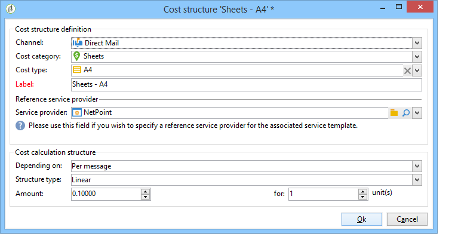

# Proveedores, existencias y presupuestos{#providers-stocks-and-budgets}

Adobe Campaign permite definir proveedores de servicios que participan en los trabajos realizados dentro de las campañas. La información sobre los proveedores de servicios y las estructuras de coste relacionadas la define el administrador de Adobe Campaign desde la vista principal. Se hace referencia al proveedor de servicios desde el envío, y las estructuras de coste permiten el cálculo de los costes asociados con este envío, así como la gestión de las existencias correspondientes.

## Creación de proveedores de servicios y sus estructuras de costes {#creating-service-providers-and-their-cost-structures}

Cada proveedor de servicios se guarda en un archivo con detalles de contacto, plantillas de servicio y trabajos relacionados.

Service providers are configured in the **[!UICONTROL Administration > Campaign management]** node of the tree.

Los trabajos realizados durante los envíos se realizan mediante proveedores de servicios, especialmente en el caso del correo directo y los canales móviles. Estos proveedores de servicios pueden, por ejemplo, participar en la impresión o distribución de mensajes. Estos trabajos implican configuraciones y costes específicos de cada proveedor de servicios. La configuración de proveedores de servicios consta de cuatro etapas:

1. Creación de un proveedor de servicios en Adobe Campaign

   See [Adding a service provider](#adding-a-service-provider).

1. Definición de categorías de costes y estructuras de plantillas de servicio asociadas

   Consulte [Definición de categorías](#defining-cost-categories) de costes y [Definición de la estructura](#defining-the-cost-structure)de costes.

1. Configuración de procesos

   See [Configuring processes associated with a service](#configuring-processes-associated-with-a-service).

1. Referencia al proveedor de servicios al nivel de campaña

   See [Associating a service with a campaign](#associating-a-service-with-a-campaign).

### Creación de un proveedor de servicios y sus categorías de costes {#creating-a-service-provider-and-its-cost-categories}

#### Adición de un proveedor de servicios {#adding-a-service-provider}

Puede crear tantos proveedores de servicios como sea necesario para los envíos. El procedimiento para añadir un proveedor de servicios es el siguiente:

1. Right-click the list of service providers and select **[!UICONTROL New]**, or click the **[!UICONTROL New]** button above the list of service providers.
1. En la sección inferior de la ventana, especifique el nombre y los detalles de contacto del proveedor de servicios.

   

1. Click the **[!UICONTROL Save]** button to add the service provider to the list.

#### Definición de categorías de coste {#defining-cost-categories}

Debe asociar las plantillas de servicio con cada proveedor de servicios. En estas plantillas, primero debe identificar las categorías de coste y, si es necesario, las existencias. A continuación, debe crear las reglas de cálculo de costes para cada categoría, a través de las estructuras de coste.

>[!NOTE]
>
>Para obtener más información sobre esto, consulte [Definición de la estructura](#defining-the-cost-structure)de costes.

Una categoría de coste es una entidad que contiene un conjunto de costes apto para un tipo de envío (correo electrónico, correo directo, etc.) o para una tarea. Las categorías de coste se agrupan en las plantillas de servicios asociadas a los proveedores de servicios. Cada proveedor de servicios puede hacer referencia a una o más plantillas de servicio.

Para crear una plantilla de servicio y definir su contenido, aplique los siguientes pasos:

1. In the **[!UICONTROL Services]** tab of the service provider, click the **[!UICONTROL Add]** button and name the service template.

   

1. Cree las categorías de coste para cada tipo de proceso (envío por correo directo, por correo electrónico, etc. o tarea). To do this, click the **[!UICONTROL Cost categories]** tab and then the **[!UICONTROL Add]** button, and enter the parameters of each cost category.

   

   * Enter a label for this cost category and select the type of process concerned: Delivery by **[!UICONTROL Direct mail]**, **[!UICONTROL E-mail]**, **[!UICONTROL Mobile]**, **[!UICONTROL Telephone]**, **[!UICONTROL Fax]** or **[!UICONTROL Task]**.
   * Click the **[!UICONTROL Add]** button to define the types of cost associated with this category.
   * Si es necesario, asocie una línea de existencias con cada tipo de coste para que las cantidades utilizadas se relacionen automáticamente con las existencias disponibles.

      >[!NOTE]
      >
      >The stock lines are defined in the **[!UICONTROL Stock management]** node.\
      >Para obtener más información sobre esto, consulte Gestión [de pedidos y](#stock-and-order-management)existencias.

1. Puede preseleccionar un valor para esta categoría de coste, que se ofrece de forma predeterminada en las categorías de coste del proveedor de servicios (en lugar de en un espacio en blanco). To do this, select the option in the **[!UICONTROL Selected]** column for the type of category concerned:

   

   Al nivel de envío, el valor se selecciona de forma predeterminada:

   

### Definición de la estructura de coste {#defining-the-cost-structure}

Para cada tipo de coste, una estructura de coste especifica las reglas de cálculo que se deben aplicar.

Click the **[!UICONTROL Cost structure]** tab to configure the cost calculation for each cost category and type. Click **[!UICONTROL Add]** and input the cost structure.

* Para crear la estructura de coste, seleccione el tipo de mensaje y la categoría de coste que le interesen en las listas desplegables, así como el tipo de coste que se aplica a la regla de cálculo. The content of these drop-down lists comes from the information entered via the **[!UICONTROL Cost categories]** tab.

   Debe asignar una etiqueta a la estructura de coste. De forma predeterminada, tiene el siguiente esquema de envío: Categoría de **coste: tipo de coste**.

   You can, however, rename it: enter the desired value directly in the **[!UICONTROL Label]** field.

* La fórmula de cálculo de coste se define en la sección inferior de la ventana.

   Esta fórmula puede ser fija (para cualquier número de mensajes) o calculada según el número de mensajes.

   Cuando depende del número de mensajes, la estructura de cálculo de costes puede ser **[!UICONTROL Linear]**, **[!UICONTROL Linear by threshold]** o **[!UICONTROL Constant by threshold]**.

#### Estructura lineal {#linear-structure}

If the amount is always the same for a message (or a batch of messages) irrespective of the total number of messages, select **[!UICONTROL Linear]** and enter the cost of each message.

If this amount applies to a batch of messages, specify the number of messages concerned in the **[!UICONTROL for]** field.

#### Estructura lineal por umbral {#linear-structure-by-threshold}

If the amount applies by threshold for each message, you must define a **[!UICONTROL Linear by threshold]** calculation structure. En este tipo de estructura de costes, cada mensaje cuesta 0,13, por ejemplo, si el número total de mensajes está entre 1 y 100, y 0,12 si envía entre 100 y 1000 mensajes, o 0,11 más allá de los 1000 mensajes.

La configuración debe ser la siguiente:

To add a threshold, click the **[!UICONTROL Add]** button to the right of the list.

#### Estructura constante por umbral {#constant-structure-by-threshold}

Finalmente, puede configurar un cálculo de coste en función del número total de mensajes. Para ello, seleccione una estructura **[!UICONTROL Constant by threshold]** de cálculo. Por ejemplo, el coste se establece en una cantidad fija de 12,00 para un envío de entre 1 y 100 mensajes, y de 100,00 para un envío de entre 101 y 1000 mensajes, y de 500,00 para cualquier envío de más de 1000 mensajes, sea cual sea el número total.

### Configuración de los procesos asociados a un servicio {#configuring-processes-associated-with-a-service}

You can associate information on the processes associated with the service via the **[!UICONTROL Processes]** tab.

To do this, click the **[!UICONTROL Processes]** tab to configure the sending of information to the router.

* The **[!UICONTROL File extraction]** section indicates the export template used for delivery when this service is selected. You can indicate the name of the output file in the **[!UICONTROL Extraction file]** field. El botón situado a la derecha del campo le permite insertar variables.

   

* The **[!UICONTROL Notification e-mail]** section lets you specify the template to notify service providers after files have been sent. Seleccione la plantilla utilizada para crear el mensaje de alerta y el grupo de destinatarios.

   By default, delivery templates for notification messages are saved in the **[!UICONTROL Administration > Campaign management > Technical delivery templates]** node, which is accessible from the general view.

* The **[!UICONTROL Post-processing]** section lets you select the workflow to launch after the delivery has been approved. Si se introduce una plantilla de flujo de trabajo, se crea automáticamente una instancia de flujo de trabajo y, a continuación, se inicia en cuanto surta efecto la aprobación. Este flujo de trabajo puede enviar el archivo de extracción a un proveedor de servicios externos para su procesamiento, por ejemplo.

### Asociación de un servicio a una campaña {#associating-a-service-with-a-campaign}

Los servicios están asociados a campañas a través de envíos o tareas. Los proveedores de servicios están vinculados a plantillas de envío para ofrecer sus servicios en los envíos creados mediante esta plantilla.

Cuando se selecciona un servicio, las categorías de coste correspondientes al tipo de envío (correo electrónico, correo directo, etc.) se indican automáticamente en la tabla central junto con las opciones de procesamiento definidas.

>[!NOTE]
>
>Si no se muestra ninguna categoría de coste cuando se selecciona un servicio, significa que no se definió ninguna categoría de costes para ese tipo de proceso. For example, for an email delivery, if no **[!UICONTROL E-mail]** type cost category has been defined, no category will be displayed, and selecting the service will have no effect.

* Para un envío por correo directo, se puede seleccionar el servicio en la ventana de configuración.

   

* Para el envío mediante canales móviles, fax o teléfono, se aplica el mismo modo de selección.
* For an email delivery, the service is selected from the **[!UICONTROL Advanced]** tab in the delivery properties, as in the following example:

   

The **[!UICONTROL Amount to surcharge]** column lets you add a cost for this category in the context of the delivery or task concerned.

Se puede imponer la selección obligatoria de un tipo de coste durante la definición de categorías de coste para un envío. Para ello, seleccione **[!UICONTROL A cost type must be selected]**.

## Gestión de existencias y pedidos {#stock-and-order-management}

Los tipos de coste se pueden asociar a las líneas de existencias para administrar las alertas, realizar un seguimiento de los suministros e iniciar pedidos.

El procedimiento para configurar la gestión de existencias y de pedidos en Adobe Campaign y avisar a los operadores en caso de suministros insuficientes para que se realice un envío es el siguiente:

1. Creación de existencias y referencia a los proveedores de servicios asociados

   Consulte [Creación de un stock](#creating-a-stock).

1. Adición de líneas de existencias

   Consulte [Adición de líneas](#adding-stock-lines)de stock.

1. Notificación de los operadores en caso de una alerta

   Consulte Operadores [de alertas](#alerting-operators).

1. Pedidos y suministro.

   Consulte [Pedidos](#orders).

### Gestión de existencias {#stock-management}

Adobe Campaign puede alertar a un grupo de operadores si las existencias se han agotado o han alcanzado un límite mínimo. Stock levels are accessible via the **[!UICONTROL Stocks]** link of the **[!UICONTROL Campaigns]** universe via the **[!UICONTROL Other choices]** link of the navigation area.

#### Creación de un inventario de existencias {#creating-a-stock}

Siga los siguientes pasos para crear un nuevo inventario de existencias:

1. Click the **[!UICONTROL Create]** button above the list of stocks.
1. Introduzca la etiqueta del inventario de existencias y seleccione el proveedor de servicios con el que está asociado en la lista desplegable.

   

   >[!NOTE]
   >
   >Para obtener más información sobre esto, consulte [Creación de proveedores de servicios y sus estructuras](#creating-service-providers-and-their-cost-structures)de costes.

#### Adición de líneas de existencias {#adding-stock-lines}

Un inventario consta de varias líneas de existencias. Una línea de existencias contiene una cantidad inicial de recursos destinados a los envíos. Cada línea de existencias indica la cantidad consumida, la cantidad en inventario y la cantidad pedida.

When you create a stock, click the **[!UICONTROL Stock lines]** tab to add new lines.

Una vez creado el inventario, haga clic en él para editar y utilizar su panel para crear y ver líneas de existencias.

Click the **[!UICONTROL Create]** button to define the stock parameters.

* Indicate the quantity initially in stock in the **[!UICONTROL Initial stock]** field. Los campos **[!UICONTROL Consumed]** y **[!UICONTROL In stock]** se calculan automáticamente y se actualizan a medida que avanzan las campañas.

   

* Indicate the threshold from which operators should be alerted to order stock in the **[!UICONTROL Alert level]** field. Cuando se alcanza el nivel de alerta, aparece un mensaje de advertencia en la ventana de aprobación de envíos con este archivo.

#### Asociación de un inventario con las categorías de coste {#associating-a-stock-with-cost-categories}

Para un proveedor de servicios determinado, en un servicio, se puede hacer referencia a una línea de existencias mediante una de las categorías de coste de la manera siguiente:

### Seguimiento de existencias {#stock-tracking}

#### Alerta a operadores {#alerting-operators}

La alerta aparece cuando las existencias a las que se hace referencia en un envío no son suficientes. Por ejemplo, se mostrará la siguiente alerta cuando se apruebe un archivo de extracción:

#### Pedidos {#orders}

The **[!UICONTROL Orders]** sub-tab lets you view current orders and save new orders.

To save an order, edit the targeted stock line, click the **[!UICONTROL Add]** button and specify the delivery date and the quantity ordered.

>[!NOTE]
>
>Once the delivery date is reached, the ordered stock line disappears automatically and the quantity entered in the **[!UICONTROL Volume on order]** field is added to the **[!UICONTROL Tracking]** tab. Esta cantidad se añade automáticamente al volumen de existencias.

The **[!UICONTROL Consumptions]** tab contains the volume consumed per campaign. La información de esta pestaña se introduce automáticamente según los envíos realizados. Click the **[!UICONTROL Edit]** button to open the campaign concerned.

## Cálculo de presupuestos {#calculating-budgets}

### Principio {#principle}

Los costes se administran para los envíos y la campaña. Según el progreso, estos costes se asignan a los presupuestos.

Los costes de envío de una campaña se consolidan al nivel de campaña y los costes de todas las campañas de un programa se pasan al programa con el que están asociados. Los informes dedicados permiten rastrear los presupuestos de toda la plataforma o para cada plan y cada programa.

### Implementación {#implementation}

En una campaña, cuando seleccione el presupuesto, debe introducir la cantidad inicial. Los costes calculados se actualizan de forma automática según el nivel de compromiso de las cantidades introducidas (gastos realizados, previstos, reservados, comprometidos). Consulte [Cálculo de importes](../../campaign/using/controlling-costs.md#calculating-amounts).

>[!NOTE]
>
>El procedimiento para crear presupuestos se presenta en [Creación de un presupuesto](../../campaign/using/controlling-costs.md#creating-a-budget).

