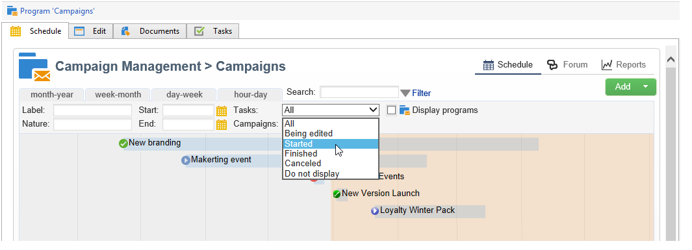
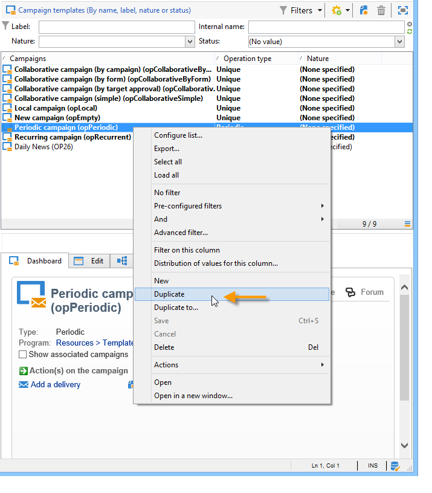
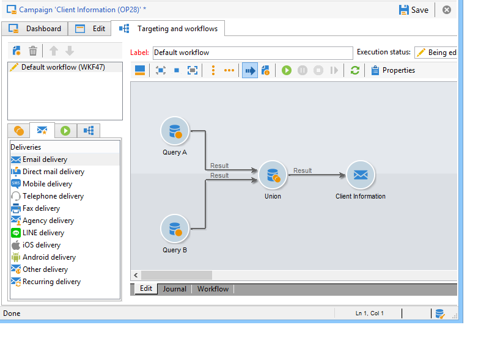
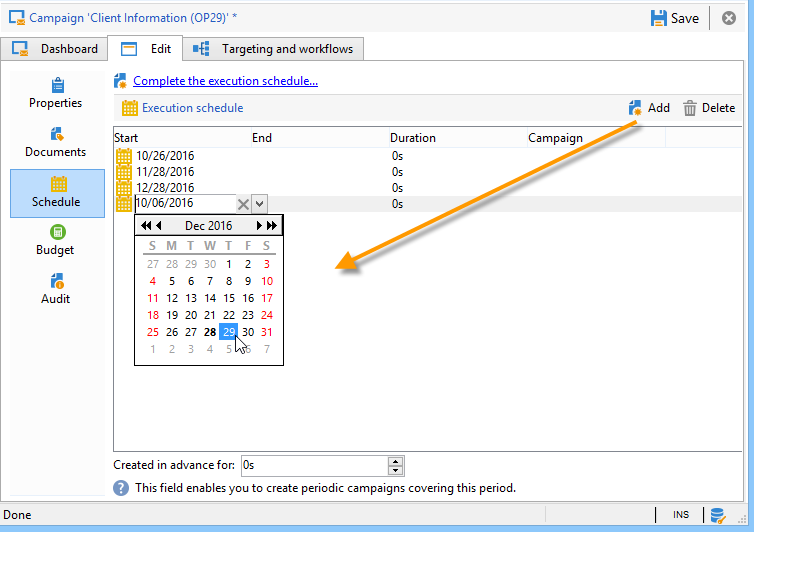

# Configuración de campañas de marketing{#setting-up-marketing-campaigns}

Las campañas incluyen acciones (envíos) y procesos (importación o extracción de archivos), así como recursos (documentos de marketing, descripciones de envíos). Todos ellos se utilizan en las campañas de marketing. Las campañas son parte de un programa y los programas se incluyen en un plan de campaña.

 Descubra cómo crear un plan de marketing, programas y campañas  [en vídeo](#video)

Para crear una campaña de marketing:

1. Crear una campaña: descubra campañas y sus características: etiqueta, tipo, fechas de inicio y finalización, presupuesto, recursos asociados, administradores y participantes.

   Consulte [Creación de una campaña](#creating-a-campaign).

1. Defina la población(es) objetivo: cree un flujo de trabajo con consultas de objetivo.

   Consulte [Selección de la población objetivo](../../campaign/using/marketing-campaign-deliveries.md#selecting-the-target-population).

1. Cree entregas: seleccione los canales y defina el contenido que desee enviar.

   Consulte [Creación de envíos](../../campaign/using/marketing-campaign-deliveries.md#creating-deliveries).

1. Apruebe los envíos.

   Consulte [Proceso de aprobación](../../campaign/using/marketing-campaign-approval.md#approval-process).

1. Supervise los envíos.

   Consulte [Monitorización](../../campaign/using/marketing-campaign-monitoring.md).

1. Planifique campañas y costes asociados.

   Consulte [Creación de proveedores de servicios y sus estructuras de costes](../../campaign/using/providers--stocks-and-budgets.md#creating-service-providers-and-their-cost-structures).

Una vez completados estos pasos, puede iniciar los envíos (consulte [Inicio de una entrega](../../campaign/using/marketing-campaign-deliveries.md#starting-a-delivery)), comprobar los datos, los procesos y la información relacionada con los envíos y, si es necesario, administrar los documentos asociados (consulte [Administración de documentos asociados](../../campaign/using/marketing-campaign-deliveries.md#managing-associated-documents)). También puede realizar un seguimiento de la ejecución de las fases de procesamiento de las campañas y envíos (consulte [Seguimiento](../../campaign/using/marketing-campaign-monitoring.md)).

## Creación de la jerarquía del plan y del programa {#creating-plan-and-program-hierarchy}

Para configurar la jerarquía de carpetas para planes y programas de marketing:

1. Haga clic en el icono **Explorer** en la página principal.
1. Haga clic con el botón derecho en la carpeta en la que desee crear su plan.
1. Seleccione **Add new folder > Campaign Management > Plan**.

   

1. Cambie el nombre del plan.
1. Haga clic con el botón derecho en el plan recién creado y seleccione **Properties...**

   

1. En la pestaña **General**, modifique el **Internal name** para evitar duplicados durante las exportaciones de paquetes.
1. Haga clic en **Save**.
1. Haga clic con el botón derecho del ratón en el plan recién creado y seleccione **Create a new “Program” folder**.
1. Repita los pasos anteriores para cambiar el nombre de la nueva carpeta del programa y su nombre interno.

## Creación de una campaña {#creating-a-campaign}

### Adición de una campaña {#adding-a-campaign}

Puede crear una campaña a través de la lista de campañas. Para mostrar esta vista, seleccione el menú **[!UICONTROL Campaigns]** en el panel **[!UICONTROL Campaigns]**.

El campo **[!UICONTROL Program]** permite seleccionar el programa al que se asocia la campaña. Esta información es obligatoria.

Las campañas también se pueden crear mediante un programa. Para ello, haga clic en el botón **[!UICONTROL Add]** de la pestaña **[!UICONTROL Schedule]** del programa correspondiente.

Cuando crea una campaña a través de la pestaña **[!UICONTROL Schedule]** de un programa, la campaña se relaciona automáticamente con el programa correspondiente. El campo **[!UICONTROL Program]** está oculto en este caso.

En la ventana de creación de campaña, seleccione la plantilla de campaña y añada un nombre y una descripción de la campaña. También puede especificar las fechas de inicio y finalización de la campaña.

Haga clic en **[!UICONTROL OK]** para crear la campaña. Se agrega al calendario del programa.

>[!NOTE]
>
>Para filtrar las campañas que desea mostrar, haga clic en el vínculo **[!UICONTROL Filter]** y seleccione el estado de las campañas que desee mostrar.

### Edición y configuración de una campaña {#editing-and-configuring-a-campaign}

Luego puede editar la campaña que acaba de crear y definir sus parámetros.

Para abrir y configurar una campaña, selecciónela en la programación y haga clic en **[!UICONTROL Open]**.

Esto le lleva al panel de campañas.

## Campañas recurrentes y periódicas {#recurring-and-periodic-campaigns}

Una campaña recurrente es una campaña basada en una plantilla específica, cuyos flujos de trabajo están configurados para ejecutarse según una programación asociada. Por lo tanto, los flujos de trabajo son recurrentes dentro de una campaña. El objetivo se duplica en cada ejecución y se rastrean los distintos procesos y la ubicación de destino. También se pueden ejecutar objetivos futuros por adelantado, mediante el periodo de cobertura durante la creación automática de flujos de trabajo, para iniciar simulaciones con cálculo de objetivos.

Una campaña periódica es una campaña creada automáticamente según la programación de ejecución de su plantilla.

### Creación de una campaña recurrente {#creating-a-recurring-campaign}

Las campañas recurrentes se crean a partir de una plantilla específica que define la plantilla de flujo de trabajo que se va a ejecutar y la programación de ejecución.

#### Creación de una plantilla para campañas recurrentes {#creating-the-campaign-template}

1. Cree una plantilla de campaña **[!UICONTROL Recurring]**.

   >[!NOTE]
   >
   >Se recomienda duplicar la plantilla predeterminada en lugar de crear una plantilla vacía.

   

1. Introduzca el nombre de la plantilla y la duración de la campaña.

   

1. Para este tipo de campaña, se añade una pestaña **[!UICONTROL Schedule]** para crear la programación de ejecución de la plantilla.

En esta pestaña, especifique las fechas de ejecución previstas de las campañas basadas en esta plantilla.

El modo de configuración de la programación de ejecución coincide con el objeto **[!UICONTROL Scheduler]** del flujo de trabajo. Para obtener más información, consulte [esta sección](../../workflow/using/architecture.md).

>[!IMPORTANT]
>
>La configuración de la programación de ejecución debe realizarse cuidadosamente para evitar sobrecargar la base de datos. Las campañas recurrentes duplican los flujos de trabajo de su plantilla en función de la programación especificada. La implementación de la creación de flujos de trabajo con excesiva frecuencia puede dificultar el funcionamiento de la base de datos.

1. Especifique un valor en el campo **[!UICONTROL Create in advance for]** para crear los flujos de trabajo correspondientes durante el periodo indicado.
1. Cree la plantilla de flujo de trabajo que desea utilizar en las campañas basadas en esta plantilla, con los parámetros de objetivo y uno o más envíos genéricos.

   >[!NOTE]
   >
   >Este flujo de trabajo debe guardarse como plantilla de flujo de trabajo recurrente. Para ello, edite las propiedades del flujo de trabajo y, en la pestaña **[!UICONTROL Recurring workflow template]**, seleccione la opción **[!UICONTROL Execution]**.

   

#### Creación de la campaña recurrente {#create-the-recurring-campaign}

Para crear la campaña recurrente y ejecutar sus flujos de trabajo según la programación definida en la plantilla, aplique el siguiente procedimiento:

1. Cree una nueva campaña basada en una plantilla de campaña recurrente.
1. Complete la programación de ejecución del flujo de trabajo.

   

1. La programación de la campaña permite introducir una creación automática de flujo de trabajo o una fecha de inicio de la ejecución para cada línea.

   Para cada línea, puede añadir las siguientes opciones adicionales:

   * **[!UICONTROL To be approved]** : permite forzar las solicitudes de aprobación de envíos en el flujo de trabajo.
   * **[!UICONTROL To be started]**: permite iniciar el flujo de trabajo cuando se llega a la fecha de inicio.

   El campo **[!UICONTROL Create in advance for]** permite crear todos los flujos de trabajo que abarcan el periodo introducido.

   Tras la ejecución del flujo de trabajo **[!UICONTROL Jobs on campaigns]**, se crean los flujos de trabajo específicos según los casos definidos en la programación de campaña. Por lo tanto, se crea un flujo de trabajo para cada fecha de ejecución.

1. Los flujos de trabajo recurrentes se crean automáticamente a partir de la plantilla de flujo de trabajo presente en la campaña. Se pueden ver en la pestaña **[!UICONTROL Targeting and workflows]** de la campaña.

   

   La etiqueta de una instancia de flujo de trabajo recurrente consta de su etiqueta de plantilla y el número de flujo de trabajo, con el carácter # en el medio.

   Los flujos de trabajo creados a partir de la programación se asocian automáticamente a él en la columna **[!UICONTROL Workflow]** de la pestaña **[!UICONTROL Schedule]**.

   

   Cada flujo de trabajo se puede editar desde esta pestaña.

   

   >[!NOTE]
   >
   >La fecha de inicio de la línea de programación asociada al flujo de trabajo está disponible en una variable del flujo de trabajo con la siguiente sintaxis:\
   >`$date(instance/vars/@startPlanningDate)`

### Creación de una campaña periódica {#creating-a-periodic-campaign}

Una campaña periódica es una campaña basada en una plantilla específica que le permite crear instancias de campaña basadas en una programación de ejecución. Las instancias de campaña se crean automáticamente en función de una plantilla de campaña periódica, dependiendo de la frecuencia definida en la programación de plantillas.

#### Creación de la plantilla de campaña {#creating-the-campaign-template-1}

1. Cree una plantilla de campaña **[!UICONTROL Periodic]**, preferiblemente mediante la duplicación de una plantilla de campaña existente.

   

1. Introduzca las propiedades de la plantilla.

   >[!NOTE]
   >
   >El operador al que se asigna la plantilla debe tener los derechos adecuados para crear campañas en el programa seleccionado.

1. Cree el flujo de trabajo asociado a esta plantilla. Se duplica en cada campaña periódica creada por la plantilla.

   

   >[!NOTE]
   >
   >Este flujo de trabajo es una plantilla de flujo de trabajo. No se puede ejecutar desde la plantilla de campaña.

1. Complete la programación de ejecución como en una plantilla de campaña recurrente: haga clic en el botón **[!UICONTROL Add]** y defina las fechas de inicio y finalización o complete la programación de ejecución mediante el vínculo.

   

   >[!IMPORTANT]
   >
   >Las plantillas de campañas periódicas crean nuevas campañas según la programación definida anteriormente. Por lo tanto, debe completarse cuidadosamente para evitar sobrecargar la base de datos de Adobe Campaign.

1. Una vez que se llega a la fecha de inicio de la ejecución, la campaña correspondiente se crea automáticamente. Tiene en cuenta todas las características de la plantilla.

   Cada campaña se puede editar a través de la programación de plantillas.

   

Todas las campañas periódicas contienen los mismos elementos. Una vez creada, se administra como una campaña estándar.

## Tutorial video {#video}

Este vídeo muestra cómo crear un plan de marketing, programas y campañas.

>[!VIDEO](https://video.tv.adobe.com/v/35132?quality=12)

Hay disponibles más vídeos de procedimientos para Campaign Classic [aquí](https://experienceleague.adobe.com/docs/campaign-classic-learn/tutorials/overview.html?lang=es).
