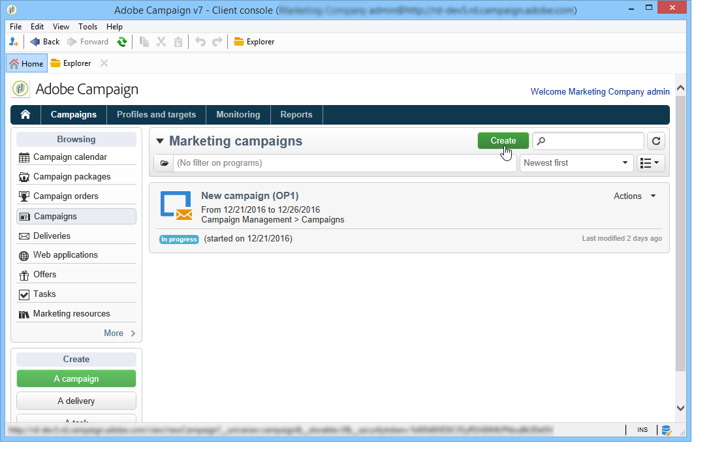

# Configuración de campañas de marketing{#setting-up-marketing-campaigns}

Las campañas incluyen acciones (envíos) y procesos (importación o extracción de archivos), así como recursos (documentos de marketing, descripciones de envíos). Todos ellos se utilizan en las campañas de marketing. Las campañas son parte de un programa y los programas se incluyen en un plan de campaña.

Para crear una campaña de marketing:

1. Crear una campaña: descubra campañas y sus características: etiqueta, tipo, fechas de inicio y finalización, presupuesto, recursos asociados, administrador o administradores y participantes.

   Consulte [Creación de una campaña](#creating-a-campaign).

1. Definir poblaciones objetivo: crear un flujo de trabajo con consultas de objetivos.

   See [Selecting the target population](../../campaign/using/marketing-campaign-deliveries.md#selecting-the-target-population).

1. Crear entregas: seleccione los canales y defina el contenido que se va a enviar.

   Consulte [Creación de envíos](../../campaign/using/marketing-campaign-deliveries.md#creating-deliveries).

1. Aprobar entregas.

   Consulte Proceso [de aprobación](../../campaign/using/marketing-campaign-approval.md#approval-process).

1. Monitorear envíos.

   Consulte [Monitoreo](../../campaign/using/marketing-campaign-monitoring.md).

1. Planifique las campañas y los costos asociados.

   See [Creating service providers and their cost structures](../../campaign/using/providers--stocks-and-budgets.md#creating-service-providers-and-their-cost-structures).

When these steps have been completed, you can start the deliveries (see [Starting a delivery](../../campaign/using/marketing-campaign-deliveries.md#starting-a-delivery)), check the data, processes and information relating to the deliveries and, if necessary, manage the associated documents (see [Managing associated documents](../../campaign/using/marketing-campaign-deliveries.md#managing-associated-documents)). You can also track the execution of the processing phases of campaigns and deliveries (see [Tracking](../../campaign/using/marketing-campaign-monitoring.md).

## Creación de la jerarquía del plan y del programa {#creating-plan-and-program-hierarchy}

Para configurar la jerarquía de carpetas para los planes y programas de marketing:

1. Haga clic en el icono **Explorer** en la página principal.
1. Haga clic con el botón derecho en la carpeta en la que desee crear su plan.
1. Seleccione **Add new folder > Campaign Management > Plan**.

   

1. Cambie el nombre del plan.
1. Haga clic con el botón derecho en el plan recién creado y seleccione **Properties...**.

   

1. En la pestaña **General**, modifique el **Internal name** para evitar duplicados durante las exportaciones de paquetes.
1. Haga clic en **Save**.
1. Haga clic con el botón derecho del ratón en el plan recién creado y seleccione **Create a new “Program” folder**.
1. Repita los pasos anteriores para cambiar el nombre de la nueva carpeta del programa y su nombre interno.

## Creación de una campaña {#creating-a-campaign}

### Adición de una campaña {#adding-a-campaign}

Puede crear una campaña a través de la lista de campañas. Para mostrar esta vista, seleccione el **[!UICONTROL Campaigns]** menú en el **[!UICONTROL Campaigns]** tablero.

The **[!UICONTROL Program]** field lets you select the program to which the campaign will be attached. Esta información es obligatoria.

Las campañas también se pueden crear mediante un programa. To do this, click the **[!UICONTROL Add]** button in the **[!UICONTROL Schedule]** tab of the concerned program.

When you create a campaign via the **[!UICONTROL Schedule]** tab of a program, the campaign is automatically linked to the concerned program. The **[!UICONTROL Program]** field is hidden in this case.

En la ventana de creación de campaña, seleccione la plantilla de campaña y agregue un nombre y una descripción de la campaña. También puede especificar las fechas de inicio y finalización de la campaña.

Haga clic **[!UICONTROL OK]** para crear la campaña. Se agrega al calendario del programa.

>[!NOTE]
>
>To filter the campaigns to display, click the **[!UICONTROL Filter]** link and select the status of campaigns to display.

### Edición y configuración de una campaña {#editing-and-configuring-a-campaign}

Luego puede editar la campaña que acaba de crear y definir sus parámetros.

To open and configure a campaign, select it from the schedule and click **[!UICONTROL Open]**.

Esto le lleva al panel de campañas.

## Campañas recurrentes y periódicas {#recurring-and-periodic-campaigns}

Una campaña recurrente es una campaña basada en una plantilla específica, cuyos flujos de trabajo están configurados para ejecutarse según una programación asociada. Por lo tanto, los flujos de trabajo son recurrentes dentro de una campaña. El objetivo se duplica en cada ejecución y se rastrean los distintos procesos y la ubicación de destino. También se pueden ejecutar objetivos futuros por adelantado, mediante el periodo de cobertura durante la creación automática de flujos de trabajo, para iniciar simulaciones con cálculo de objetivos.

Una campaña periódica es una campaña creada automáticamente según la programación de ejecución de su plantilla.

### Creación de una campaña recurrente {#creating-a-recurring-campaign}

Las campañas recurrentes se crean a partir de una plantilla específica que define la plantilla de flujo de trabajo que se va a ejecutar y la programación de ejecución.

#### Creación de una plantilla para campañas recurrentes {#creating-the-campaign-template}

1. Cree una plantilla **[!UICONTROL Recurring]** de campaña.

   >[!NOTE]
   >
   >Se recomienda duplicar la plantilla predeterminada en lugar de crear una plantilla vacía.

   

1. Introduzca el nombre de la plantilla y la duración de la campaña.

   

1. For this type of campaign, a **[!UICONTROL Schedule]** tab is added in order to create the template execution schedule.

En esta pestaña, especifique las fechas de ejecución previstas de las campañas basadas en esta plantilla.

Puede utilizar el asistente para la creación de programaciones para rellenar todas las fechas de ejecución automáticamente. To do this, click the **[!UICONTROL Complete the execution schedule...]** link located above the table.

The configuration mode of the execution schedule coincides with the **[!UICONTROL Scheduler]** object of the Workflow. Para obtener más información, consulte [esta sección](../../workflow/using/executing-a-workflow.md#architecture).

>[!IMPORTANT]
>
>La configuración de la programación de ejecución debe realizarse cuidadosamente para evitar sobrecargar la base de datos. Las campañas recurrentes duplican los flujos de trabajo de su plantilla en función de la programación especificada. La implementación de la creación de flujos de trabajo con excesiva frecuencia puede dificultar el funcionamiento de la base de datos.

1. Specify a value in the **[!UICONTROL Create in advance for]** field in order to create the corresponding workflows for the period indicated.
1. Cree la plantilla de flujo de trabajo que desea utilizar en las campañas basadas en esta plantilla, con los parámetros de objetivo y uno o más envíos genéricos.

   >[!NOTE]
   >
   >Este flujo de trabajo debe guardarse como plantilla de flujo de trabajo recurrente. To do this, edit the workflow properties and select the **[!UICONTROL Recurring workflow template]** option in the **[!UICONTROL Execution]** tab.

   

#### Creación de la campaña recurrente {#create-the-recurring-campaign}

Para crear la campaña recurrente y ejecutar sus flujos de trabajo según la programación definida en la plantilla, aplique el siguiente procedimiento:

1. Cree una nueva campaña basada en una plantilla de campaña recurrente.
1. Complete la programación de ejecución del flujo de trabajo.

   

1. La programación de la campaña permite introducir una creación automática de flujo de trabajo o una fecha de inicio de la ejecución para cada línea.

   Para cada línea, puede añadir las siguientes opciones adicionales:

   * **[!UICONTROL To be approved]** :: le permite forzar las solicitudes de aprobación de entrega en el flujo de trabajo.
   * **[!UICONTROL To be started]** :: le permite iniciar el flujo de trabajo cuando se ha alcanzado la fecha de inicio.
   The **[!UICONTROL Create in advance for]** field lets you create all the workflows covering the period entered.

   Upon execution of the **[!UICONTROL Jobs on campaigns]** workflow, the dedicated workflows are created based on the occurrences defined in the campaign schedule. Por lo tanto, se crea un flujo de trabajo para cada fecha de ejecución.

1. Los flujos de trabajo recurrentes se crean automáticamente a partir de la plantilla de flujo de trabajo presente en la campaña. They are visible from the **[!UICONTROL Targeting and workflows]** tab of the campaign.

   

   La etiqueta de una instancia de flujo de trabajo recurrente consta de su etiqueta de plantilla y el número de flujo de trabajo, con el carácter # en el medio.

   Workflows created from the schedule are automatically associated with it in the **[!UICONTROL Workflow]** column of the **[!UICONTROL Schedule]** tab.

   

   Cada flujo de trabajo se puede editar desde esta pestaña.

   

   >[!NOTE]
   >
   >La fecha de inicio de la línea de programación asociada al flujo de trabajo está disponible en una variable del flujo de trabajo con la siguiente sintaxis:\
   >`$date(instance/vars/@startPlanningDate)`

### Creación de una campaña periódica {#creating-a-periodic-campaign}

Una campaña periódica es una campaña basada en una plantilla específica que le permite crear instancias de campaña basadas en una programación de ejecución. Las instancias de campaña se crean automáticamente en función de una plantilla de campaña periódica, dependiendo de la frecuencia definida en la programación de plantillas.

#### Creación de la plantilla de campaña {#creating-the-campaign-template-1}

1. Create a **[!UICONTROL Periodic]** campaign template, preferably by duplicating an existing campaign template.

   

1. Introduzca las propiedades de la plantilla.

   >[!NOTE]
   >
   >El operador al que se asigna la plantilla debe tener los derechos adecuados para crear campañas en el programa seleccionado.

1. Cree el flujo de trabajo asociado a esta plantilla. Se duplica en cada campaña periódica creada por la plantilla.

   

   >[!NOTE]
   >
   >Este flujo de trabajo es una plantilla de flujo de trabajo. No se puede ejecutar desde la plantilla de campaña.

1. Complete its execution schedule as for a recurring campaign template: click the **[!UICONTROL Add]** button and define the start and end dates, or fill in the execution schedule via the link.

   

   >[!IMPORTANT]
   >
   >Las plantillas de campañas periódicas crean nuevas campañas según la programación definida anteriormente. Por lo tanto, debe completarse cuidadosamente para evitar sobrecargar la base de datos de Adobe Campaign.

1. Una vez que se llega a la fecha de inicio de la ejecución, la campaña correspondiente se crea automáticamente. Tiene en cuenta todas las características de la plantilla.

   Cada campaña se puede editar a través de la programación de plantillas.

   

Todas las campañas periódicas contienen los mismos elementos. Una vez creada, se administra como una campaña estándar.
