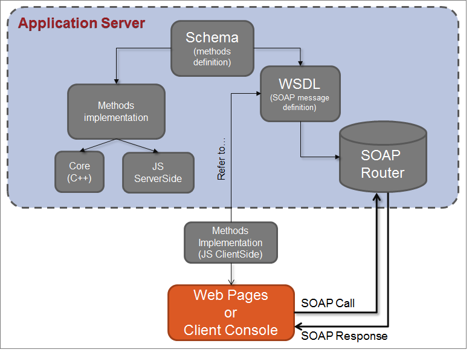

# Acerca de los servicios web{#about-web-services}

## Definición de las API de Adobe Campaign {#definition-of-adobe-campaign-apis}

El servidor de aplicaciones de Adobe Campaign se ha diseñado para que sea abierto y fácil de integrar con sistemas de información de la empresa cada vez más diversos y complejos.

Las API de Adobe Campaign se utilizan en JavaScript dentro de la aplicación y en SOAP fuera de ella. Constituyen una biblioteca de funciones genéricas que se pueden enriquecer. Para obtener más información, consulte [Implementación de métodos SOAP](../../configuration/using/implementing-soap-methods.md).

>[!IMPORTANT]
>
>La cantidad de llamadas al motor autorizadas por día varía según el contrato de licencia. Para obtener más información, consulte [esta página](https://helpx.adobe.com/es/legal/product-descriptions/adobe-campaign-classic---product-description.html).\
>Una lista de todas las API, con su descripción completa, está disponible en [esta documentación dedicada](https://experienceleague.adobe.com/developer/campaign-api/api/index.html.

## Requisitos previos {#prerequisites}

Antes de usar las API de Adobe Campaign, debe estar familiarizado con los siguientes temas:

* Javascript
* protocolo SOAP
* Modelo de datos Adobe Campaign

## Uso de API de Adobe Campaign {#using-adobe-campaign-apis}

Adobe Campaign utiliza dos tipos de API:

* API genéricas de acceso a datos para consultar los datos del modelo de datos. Consulte [API orientadas a datos](../../configuration/using/data-oriented-apis.md).
* API específicas para empresas que le permiten actuar sobre cada objeto: envíos, flujos de trabajo, suscripciones, etc. Consulte [API orientadas al negocio](../../configuration/using/business-oriented-apis.md).

Para desarrollar API e interactuar con Adobe Campaign, debe estar familiarizado con el modelo de datos. Adobe Campaign permite generar una descripción completa de la base. Consulte [Descripción del modelo](../../configuration/using/data-oriented-apis.md#description-of-the-model).

## Llamadas SOAP {#soap-calls}

El protocolo SOAP permite invocar métodos API, a través del cliente enriquecido, aplicaciones de terceros que utilizan servicios web o JSP que utilizan estos métodos de forma nativa.


La estructura de un mensaje SOAP es la siguiente:

* un sobre que define la estructura del mensaje,
* un encabezado opcional,
* un cuerpo que contiene la información sobre la llamada y la respuesta,
* administración de errores que define la condición de error.

## Recursos e intercambios {#resources-and-exchanges}

El esquema siguiente muestra los distintos recursos implicados en el uso de las API de Adobe Campaign:



## Ejemplo de un mensaje SOAP en el método &quot;ExecuteQuery&quot; {#example-of-a-soap-message-on-the--executequery--method--}

En este ejemplo, una consulta SOAP invoca el método &quot;ExecuteQuery&quot;, que toma una cadena de caracteres como parámetro para la autenticación (token de sesión) y un contenido XML para la descripción de la consulta que se va a ejecutar.

Para obtener más información, consulte [ExecuteQuery (xtk:queryDef)](../../configuration/using/data-oriented-apis.md#executequery--xtk-querydef-).

>[!NOTE]
>
>La descripción WSDL de este servicio se completa en el ejemplo siguiente: [Descripción del servicio web: WSDL](../../configuration/using/web-service-calls.md#web-service-description--wsdl).

### consulta SOAP {#soap-query}

```
<?xml version='1.0' encoding='ISO-8859-1'?>
  <SOAP-ENV:Envelope xmlns:xsd='http://www.w3.org/2001/XMLSchema' xmlns:xsi='http://www.w3.org/2001/XMLSchema-instance' xmlns:ns='http://xml.apache.org/xml-soap' xmlns:SOAP-ENV='http://schemas.xmlsoap.org/soap/envelope/'>
    <SOAP-ENV:Body>
      <ExecuteQuery xmlns='urn:xtk:queryDef' SOAP-ENV:encodingStyle='http://schemas.xmlsoap.org/soap/encoding/'>
        <__sessiontoken xsi:type='xsd:string'/>
        <entity xsi:type='ns:Element' SOAP-ENV:encodingStyle='http://xml.apache.org/xml-soap/literalxml'>
          <queryDef firstRows="true" lineCount="200" operation="select" schema="nms:rcpGrpRel" startLine="0" startPath="/" xtkschema="xtk:queryDef">
          ...
          </queryDef>
        </entity>
      </ExecuteQuery>
  </SOAP-ENV:Body>
</SOAP-ENV:Envelope>
```

El `<soap-env:envelope>` es el primer elemento del mensaje que representa la envolvente SOAP.

El `<soap-env:body>` es el primer elemento secundario del sobre. Contiene la descripción del mensaje, es decir, el contenido de la consulta o la respuesta.

El método que se va a invocar se introduce en `<executequery>` del cuerpo del mensaje SOAP.

En SOAP, los parámetros se reconocen por orden de apariencia. El primer parámetro, `<__sessiontoken>`, toma la cadena de autenticación, el segundo parámetro es la descripción XML de la consulta desde el `<querydef>` Elemento.

### Respuesta SOAP {#soap-response}

```
<?xml version='1.0' encoding='ISO-8859-1'?>
  <SOAP-ENV:Envelope xmlns:xsd='http://www.w3.org/2001/XMLSchema' xmlns:xsi='http://www.w3.org/2001/XMLSchema-instance' xmlns:ns='http://xml.apache.org/xml-soap' xmlns:SOAP-ENV='http://schemas.xmlsoap.org/soap/envelope/'>
    <SOAP-ENV:Body>
      <ExecuteQueryResponse xmlns='urn:xtk:queryDef' SOAP-ENV:encodingStyle='http://schemas.xmlsoap.org/soap/encoding/'>
        <pdomOutput xsi:type='ns:Element' SOAP-ENV:encodingStyle='http://xml.apache.org/xml-soap/literalxml'>
          <rcpGrpRel-collection><rcpGrpRel group-id="1872" recipient-id="1362"></rcpGrpRel></rcpGrpRel-collection>
        </pdomOutput>
      </ExecuteQueryResponse>
    </SOAP-ENV:Body>
</SOAP-ENV:Envelope>
```

El resultado de la consulta se introduce desde el `<pdomoutput>` Elemento.

## Administración de errores {#error-management}

Ejemplo de respuesta de error SOAP:

```
<?xml version='1.0' encoding='ISO-8859-1'?>
<SOAP-ENV:Envelope xmlns:SOAP-ENV='http://schemas.xmlsoap.org/soap/envelope/'>
  <SOAP-ENV:Body>
    <SOAP-ENV:Fault>
      <faultcode>SOAP-ENV:Server</faultcode>
      <faultstring>Error while executing 'Write' of the 'xtk:persist'.</faultstring> service
      <detail>ODBC error: [Microsoft][ODBC SQL Server Driver][SQL Server]Cannot insert duplicate key row in object 'XtkOption' with unique index 'XtkOption_name'. SQLSTate: 23000
ODBC error: [Microsoft][ODBC SQL Server Driver][SQL Server]The statement has been terminated. SQLSTate: 01000 Cannot save the 'Options (xtk:option)' document </detail>
    </SOAP-ENV:Fault>
  </SOAP-ENV:Body>
</SOAP-ENV:Envelope>
```

El `<soap-env:fault>` del cuerpo del mensaje SOAP se utiliza para transmitir las señales de error que surgen durante el procesamiento del servicio web. Se compone de los siguientes subelementos:

* `<faultcode>` : indica el tipo de error. Los tipos de error son:

   * &quot;VersionMismatch&quot; en caso de incompatibilidad con la versión de SOAP utilizada,
   * &quot;MustUnderstand&quot; en caso de problemas en el encabezado del mensaje,
   * &quot;Cliente&quot; en el caso de que al cliente le falte información,
   * &quot;Server&quot; en el caso de que el servidor tenga un problema al ejecutar el procesamiento.

* `<faultstring>` : mensaje que describe el error
* `<detail>` : mensaje de error largo

El éxito o el error de la invocación del servicio se identifican cuando la variable `<faultcode>` el elemento está verificado.

>[!IMPORTANT]
>
>Todos los servicios web de Adobe Campaign administran errores. Por lo tanto, se recomienda probar cada llamada para controlar los errores devueltos.

Ejemplo de control de errores en C#:

```
try 
{
  // Invocation of method
  ...
}
catch (SoapException e)
{
  System.Console.WriteLine("Soap exception: " + e.Message);        
  if (e.Detail != null)
    System.Console.WriteLine(e.Detail.InnerText);
}
```

## URL del servidor del servicio web (o EndPoint) {#url-of-web-service-server--or-endpoint-}

Para enviar el servicio web, se debe contactar con el servidor de Adobe Campaign que implementa el método de servicio correspondiente.

La URL del servidor es la siguiente:

https://serverName/nl/jsp/soaprouter.jsp

Con **`<server>`** el servidor de aplicaciones de Adobe Campaign (**nlserver web**).
