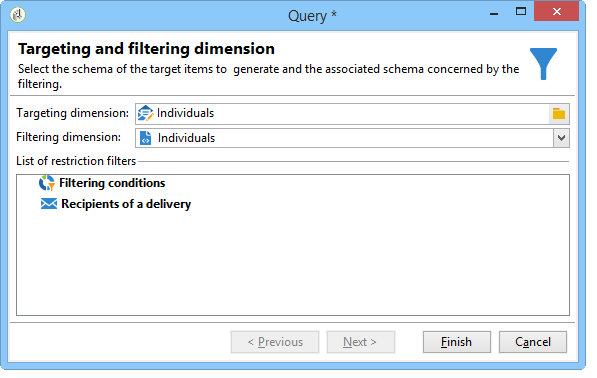
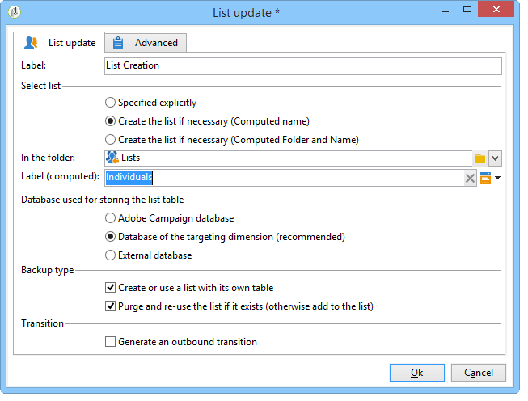

# Creación de una lista de perfiles a partir de un flujo de trabajo{#creating-a-profile-list-with-a-workflow}

Para crear una lista de tipo **[!UICONTROL List]** basada en la nueva tabla de destinatarios, debe crear un flujo de trabajo de objetivos que genere la lista.

Para obtener más información sobre las listas en Campaign, consulte [esta sección](../../platform/using/creating-and-managing-lists.md#about-lists-in-adobe-campaign).

 [Descubra esta funcionalidad en vídeo](../../platform/using/creating-and-managing-lists.md#create-list-in-a-wf-video)

Para crear un flujo de trabajo de objetivos y actualizar los destinatarios en una tabla de destinatarios personalizada, siga los pasos a continuación:

1. Vaya al nodo **[!UICONTROL Profiles and Targets > Jobs > Targeting workflows]** del explorador.
1. Cree un nuevo flujo de trabajo de objetivos.
1. Realice una actividad **Query** seguida de una actividad **List update**.

   

1. Haga doble clic en la actividad **Consulta** y, a continuación, haga clic en **[!UICONTROL Edit the query]** para elegir una dimensión de segmentación basada en el esquema de la nueva tabla de destinatarios (en nuestro ejemplo: **Individual**). Haga clic en **[!UICONTROL Finish]** para confirmar.

   

1. Haga doble clic en la actividad **List update** y, a continuación, seleccione el botón de opción **[!UICONTROL Create the list if necessary (Computed name)]**.

   

1. Seleccione la carpeta de creación de la nueva lista.
1. Ejecute el flujo de trabajo para crear la lista.
1. Vea el resultado en el nodo del árbol que seleccionó durante la actividad **[!UICONTROL List update]**.

   El panel especifica el esquema en el que se basa la lista, como se muestra a continuación:

   
