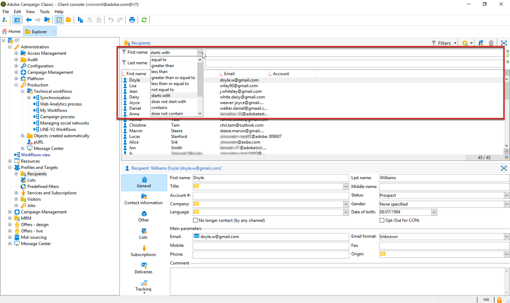

# Prácticas recomendadas del modelo de datos{#data-model-best-practices}

Este documento describe las recomendaciones clave al diseñar el modelo de datos de Adobe Campaign.

Para comprender mejor las tablas integradas de Campaign y su interacción, consulte la sección [esta sección](../../configuration/using/about-data-model.md).

Lea [esta documentación](../../configuration/using/about-schema-reference.md) para empezar a utilizar los esquemas de Campaign. Obtenga información sobre cómo configurar esquemas de extensión para ampliar el modelo de datos conceptuales de la base de datos de Adobe Campaign en [este documento](../../configuration/using/about-schema-edition.md).

## Información general {#overview}

El sistema Adobe Campaign es extremadamente flexible y se puede ampliar más allá de la implementación inicial. Sin embargo, aunque las posibilidades son infinitas, es fundamental tomar decisiones sabias y construir bases sólidas para empezar a diseñar su modelo de datos.

Este documento proporciona casos de uso comunes y prácticas recomendadas para aprender a diseñar correctamente la herramienta Adobe Campaign.

## Arquitectura del modelo de datos {#data-model-architecture}

Adobe Campaign es un potente sistema de administración de campañas en canales múltiples que puede ayudarle a alinear sus estrategias en línea y sin conexión para crear experiencias personalizadas con los clientes.

### Enfoque centrado en el cliente {#customer-centric-approach}

Aunque la mayoría de los proveedores de servicios de correo electrónico se comunican a los clientes mediante un enfoque centrado en la lista, Adobe Campaign depende de una base de datos relacional para aprovechar una vista más amplia de los clientes y sus atributos.

Este enfoque centrado en el cliente se muestra en el gráfico siguiente. La tabla **Recipient** en gris representa la tabla de cliente principal en torno a la cual se está creando todo:

Para acceder a la descripción de cada tabla, vaya a **[!UICONTROL Admin > Configuration > Data schemas]**, seleccione un recurso de la lista y haga clic en la pestaña **[!UICONTROL Documentation]**.

El modelo de datos predeterminado de Adobe Campaign se presenta en [este documento](../../configuration/using/data-model-description.md).

>[!NOTE]
>
>Adobe Campaign Classic permite crear una tabla de cliente personalizada. Sin embargo, en la mayoría de los casos, se recomienda aprovechar la [tabla de destinatarios](../../configuration/using/about-data-model.md#default-recipient-table) estándar que ya tiene tablas y características adicionales prediseñadas.

### Datos para Adobe Campaign {#data-for-campaign}

¿Qué datos se deben enviar a Adobe Campaign? Es fundamental determinar los datos necesarios para sus actividades de marketing.

>[!NOTE]
>
>Adobe Campaign no es ni un almacén de datos ni una herramienta de creación de informes. Por lo tanto, no intente importar todos los clientes posibles y su información asociada en Adobe Campaign ni importe los datos que solo se utilizarán para generar informes.

Para tomar la decisión de si un atributo sería necesario o no en Adobe Campaign, pregúntese si correspondería a una de estas categorías:

* Atributo utilizado para la **segmentación**
* Atributo utilizado para **procesos de administración de datos** (cálculo agregado, por ejemplo)
* Atributo utilizado para **personalización**

Si no se incluye en ninguno de estos parámetros, lo más probable es que no necesite este atributo en Adobe Campaign.

### Opción de tipos de datos {#data-types}

Para garantizar una buena arquitectura y un buen rendimiento de su sistema, siga las prácticas recomendadas a continuación para configurar los datos en Adobe Campaign.

* Una tabla grande debería tener principalmente campos numéricos y contener vínculos a tablas de referencia (cuando se trabaja con la lista de valores).
* El atributo **expr** permite definir un atributo de esquema como campo calculado en lugar de como valor de conjunto físico en una tabla. Esto puede permitir el acceso a la información en un formato diferente (por ejemplo, en cuanto a la edad y la fecha de nacimiento) sin necesidad de almacenar ambos valores. Esta es una buena forma de evitar la duplicación de campos. Por ejemplo, la tabla de destinatarios utiliza una expresión para el dominio , que ya está presente en el campo de correo electrónico.
* Sin embargo, cuando el cálculo de la expresión es complejo, no se recomienda utilizar el atributo **expr** ya que el cálculo sobre la marcha puede afectar al rendimiento de las consultas.
* El tipo **XML** es una buena forma de evitar la creación de demasiados campos. Pero también ocupa espacio en disco, ya que utiliza una columna CLOB en la base de datos. También puede generar consultas SQL complejas y afectar al rendimiento.
* La longitud de un campo **string** siempre debe definirse con la columna . De forma predeterminada, la longitud máxima en Adobe Campaign es 255, pero Adobe recomienda mantener el campo más corto si ya sabe que el tamaño no excederá una longitud más corta.
* Es aceptable tener un campo más corto en Adobe Campaign que en el sistema de origen si está seguro de que el tamaño del sistema de origen se sobreestimó y no se alcanzaría. Esto podría significar una cadena más corta o un número entero menor en Adobe Campaign.

### Elección de campos {#choice-of-fields}

Un campo debe almacenarse en una tabla si tiene un propósito de objetivo o personalización. En otras palabras, si un campo no se utiliza para enviar un correo electrónico personalizado o se utiliza como criterio en una consulta, ocupa espacio en disco, mientras que es inútil.

Para instancias híbridas y locales, FDA (Acceso de Datos Federados, una función opcional que permite acceder a datos externos) cubre la necesidad de agregar un campo &quot;sobre la marcha&quot; durante un proceso de campaña. No es necesario importar todo si tiene FDA. Para obtener más información, consulte [Acerca del acceso de datos federado](../../installation/using/about-fda.md).

### Elección de claves {#choice-of-keys}

Además del **autopk** definido de forma predeterminada en la mayoría de las tablas, debe considerar la posibilidad de agregar algunas claves lógicas o empresariales (número de cuenta, número de cliente, etc.). Se puede utilizar más adelante para importar/reconciliación o paquetes de datos. Para obtener más información, consulte [Identifiers](#identifiers).

Las claves eficientes son esenciales para el rendimiento. Siempre debe preferirse los tipos de datos numéricos como claves para las tablas.

Para la base de datos SQLServer, puede considerar la posibilidad de utilizar &quot;índice agrupado&quot; si se necesita rendimiento. Como Adobe no gestiona esto, debe crearlo en SQL.

### Espacios de tablas dedicados {#dedicated-tablespaces}

El atributo tablespace del esquema permite especificar un tablespace dedicado para una tabla.

El asistente de instalación le permite almacenar objetos por tipo (datos, temporales e índice).

Los tablespaces dedicados son mejores para la partición, las reglas de seguridad y permiten una administración flexible y fluida, una mejor optimización y un mejor rendimiento.

## Identificadores {#identifiers}

Los recursos de Adobe Campaign tienen tres identificadores y es posible añadir un identificador adicional.

En la tabla siguiente se describen estos identificadores y su finalidad.

| Identifier | Descripción | Prácticas recomendadas |
|--- |--- |--- |
| Id | <ul><li>El id es la clave principal física de una tabla de Adobe Campaign. Para tablas predeterminadas, es un número generado de 32 bits a partir de una secuencia</li><li>Este identificador suele ser único para una instancia de Adobe Campaign específica. </li><li>Un id generado automáticamente puede ser visible en una definición de esquema. Busque el atributo *autopk=&quot;true&quot;*.</li></ul> | <ul><li>Los identificadores generados automáticamente no deben utilizarse como referencia en un flujo de trabajo o en una definición de paquete.</li><li>No se debe suponer que el id siempre será un número creciente.</li><li>El id de una tabla predeterminada es un número de 32 bits y este tipo no debe cambiarse. Este número se toma de una &quot;secuencia&quot; cubierta en la sección con el mismo nombre.</li></ul> |
| Nombre (o nombre interno) | <ul><li>Esta información es un identificador único de un registro de una tabla. Este valor se puede actualizar manualmente, normalmente con un nombre generado.</li><li>Este identificador mantiene su valor cuando se implementa en una instancia diferente de Adobe Campaign y no debe estar vacío.</li></ul> | <ul><li>Cambie el nombre del registro generado por Adobe Campaign si el objeto está diseñado para implementarse de un entorno a otro.</li><li>Cuando un objeto tiene un atributo de espacio de nombres (*schema*, por ejemplo), este área de nombres común se utilizará en todos los objetos personalizados creados. Algunas áreas de nombres reservadas no deben usarse: *nms*, *xtk*.</li><li>Cuando un objeto no tiene área de nombres (*workflow* o *delivery*, por ejemplo), esta noción de área de nombres se agregaría como prefijo de un objeto de nombre interno: *namespaceMyObjectName*.</li><li>No utilice caracteres especiales como espacio &quot;&quot;, semicolumna &quot;:&quot; o guión &quot;-&quot;. Todos estos caracteres se sustituirían por un guión bajo &quot;_&quot; (carácter permitido). Por ejemplo, &quot;abc-def&quot; y &quot;abc:def&quot; se almacenarían como &quot;abc_def&quot; y se sobrescribirían entre sí.</li></ul> |
| Etiqueta | <ul><li>La etiqueta es el identificador comercial de un objeto o registro en Adobe Campaign.</li><li>Este objeto permite espacios y caracteres especiales.</li><li>No garantiza la exclusividad de un registro.</li></ul> | <ul><li>Se recomienda determinar una estructura para las etiquetas de objeto.</li><li>Esta es la solución más fácil de usar para identificar un registro u objeto para un usuario de Adobe Campaign.</li></ul> |

## Claves internas personalizadas {#custom-internal-keys}

Se requieren claves principales para cada tabla creada en Adobe Campaign.

La mayoría de las organizaciones están importando registros de sistemas externos. Aunque la clave física de la tabla de destinatarios es el atributo &quot;id&quot;, también es posible determinar una clave personalizada.

Esta clave personalizada es la clave principal del registro real en el sistema externo que alimenta a Adobe Campaign.

Cuando una tabla predeterminada tiene una autopk y una clave interna, la clave interna se definirá como un índice único en la tabla de la base de datos física.

Al crear una tabla personalizada, tiene dos opciones:
* Una combinación de clave generada automáticamente (id) y clave interna (custom). Esta opción es interesante si la clave del sistema es una clave compuesta o no un número entero. Los integradores proporcionarán un mayor rendimiento en las mesas grandes y se unirán a otras tablas.
* Uso de la clave principal como clave principal del sistema externo. Esta solución suele ser preferible, ya que simplifica el enfoque para importar y exportar datos, con una clave coherente entre los distintos sistemas. La función Autopk debe deshabilitarse si la clave se denomina &quot;id&quot; y se espera que se rellene con valores externos (no generados automáticamente).

>[!IMPORTANT]
>
>Una autopk no debe utilizarse como referencia en flujos de trabajo.

## Secuencias {#sequences}

La clave principal de Adobe Campaign es un ID generado automáticamente para todas las tablas integradas y puede ser la misma para las tablas personalizadas. Para obtener más información, consulte [esta sección](#identifiers).

Este valor se toma de lo que se denomina secuencia ****, que es un objeto de base de datos utilizado para generar una secuencia numérica.

Existen dos tipos de secuencias:
* **Compartido**: más de una tabla seleccionaría su id de la misma secuencia. Significa que si una tabla utiliza una id &#39;X&#39;, ninguna otra tabla que comparta la misma secuencia tendría un registro con esa id &#39;X&#39;. **** XtkNewID es la secuencia compartida predeterminada disponible en Adobe Campaign.
* **Dedicado**: solo una tabla está seleccionando sus id de la secuencia. El nombre de la secuencia generalmente contendría el nombre de la tabla.

>[!IMPORTANT]
>
>La secuencia es un valor entero de 32 bits, con un número máximo finito de valores disponibles: 2 140 millones. Después de alcanzar el valor máximo, la secuencia vuelve a 0 para reciclar los id.
>
>Si no se han purgado los datos antiguos, el resultado será una infracción de clave única, que se convierte en un bloqueador del estado y el uso de la plataforma. Adobe Campaign no podría enviar comunicaciones (cuando afecta a la tabla del registro de entregas) y el rendimiento se vería muy afectado.

Por lo tanto, un cliente que envía 6.000 millones de correos electrónicos anualmente con un período de retención de 180 días para sus registros se quedaría sin id en 4 meses. Para evitar este desafío, asegúrese de tener la configuración de depuración según sus volúmenes. Para obtener más información, consulte [esta sección](#data-retention).

Cuando se crea una tabla personalizada en Adobe Campaign con una clave principal como autoPK, se debe asociar sistemáticamente una secuencia dedicada personalizada con esa tabla.

De forma predeterminada, una secuencia personalizada tendrá valores que oscilarán entre +1000 y +2,1BB. Técnicamente, es posible obtener una gama completa de 4BB habilitando identificadores negativos. Debe usarse con cuidado y se perderá un id al pasar de números negativos a positivos: Adobe Campaign suele ignorar el registro 0 en las consultas SQL generadas.

**Temas relacionados:**
* Para obtener más información sobre la función **Sequence auto-generation**, consulte [este documento](https://helpx.adobe.com/es/campaign/kb/sequence_auto_generation.html).
* Para obtener más información sobre el agotamiento de las secuencias, vea [este vídeo](https://helpx.adobe.com/customer-care-office-hours/campaign/sequences-exhaustion-campaign-classic.html).

## Índices {#indexes}

Los índices son esenciales para el rendimiento. Cuando se declara una clave en el esquema, Adobe crea automáticamente un índice en los campos de la clave. También puede declarar más índices para las consultas que no utilicen la clave.

Adobe recomienda definir índices adicionales, ya que puede mejorar el rendimiento.

Sin embargo, tenga en cuenta lo siguiente:

* El uso del índice está enlazado a su patrón de acceso. La optimización de la indexación suele ser una parte clave en el diseño de la base de datos y debe ser gestionada por expertos. La adición de índices suele ser un flujo de trabajo iterativo adjunto al mantenimiento de la base de datos. Se hace con el tiempo, paso a paso, para abordar los problemas de rendimiento cuando se producen.
* Los índices aumentan el tamaño general de la tabla (para almacenar el índice en sí).
* Añadir índice en columnas puede mejorar el rendimiento del acceso de lectura de datos (SELECT), pero puede reducir el rendimiento del acceso de escritura de datos (UPDATE).
* Debido a que esto afecta al rendimiento durante la inserción de datos, los índices deben tener un tamaño y un número limitados.
* No añada índices cuando no sea necesario. Asegúrese de que sea necesario y que aumente el rendimiento general de las consultas (prueba y aprendizaje).
* En términos generales, un índice es eficiente si sabe que sus consultas no devolverán más del 10% de los registros.
* Seleccione cuidadosamente los índices que deben definirse.
* No elimine los índices nativos de las tablas predeterminadas.

<!--When you are performing an initial import with very high volumes of data insert in Adobe Campaign database, it is recommended to run that import without custom indexes at first. It will allow to accelerate the insertion process. Once you’ve completed this important import, it is possible to enable the index(es).-->

### Ejemplo

La administración de índices puede resultar muy compleja, por lo que es importante comprender cómo funcionan. Para ilustrar esta complejidad, tomemos un ejemplo básico, como buscar destinatarios filtrando el nombre y los apellidos. Para ello:
1. Vaya a la carpeta que enumera todos los destinatarios de la base de datos. Para obtener más información, consulte [Administración de perfiles](../../platform/using/managing-profiles.md).
1. Haga clic con el botón derecho en el campo **[!UICONTROL First name]**.
1. Seleccione **[!UICONTROL Filter on this field]**.

   

1. Repita esta operación para el campo **[!UICONTROL Last name]**.

Los dos filtros correspondientes se añaden en la parte superior de la pantalla.

Ahora puede realizar el filtrado de búsqueda en los campos **[!UICONTROL First name]** y **[!UICONTROL Last name]** según las distintas condiciones de filtro.

Ahora, para acelerar la búsqueda en estos filtros, puede agregar índices. Pero, ¿qué índices se deben utilizar?

>[!NOTE]
>
>Este ejemplo se aplica a los clientes alojados que utilizan una base de datos PostgreSQL.

La siguiente tabla muestra en qué casos se utilizan o no los tres índices descritos a continuación según el patrón de acceso mostrado en la primera columna.

| Criterios de búsqueda | Índice 1 (Nombre + Apellido) | Índice 2 (solo nombre) | Índice 3 (solo apellidos) | Comentarios |
|--- |--- |--- |--- |--- |
| El nombre es igual a &quot;Johnny&quot; | Utilizado | Utilizado | No se usa | Como el nombre está en primera posición en el índice 1, se utilizará de todos modos: no es necesario añadir un criterio en el apellido. |
| El nombre es igual a &quot;Johnny&quot; Y el apellido es igual a &quot;Smith&quot; | Utilizado | No se usa | No se usa | Como ambos atributos se buscan en la misma consulta, solo se utilizará el índice que combina ambos atributos. |
| Apellido igual a &quot;Smith&quot; | No se usa | No se usa | Utilizado | Se tiene en cuenta el orden de los atributos en el índice. Si no coincide con este orden, es posible que no se use el índice. |
| El nombre empieza por &quot;Joh&quot; | Utilizado | Utilizado | No se usa | La opción &quot;Búsqueda a la izquierda&quot; habilitará índices. |
| El nombre termina con &quot;nny&quot; | No se usa | No se usa | No se usa | La &quot;búsqueda correcta&quot; deshabilitará los índices y se realizará un análisis completo. Algunos tipos de índice específicos podrían gestionar este caso de uso, pero no están disponibles de forma predeterminada en Adobe Campaign. |
| El nombre contiene &quot;John&quot; | No se usa | No se usa | No se usa | Es una combinación de búsquedas &quot;izquierda&quot; y &quot;derecha&quot;. Debido a esto último, deshabilitará los índices y se realizará un análisis completo. |
| El nombre es igual a &quot;john&quot; | No se usa | No se usa | No se usa | Los índices distinguen entre mayúsculas y minúsculas. Para que no distinga entre mayúsculas y minúsculas, debe crear un índice específico que incluya una función SQL como &quot;upper(firstname)&quot;. Debe hacer lo mismo con otras transformaciones de datos como &quot;unacento (nombre de pila)&quot;. |

## Enlaces y cardinalidad {#links-and-cardinality}

### Vínculos {#links}

Tenga cuidado con la integridad &quot;propia&quot; de las tablas grandes. La eliminación de registros que tienen tablas anchas con integridad &quot;propia&quot; puede detener la instancia. La tabla está bloqueada y las eliminaciones se realizan una por una. Así que es mejor usar integridad &quot;neutral&quot; en tablas secundarias que tienen grandes volúmenes.

Declarar un vínculo como una unión externa no es bueno para el rendimiento. El registro de id cero emula la funcionalidad de unión externa. No es necesario declarar uniones externas si el vínculo utiliza la autopk.

Aunque es posible unir cualquier tabla en un flujo de trabajo, Adobe recomienda definir vínculos comunes entre los recursos directamente en la definición de la estructura de datos.

El vínculo se debe definir en alineación con los datos reales de las tablas. Una definición incorrecta podría afectar a los datos recuperados mediante vínculos, por ejemplo, duplicando registros de forma inesperada.

Asigne un nombre al vínculo de forma coherente con el nombre de la tabla: el nombre del vínculo debería ayudar a comprender cuál es la tabla distante.

No asigne a un vínculo el nombre &quot;id&quot; como sufijo. Por ejemplo, asígnele el nombre &quot;transaction&quot; en lugar de &quot;transactionId&quot;.

De forma predeterminada, Adobe Campaign crea un vínculo utilizando la clave principal de la tabla externa. Para una mayor claridad, es preferible definir explícitamente la unión en la definición del vínculo.

Se agregará un índice a los atributos utilizados en un vínculo.

La variable   los vínculos creados por y modificados por última vez están presentes en muchas tablas. Es posible deshabilitar el índice utilizando el atributo noDbIndex en el vínculo, si la empresa no está utilizando esta información.

### Cardinalidad {#cardinality}

Al diseñar un vínculo, asegúrese de que el registro de destino sea único cuando se haya declarado una relación 1-1. De lo contrario, la unión puede devolver varios registros cuando solo se espera uno. Esto da como resultado errores durante la preparación del envío cuando &quot;la consulta devuelve más filas de las esperadas&quot;. Establezca el nombre del vínculo en el mismo nombre que el esquema de destino.

Defina un vínculo con una cardinalidad (1-N) en el esquema del lado (1). Por ejemplo, la relación Recipient (1) - (N) Transaction debe definirse en el esquema de transacción.

Tenga en cuenta que la cardinalidad inversa de un vínculo es (N) de forma predeterminada. Es posible definir un vínculo (1-1) añadiendo el atributo revCardinality=&#39;single&#39; a la definición del vínculo.

Si el vínculo inverso no debe ser visible para el usuario, puede ocultarlo con la definición del vínculo revLink=&#39;_NONE_&#39;. Un buen caso de uso para esto es definir un vínculo del destinatario a la última transacción completada, por ejemplo. Solo es necesario ver el vínculo del destinatario a la última transacción y no es necesario que el vínculo inverso esté visible desde la tabla de transacciones.

Los vínculos que realizan una unión externa (1-0.0.1) deben utilizarse con cuidado, ya que afectarán al rendimiento del sistema.

## Retención de datos: limpieza y depuración {#data-retention}

Adobe Campaign no es ni un almacén de datos ni una herramienta de creación de informes. Por lo tanto, para garantizar un buen rendimiento de la solución Adobe Campaign, el crecimiento de las bases de datos debe mantenerse bajo control. Para lograrlo, puede ser útil seguir algunas de las prácticas recomendadas a continuación.

De forma predeterminada, los registros de envío y seguimiento de Adobe Campaign tienen una duración de retención de 180 días. Se ejecuta un proceso de limpieza para eliminar cualquier registro anterior al anterior.

* Si desea mantener los registros más tiempo, esta decisión debe tomarse cuidadosamente en función del tamaño de la base de datos y el volumen de mensajes enviados. Como recordatorio, la secuencia de Adobe Campaign es un entero de 32 bits.
* Se recomienda no tener más de mil millones de registros a la vez en estas tablas (alrededor del 50% de los 2.140 millones de id disponibles) para limitar los riesgos de consumir todos los id disponibles. Esto requerirá que algunos clientes reduzcan la duración de la retención por debajo de 180 días.

Obtenga más información sobre la retención de datos en [Campaign Privacy and Security Guidelines](https://helpx.adobe.com/es/campaign/kb/campaign-privacy-overview.html#consent).

Obtenga más información sobre el flujo de trabajo de limpieza de la base de datos de Campaign [en esta sección](../../production/using/database-cleanup-workflow.md).

>[!IMPORTANT]
>
>Las tablas personalizadas no se depuran con el proceso de limpieza estándar. Aunque esto puede no ser necesario en el primer día, no olvide crear un proceso de depuración para las tablas personalizadas, ya que esto podría provocar problemas de rendimiento.

Existen varias soluciones para minimizar la necesidad de registros en Adobe Campaign:
* Exporte los datos en un almacén de datos fuera de Adobe Campaign.
* Genere valores agregados que utilicen menos espacio mientras sean suficientes para sus prácticas de marketing. Por ejemplo, no necesita el historial completo de transacciones con el cliente en Adobe Campaign para realizar un seguimiento de las últimas compras.

Puede declarar el atributo &quot;deleteStatus&quot; en un esquema. Es más eficaz marcar el registro como eliminado y posponer la eliminación en la tarea de limpieza.

## Rendimiento {#performance}

Para garantizar un mejor rendimiento en cualquier momento, siga las prácticas recomendadas a continuación.

### Recomendaciones generales {#general-recommendations}

* Evite utilizar operaciones como &quot;CONTIENE&quot; en consultas. Si sabe para qué se espera y desea que se filtre, aplique la misma condición con un &quot;EQUAL TO&quot; u otros operadores de filtro específicos.
* Evite unirse a campos no indexados al crear datos en flujos de trabajo.
* Intente asegurarse de que los procesos como la importación y exportación se producen fuera del horario laboral.
* Asegúrese de que haya una programación para todas las actividades diarias y cumpla con la programación.
* Si uno o varios de los procesos diarios fallan y si es obligatorio ejecutarlo ese mismo día, asegúrese de que no haya procesos conflictivos en ejecución cuando se inicie el proceso manual, ya que esto podría afectar al rendimiento del sistema.
* Asegúrese de que ninguna de las campañas diarias se ejecuta durante el proceso de importación o cuando se ejecuta cualquier proceso manual.
* Utilice una o varias tablas de referencia en lugar de duplicar un campo en cada fila. Al utilizar pares clave/valor, se prefiere elegir una clave numérica.
* Una cadena corta sigue siendo aceptable. En caso de que las tablas de referencias ya estén implementadas en un sistema externo, reutilizar la misma facilitará la integración de datos con Adobe Campaign.

### Relaciones de uno a varios {#one-to-many-relationships}

* El diseño de datos afecta a la capacidad de uso y la funcionalidad. Si diseña su modelo de datos con muchas relaciones de uno a varios, a los usuarios les resultará más difícil construir una lógica significativa en la aplicación. La lógica de filtro &quot;uno a varios&quot; puede resultar difícil para los especialistas en marketing que no son técnicos construir y comprender correctamente.
* Es bueno tener todos los campos esenciales en una tabla porque facilita a los usuarios la creación de consultas. A veces también es bueno para el rendimiento duplicar algunos campos entre tablas si puede evitar una unión.
* Algunas funcionalidades integradas no podrán hacer referencia a relaciones &quot;uno a varios&quot;, por ejemplo, la fórmula de Ponderación de ofertas y los Envíos.

## Tablas grandes {#large-tables}

Adobe Campaign se basa en motores de base de datos de terceros. Según el proveedor, la optimización del rendimiento para tablas más grandes puede requerir un diseño específico.

A continuación se describen algunas prácticas recomendadas comunes que deben seguirse al diseñar el modelo de datos con tablas grandes y uniones complejas.

* Cuando utilice tablas de destinatarios personalizadas adicionales, asegúrese de que tiene una tabla de registro dedicada para cada asignación de envío.
* Reduzca el número de columnas, especialmente identificando aquellas que no se utilizan.
* Optimice las relaciones del modelo de datos evitando las uniones complejas, como las uniones en varias condiciones o varias columnas.
* Para las claves de unión, utilice siempre datos numéricos en lugar de cadenas de caracteres.
* Reduzca al máximo la profundidad de la retención de registros. Si necesita un historial más profundo, puede acumular cálculos y/o administrar tablas de registro personalizadas para almacenar un historial más grande.

### Tamaño de las tablas {#size-of-tables}

El tamaño de la tabla es una combinación del número de registros y el número de columnas por registro. Ambos pueden afectar al rendimiento de las consultas.

* Una tabla **de tamaño pequeño** es similar a la tabla Envío.
* Una tabla **de tamaño medio** es el mismo que el tamaño de la tabla de destinatarios. Tiene un registro por cliente.
* Una tabla **de tamaño grande** es similar a la tabla Registro amplio. Tiene muchos registros por cliente.
Por ejemplo, si la base de datos contiene 10 millones de destinatarios, la tabla Registro amplio contiene entre 100 y 200 millones de mensajes y la tabla Entrega contiene unos pocos miles de registros.

En PostgreSQL, una fila no debe superar los 8 KB para evitar el mecanismo [TOAST](https://wiki.postgresql.org/wiki/TOAST). Por lo tanto, intente reducir en la medida de lo posible el número de columnas y el tamaño de cada fila para preservar el rendimiento óptimo del sistema (memoria y CPU).

El número de filas también afecta al rendimiento. La base de datos de Adobe Campaign no está diseñada para almacenar datos históricos que no se utilizan activamente con fines de segmentación o personalización; se trata de una base de datos operativa.

Para evitar cualquier problema de rendimiento relacionado con el alto número de filas, mantenga los registros necesarios en la base de datos. Cualquier otro registro debe exportarse a un almacén de datos de terceros y eliminarse de la base de datos operativa de Adobe Campaign.

Estas son algunas prácticas recomendadas con respecto al tamaño de las tablas:

* Diseñe tablas grandes con menos campos y datos numéricos.
* No utilice un gran número de tipo de columna (por ejemplo: Int64) para almacenar números pequeños como valores booleanos.
* Elimine las columnas no utilizadas de la definición de tabla.
* No mantenga los datos históricos o inactivos en la base de datos de Adobe Campaign (exportación y limpieza).

Este es un ejemplo.

En este ejemplo:
* Las tablas *Transaction* y *Transaction Item* son grandes: más de 10 millones.
* Las tablas *Product* y *Store* son más pequeñas: menos de 10.000.
* La etiqueta y la referencia del producto se han colocado en la tabla *Product*.
* La tabla *Transaction Item* solo tiene un vínculo a la tabla *Product*, que es numérica.

<!--For more detailed best practices on how to optimize the database design for larger volumes, see [Campaign Classic Data model Best practices](https://helpx.adobe.com/campaign/kb/acc-data-model-best-practices.html).-->
