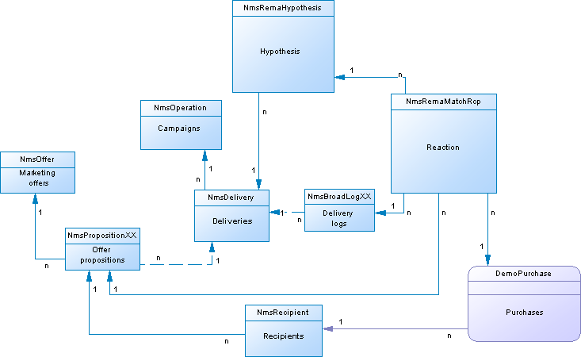

# Descripción del modelo de datos de campaña{#data-model-description}

Adobe Campaign viene con un modelo de datos predefinido. Esta sección proporciona algunos detalles sobre las tablas integradas del modelo de datos de Adobe Campaign y su interacción.

Para acceder a la descripción de cada tabla, vaya a **[!UICONTROL Admin > Configuration > Data schemas]**, seleccione un recurso en la lista y haga clic en la ficha **[!UICONTROL Documentation]**.

>[!NOTE]
>
>La estructura física y lógica de los datos que se llevan en la aplicación se describe en XML. Obedece a una gramática específica de Adobe Campaign, denominada esquema. Para obtener más información sobre esquemas de Adobe Campaign, lea [esta sección](../../configuration/using/about-schema-reference.md).

## Descripción de las tablas principales {#description-main-tables}

Adobe Campaign se basa en una base de datos relacional que contiene tablas vinculadas entre sí.

El siguiente diagrama muestra las uniones entre las tablas comerciales principales del modelo de datos de Adobe Campaign con los campos principales de cada una.

<!---->

El modelo de datos predefinido de Adobe Campaign incluye las tablas principales que se enumeran a continuación.

### NmsRecipient {#NmsRecipient}

Esta tabla coincide con el esquema **nms:destinatario**.

Es la tabla predeterminada utilizada para los **destinatarios de envíos**. Como resultado, contiene la información necesaria para los envíos a través de los diversos canales:

* sEmail: dirección de correo electrónico.
* iEmailFormat: formato preferido para correos electrónicos (1 para Texto, 2 para HTML y 0 si no está definido).
* sAddress1, sAddress2, sAddress3, sAddress4, sZipCode y sCity se utilizan para generar la dirección postal (de acuerdo con el estándar AFNOR XPZ 10-011 de mayo de 1997).
* sPhone, sMobilePhone, sFax contienen los números de teléfono, teléfono móvil y fax respectivamente.
* iBlackList es el indicador de exclusión predeterminado que se utiliza para los perfiles (1 significa &quot;no suscrito&quot;, 0 en caso contrario).

El campo iFolderId es la clave externa que vincula el destinatario a su carpeta de ejecución. Para obtener más información sobre esto, consulte [XtkFolder](#XtkFolder).

El campo sCountryCode es el código ISO 3166-1 Alpha 2 (2 caracteres) del país asociado al destinatario. Este campo es en realidad una clave externa en la tabla de referencia de país (NmsCountry), que contiene las etiquetas de país y otros datos de código de país. Si el país no se rellena, el valor &#39;XX&#39; se almacena (y se utiliza en lugar de un registro de ID cero).

Para obtener más información sobre la tabla de Destinatarios, consulte [esta sección](../../configuration/using/about-data-model.md#default-recipient-table).

### NmsGroup {#NmsGroup}

Esta tabla coincide con el esquema **nms:group**.

Le permite crear **grupos estáticos de destinatarios**. Existe una relación de varios a varios entre destinatarios y grupos. Por ejemplo, un destinatario puede pertenecer a varios grupos y un grupo puede contener varios destinatarios. Los grupos se pueden crear manualmente, a través de una importación o mediante la segmentación por envío. Los grupos suelen utilizarse como destinatarios de envío. Hay un índice único en el campo que representa el nombre interno del grupo sName. El grupo está vinculado a una carpeta (la clave es iFolderId. Para obtener más información sobre esto, consulte [XtkFolder](#XtkFolder)).

### NmsRcpGrpRel {#NmsRcpGrpRel}

La tabla de relación NmsRcpGrpRel sólo contiene los dos campos correspondientes a los identificadores de las tablas vinculadas iRecipientId e iGroupId.

### NmsService {#NmsService}

Esta tabla coincide con el esquema **nms:service**.

En Adobe Campaign, puede crear y administrar suscripciones a servicios informativos (temas). La tabla NmsService almacena la definición de los servicios informativos (temas) a los que oferta a los destinatarios para suscribirse (por ejemplo, una newsletter).

Los servicios son entidades similares a los grupos (agrupaciones de destinatarios estáticas), con la salvedad de que distribuyen más información y facilitan la gestión de suscripciones y cancelaciones de suscripciones mediante formularios.

Hay un índice único en el campo que representa el nombre interno del servicio sName. El servicio está vinculado a una carpeta (la clave es iFolderId. Para obtener más información sobre esto, consulte [XtkFolder](#XtkFolder)). Finalmente, el campo iType especifica el canal de envío de este servicio (0 para correo electrónico, 1 para SMS, 2 para teléfono, 3 para correo directo y 4 para fax).

### NmsSubscription {#NmsSubscription}

Esta tabla coincide con el esquema **nms:suscripción**.

Permite administrar suscripciones de destinatario a servicios informativos.

### NmsSubHisto {#NmsSubHisto}

Esta tabla coincide con el esquema **nms:subHisto**.

Si las suscripciones se administran mediante formularios web o la interfaz de la aplicación, todas las suscripciones y las suscripciones se registran en la tabla NmsSubHisto. El campo iAction especifica la acción (0 para baja y 1 para suscripción) realizada en la fecha almacenada en el campo tsDate.

### NmsDelivery {#NmsDelivery}

Esta tabla coincide con el esquema **nms:envío**.

Cada registro de esta tabla representa una **acción de envío** o una **Plantilla de envíos**. Contiene todos los parámetros necesarios para realizar envíos (el destinatario, el contenido, etc.). Los registros de envío (difusión) (NmsBroadLog) y las direcciones URL de seguimiento asociadas (NmsTrackingUrl) se crean durante la fase de análisis (consulte a continuación para obtener más detalles sobre ambas tablas).

Hay un índice único en el campo que representa el nombre interno del envío o escenario sInternalName. El envío está vinculado a una carpeta de ejecución (la clave externa es iFolderProcessId. Para obtener más información sobre esto, consulte [XtkFolder](#XtkFolder)).

### XtkFolder {#XtkFolder}

Contiene **todas las carpetas del árbol** visibles en la ficha **Navegación** de la consola.

Las carpetas están escritas: el valor del campo sModel especifica el tipo de datos que se pueden incluir en la carpeta. Este campo también permite que la consola de cliente muestre los datos correctamente con los formularios correspondientes. Los valores posibles de este campo se definen en navTree.

El árbol se administra mediante los campos iParentId e iChildCount. El campo sFullName proporciona la ruta completa de la carpeta en el árbol. Finalmente, hay un índice único en el campo que representa el nombre interno de la carpeta sName.

## Envío y seguimiento {#delivery-and-tracking}

Este conjunto de tablas está vinculado al módulo **Envío**, que permite monitorear envíos y posibles problemas encontrados cuando se envían mensajes. Para obtener más información sobre esto, consulte [envíos de monitoreo](../../delivery/using/about-delivery-monitoring.md). Para obtener más información sobre el seguimiento, consulte [Seguimiento de mensajes](../../delivery/using/about-message-tracking.md).

**NmsBroadLogMsg**: Esta tabla coincide con  **nms:** wideLogMsgschema. Es una extensión de la tabla de registro de envíos.

## Gestión de la campaña {#campaign-management}

Este conjunto de tablas está vinculado al módulo **campañas de mercadotecnia**, que permite definir, optimizar, ejecutar y analizar campañas de comunicaciones y mercadotecnia. Para obtener más información sobre esto, consulte [Acerca de las campañas de mercadotecnia](../../campaign/using/designing-marketing-campaigns.md).

* **NmsOperation**: Esta tabla coincide con  **nms:** operationschema. Contiene los datos de las campañas de comercialización.
* **NmsDeliveryOutline**: Esta tabla coincide con  **nms:** deliveryOutlineschema. Contiene las propiedades extendidas del envío (descripción del envío).
* **NmsDlvOutlineItem**: Esta tabla coincide con el esquema  **nms:** dlvOutlineItem. Contiene los artículos de una descripción del envío.
* **NmsDeliveryCustomization**: Esta tabla coincide con el esquema  **nms:** deliveryCustomization. Contiene los campos de personalización de un envío.
* **NmsBudget**: Esta tabla coincide con el  **esquema nms:** budgetschema. Contiene los datos de un presupuesto sobre una campaña, un plan, un programa, una tarea y/o envíos.
* **NmsDocument**: Esta tabla coincide con el esquema  **nms:** document. Contiene los documentos de marketing de la campaña en forma de archivos (imágenes, archivos de Excel o Word, etc.)
* **XtkWorkflow**: Esta tabla coincide con el esquema  **xtk:** workflow. Contiene objetivos de campaña.
* **NmsTask**: Esta tabla coincide con el  **esquema nms:** taskschema. Contiene la definición de una tarea de marketing.
* **NmsAsset**: Esta tabla coincide con el  **esquema nms:** asset. Contiene la definición de recurso de marketing.

## Consistencia de la comunicación {#communication-consistency}

Este conjunto de tablas está vinculado al módulo **Optimización de la campaña**, que permite controlar, filtrar y supervisar el envío de envíos. Para obtener más información sobre esto, consulte [Acerca de tipologías de campaña](../../campaign/using/about-campaign-typologies.md).

* **NmsTypologyRule**: Esta tabla coincide con  **nms:** typologyRuleschema. Contiene las reglas que se aplican a los envíos en función de las tipologías.
* **NmsTypology**: Esta tabla coincide con el esquema  **nms:** typologyschema. Contiene el conjunto de reglas que se aplicarán a los envíos que coincidan con la tipología.
* **NmsTypologyRuleRel**: Esta tabla coincide con  **nms:** typologyRuleRelschema. Contiene las relaciones entre las tipologías y sus reglas.
* **NmsVolumeLine**: Esta tabla coincide con el  **nms:** volumeLineschema. Contiene el conjunto de líneas de disponibilidad de las reglas de capacidad.
* **NmsVolumeConsumed**: Esta tabla coincide con el esquema  **nms:** volumeConsumeed. Contiene todas las líneas de consumo de las reglas de capacidad.

## Administración de respuestas {#response-management}

Este conjunto de tablas está vinculado al módulo **Gestor de respuestas**, que permite medir el éxito y la rentabilidad de las campañas o propuestas de oferta de mercadotecnia para todos los canales de comunicación. Para obtener más información sobre esto, consulte [Acerca del administrador de respuestas](../../campaign/using/about-response-manager.md).

### NmsRemaHypothe{#NmsRemaHypothesis}

Esta tabla coincide con el esquema **nms:remaHypothe**. Contiene la definición de la hipótesis de medición.

Esta tabla contiene información importante almacenada en XML, que incluye:

**Contexto de ejecución (información almacenada en XML)**

El contexto de ejecución rellena las tablas y los campos que se deben tener en cuenta para el cálculo de la medición, a saber:
* El esquema de almacenamiento del registro de reacción nms:remaMatchRcp.
* El esquema de la tabla de transacciones (compras, por ejemplo).
* El esquema de consulta, que permite definir la tabla de inicios de las condiciones de hipótesis.
* Vínculos a individuos que permiten identificar al individuo en función del esquema de consulta.
* La fecha de transacción. Este campo no es obligatorio, pero se recomienda utilizarlo para restringir el perímetro de cálculo.
* El importe de la transacción: es un campo opcional para calcular automáticamente los indicadores de ingresos.

**perímetro de hipótesis (información almacenada en XML)**

El perímetro de hipótesis consiste en filtrar la hipótesis basándose en la tabla del esquema de consulta.

**Secuencia de comandos de sobrecarga de hipótesis (información almacenada en XML)**

La secuencia de comandos de sobrecarga de hipótesis es un código JavaScript que le permite sobrecargar el contenido de la hipótesis durante la ejecución.

**Indicadores de medición**

Los siguientes indicadores se actualizan automáticamente durante la ejecución de la hipótesis:

* Número de reacciones: **iTransaction**. Número de líneas en la tabla de registros de reacciones.
* Número de usuarios contactados: **iContactReaccionó**. Número específico de contactos objetivo en la hipótesis.
* Recuento de grupos de control: **iProofReaccionó**. Número específico de contactos de grupo de control objetivo en la hipótesis.
* Tasa de respuesta de contacto: **dContactReactRate**. Tasa de respuesta de los contactos objetivo en la hipótesis.
* Tasa de respuesta del grupo de control: **dProofReactRate**. Tasa de respuesta del grupo de control de hipótesis.
* Ingresos totales de la población contactada: **dContactReactTotalAmount**. Ingresos totales de los contactos objetivo en la hipótesis.
* Ingresos medios de grupos de control: **dContactReactAvgAmount**. Ingresos medios de los contactos de grupo de control objetivo en la hipótesis.
* Ingresos totales del grupo de control: **dProofReactTotalAmount**. Ingresos totales del grupo de control de hipótesis.
* Ingresos medios de grupos de control: **dProofReactAvgAmount**. Ingresos medios del grupo de control de hipótesis.
* Margen total por contacto: **dContactReactTotalMargin**. Margen total por contacto objetivo en la hipótesis.
* Margen promedio por contacto: **dContactReactAvgMargin**. Margen promedio por contacto objetivo en la hipótesis.
* Margen total de grupos de control: **dProofReactTotalMargin**. Margen total del grupo de control objetivo en la hipótesis.
* Margen medio del grupo de control: **dProofReactAvgMargin**. Margen medio del grupo de control objetivo en la hipótesis.
* Ingresos adicionales: **dAdditionalAmount**. (Ingresos medios de los grupos de control contactados - Ingresos medios) * Número de usuarios contactados.
* Margen adicional: **dAdditionalMargin**. (Margen medio de contacto - Margen medio de grupos de control) / Número de usuarios contactados.
* Costo promedio por contacto (expresión SQL). Coste calculado del envío / Número de personas contactadas.
* ROI (expresión SQL). Coste calculado del envío/margen total de contacto.
* ROI efectivo (expresión SQL). Coste calculado del envío / Margen adicional.
* Significado: **iSignificativamente** (expresión SQL). Contiene valores de 0 a 3 según la relevancia de la campaña.

### NmsRemaMatchRcp {#NmsRemaMatchRcp}

Esta tabla coincide con el esquema **nms:remaMatchRcp**.

Contiene un registro que representa la reacción de un individuo a una hipótesis determinada. Estos registros se crearon durante la ejecución de la hipótesis.

## Simulación y envío {#simulation-and-delivery}

Este conjunto de tablas está vinculado al módulo **Simulación**, que permite probar la distribución de ofertas pertenecientes a una categoría o un entorno antes de enviar la propuesta a destinatarios. Para obtener más información sobre esto, consulte [Acerca de la simulación de ofertas](../../interaction/using/about-offers-simulation.md).

* **NmsSimulation**: Esta tabla coincide con el esquema  **nms:** simulation. Representa una simulación para un conjunto de envíos o ofertas en una población determinada.
* **NmsDlvSimulationRel**: Esta tabla coincide con  **nms:** dlvSimulationRelschema. Contiene la lista de envíos que se tienen en cuenta en la simulación. El ámbito de la simulación se almacena en XML.
* **NmsOfferSimulationRel**: Esta tabla coincide con  **nms:** offerSimulationRelschema. Permite vincular una simulación con una oferta.

## Módulo de interacción {#interaction-module}

Este conjunto de tablas está vinculado al módulo **Interacción**, que permite responder en tiempo real durante una interacción con un determinado contacto al convertirlas en una o varias ofertas adaptadas. Para obtener más información sobre esto, consulte [Administración de ofertas e interacciones](../../interaction/using/interaction-and-offer-management.md).

* **NmsOffer**: Esta tabla coincide con el esquema  **nms:** offer. Contiene la definición de cada oferta de mercadotecnia.
* **NmsPropositionRcp**: Esta tabla coincide con  **nms:** propositionRcpschema. Contiene el registro de canales cruzados de propuestas de marketing enviadas a cada individuo. El registro se crea cuando se prepara una propuesta o se hace efectivamente a un individuo.
* **NmsOfferSpace**: Esta tabla coincide con  **nms:** offerSpaceschema. Contiene la definición de los lugares en que se formulan las propuestas.
* **NmsOfferContext**: Esta tabla coincide con  **nms:** offerContextSchema. Contiene criterios adicionales sobre la aplicabilidad de la propuesta, así como la definición de la fórmula de cálculo del peso.
* **NmsOfferView**: Esta tabla coincide con  **nms:offerView**. Contiene las representaciones de la oferta.
* **NmsOfferCategory**: Esta tabla coincide con  **nms:offerCategory**. Contiene las categorías de oferta.
* **NmsOfferEnv**: Esta tabla coincide con  **nms:offerEnv**. Contiene los entornos de oferta.

## Módulo de centro de mensajes {#message-center-module}

El siguiente conjunto de tablas está vinculado al módulo **Mensajería transaccional** (Centro de mensajes), que permite administrar comunicaciones individuales y únicas enviadas a un usuario y generadas a partir de eventos activados desde sistemas de información. Para obtener más información sobre esto, consulte [Mensajería transaccional](../../message-center/using/about-transactional-messaging.md).

### NmsRtEvent {#NmsRtEvent}

Esta tabla coincide con el esquema **nms:rtEvent**. Contiene una definición de eventos en tiempo real.

### NmsBatchEvent {#NmsBatchEvent}

Esta tabla coincide con el esquema **nms:batchEvent**. Contiene la definición de eventos por lotes.

<!--## Microsites Module {#microsites-module}

This set of tables is linked to the **Web applications** functionality, which allows to create and publish dynamic and interactive web applications with data from the database and content adapted to the rights of the connected user. For more on this, see [About web applications](../../web/using/about-web-applications.md).

* **NmsTrackingUrl**: This table matches the **nms:trackingUrl** schema.

* **NmsPurl**: This table matches the **nms:purl** schema.-->

## Módulo NMAC {#nmac-module}

Este conjunto de tablas está vinculado al **Canal de aplicaciones móviles**, que permite enviar notificaciones personalizadas a los terminales de iOS y Android mediante aplicaciones. Para obtener más información sobre esto, consulte [Acerca del canal de la aplicación móvil](../../delivery/using/about-mobile-app-channel.md).

* **NmsMobileApp**: Esta tabla coincide con  **nms:** mobileAppschema. Contiene las aplicaciones móviles definidas en Adobe Campaign.
* **NmsAppSubscription**: Esta tabla coincide con el esquema  **nms:** appSubscriptionschema. Contiene la información de los suscriptores con respecto a una o más aplicaciones.
* **NmsAppSubscriptionRcp**: Esta tabla coincide con  **nms:** appSubscriptionRcpschema. Permite vincular visitantes suscritos a una aplicación con la tabla destinatarios.
* **NmsExcludeLogAppSubRcp**: Esta tabla coincide con  **nms:** excludeLogAppSubRcpschema.
* **NmsTrackingLogAppSubRcp**: Esta tabla coincide con  **nms:** trackingLogAppSubRcpschema.
* **NmsBroadLogAppSubRcp**: Esta tabla coincide con  **nms:** wideLogAppSubRcpschema.

## Módulo de mercadotecnia social {#social-marketing-module}

Este conjunto de tablas está vinculado al módulo **Administración de redes sociales**, que permite interactuar con clientes y clientes potenciales a través de Facebook y Twitter. Para obtener más información sobre esto, consulte [Acerca del marketing social](../../social/using/about-social-marketing.md).

* **NmsVisitor**: Esta tabla coincide con el esquema  **nms:** visitor. Contiene información sobre visitantes.
* **NmsVisitorSub**: Esta tabla coincide con  **nms:** visitorSubschema. Permite vincular un visitante a los servicios a los que se han suscrito (Twitter o Facebook).
* **NmsFriendShipRel**: Esta tabla coincide con  **nms:** friendlyRelschema. Permite vincular visitantes con sus amigos en el contexto del servicio de Facebook.
* **NmsVisitorInterestRel**: Esta tabla coincide con  **nms:** visitorInterestRelschema. Le permite vincular visitantes y sus intereses.
* **NmsInterest**: Esta tabla coincide con el  **esquema nms:** interestschema. Contiene la lista de intereses para cada visitante.