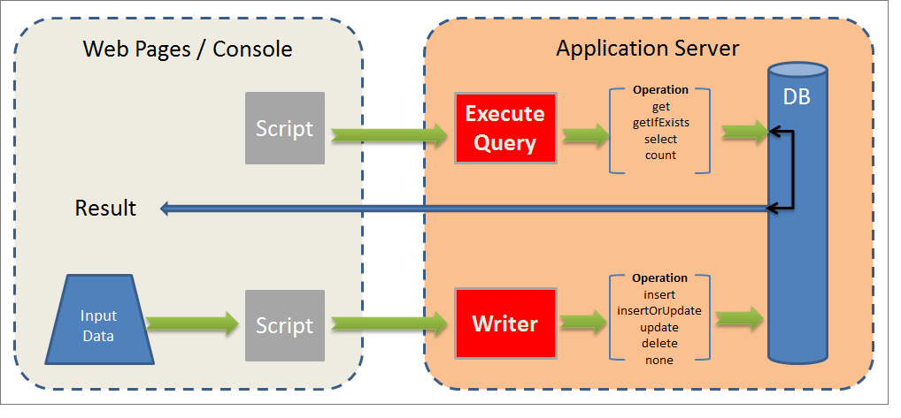

# API orientadas a datos{#data-oriented-apis}

Las API orientadas a datos le permiten abordar todo el modelo de datos.

## Visión general del modelo de datos {#overview-of-the-datamodel}

Adobe Campaign no oferta una API de lectura dedicada por entidad (sin la función getRecipient o getDelivery, etc.). Utilice los métodos de lectura y modificación de datos CONSULTA y WRITER para acceder a los datos del modelo.

Adobe Campaign permite administrar colecciones: Las consultas permiten recuperar un conjunto de información recopilada en toda la base. A diferencia del acceso en modo SQL, las API de Adobe Campaign devuelven un árbol XML en lugar de columnas de datos. De este modo, Adobe Campaign crea documentos compuestos con todos los datos recopilados.

Este modo operativo no oferta la asignación uno a uno entre los atributos y elementos de los documentos XML y las columnas de las tablas de la base de datos.

Los documentos XML se almacenan en campos de tipo MEMO de la base de datos.

## Descripción del modelo {#description-of-the-model}

Debe estar familiarizado con el modelo de datos de Adobe Campaign para poder abordar los campos de la base de datos en las secuencias de comandos.

Para ver una presentación del modelo de datos, consulte la [descripción del modelo de datos de Adobe Campaign](../../configuration/using/data-model-description.md).

Para generar su estructura, consulte este artículo: [Cómo generar un modelo de datos o un diccionario de datos](https://helpx.adobe.com/campaign/kb/generate-data-model.html).

## Consulta y escritor {#query-and-writer}

El siguiente esquema de introducción detalla los intercambios de bajo nivel para lectura (ExecuteQuery) y escritura (Writer) entre la base de datos y el cliente (páginas web o consola cliente de Adobe Campaign).



### ExecuteQuery {#executequery}

Para columnas y condiciones, puede utilizar Consultas.

Esto le permite aislar el SQL subyacente. El idioma de consulta no depende del motor subyacente: algunas funciones se reasignarán, lo que puede generar varios pedidos SQL SELECT.

Para obtener más información sobre esto, consulte [Ejemplo sobre el método &#39;ExecuteQuery&#39; del esquema &#39;xtk:queryDef&#39;](../../configuration/using/web-service-calls.md#example-on-the--executequery--method-of-schema--xtk-querydef-).

El método **ExecuteQuery** se presenta en [ExecuteQuery (xtk:queryDef)](#executequery--xtk-querydef-).

### Escribir {#write}

Los comandos de escritura permiten escribir documentos simples o complejos, con entradas en una o varias tablas de la base.

Las API transaccionales permiten administrar las conciliaciones mediante el comando **updateOrInsert**: un comando permite crear o actualizar datos. También puede configurar la combinación de modificaciones (**combinar**): este modo operativo permite autorizar actualizaciones parciales.

La estructura XML oferta una vista lógica de los datos y permite evitar la estructura física de la tabla SQL.

El método Write se presenta en [Write / WriteCollection (xtk:session)](#write---writecollection--xtk-session-).

## ExecuteQuery (xtk:queryDef) {#executequery--xtk-querydef-}

Este método permite realizar consultas a partir de datos asociados a un esquema. Se necesita una cadena de autenticación (debe haber iniciado sesión) y un documento XML que describa la consulta que se va a enviar como parámetros. El parámetro return es un documento XML que contiene el resultado de la consulta en el formato del esquema al que hace referencia la consulta.

Definición del método &quot;ExecuteQuery&quot; en el esquema &quot;xtk:queryDef&quot;:

```
<method name="ExecuteQuery" const="true">
  <parameters>
    <param desc="Output XML document" name="output" type="DOMDocument" inout="out"/>
  </parameters>
</method>
```

>[!NOTE]
>
>Es un método &quot;const&quot;. Los parámetros de entrada se incluyen en un documento XML con el formato del esquema &quot;xtk:queryDef&quot;.

### Formato del documento XML de la consulta de entrada {#format-of-the-xml-document-of-the-input-query}

La estructura del documento XML de la consulta se describe en el esquema &quot;xtk:queryDef&quot;. Este documento describe las cláusulas de una consulta SQL: &quot;select&quot;, &quot;where&quot;, &quot;order by&quot;, &quot;group by&quot;, &quot;have&quot;.

```
<queryDef schema="schema_key" operation="operation_type">
  <select>
    <node expr="expression1">
    <node expr="expression2">
    ...
  </select>
  <where> 
    <condition expr="expression1"/> 
    <condition expr="expression2"/>
    ... 
  </where>
  <orderBy>
    <node expr="expression1">
    <node expr="expression2">
    ...
  </orderBy>
  <groupBy>
    <node expr="expression1">
    <node expr="expression2">
    ...
  </groupBy>
  <having>
    <condition expr="expression1"/> 
    <condition expr="expression2"/>
    ...
  </having>
</queryDef>
```

Se puede definir una subconsulta ( `<subquery>` ) en un elemento `<condition> `. La sintaxis de un   `<subquery> `   se basa en la sintaxis de un    `<querydef>`.

Ejemplo de un `<subquery>  : </subquery>`

```
<condition setOperator="NOT IN" expr="@id" enabledIf="$(/ignored/@ownerType)=1">
  <subQuery schema="xtk:operatorGroup">
     <select>
       <node expr="[@operator-id]" />
     </select>
     <where>
       <condition expr="[@group-id]=$long(../@owner-id)"/>
     </where>
   </subQuery>
</condition>  
  
```

Una consulta debe hacer referencia a un esquema de inicio desde el atributo **esquema**.

El tipo de operación deseada se introduce en el atributo **operation** y contiene uno de los siguientes valores:

* **get**: recupera un registro de la tabla y devuelve un error si los datos no existen,
* **getIfExists**: recupera un registro de la tabla y devuelve un documento vacío si los datos no existen,
* **seleccionar**: crea un cursor para devolver varios registros y devuelve un documento vacío si no hay datos,
* **count**: devuelve un recuento de datos.

La sintaxis **XPath** se utiliza para ubicar los datos según el esquema de entrada. Para obtener más información sobre XPath, consulte [esquemas de datos](../../configuration/using/data-schemas.md).

#### Ejemplo con la operación &#39;get&#39; {#example-with-the--get--operation}

Recupera los apellidos y el nombre de un destinatario (&quot;esquema nms:destinatario&quot;) con un filtro en el correo electrónico.

```
<queryDef schema="nms:recipient" operation="get">
  <!-- fields to retrieve -->
  <select>
    <node expr="@firstName"/>
    <node expr="@lastName"/>
  </select> 

  <!-- condition on email -->
  <where>  
    <condition expr="@email= 'john.doe@aol.com'"/>
  </where>
</queryDef>
```

#### Ejemplo con la operación &#39;select&#39; {#example-with-the--select--operation}

Devuelve la lista de destinatarios filtrados en una carpeta y el dominio de correo electrónico con un orden descendente en la fecha de nacimiento.

```
<queryDef schema="nms:recipient" operation="select">
  <select>
    <node expr="@email"/>
    <!-- builds a string with the concatenation of the last name and first name separated by a dash -->      
    <node expr="@lastName+'-'+@firstName"/>
    <!-- get year of birth date -->
    <node expr="Year(@birthDate)"/>
  </select> 

  <where>  
     <condition expr="[@folder-id] = 1234 and @domain like 'Adobe%'"/>
  </where>

  <!-- order by birth date -->
  <orderBy>
    <node expr="@birthDate" sortDesc="true"/> <!-- by default sortDesc="false" -->
  </orderBy>
</queryDef>
```

Las expresiones pueden ser campos simples o expresiones complejas, como operaciones aritméticas o la concatenación de cadenas.

Para limitar el número de registros que se van a devolver, agregue el atributo **lineCount** al elemento `<querydef>`.

Para limitar el número de registros devueltos por la consulta a 100:

```
<queryDef schema="nms:recipient" operation="select" lineCount="100">
...
```

Para recuperar los 100 registros siguientes, vuelva a ejecutar la misma consulta y agregue el atributo **startLine**.

```
<queryDef schema="nms:recipient" operation="select" lineCount="100" startLine="100">
...
```

#### Ejemplo con la operación &#39;count&#39; {#example-with-the--count--operation}

Para contar el número de registros de una consulta:

```
<queryDef schema="nms:recipient" operation="count"">
  <!-- condition on the folder and domain of the e-mail -->
  <where>  
    <condition expr="[@folder-id] = 1234" and @domain like 'Adobe%'"/>
  </where>
</queryDef>
```

>[!NOTE]
>
>Nuevamente, usamos la condición del ejemplo anterior. Las cláusulas `<select>` y no se utilizan. `</select>`

#### Agrupación de datos {#data-grouping}

Para recuperar las direcciones de correo electrónico a las que se hace referencia más de una vez:

```
<queryDef schema="nms:recipient" operation="select">
  <select>
    <node expr="@email"/>
    <node expr="count(@email)"/>
  </select>

  <!-- e-mail grouping clause -->
  <groupby>
    <node expr="@email"/>
  </groupby>

  <!-- grouping condition -->
  <having>
    <condition expr="count(@email) > 1"/>
  </having>

</queryDef>
```

La consulta se puede simplificar agregando el atributo **groupBy** directamente al campo que se va a agrupar:

```
<select>
  <node expr="@email" groupBy="true"/>
</select>
```

>[!NOTE]
>
>Ya no es necesario rellenar el elemento `<groupby>`.

#### Bracketing en condiciones {#bracketing-in-conditions}

Aquí hay dos ejemplos de paréntesis en la misma condición.

* Versión simple en una sola expresión:

   ```
   <where>
     <condition expr="(@age > 15 or @age <= 45) and  (@city = 'Newton' or @city = 'Culver City') "/>
   </where>
   ```

* Versión estructurada con `<condition>` elementos:

   ```
   <where>
     <condition bool-operator="AND">
       <condition expr="@age > 15" bool-operator="OR"/>
       <condition expr="@age <= 45"/>
     </condition>
     <condition>
       <condition expr="@city = 'Newton'" bool-operator="OR"/>
       <condition expr="@city = 'Culver City'"/>
     </condition>
   </where>
   ```

Es posible reemplazar el operador &#39;O&#39; por la operación &#39;IN&#39; cuando se apliquen varias condiciones al mismo campo:

```
<where>
  <condition>
    <condition expr="@age IN (15, 45)"/>
    <condition expr="@city IN ('Newton', 'Culver City')"/>
  </condition>
</where>
```

Esta sintaxis simplifica la consulta cuando se utilizan más de dos datos en la condición.

#### Ejemplos de vínculos {#examples-on-links}

* Vínculos 1-1 o N1: cuando la tabla tiene la clave externa (los inicios de vínculo de la tabla), los campos de la tabla vinculada se pueden filtrar o recuperar directamente.

   Ejemplo de un filtro en la etiqueta de la carpeta:

   ```
   <where>
     <condition expr="[folder/@label] like 'Segment%'"/>
   </where>
   ```

   Para recuperar los campos de la carpeta desde el esquema &quot;nms:destinatario&quot;:

   ```
   <select>
     <!-- label of recipient folder -->
     <node expr="[folder/@label]"/>
     <!-- displays the string count of the folder -->
     <node expr="partition"/>
   </select>
   ```

* Vínculos de colección (1N): el filtrado en los campos de una tabla de recopilación debe realizarse mediante el operador **EXISTS** o **NOT EXISTS**.

   Para filtrar a los destinatarios que se han suscrito al servicio informativo &#39;Newsletter&#39;:

   ```
   <where>
     <condition expr="subscription" setOperator="EXISTS">
       <condition expr="@name = 'Newsletter'"/>
     </condition>
   </where>
   ```

   No se recomienda la recuperación directa de los campos de un vínculo de recopilación desde la cláusula `<select>` porque la consulta devuelve un producto cardinal. Solo se utiliza cuando la tabla vinculada contiene un solo registro (ejemplo `<node expr="">`).

   Ejemplo del vínculo de la colección &quot;suscripción&quot;:

   ```
   <select>
     <node expr="subscription/@label"/>
   </select>
   ```

   Es posible recuperar una sublista que contenga los elementos de un vínculo de recopilación en la cláusula `<select>`. Los XPath de los campos a los que se hace referencia están contextuales a partir del elemento de recopilación.

   Los elementos de filtrado ( `<orderby>` ) y restricción ( `<where>` ) se pueden agregar al elemento de recopilación.

   En este ejemplo, para cada destinatario la consulta devuelve el correo electrónico y la lista de servicios informativos a los que se suscribe el destinatario:

   ```
   <queryDef schema="nms:recipient" operation="select">
     <select>
       <node expr="@email"/>
   
       <!-- collection table (unbound type) -->
       <node expr="subscription">  
         <node expr="[service/@label]"/>    
         <!-- sub-condition on the collection table -->
         <where>  
           <condition expr="@expirationDate >= GetDate()"/>
         </where>
         <orderBy>
           <node expr="@expirationDate"/> 
         </orderBy>
       </node>
     </select> 
   </queryDef>
   ```

#### Enlace de los parámetros de las cláusulas &#39;where&#39; y &#39;select&#39; {#binding-the-parameters-of-the--where--and--select--clause}

El enlace de parámetros permite al motor establecer los valores de los parámetros utilizados en la consulta. Esto es muy útil, ya que el motor está a cargo del escape de los valores, y existe la ventaja adicional de una caché para los parámetros que se van a recuperar.

Cuando se construye una consulta, los valores &quot;enlazados&quot; se reemplazan por un carácter (?? en ODBC, `#[index]#` en postgres...) en el cuerpo de la consulta SQL.

```
<select>
  <!--the value will be bound by the engine -->
  <node expr="@startDate = #2002/02/01#"/>                   
  <!-- the value will not be bound by the engine but visible directly in the query -->
  <node expr="@startDate = #2002/02/01#" noSqlBind="true"/> 
</select>
```

Para evitar enlazar un parámetro, el atributo &quot;noSqlBind&quot; debe rellenarse con el valor &#39;true&#39;.

>[!IMPORTANT]
>
>Si la consulta incluye instrucciones &quot;pedido por&quot; o &quot;grupo por&quot;, los motores de base de datos no podrán &quot;enlazar&quot; valores. Debe colocar el atributo @noSqlBind=&quot;true&quot; en las instrucciones &quot;select&quot; y/o &quot;where&quot; de la consulta.

#### Sugerencia de creación de consultas: {#query-building-tip-}

Para ayudarle con la sintaxis de una consulta, puede escribir la consulta mediante el editor de consultas genérico en la consola de cliente de Adobe Campaign ( menú **[!UICONTROL Tools/ Generic query editor...]**). Para ello:

1. Seleccione los datos que desea recuperar:

   

1. Defina la condición del filtro:

   

1. Ejecute la consulta y presione CTRL+F4 para vista del código fuente de la consulta.

   

### Formato de documento de salida {#output-document-format}

El parámetro return es un documento XML con el formato del esquema asociado a la consulta.

Ejemplo de un retorno desde el esquema &quot;nms:destinatario&quot; en una operación &quot;get&quot;:

```
<recipient email="john.doe@adobe.com" lastName"Doe" firstName="John"/>
```

En una operación de &quot;selección&quot;, el documento devuelto es una lista desglosada de elementos:

```
<!-- the name of the first element does not matter -->
<recipient-collection>   
  <recipient email="john.doe@adobe.com" lastName"Doe" firstName="John"/>
  <recipient email="peter.martinez@adobe.com" lastName"Martinez" firstName="Peter"/>
  <recipient...
</recipient-collection>  
```

Ejemplo de un documento devuelto para la operación de tipo &quot;count&quot;:

```
<recipient count="3"/>
```

#### Alias {#alias}

Un alias permite modificar la ubicación de los datos en el documento de salida. El atributo **alias** debe especificar una XPath en el campo correspondiente.

```
<queryDef schema="nms:recipient" operation="get">
  <select>
    <node expr="@firstName" alias="@firstName"/>
    <node expr="@lastName"/>
    <node expr="[folder/@label]" alias="@My_folder"/>
  </select> 
</queryDef>
```

Devuelve:

```
<recipient My_folder="Recipients" First name ="John" lastName="Doe"/>
```

En lugar de:

```
<recipient firstName="John" lastName="Doe">
  <folder label="Recipients"/>
</recipient>
```

### Ejemplo de mensajes SOAP {#example-of-soap-messages}

* Consulta:

   ```
   <?xml version='1.0' encoding='ISO-8859-1'?>
   <SOAP-ENV:Envelope xmlns:xsd='http://www.w3.org/2001/XMLSchema' xmlns:xsi='http://www.w3.org/2001/XMLSchema-instance' xmlns:ns='http://xml.apache.org/xml-soap' xmlns:SOAP-ENV='http://schemas.xmlsoap.org/soap/envelope/'>
     <SOAP-ENV:Body>
       <ExecuteQuery xmlns='urn:xtk:queryDef' SOAP-ENV:encodingStyle='http://schemas.xmlsoap.org/soap/encoding/'>
         <__sessiontoken xsi:type='xsd:string'/>
         <entity xsi:type='ns:Element' SOAP-ENV:encodingStyle='http://xml.apache.org/xml-soap/literalxml'>
           <queryDef operation="get" schema="nms:recipient" xtkschema="xtk:queryDef">
             <select>
               <node expr="@email"/>
               <node expr="@lastName"/>
               <node expr="@firstName"/>
             </select>
             <where>
               <condition expr="@id = 3599"/>
             </where>
           </queryDef>
         </entity>
       </ExecuteQuery>
     </SOAP-ENV:Body>
   </SOAP-ENV:Envelope>
   ```

* Respuesta:

   ```
   <?xml version='1.0' encoding='ISO-8859-1'?>
   <SOAP-ENV:Envelope xmlns:xsd='http://www.w3.org/2001/XMLSchema' xmlns:xsi='http://www.w3.org/2001/XMLSchema-instance' xmlns:ns='http://xml.apache.org/xml-soap' xmlns:SOAP-ENV='http://schemas.xmlsoap.org/soap/envelope/'>
     <SOAP-ENV:Body>
       <ExecuteQueryResponse xmlns='urn:xtk:queryDef' SOAP-ENV:encodingStyle='http://schemas.xmlsoap.org/soap/encoding/'>
         <pdomOutput xsi:type='ns:Element' SOAP-ENV:encodingStyle='http://xml.apache.org/xml-soap/literalxml'>
           <recipient email="john.doe@adobe.com" lastName"Doe" firstName="John"/>
         </pdomOutput>
       </ExecuteQueryResponse>
     </SOAP-ENV:Body>
   </SOAP-ENV:Envelope>
   ```

## Write / WriteCollection (xtk:session) {#write---writecollection--xtk-session-}

Estos servicios se utilizan para insertar, actualizar o eliminar una entidad (método &quot;Write&quot;) o una colección de entidades (método &quot;WriteCollection&quot;).

Las entidades que se van a actualizar están asociadas con un esquema de datos. Los parámetros de entrada son una cadena de autenticación (debe haber iniciado sesión) y un documento XML que contiene los datos que se van a actualizar.

Este documento se complementa con instrucciones para configurar los procedimientos de escritura.

La llamada no devuelve datos, excepto errores.

Definición de los métodos &quot;Write&quot; y &quot;WriteCollection&quot; en el esquema &quot;xtk:session&quot;:

```
<method name="Write" static="true">
  <parameters>
    <param name="doc" type="DOMDocument" desc="Difference document"/>
  </parameters>
</method>
<method name="WriteCollection" static="true">
  <parameters>
    <param name="doc" type="DOMDocument" desc="Difference collection document"/>
  </parameters>
</method>
```

>[!NOTE]
>
>Es un método &quot;estático&quot;. Los parámetros de entrada se incluyen en un documento XML en el formato del esquema que se va a actualizar.

### Información general {#overview}

La reconciliación de datos funciona según la definición de las claves ingresadas en el esquema asociado. El procedimiento de escritura busca la primera clave elegible en función de los datos introducidos en el documento de entrada. La entidad se inserta o actualiza en función de su existencia en la base de datos.

La clave del esquema de la entidad que se va a actualizar se completa en función del atributo **xtkschema**.

Por lo tanto, la clave de reconciliación se puede forzar con el atributo **_key** que contiene la lista de XPath que conforma la clave (separada por comas).

Es posible forzar el tipo de operación rellenando el atributo **_operation** con los siguientes valores:

* **insertar**: fuerza la inserción del registro (no se utiliza la clave de reconciliación),
* **insertOrUpdate**: actualiza o inserta el registro en función de la clave de reconciliación (modo predeterminado),
* **update**: actualiza el registro; no hace nada si los datos no existen,
* **delete**: elimina los registros,
* **ninguno**: solo se utiliza para la reconciliación de vínculos, sin actualización ni inserción.

### Ejemplo con el método &#39;Write&#39; {#example-with-the--write--method}

Actualización o inserción de un destinatario (operación implícita &quot;insertOrUpdate&quot;) con dirección de correo electrónico, fecha de nacimiento y localidad:

```
<recipient xtkschema="nms:recipient" email="john.doe@adobe.com" birthDate="1956/05/04" folder-id=1203 _key="@email, [@folder-id]">
  <location city="Newton"/>
</recipient>
```

Eliminación de un destinatario:

```
<recipient xtkschema="nms:recipient" _operation="delete" email="rene.dupont@adobe.com" folder-id=1203 _key="@email, [@folder-id]"/>
```

>[!NOTE]
>
>Para una operación de eliminación, el documento de entrada debe contener solo los campos que conforman la clave de reconciliación.

### Ejemplo con el método &#39;WriteCollection&#39; {#example-with-the--writecollection--method}

Actualizar o insertar para varios destinatarios:

```
<recipient-collection xtkschema="nms:recipient">    
  <recipient email="john.doe@adobe.com" firstName="John" lastName="Doe" _key="@email"/>
  <recipient email="peter.martinez@adobe.com" firstName="Peter" lastName="Martinez" _key="@email"/>
  <recipient ...
</recipient-collection>
```

### Ejemplo en vínculos {#example-on-links}

#### Ejemplo 1 {#example-1}

Asociación de la carpeta con un destinatario en función de su nombre interno (@name).

```
<recipient _key="[folder/@name], @email" email="john.doe@adobe.net" lastName="Doe" firstName="John" xtkschema="nms:recipient">
  <folder name="Folder2" _operation="none"/>
</recipient>
```

Los atributos &quot;_key&quot; y &quot;_operation&quot; se pueden introducir en un elemento vinculado. El comportamiento en este elemento es el mismo que en el elemento principal del esquema de entrada.

La definición de la clave de la entidad principal (&quot;nms:destinatario&quot;) consiste en un campo de una tabla vinculada (elemento `<folder>` esquema &quot;xtk:folder&quot;) y el correo electrónico.

>[!NOTE]
>
>La operación &quot;ninguno&quot; introducida en el elemento de carpeta define una reconciliación en la carpeta sin actualizar ni insertar.

#### Ejemplo 2 {#example-2}

Actualización de la compañía (tabla vinculada en el esquema &quot;cus:compañía&quot;) desde un destinatario:

```
<recipient _key="[folder/@name], @email" email="john.doe@adobe.net" lastName="Doe" firstName="John" xtkschema="nms:recipient">
  <company name="adobe" code="ERT12T" _key="@name" _operation="update"/>
</recipient>
```

#### Ejemplo 3 {#example-3}

Añadir un destinatario en un grupo con la tabla de relación de grupo (&quot;nms:rcpGrpRel&quot;):

```
<recipient _key="@email" email="martin.ledger@adobe.net" xtkschema="nms:recipient">
  <rcpGrpRel _key="[rcpGroup/@name]">
    <rcpGroup name="GRP1"/>
  </rcpGrpRel>
</recipient>
```

>[!NOTE]
>
>La definición de la clave no se introduce en el elemento `<rcpgroup>` porque una clave implícita basada en el nombre del grupo se define en el esquema &quot;nms:group&quot;.

### Elementos de recopilación XML {#xml-collection-elements}

De forma predeterminada, todos los elementos de la colección deben rellenarse para actualizar los elementos de la colección XML. Los datos de la base de datos se reemplazarán con los datos del documento de entrada. Si el documento contiene sólo los elementos que se van a actualizar, debe rellenar el atributo &quot;_operation&quot; en todos los elementos de recopilación que se van a actualizar para forzar una combinación con los datos XML de la base de datos.

### Ejemplo de mensajes SOAP {#example-of-soap-messages-1}

* Consulta:

   ```
   <?xml version='1.0' encoding='ISO-8859-1'?>
   <SOAP-ENV:Envelope xmlns:xsd='http://www.w3.org/2001/XMLSchema' xmlns:xsi='http://www.w3.org/2001/XMLSchema-instance' xmlns:ns='http://xml.apache.org/xml-soap' xmlns:SOAP-ENV='http://schemas.xmlsoap.org/soap/envelope/'>
     <SOAP-ENV:Body>
       <Write xmlns='urn:xtk:persist' SOAP-ENV:encodingStyle='http://schemas.xmlsoap.org/soap/encoding/'>
         <__sessiontoken xsi:type='xsd:string'/>
         <domDoc xsi:type='ns:Element' SOAP-ENV:encodingStyle='http://xml.apache.org/xml-soap/literalxml'>
           <recipient xtkschema="nms:recipient" email="rene.dupont@adobe.com" firstName="René" lastName="Dupont" _key="@email">
         </domDoc>
       </Write>
     </SOAP-ENV:Body>
   </SOAP-ENV:Envelope>
   ```

* Respuesta:

   ```
   <?xml version='1.0' encoding='ISO-8859-1'?>
   <SOAP-ENV:Envelope xmlns:xsd='http://www.w3.org/2001/XMLSchema' xmlns:xsi='http://www.w3.org/2001/XMLSchema-instance' xmlns:ns='http://xml.apache.org/xml-soap' xmlns:SOAP-ENV='http://schemas.xmlsoap.org/soap/envelope/'>
     <SOAP-ENV:Body>
       <WriteResponse xmlns='urn:' SOAP-ENV:encodingStyle='http://schemas.xmlsoap.org/soap/encoding/'>
       </WriteResponse>
     </SOAP-ENV:Body>
   </SOAP-ENV:Envelope>
   ```

   Regresar con error:

   ```
   <?xml version='1.0'?>
   <SOAP-ENV:Envelope xmlns:xsd="http://www.w3.org/2001/XMLSchema" xmlns:xsi="http://www.w3.org/2001/XMLSchema-instance" xmlns:SOAP-ENV='http://schemas.xmlsoap.org/soap/envelope/'>
     <SOAP-ENV:Body>
       <SOAP-ENV:Fault>
         <faultcode>SOAP-ENV:Server</faultcode>
         <faultstring xsi:type="xsd:string">Error while executing the method 'Write' of service 'xtk:persist'.</faultstring>
         <detail xsi:type="xsd:string">PostgreSQL error: ERROR:  duplicate key violates unique constraint &quot;nmsrecipient_id&quot;Impossible to save document of type 'Recipients (nms:recipient)'</detail>
       </SOAP-ENV:Fault>
     </SOAP-ENV:Body>
   </SOAP-ENV:Envelope>
   ```

