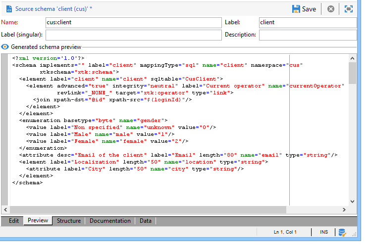
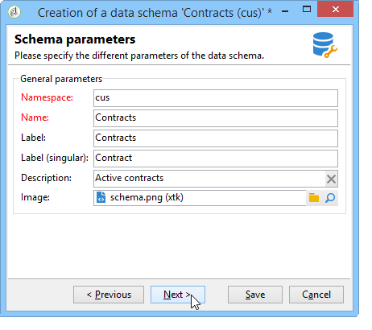
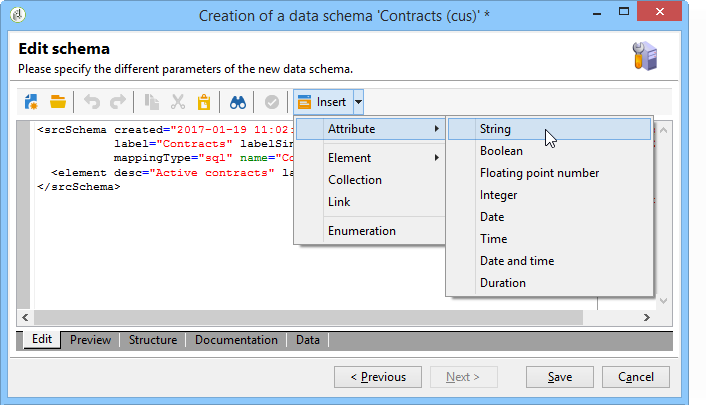

# Esquemas de datos{#data-schemas}

## Principios {#principles}

Para editar, crear y configurar los esquemas, haga clic en **[!UICONTROL Administration > Configuration > Data schemas]** de la consola del cliente de Adobe Campaign.

>[!NOTE]
>
>Solo un administrador de la consola de Adobe Campaign Classic puede eliminar esquemas de datos integrados.


El campo de edición muestra el contenido XML del esquema de origen:


>[!NOTE]
>
>El control de edición &quot;Name&quot; permite introducir la clave de esquema formada por el nombre y el área de nombres. Los atributos &quot;name&quot; y &quot;namespace&quot; del elemento raíz del esquema se actualizan automáticamente en la zona de edición XML del esquema.

La previsualización genera automáticamente el esquema ampliado:



>[!NOTE]
>
>Cuando se guarda el esquema de origen, se inicia automáticamente la generación del esquema ampliado.

Si necesita comprobar la estructura completa de un esquema, puede utilizar la pestaña preview. Si el esquema se ha ampliado, podrá visualizar todas sus extensiones. Como complemento, la pestaña Documentación muestra todos los atributos y elementos de esquema y sus propiedades (Campo SQL, tipo/longitud, etiqueta, descripción). La pestaña Documentación solo se aplica a los esquemas generados. Para obtener más información, consulte [Regeneración de esquemas](../../configuration/using/regenerating-schemas.md) sección.

## Ejemplo: Creación de una tabla de contrato {#example--creating-a-contract-table}

En el siguiente ejemplo, deseamos crear una nueva tabla para **contratos** en el modelo de base de datos de la base de datos Adobe Campaign. Esta tabla permite almacenar el nombre y los apellidos y las direcciones de correo electrónico de los titulares y cotitulares de cada contrato.

Para ello, debe crear el esquema de la tabla y actualizar la estructura de la base de datos para generar la tabla correspondiente. Siga estos pasos:

1. Edite el **[!UICONTROL Administration > Configuration > Data schemas]** del árbol de Adobe Campaign y haga clic en **[!UICONTROL New]** .
1. Elija la **[!UICONTROL Create a new table in the data model]** y haga clic en **[!UICONTROL Next]** .

   

1. Especifique un nombre para la tabla y un área de nombres.

   

   >[!NOTE]
   >
   >De forma predeterminada, los esquemas creados por los usuarios se almacenan en el área de nombres &quot;cus&quot;. Para obtener más información, consulte [Identificación de un esquema](../../configuration/using/about-schema-reference.md#identification-of-a-schema).

1. Cree el contenido de la tabla. Se recomienda utilizar el asistente de entrada para asegurarse de que no falta ninguna configuración. Para ello, haga clic en el **[!UICONTROL Insert]** y elija el tipo de configuración que desea añadir.

   

1. Defina la configuración de la tabla de contratos:

   ```
   <srcSchema desc="Active contracts" img="ncm:channels.png" label="Contracts" labelSingular="Contract" mappingType="sql" name="Contracts" namespace="cus" xtkschema="xtk:srcSchema">
     <element desc="Active contracts" img="ncm:channels.png" label="Contracts" labelSingular="Contract"
              name="Contracts" autopk="true">
              <attribute name="holderName" label="Holder last name" type="string"/>
              <attribute name="holderFirstName" label="Holder first name" type="string"/>
              <attribute name="holderEmail" label="Holder email" type="string"/>
              <attribute name="co-holderName" label="Co-holder last name" type="string"/>           
              <attribute name="co-holderFirstName" label="Co-holder first name" type="string"/>           
              <attribute name="co-holderEmail" label="Co-holder email" type="string"/>    
              <attribute name="date" label="Subscription date" type="date"/>     
              <attribute name="noContract" label="Contract number" type="long"/>  
     </element>
   </srcSchema>
   ```

   Añada el tipo de contrato y coloque un índice en el número de contrato.

   ```
   <srcSchema _cs="Contracts (cus)" desc="Active contracts" entitySchema="xtk:srcSchema" img="ncm:channels.png"
              label="Contracts" labelSingular="Contract" name="Contracts" namespace="cus" xtkschema="xtk:srcSchema">
     <enumeration basetype="byte" name="typeContract">
       <value label="Home" name="home" value="0"/>
       <value label="Car" name="car" value="1"/>
       <value label="Health" name="health" value="2"/>
       <value label="Pension fund" name="pension fund" value="2"/>
     </enumeration>
     <element autopk="true" desc="Active contracts" img="ncm:channels.png" label="Contracts"
              labelSingular="Contract" name="Contracts">
       <attribute label="Holder last name" name="holderName" type="string"/>
       <attribute label="Holder first name" name="holderFirstName" type="string"/>
       <attribute label="Holder email" name="holderEmail" type="string"/>
       <attribute label="Co-holder last name" name="co-holderName" type="string"/>
       <attribute label="Co-holder first name" name="co-holderFirstName" type="string"/>
       <attribute label="Co-holder email" name="co-holderEmail" type="string"/>
       <attribute label="Subscription date" name="date" type="date"/>
      <attribute desc="Type of contract" enum="cus:Contracts:typeContract" label="Type of contract"
                  name="type" type="byte"/>
       <attribute label="Contract number" name="noContract" type="long"/>
       <dbindex name="noContract" unique="true">
         <keyfield xpath="@noContract"/>
       </dbindex>
     </element>
   </srcSchema>
   ```

1. Guarde el esquema para generar la estructura:

   

1. Actualice la estructura de la base de datos para crear la tabla a la que se vinculará el esquema. Para obtener más información, consulte [Actualización de la estructura de base de datos](../../configuration/using/updating-the-database-structure.md).
