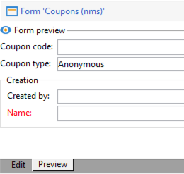
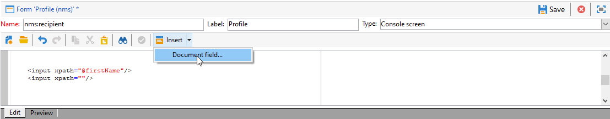

# Edición de formularios{#editing-forms}


## Información general

Los especialistas en marketing y los operadores utilizan formularios de entrada para crear, modificar y previsualizar registros. Forms muestra una representación visual de la información.

Puede crear y modificar formularios de entrada:

* Puede modificar los formularios de entrada de fábrica que se envían de forma predeterminada. Los formularios de entrada de fábrica se basan en los esquemas de datos de fábrica.
* Puede crear formularios de entrada personalizados, basados en esquemas de datos definidos.

Forms son entidades de `xtk:form` tipo . Puede ver la estructura del formulario de entrada en el `xtk:form` esquema. Para ver este esquema, elija **[!UICONTROL Administration]** > **[!UICONTROL Configuration]** > **[!UICONTROL Data schemas]** del menú . Más información sobre [estructura de formulario](form-structure.md).

Para acceder a los formularios de entrada, seleccione **[!UICONTROL Administration]> [!UICONTROL Configuration] >[!UICONTROL Input forms]** del menú:


Para diseñar formularios, edite el contenido XML en el editor XML:


[Más información](form-structure.md#formatting).

Para obtener una vista previa de un formulario, haga clic en el botón **[!UICONTROL Preview]** pestaña:


## Tipos de formulario

Puede crear diferentes tipos de formularios de entrada. El tipo de formulario determina cómo navegan los usuarios en el formulario:

* Pantalla de la consola

   Este es el tipo de formulario predeterminado. El formulario consta de una sola página.

   

* Administración de contenido

   Utilice este tipo de formulario para la gestión de contenido. Consulte esta [caso de uso](../../delivery/using/use-case--creating-content-management.md).

   

* Asistente

   Este formulario consta de varias pantallas flotantes que se ordenan en secuencias específicas. Los usuarios navegan de una pantalla a otra. [Más información](form-structure.md#wizards).

* Iconbox

   Este formulario consta de varias páginas. Para desplazarse por el formulario, los usuarios seleccionan iconos a la izquierda del formulario.

   

* Portátil

   Este formulario consta de varias páginas. Para desplazarse por el formulario, los usuarios seleccionan fichas en la parte superior del formulario.

   

* Panel vertical

   Este formulario muestra un árbol de navegación.

* Panel horizontal

   Este formulario muestra una lista de elementos.

## Contenedores

En los formularios, puede utilizar contenedores para varios fines:

* Organización del contenido en los formularios
* Definición del acceso a los campos de entrada
* Anidar formularios dentro de otros formularios

[Más información](form-structure.md#containers).

### Organizar contenido

Utilice contenedores para organizar el contenido dentro de los formularios:

* Los campos se pueden agrupar en secciones.
* Puede agregar páginas a formularios de varias páginas.

Para insertar un contenedor, utilice la variable `<container>` elemento. [Más información](form-structure.md#containers).

#### Campos de grupo

Utilice contenedores para agrupar los campos de entrada en secciones organizadas.

Para insertar una sección en un formulario, utilice este elemento: `<container type="frame">`. De forma opcional, para agregar un título de sección, utilice la variable `label` atributo.

Sintaxis: `<container type="frame" label="`*section_title*`"> […] </container>`

En este ejemplo, un contenedor define la variable **Creación** , que incluye el **[!UICONTROL Created by]** y **[!UICONTROL Name]** campos de entrada:

```xml
<form _cs="Coupons (nms)" entitySchema="xtk:form" img="xtk:form.png" label="Coupons"
      name="coupon" namespace="nms" type="default" xtkschema="xtk:form">
  <input xpath="@code"/>
  <input xpath="@type"/>
  <container label="Creation" type="frame">
    <input xpath="createdBy"/>
    <input xpath="createdBy/@name"/>
  </container>
</form>
```


#### Agregar páginas a formularios de varias páginas

Para los formularios de varias páginas, utilice un contenedor para crear una página de formulario.

Este ejemplo muestra los contenedores para la variable **General** y **Detalles** páginas de un formulario:

```xml
<container img="ncm:book.png" label="General">
[…]
</container>
<container img="ncm:detail.png" label="Details">
[…]
</container>
```

### Definición del acceso a los campos

Utilice contenedores para definir qué es visible y para definir el acceso a los campos. Puede activar o desactivar grupos de campos.

### Anidar formularios

Utilice contenedores para anidar formularios dentro de otros formularios. [Más información](#add-pages-to-multipage-forms).

## Referencias a imágenes

Para buscar imágenes, elija **[!UICONTROL Administration]** > **[!UICONTROL Configuration]** > **[!UICONTROL Images]** del menú .

Para asociar una imagen a un elemento del formulario, por ejemplo, un icono, puede agregar una referencia a una imagen. Utilice la variable `img` , por ejemplo, en la `<container>` elemento.

Sintaxis: `img="`*`namespace`*`:`*`filename`*`.`*`extension`*`"`

Este ejemplo muestra referencias a la variable `book.png` y `detail.png` imágenes de `ncm` namespace:

```xml
<container img="ncm:book.png" label="General">
[…]
</container>
<container img="ncm:detail.png" label="Details">
[…]
</container>
```

Estas imágenes se utilizan para los iconos en los que los usuarios hacen clic para desplazarse por un formulario de varias páginas:


## Crear un formulario simple {#create-simple-form}

Para crear un formulario, siga estos pasos:

1. En el menú , elija **[!UICONTROL Administration]** > **[!UICONTROL Configuration]** > **[!UICONTROL Input forms]**.
1. Haga clic en el **[!UICONTROL New]** en la parte superior derecha de la lista.

   

1. Especifique las propiedades del formulario:

   * Especifique el nombre del formulario y el área de nombres.

      El nombre del formulario y el espacio de nombres pueden coincidir con el esquema de datos relacionado.  Este ejemplo muestra un formulario para la variable `cus:order` esquema de datos:

      ```xml
      <form entitySchema="xtk:form" img="xtk:form.png" label="Order" name="order" namespace="cus" type="iconbox" xtkschema="xtk:form">
        […]
      </form>
      ```

      También puede especificar explícitamente el esquema de datos en la variable `entity-schema` atributo.

      ```xml
      <form entity-schema="cus:stockLine" entitySchema="xtk:form" img="xtk:form.png" label="Stock order" name="stockOrder" namespace="cus" xtkschema="xtk:form">
        […]
      </form>
      ```

   * Especifique la etiqueta que se mostrará en el formulario.
   * De forma opcional, especifique el tipo de formulario. Si no especifica ningún tipo de formulario, se utilizará de forma predeterminada el tipo de pantalla de la consola.

      

      Si está diseñando un formulario de varias páginas, puede omitir el tipo de formulario en la variable `<form>` y especifique el tipo en un contenedor.

1. Haga clic en **[!UICONTROL Save]**.

1. Inserte los elementos de formulario.

   Por ejemplo, para insertar un campo de entrada, utilice el `<input>` elemento. Configure las variables `xpath` a la referencia de campo como expresión XPath. [Más información](schema-structure.md#referencing-with-xpath).

   Este ejemplo muestra los campos de entrada basados en la variable `nms:recipient` esquema.

   ```xml
   <input xpath="@firstName"/>
   <input xpath="@lastName"/>
   ```

1. Si el formulario se basa en un tipo de esquema específico, puede buscar los campos de este esquema:

   1. Haga clic en **[!UICONTROL Insert]** > **[!UICONTROL Document fields]**.

      

   1. Seleccione el campo y haga clic en **[!UICONTROL OK]**.

      

1. De forma opcional, especifique el editor de campos.

   Se asocia un editor de campos predeterminado a cada tipo de datos:
   * Para un campo de tipo fecha, el formulario muestra un calendario de entrada.
   * Para un campo de tipo enumeration, el formulario muestra una lista de selección.

   Puede utilizar estos tipos de editor de campos:

   | Editor de campos | Atributo de formulario |
   | --- | --- |
   | Botón de radio | `type="radiobutton"` |
   | Casilla de verificación | `type="checkbox"` |
   | Editar árbol | `type="tree"` |

   Más información sobre [controles de lista de memoria](form-structure.md#memory-list-controls).

1. Opcionalmente, defina el acceso a los campos:

   | Elemento | Atributo | Descripción |
   | --- | --- | --- |
   | `<input>` | `read-only:"true"` | Proporciona acceso de solo lectura a un campo |
   | `<container>` | `type="visibleGroup" visibleIf="`*edit-expr*`"` | Muestra condicionalmente un grupo de campos |
   | `<container>` | `type="enabledGroup" enabledIf="`*edit-expr*`"` | Habilita condicionalmente un grupo de campos |

   Ejemplo:

   ```xml
   <container type="enabledGroup" enabledIf="@gender=1">
     […]
   </container>
   <container type="enabledGroup" enabledIf="@gender=2">
     […]
   </container>
   ```

1. Opcionalmente, puede utilizar contenedores para agrupar campos en secciones.

   ```xml
   <container type="frame" label="Name">
      <input xpath="@firstName"/>
      <input xpath="@lastName"/>
   </container>
   <container type="frame" label="Contact details">
      <input xpath="@email"/>
      <input xpath="@phone"/>
   </container>
   ```

   

## Crear un formulario de varias páginas {#create-multipage-form}

Puede crear formularios de varias páginas. También puede anidar formularios dentro de otros formularios.

### Cree un `iconbox` formulario

Utilice la variable `iconbox` tipo de formulario para mostrar los iconos a la izquierda del formulario, que llevan a los usuarios a diferentes páginas del formulario.


Cambio del tipo de un formulario existente a `iconbox`, siga estos pasos:

1. Cambie el `type` del `<form>` elemento a `iconbox`:

   ```xml
   <form […] type="iconbox">
   ```

1. Defina un contenedor para cada página de formulario:

   1. Agregue un `<container>` como elemento secundario del `<form>` elemento.
   1. Para definir una etiqueta y una imagen para el icono, utilice la variable `label` y `img` atributos.

      ```xml
      <form entitySchema="xtk:form" name="Service provider" namespace="nms" type="iconbox" xtkschema="xtk:form">
          <container img="xtk:properties.png" label="General">
              <input xpath="@label"/>
              <input xpath="@name"/>
              […]
          </container>
          <container img="nms:msgfolder.png" label="Details">
              <input xpath="@address"/>
              […]
          </container>
          <container img="nms:supplier.png" label="Services">
              […]
          </container>
      </form>
      ```
   También puede quitar el `type="frame"` del atributo existente `<container>` elementos.

### Crear un formulario de bloc de notas

Utilice la variable `notebook` tipo de formulario para mostrar fichas en la parte superior del formulario, que llevan a los usuarios a diferentes páginas.


Cambio del tipo de un formulario existente a `notebook`, siga estos pasos:

1. Cambie el `type` del `<form>` elemento a `notebook`:

   ```xml
   <form […] type="notebook">
   ```

1. Agregue un contenedor para cada página de formulario:

   1. Agregue un `<container>` como elemento secundario del `<form>` elemento.
   1. Para definir la etiqueta y la imagen del icono, utilice la variable `label` y `img` atributos.

   ```xml
     <form entitySchema="xtk:form" name="Service provider" namespace="nms" type="notebook" xtkschema="xtk:form">
         <container label="General">
             <input xpath="@label"/>
             <input xpath="@name"/>
             […]
         </container>
         <container label="Details">
             <input xpath="@address"/>
             […]
         </container>
         <container label="Services">
             […]
         </container>
     </form>
   ```

   También puede quitar el `type="frame"` del atributo existente `<container>` elementos.
