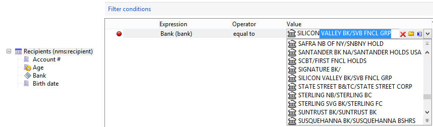

# Ejemplos de la edición de esquemas{#examples-of-schemas-edition}

## Ampliación de una tabla {#extending-a-table}

Para ampliar la tabla de destinatarios del esquema **nms:recipient** , siga el siguiente procedimiento:

1. Cree el esquema de extensión (**cus:extension**) con los siguientes datos:

   ```
   <srcSchema mappingType="sql" name="extension" namespace="cus" xtkschema="xtk:srcSchema" extendedSchema="nms:recipient">  
     <enumeration basetype="string" default="area1" name="area">    
       <value label="Zone 1" name="area1"/>    
       <value label="Zone 2" name="area2"/>  
     </enumeration>  
   
     <element name="extension">    
       <dbindex name="area">      
         <keyfield xpath="location/@area"/>    
       </dbindex>      
   
       <attribute label="Loyalty code" name="fidelity" type="long"/>    
       <element name="location">      
         <attribute name="area" label="Purchasing zone" type="string" length="50" enum="area"/>    
       </element>  </element>  
   </srcSchema>
   ```

   En este ejemplo, se agrega un campo indexado (**fidelity**) y el elemento **location** (que ya existía en el esquema **nms:recipient**) se completa con un campo enumerado (**area**).

   >[!IMPORTANT]
   >
   >Recuerde añadir el atributo **ExtendedSchema** para hacer referencia al esquema de extensión.

1. Compruebe que el esquema extendido es el esquema **nms:recipient** y que los datos adicionales están presentes:

   ```
   <schema dependingSchemas="cus:extension" mappingType="sql" name="recipient" namespace="nms" xtkschema="xtk:schema">
     ...
     <enumeration basetype="string" default="area1" name="area">    
       <value label="Zone 1" name="area1"/>    
       <value label="Zone 2" name="area2"/>  
     </enumeration>
     ...
     <element autopk="true" name="recipient" sqltable="NmsRecipient"> 
       <dbindex name="area">      
         <keyfield xpath="location/@area"/>    
       </dbindex>
   
       ...
       <attribute belongsTo="cus:extension" label="Loyalty code" name="fidelity" sqlname="iFidelity" type="long"/>
       <element name="location">
         ...
         <attribute enum="area" label="Purchasing zone" length="50" name="area" sqlname="sArea" type="string"/>
       </element>
       ...
     </element>
   </schema>
   ```

   El script SQL generado a partir del asistente de actualización de base de datos es el siguiente:

   ```
   ALTER TABLE NmsRecipient ADD iFidelity INTEGER;
   UPDATE NmsRecipient SET iFidelity = 0;
   ALTER TABLE NmsRecipient ALTER COLUMN iFidelity SET NOT NULL;ALTER TABLE NmsRecipient ALTER COLUMN iFidelity SET Default 0;
   ALTER TABLE NmsRecipient ADD sArea VARCHAR(50); 
   CREATE INDEX NmsRecipient_area ON NmsRecipient(sArea);
   ```

## Tabla de colección vinculada {#linked-collection-table}

En esta sección se describe cómo crear una tabla de pedidos vinculada a la tabla de destinatarios con cardinalidad 1-N.

Ordenar esquema de origen de tabla:

```
<srcSchema label="Order" name="order" namespace="cus" xtkschema="xtk:srcSchema">  
  <element autopk="true" name="order">    
    <compute-string expr="@number" + '(' + ToString(@date) + ')'/>    
    
    <attribute label="Number" length="128" name="number" type="string"/>    
    <attribute desc="Order date" label="Date" name="date" type="datetime" default="GetDate()"/>    
    <attribute desc="order total" label="Total" name="total" type="double"/>    
    <element label="Recipient" name="recipient" revDesc="Orders associated with this recipient" revIntegrity="own" revLabel="Orders" target="nms:recipient" type="link"/>  
  </element>
</srcSchema>
```

El tipo de tabla es **autopk** para crear una clave principal generada automáticamente que se utilizará al unir el vínculo a la tabla de destinatarios.

Esquema generado:

```
<schema label="Order" mappingType="sql" name="order" namespace="cus" xtkschema="xtk:schema">  
  <element autopk="true" label="Order" name="order" sqltable="CusOrder">    
    <compute-string expr="ToString(@date) + ' - ' + @number"/>    

    <dbindex name="id" unique="true">      
      <keyfield xpath="@id"/>    
    </dbindex>    

    <key internal="true" name="id">      
      <keyfield xpath="@id"/>    
    </key>    

    <dbindex name="recipientId">      
      <keyfield xpath="@recipient-id"/>    
    </dbindex>    

    <attribute desc="Internal primary key" label="Primary key" name="id" sqlname="iOrderId" type="long"/>    
    <attribute label="Number" length="128" name="number" sqlname="sNumber" type="string"/>    
    <attribute desc="Order date" label="Date" name="date" sqlname="tsDate" type="datetime"/>    
    <attribute desc="order total" label="Total" name="total" sqlname="Total" type="double"/>    
    <element label="Recipient" name="recipient" revLink="order" target="nms:recipient" type="link">      
      <join xpath-dst="@id" xpath-src="@recipient-id"/>    
    </element>    
    <attribute advanced="true" label="Foreign key of 'Recipient' link ('id' field)" name="recipient-id" sqlname="iRecipientId" type="long"/>  
   </element>
</schema>
```

El script SQL de creación de tabla es el siguiente:

```
CREATE TABLE CusOrder(dTotal DOUBLE PRECISION NOT NULL Default 0, iOrderId INTEGER NOT NULL Default 0, iRecipientId INTEGER NOT NULL Default 0, sNumber VARCHAR(128), tsDate TIMESTAMP Default NULL);
CREATE UNIQUE INDEX CusOrder_id ON CusOrder(iOrderId);
CREATE INDEX CusOrder_recipientId ON CusOrder(iRecipientId);  
INSERT INTO CusOrder (iOrderId) VALUES (0); 
```

>[!NOTE]
>
>El comando SQL INSERT INTO al final de la secuencia de comandos permite insertar un registro de identificador establecido en 0 para simular las uniones externas.

## Tabla de extensión {#extension-table}

Una tabla de extensión permite ampliar el contenido de una tabla existente en una tabla vinculada de cardinalidad 1-1.

El propósito de una tabla de extensión es evitar limitaciones en el número de campos admitidos en una tabla o optimizar el espacio ocupado por los datos, que se consumen bajo demanda.

Creación del esquema de la tabla de extensiones (**cus:feature**):

```
<srcSchema mappingType="sql" name="feature" namespace="cus" xtkschema="xtk:srcSchema">  
  <element autopk="true" name="feature">    
    <attribute label="Children" name="children" type="byte"/>    
    <attribute label="Single" name="single" type="boolean"/>    
    <attribute label="Spouse first name" length="100" name="spouseFirstName" type="string"/>  
  </element>
</srcSchema>
```

Creación de un esquema de extensión en la tabla de destinatarios para añadir el vínculo de cardinalidad 1-1:

```
<srcSchema extendedSchema="nms:recipient" label="Recipient" mappingType="sql" name="recipient" namespace="cus" xtkschema="xtk:srcSchema">  
  <element name="recipient">    
    <element desc="Features" integrity="own" label="Features" name="feature" revCardinality="single" revLink="recipient" target="cus:feature" type="link"/> 
  </element>
</srcSchema>
```

>[!NOTE]
>
>La definición del vínculo entre la tabla de destinatarios y la tabla de extensiones debe rellenarse desde el esquema que contiene la clave externa.

La secuencia de comandos SQL para crear la tabla de extensión es la siguiente:

```
CREATE TABLE CusFeature(  iChildren NUMERIC(3) NOT NULL Default 0, iFeatureId INTEGER NOT NULL Default 0, iSingle NUMERIC(3) NOT NULL Default 0, sSpouseFirstName VARCHAR(100));
CREATE UNIQUE INDEX CusFeature_id ON CusFeature(iFeatureId);  
INSERT INTO CusFeature (iFeatureId) VALUES (0); 
```

El script de actualización SQL de la tabla de destinatarios es el siguiente:

```
ALTER TABLE NmsRecipient ADD iFeatureId INTEGER;
UPDATE NmsRecipient SET iFeatureId = 0;
ALTER TABLE NmsRecipient ALTER COLUMN iFeatureId SET NOT NULL;
ALTER TABLE NmsRecipient ALTER COLUMN iFeatureId SET Default 0;
CREATE INDEX NmsRecipient_featureId ON NmsRecipient(iFeatureId);
```

## Tabla de desbordamiento {#overflow-table}

Una tabla de desbordamiento es una tabla de extensión (cardinalidad 1-1), pero la declaración del vínculo a la tabla que se va a ampliar se rellena en el esquema de la tabla de desbordamiento.

La tabla de desbordamiento contiene la clave externa de la tabla que se va a ampliar. Por lo tanto, no se modifica la tabla que se va a ampliar. La relación entre las dos tablas es el valor de la clave principal de la tabla que se va a ampliar.

Creación del esquema de tabla de desbordamiento (**cus:overflow**):

```
<srcSchema label="Overflow" name="overflow" namespace="cus" xtkschema="xtk:srcSchema">  
  <element name="overflow">    
    <key internal="true" name="id">      
      <keyfield xlink="recipient"/>    
    </key>    

    <attribute label="Children" name="children" type="byte"/>    
    <attribute label="Single" name="single" type="boolean"/>    
    <attribute label="Spouse first name" length="100" name="spouseFirstName" type="string"/>  
    <element label="Customer" name="recipient" revCardinality="single" revIntegrity="own" revExternalJoin="true" target="nms:recipient" type="link"/>  
  </element>  
</srcSchema>
```

>[!NOTE]
>
>La clave principal de la tabla de desbordamiento es el vínculo a la tabla que se va a ampliar (esquema &quot;nms:recipient&quot; en nuestro ejemplo).

El script SQL de creación de tabla es el siguiente:

```
CREATE TABLE CusOverflow(iChildren NUMERIC(3) NOT NULL Default 0, iRecipientId INTEGER NOT NULL Default 0, iSingle NUMERIC(3) NOT NULL Default 0, sSpouseFirstName VARCHAR(100));
CREATE UNIQUE INDEX CusOverflow2_id ON CusOverflow2(iRecipientId);  
```

## Tabla de relación {#relationship-table}

Una tabla de relación permite vincular dos tablas con la cardinalidad N-N. Esta tabla contiene solo las claves externas de las tablas que se van a vincular.

Ejemplo de una tabla de relación entre grupos (**nms:group**) y destinatarios (**nms:recipient**).

Esquema de origen de la tabla de relación:

```
<srcSchema name="rcpGrpRel" namespace="cus">
  <element name="rcpGrpRel">
    <key internal="true" name="id">      
      <keyfield xlink="rcpGroup"/>      
      <keyfield xlink="recipient"/>    
    </key>

    <element integrity="neutral" label="Recipient" name="recipient" revDesc="Groups to which this recipient belongs" revIntegrity="own" revLabel="Groups" target="nms:recipient" type="link"/>    
    <element integrity="neutral" label="Group" name="rcpGroup" revDesc="Recipients in the group" revIntegrity="own" revLabel="Recipients" revLink="rcpGrpRel" target="nms:group" type="link"/>
  </element>
</srcSchema>
```

El esquema generado es el siguiente:

```
<schema mappingType="sql" name="rcpGrpRel" namespace="cus" xtkschema="xtk:schema">  
  <element name="rcpGrpRel" sqltable="CusRcpGrpRel">    
    <compute-string expr="ToString([@rcpGroup-id]) + ',' + ToString([@recipient-id])"/>    
    <dbindex name="id" unique="true">      
      <keyfield xpath="@rcpGroup-id"/>      
      <keyfield xpath="@recipient-id"/>    
    </dbindex>    

    <key internal="true" name="id">      
      <keyfield xpath="@rcpGroup-id"/>      
      <keyfield xpath="@recipient-id"/>    
    </key>    

    <dbindex name="rcpGroupId">      
      <keyfield xpath="@rcpGroup-id"/>    
    </dbindex>    
    <dbindex name="recipientId">      
      <keyfield xpath="@recipient-id"/>    
    </dbindex>    

    <element integrity="neutral" label="Recipient" name="recipient" revLink="rcpGrpRel" target="nms:recipient" type="link">      
      <join xpath-dst="@id" xpath-src="@recipient-id"/>    
    </element>    
    <attribute advanced="true" label="Foreign key of 'Recipient' link ('id' field)" name="recipient-id" sqlname="iRecipientId" type="long"/>    

    <element integrity="neutral" label="Group" name="rcpGroup" revLink="rcpGrpRel" target="nms:group" type="link">      
      <join xpath-dst="@id" xpath-src="@rcpGroup-id"/>    
    </element>    
    <attribute advanced="true" label="Foreign key of 'Group' link ('id' field)" name="rcpGroup-id" sqlname="iRcpGroupId" type="long"/>  
  </element>
</schema>
```

El script SQL de creación de tabla es el siguiente:

```
CREATE TABLE CusRcpGrpRel( iRcpGroupId INTEGER NOT NULL Default 0, iRecipientId INTEGER NOT NULL Default 0);
CREATE UNIQUE INDEX CusRcpGrpRel_id ON CusRcpGrpRel(iRcpGroupId, iRecipientId);
CREATE INDEX CusRcpGrpRel_recipientId ON CusRcpGrpRel(iRecipientId);
```

## Caso de uso: vincular un campo a una tabla de referencia existente {#uc-link}

Este caso de uso demuestra cómo se puede usar una tabla de referencia existente como alternativa a los mecanismos de enumeración integrados de Adobe Campaign (enum, userEnum o dbEnum).

También puede utilizar una tabla de referencia existente como una enumeración en los esquemas. Esto se puede lograr creando un vínculo entre una tabla y la tabla de referencia, y agregando el atributo **displayAsField=&quot;true&quot;**.

En este ejemplo, la tabla de referencia contiene una lista de identificadores y nombres de bancos:

```
<srcSchema entitySchema="xtk:srcSchema" img="cus:bank16x16.png" label="Bank" mappingType="sql" name="bank" namespace="cus"
xtkschema="xtk:srcSchema">
    <element img="cus:bank16x16.png" label="Banks" name="bank">
        <compute-string expr="@name"/>
        <key name="id">
            <keyfield xpath="@id"/>
        </key>
        <attribute label="Bank Id" name="id" type="short"/>
        <attribute label="Name" length="64" name="name" type="string"/>
     </element> 
</srcSchema>
```

En cualquier tabla que utilice esta tabla de referencia, defina un vínculo y añada el atributo **displayAsField=&quot;true&quot;**.

```
<element displayAsField="true" label="Bank" name="bank" target="cus:bank" type="link" noDbIndex="true"/>
```

La interfaz de usuario no muestra ningún vínculo, sino un campo. Cuando el usuario selecciona ese campo, puede seleccionar un valor de la tabla de referencia o utilizar la función de autocompletar.



* Para que se complete automáticamente, debe definir una cadena de cálculo en la tabla de referencia.

* Añada el atributo **noDbIndex=&quot;true&quot;** en la definición del vínculo para evitar que Adobe Campaign cree un índice sobre los valores almacenados en la tabla de origen del vínculo.

## Temas relacionados

* [Uso de enumeraciones](../../platform/using/managing-enumerations.md)

* [Introducción a los esquemas de Campaign](../../configuration/using/about-schema-edition.md)

* [Actualización de la estructura de la base de datos](../../configuration/using/updating-the-database-structure.md)
