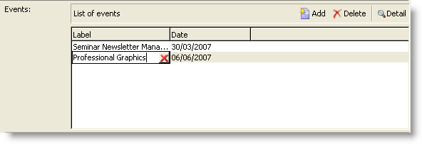

# Estructura del formulario{#form-structure}

La descripción de un formulario es un documento XML estructurado que observa la gramática del esquema de formulario **xtk:form**.

El documento XML del formulario de entrada debe contener el elemento raíz `<form>` con los atributos **name** y **Área de nombres** para rellenar el nombre y la Área de nombres del formulario.

```
<form name="form_name" namespace="name_space">
...
</form>
```

De forma predeterminada, un formulario está asociado al esquema de datos con el mismo nombre y Área de nombres. Para asociar un formulario con un nombre diferente, establezca el atributo **entity-esquema** del elemento `<form>` en el nombre de la clave de esquema. Para ilustrar la estructura de un formulario de entrada, describa una interfaz con el esquema de ejemplo &quot;cus:destinatario&quot;:

```
<srcSchema name="recipient" namespace="cus">
  <enumeration name="gender" basetype="byte">    
    <value name="unknown" label="Not specified" value="0"/>    
    <value name="male" label="Male" value="1"/>   
    <value name="female" label="Female" value="2"/>   
  </enumeration>

  <element name="recipient">
    <attribute name="email" type="string" length="80" label="Email" desc="E-mail address of recipient"/>
    <attribute name="birthDate" type="datetime" label="Date"/>
    <attribute name="gender" type="byte" label="Gender" enum="gender"/>
  </element>
</srcSchema>
```

Formulario de entrada basado en el esquema de ejemplo:


```
<form name="recipient" namespace="cus">
  <input xpath="@gender"/>
  <input xpath="@birthDate"/>
  <input xpath="@email"/>
</form>
```

La descripción de los inicios de controles de edición del elemento raíz `<form>`. Se introduce un control de edición en el elemento **`<input>`** con el atributo **xpath** que contiene la ruta de acceso al esquema.

El control de edición se adapta automáticamente al tipo de datos correspondiente y utiliza la etiqueta definida en el esquema.

>[!NOTE]
>
>Puede sobrecargar la etiqueta definida en su esquema de datos agregando el atributo **label** al elemento `<input>`:\
>`<input label="E-mail address" xpath="@name" />`

De forma predeterminada, cada campo se muestra en una sola línea y ocupa todo el espacio disponible en función del tipo de datos.

## Formato {#formatting}

El diseño de los controles es similar al diseño utilizado en las tablas HTML, con la posibilidad de dividir un control en varias columnas, entrelazar elementos o especificar la ocupación del espacio disponible. Recuerde, sin embargo, que el formato solo le permite dividir el área por proporciones; no se pueden especificar dimensiones fijas para un objeto.

Para mostrar los controles del ejemplo anterior en dos columnas:


```
<form name="recipient" namespace="cus">
  <container colcount="2">
    <input xpath="@gender"/>
    <input xpath="@birthDate"/>
    <input xpath="@email"/>
  </container>
</form>
```

El elemento **`<container>`** con el atributo **colcount** permite forzar la visualización de controles secundarios en dos columnas.

El atributo **colspan** de un control extiende el control por el número de columnas ingresadas en su valor:


```
<form name="recipient" namespace="cus">
  <container colcount="2">
    <input xpath="@gender"/>
    <input xpath="@birthDate"/>
    <input xpath="@email" colspan="2"/>
  </container>
</form> 
```

Al rellenar el atributo **type=&quot;frame&quot;**, el contenedor agrega un marco alrededor de los controles secundarios con la etiqueta contenida en el atributo **label**:


```
<form name="recipient" namespace="cus">
  <container colcount="2" type="frame" label="General">
    <input xpath="@gender"/>
    <input xpath="@birthDate"/>
    <input xpath="@email" colspan="2"/>
  </container>
</form>
```

Se puede utilizar un elemento **`<static>`** para dar formato al formulario de entrada:


```
<form name="recipient" namespace="cus">
  <static type="separator" colspan="2" label="General"/>
  <input xpath="@gender"/>
  <input xpath="@birthDate"/>
  <input xpath="@email" colspan="2"/>
  <static type="help" label="General information about recipient with date of birth, gender, and e-mail address." colspan="2"/>
</form>
```

La etiqueta **`<static>`** con el tipo **separador** permite agregar una barra separadora con una etiqueta contenida en el atributo **label**.

Se agregó un texto de ayuda con la etiqueta `<static>` con el tipo de ayuda. El contenido del texto se introduce en el atributo **label**.

## Contenedores {#containers}

Los contenedores permiten agrupar un conjunto de controles. Están representados por el elemento **`<container>`**. Se utilizaron anteriormente para dar formato a los controles en varias columnas.

El atributo **xpath** de un `<container>` permite simplificar la referencia de los controles secundarios. La referencia de los controles es relativa al elemento principal `<container>`.

Ejemplo de un contenedor sin &quot;xpath&quot;:

```
<container colcount="2">
  <input xpath="location/@zipCode"/>
  <input xpath="location/@city"/>
</container>
```

Ejemplo con la adición de &quot;xpath&quot; al elemento llamado &quot;location&quot;:

```
<container colcount="2" xpath="location">
  <input xpath="@zipCode"/>
  <input xpath="@city"/>
</container>
```

### Tipos de contenedores {#types-of-container}

Los contenedores se utilizan para construir controles complejos mediante un conjunto de campos formateados en páginas.

#### Contenedor de tabulación {#tab-container}

Un contenedor de ficha da formato a los datos de las páginas a las que se puede acceder desde las fichas.


```
<container type="notebook">
  <container colcount="2" label="General">
    <input xpath="@gender"/>
    <input xpath="@birthDate"/>
    <input xpath="@email" colspan="2"/>
  </container>
  <container colcount="2" label="Location">
    ...
  </container>
</container>
```

El contenedor principal está definido por el atributo **type=&quot;bloc&quot;**. Las fichas se declaran en los contenedores secundarios y la etiqueta de las fichas se rellena desde el atributo **label**.

>[!NOTE]
>
>Una función **style=&quot;down|up**(de forma predeterminada)**&quot;** fuerza la posición vertical de las etiquetas de tabulación debajo o encima del control. Esta función es opcional.
>
>`<container style="down" type="notebook">  ... </container>`

#### Lista de iconos {#icon-list}

Este contenedor muestra una barra de iconos vertical que permite seleccionar las páginas que se van a mostrar.


```
<container type="iconbox">
  <container colcount="2" label="General" img="xtk:properties.png">
    <input xpath="@gender"/>
    <input xpath="@birthDate"/>
    <input xpath="@email" colspan="2"/>
  </container>
  <container colcount="2" label="Location" img="nms:msgfolder.png">
    ...
  </container>
</container>
```

El contenedor principal está definido por el atributo **type=&quot;iconbox&quot;**. Las páginas asociadas con los iconos se declaran en los contenedores secundarios. La etiqueta de los iconos se rellena desde el atributo **label**.

El icono de una página se rellena desde el atributo `img="<image>"`, donde `<image>` es el nombre de la imagen correspondiente a su clave formada por el nombre y la Área de nombres (por ejemplo, &quot;xtk:properties.png&quot;).

Las imágenes están disponibles desde el nodo **[!UICONTROL Administration > Configuration > Images]**.

#### Contenedor de visibilidad {#visibility-container}

Puede enmascarar un conjunto de controles mediante una condición dinámica.

Este ejemplo ilustra la visibilidad de los controles en el valor del campo &quot;Género&quot;:

```
<container type="visibleGroup" visibleIf="@gender=1">
  ...
</container>
<container type="visibleGroup" visibleIf="@gender=2">
  ...
</container>
```

El atributo **type=&quot;visibleGroup&quot;** define un contenedor de visibilidad. El atributo **visibleIf** contiene la condición de visibilidad.

Ejemplos de sintaxis de condición:

* **visibleIf=&quot;@email=&#39;peter.martinezATneeolane.net&#39;&quot;**: prueba la igualdad en los datos de tipo cadena. El valor de comparación debe estar entre comillas.
* **visibleIf=&quot;@gender >= 1 y @gender != 2&quot;**: en un valor numérico.
* **visibleIf=&quot;@boolean1==true o @boolean2==false&quot;**: prueba en campos booleanos.

#### Habilitando contenedor {#enabling-container}

Este contenedor le permite habilitar o deshabilitar un conjunto de datos de una condición dinámica. Al deshabilitar un control se evita que se edite. El siguiente ejemplo ilustra la habilitación de controles desde el valor del campo &quot;Género&quot;:

```
<container type="enabledGroup" enabledIf="@gender=1">
  ...
</container>
<container type="enabledGroup" enabledIf="@gender=2">
  ...
</container>
```

El atributo **type=&quot;enabledGroup&quot;** define un contenedor habilitante. El atributo **enabledIf** contiene la condición de activación.

## Edición de un vínculo {#editing-a-link}

Recuerde que un vínculo se declara en el esquema de datos de la siguiente manera:

```
<element label="Company" name="company" target="cus:company" type="link"/>
```

El control de edición del vínculo en su formulario de entrada es el siguiente:


```
<input xpath="company"/>
```

Se puede acceder a la selección de destinatarios mediante el campo de edición. La entrada está asistida por un tipo-avance para que se pueda encontrar fácilmente un elemento de destinatario a partir de los primeros caracteres introducidos. La búsqueda se basa en la **cadena de cálculo** definida en el esquema de destino. Si el esquema no existe después de la validación en el control, se muestra un mensaje de confirmación de la creación de destinatarios sobre la marcha. La confirmación crea un nuevo registro en la tabla de destinatarios y lo asocia al vínculo.

Se utiliza una lista desplegable para seleccionar un elemento de destinatario de la lista de registros ya creados.

El icono **[!UICONTROL Modify the link]** (carpeta) inicia un formulario de selección con la lista de elementos de destino y una zona de filtrado:


El icono **[!UICONTROL Edit link]** (lupa) inicia el formulario de edición del elemento vinculado. El formulario utilizado se deduce de forma predeterminada en la clave del esquema de destino. El atributo **form** permite forzar el nombre del formulario de edición (p. ej. &quot;cus:compañía2&quot;).

Puede restringir la selección de elementos de destinatario agregando el elemento **`<sysfilter>`** de la definición del vínculo en el formulario de entrada:

```
<input xpath="company">
  <sysFilter>
    <condition expr="[location/@city] =  'Newton"/>
  </sysFilter>
</input>
```

También puede ordenar la lista con el elemento **`<orderby>`**:

```
<input xpath="company">
  <orderBy>
    <node expr="[location/@zipCode]"/>
  </orderBy>
</input>
```

### Propiedades de control {#control-properties}

* **noAutoComplete**: desactiva el tipo anterior (con el valor &quot;true&quot;)
* **createMode**: crea el vínculo sobre la marcha si no existe. Los valores posibles son:

   * **ninguno**: desactiva la creación. Se muestra un mensaje de error si el vínculo no existe
   * **en línea**: crea el vínculo con el contenido en el campo de edición
   * **edición**: muestra el formulario de edición en el vínculo. Cuando se valida el formulario, se guardan los datos (modo predeterminado)

* **noZoom**: sin formulario de edición en el vínculo (con el valor &quot;true&quot;)
* **formulario**: sobrecarga el formulario de edición del elemento de destino

## Lista de vínculos {#list-of-links}

Un vínculo introducido en el esquema de datos como elemento de recopilación (unbound=&quot;true&quot;) debe pasar por una lista para poder vista de todos los elementos asociados a él.

El principio consiste en mostrar la lista de los elementos vinculados con la carga de datos optimizada (descarga por lote de datos, ejecución de la lista sólo si está visible).

Ejemplo de un vínculo de colección en un esquema:

```
<element label="Events" name="rcpEvent" target="cus:event" type="link" unbound="true">
...
</element>
```

La lista en su forma de entrada:


```
 <input xpath="rcpEvent" type="linklist">
  <input xpath="@label"/>
  <input xpath="@date"/>
</input>
```

El control de lista está definido por el atributo **type=&quot;linklist&quot;**. La ruta de lista debe hacer referencia al vínculo de la colección.

Las columnas se declaran mediante los elementos **`<input>`** de la lista. El atributo **xpath** hace referencia a la ruta del campo en el esquema de destinatario.

Una barra de herramientas con una etiqueta (definida en el vínculo del esquema) se coloca automáticamente encima de la lista.

La lista se puede filtrar mediante el botón **[!UICONTROL Filters]** y configurar para agregar y ordenar las columnas.

Los botones **[!UICONTROL Add]** y **[!UICONTROL Delete]** permiten agregar y eliminar elementos de recopilación en el vínculo. De forma predeterminada, al agregar un elemento se inicia el formulario de edición del esquema de destinatario.

El botón **[!UICONTROL Detail]** se agrega automáticamente cuando se completa el atributo **zoom=&quot;true&quot;** en la etiqueta **`<input>`** de la lista: le permite iniciar el formulario de edición de la línea seleccionada.

El filtrado y la ordenación se pueden aplicar al cargar la lista:

```
 <input xpath="rcpEvent" type="linklist">
  <input xpath="@label"/>
  <input xpath="@date"/>
  <sysFilter>
    <condition expr="@type = 1"/>
  </sysFilter>
  <orderBy>
    <node expr="@date" sortDesc="true"/>
  </orderBy>
</input>
```

### Tabla de relación {#relationship-table}

Una tabla de relaciones permite vincular dos tablas con cardinalidad N-N. La tabla de relaciones contiene solamente los vínculos a las dos tablas.

Añadir un elemento a la lista debería permitirle completar una lista desde uno de los dos vínculos de la tabla de relaciones.

Ejemplo de tabla de relación en un esquema:

```
<srcSchema name="subscription" namespace="cus">
  <element name="recipient" type="link" target="cus:recipient" label="Recipient"/>
  <element name="service" type="link" target="cus:service" label="Subscription service"/>
</srcSchema>
```

Para nuestro ejemplo, estamos en inicio con la forma de entrada del esquema &quot;cus:destinatario&quot;. La lista debe mostrar las asociaciones con suscripciones a los servicios y debe permitirle agregar una suscripción seleccionando un servicio existente.


```
<input type="linklist" xpath="subscription" xpathChoiceTarget="service" xpathEditTarget="service" zoom="true">
  <input xpath="recipient"/>
  <input xpath="service"/>
</input>
```

El atributo **xpathChoiceTarget** le permite iniciar un formulario de selección a partir del vínculo introducido. Al crear el registro de tabla de relaciones, se actualizará automáticamente el vínculo al destinatario actual y al servicio seleccionado.

>[!NOTE]
>
>El atributo **xpathEditTarget** le permite forzar la edición de la línea seleccionada en el vínculo introducido.

### Propiedades de lista {#list-properties}

* **noToolbar**: oculta la barra de herramientas (con el valor &quot;true&quot;)
* **toolbarCaption**: sobrecarga la etiqueta de la barra de herramientas
* **toolbarAlign**: modifica la geometría vertical u horizontal de la barra de herramientas (valores posibles: &quot;vertical&quot;|&quot;horizontal&quot;)
* **img**: muestra la imagen asociada con la lista
* **formulario**: sobrecarga el formulario de edición del elemento de destino
* **zoom**: agrega el  **[!UICONTROL Zoom]** botón para editar el elemento de destino
* **xpathEditTarget**: establece la edición en el vínculo introducido
* **xpathChoiceTarget**: además, inicia el formulario de selección en el vínculo introducido

## Controles de lista de memoria {#memory-list-controls}

Las listas de memoria permiten editar los elementos de la colección mediante la precarga de datos de lista. Esta lista no se puede filtrar ni configurar.

Estas listas se utilizan en elementos de recopilación asignados a XML o en vínculos de bajo volumen.

### Lista de columnas {#column-list}

Este control muestra una lista de columnas editable con una barra de herramientas que contiene los botones Añadir y Eliminar.


```
<input xpath="rcpEvent" type="list">
  <input xpath="@label"/>
  <input xpath="@date"/>
</input>
```

El control de lista debe rellenarse con el atributo **type=&quot;list&quot;** y la ruta de la lista debe hacer referencia al elemento de colección.

Las columnas se declaran en las etiquetas secundarias **`<input>`** de la lista. La etiqueta de columna y el tamaño se pueden forzar con los atributos **label** y **colSize**.

>[!NOTE]
>
>Las flechas de orden se agregan automáticamente cuando se agrega el atributo **ordered=&quot;true&quot;** al elemento de recopilación en el esquema de datos.

Los botones de la barra de herramientas se pueden alinear horizontalmente:



```
<input nolabel="true" toolbarCaption="List of events" type="list" xpath="rcpEvent" zoom="true">
  <input xpath="@label"/>
  <input xpath="@date"/>
</input>
```

El atributo **toolbarCaption** fuerza la alineación horizontal de la barra de herramientas e introduce el título sobre la lista.

#### Ampliar una lista {#zoom-in-a-list}

La inserción y edición de los datos en una lista se puede introducir en un formulario de edición independiente.


```
<input nolabel="true" toolbarCaption="List of events" type="list" xpath="rcpEvent" zoom="true" zoomOnAdd="true">
  <input xpath="@label"/>
  <input xpath="@date"/>

  <form colcount="2" label="Event">
    <input xpath="@label"/>
    <input xpath="@date"/>
  </form>
</input>
```

El formulario de edición se completa desde el elemento `<form>` en la definición de lista. Su estructura es idéntica a la de un formulario de entrada. El botón **[!UICONTROL Detail]** se agrega automáticamente cuando se completa el atributo **zoom=&quot;true&quot;** en la etiqueta **`<input>`** de la lista. Este atributo permite iniciar el formulario de edición de la línea seleccionada.

>[!NOTE]
>
>Añadir el atributo **zoomOnAdd=&quot;true&quot;** fuerza la llamada al formulario de edición cuando se inserta un elemento de lista.

### Propiedades de lista {#list-properties-1}

* **noToolbar**: oculta la barra de herramientas (con el valor &quot;true&quot;)
* **toolbarCaption**: sobrecarga la etiqueta de la barra de herramientas
* **toolbarAlign**: modifica la posición de la barra de herramientas (valores posibles: &quot;vertical&quot;|&quot;horizontal&quot;)
* **img**: muestra la imagen asociada con la lista
* **formulario**: sobrecarga el formulario de edición del elemento de destino
* **zoom**: agrega el  **[!UICONTROL Zoom]** botón para editar el elemento de destino
* **zoomOnAdd**: inicia el formulario de edición en la adición
* **xpathChoiceTarget**: además, inicia el formulario de selección en el vínculo introducido

## Campos no editables {#non-editable-fields}

Para mostrar un campo y evitar que se edite, utilice la etiqueta **`<value>`** o complete el atributo **readOnly=&quot;true&quot;** en la etiqueta **`<input>`**.

Ejemplo en el campo &quot;Género&quot;:


```
<value value="@gender"/>
<input xpath="@gender" readOnly="true"/>
```

## Botón de radio {#radio-button}

Un botón de radio permite elegir entre varias opciones. Las etiquetas **`<input>`** se utilizan para lista de las opciones posibles y el atributo **selectedValue** especifica el valor asociado con la opción.

Ejemplo en el campo &quot;Género&quot;:

```
<input type="RadioButton" xpath="@gender" checkedValue="0" label="Choice 1"/>
<input type="RadioButton" xpath="@gender" checkedValue="1" label="Choice 2"/>
<input type="RadioButton" xpath="@gender" checkedValue="2" label="Choice 3"/>
```


## Casilla de verificación {#checkbox}

Una casilla de verificación refleja un estado booleano (seleccionado o no). De forma predeterminada, los campos &quot;Boolean&quot; (true/false) utilizan este control. Con este botón se puede asociar una variable que toma un valor predeterminado de 0 o 1. Este valor se puede sobrecargar mediante los atributos **checkValue**.

```
<input xpath="@boolean1"/>
<input xpath="@field1" type="checkbox" checkedValue="Y"/>
```


## Editar la jerarquía de navegación {#navigation-hierarchy-edit}

Este control crea un árbol en un conjunto de campos para editar.

Los controles que se van a editar se agrupan en una **`<container>`** ingresada bajo la etiqueta **`<input>`** del control de árbol:

```
<input nolabel="true" type="treeEdit">
  <container label="Text fields">
    <input xpath="@text1"/>
    <input xpath="@text2"/>
  </container>
  <container label="Boolean fields">
    <input xpath="@boolean1"/>
    <input xpath="@boolean2"/>
  </container>
</input>
```


## Campo de expresión {#expression-field}

Un campo de expresión actualiza un campo dinámicamente desde una expresión; la etiqueta **`<input>`** se utiliza con un atributo **xpath** para introducir la ruta del campo que se va a actualizar y un atributo **expr** que contiene la expresión de actualización.

```
<!-- Example: updating the boolean1 field from the value contained in the field with path /tmp/@flag -->
<input expr="Iif([/tmp/@flag]=='On', true, false)" type="expr" xpath="@boolean1"/>
<input expr="[/ignored/@action] == 'FCP'" type="expr" xpath="@launchFCP"/>
```

## Contexto de los formularios {#context-of-forms}

La ejecución de un formulario de entrada inicializa un documento XML que contiene los datos de la entidad que se está editando. Este documento representa el contexto del formulario y se puede utilizar como espacio de trabajo.

### Actualizando el contexto {#updating-the-context}

Para modificar el contexto del formulario, utilice la etiqueta **`<set expr="<value>" xpath="<field>"/>`**, donde **`<field>`** es el campo de destino, y **`<value>`** es la expresión o el valor de actualización.

Ejemplos de uso de la etiqueta **`<set>`**:

* **`<set expr="'Test'" xpath="/tmp/@test" />`**:: coloca el valor &#39;Test&#39; en la ubicación temporal /tmp/@test1
* **`<set expr="'Test'" xpath="@lastName" />`**:: actualiza la entidad en el atributo &quot;lastName&quot; con el valor &#39;Test&#39;
* **`<set expr="true" xpath="@boolean1" />`**:: establece el valor del campo &quot;boolean1&quot; en &quot;true&quot;
* **`<set expr="@lastName" xpath="/tmp/@test" />`**:: se actualiza con el contenido del atributo &quot;lastName&quot;

El contexto del formulario se puede actualizar al inicializarlo y cerrarlo mediante las etiquetas **`<enter>`** y **`<leave>`**.

```
<form name="recipient" namespace="cus">
  <enter>
    <set...
  </enter>
  ...
  <leave>
    <set...
  </leave>
</form>
```

>[!NOTE]
>
>Los `<enter>` y `<leave>`   se pueden utilizar en las `<container>` páginas (tipos &quot;bloc de notas&quot; y &quot;iconbox&quot;).

### Lenguaje de expresión {#expression-language-}

Se puede utilizar un lenguaje de macro en la definición del formulario para realizar pruebas condicionales.

La etiqueta **`<if expr="<expression>" />`** ejecuta las instrucciones especificadas en la etiqueta si se comprueba la expresión:

```
<if expr="([/tmp/@test] == 'Test' or @lastName != 'Doe') and @boolean2 == true">
  <set xpath="@boolean1" expr="true"/>
</if>
```

La etiqueta **`<check expr="<condition>" />`** combinada con la etiqueta **`<error>`** impide la validación del formulario y muestra un mensaje de error si no se cumple la condición:

```
<leave>
  <check expr="/tmp/@test != ''">
    <error>You must populate the 'Test' field!</error> 
  </check>
</leave>
```

## Asistentes {#wizards}

Un asistente lo guiará a través de un conjunto de pasos de entrada de datos en forma de páginas. Los datos introducidos se guardan al validar el formulario.

Un asistente tiene la siguiente estructura:

```
<form type="wizard" name="example" namespace="cus" img="nms:rcpgroup32.png" label="Wizard example" entity-schema="nms:recipient">
  <container title="Title of page 1" desc="Long description of page 1">
    <input xpath="@lastName"/>
    <input xpath="comment"/>
  </container>
  <container title="Title of page 2" desc="Long description of page 2">
    ...
  </container>
  ...
</form>
```


La presencia del atributo **type=&quot;Wizard&quot;** en el elemento `<form>` permite definir el modo de asistente en la construcción del formulario. Las páginas se completan desde `<container>` elementos, que son elementos secundarios del elemento `<form>`. El elemento `<container>` de una página se rellena con los atributos de título del título y desc para mostrar la descripción bajo el título de la página. Los botones **[!UICONTROL Previous]** y **[!UICONTROL Next]** se agregan automáticamente para permitir la navegación entre páginas.

El botón **[!UICONTROL Finish]** guarda los datos introducidos y cierra el formulario.

### Métodos SOAP {#soap-methods}

La ejecución del método SOAP se puede iniciar desde una etiqueta **`<leave>`** rellenada al final de una página.

La etiqueta **`<soapcall>`** contiene la llamada para el método con los siguientes parámetros de entrada:

```
<soapCall name="<name>" service="<schema>">
  <param type="<type>" exprIn="<xpath>"/>  
  ...
</soapCall>
```

El nombre del servicio y su esquema de implementación se introducen mediante los atributos **name** y **service** de la etiqueta **`<soapcall>`**.

Los parámetros de entrada se describen en los elementos **`<param>`** de la etiqueta **`<soapcall>`**.

El tipo de parámetro debe especificarse mediante el atributo **type**. Los tipos posibles son los siguientes:

* **cadena**: cadena de caracteres
* **booleano**: Booleano
* **byte**: Entero de 8 bits
* **short**: Entero de 16 bits
* **long**: Entero de 32 bits
* **short**: Entero de 16 bits
* **doble**: Número de punto flotante de precisión de doble
* **DOMElement**: nodo element-type

El atributo **exprIn** contiene la ubicación de los datos que se pasarán como parámetro.

**Ejemplo**:

```
<leave>
  <soapCall name="RegisterGroup" service="nms:recipient">         
    <param type="DOMElement" exprIn="/tmp/entityList"/>         
    <param type="DOMElement" exprIn="/tmp/choiceList"/>         
    <param type="boolean"    exprIn="true"/>       
  </soapCall>
</leave>
```

