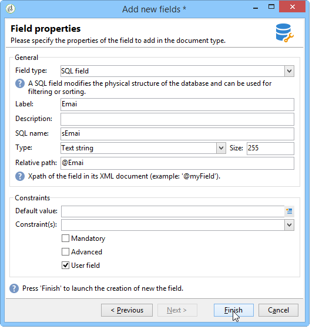

# Nuevo asistente de campo{#new-field-wizard}


Un asistente accesible a través de **[!UICONTROL Tools > Advanced > Add new fields]** le permite agregar uno o más campos a una tabla de la base de datos.

Al validar el asistente, se actualiza el esquema de extensión de la tabla que se va a ampliar y se inicia el script SQL para modificar la estructura física de la base de datos.

Este asistente tiene la ventaja de agregar rápidamente un campo sin necesidad de conocer la estructura de un esquema de datos.

La principal desventaja es la limitación de los datos y las propiedades que se van a ampliar.

Las pantallas del asistente contienen los siguientes pasos:

1. La primera página permite introducir el nombre del esquema que se va a ampliar y el área de nombres del esquema de extensión donde se guardarán las modificaciones:

   

1. La siguiente página permite introducir las propiedades del campo que se va a añadir.

   

1. Para confirmar los cambios, haga clic en el botón **[!UICONTROL Finish]**.

Se crea automáticamente un archivo de extensión, llamado &quot;cus:recipient&quot; en nuestro ejemplo, y se ejecuta la secuencia de comandos SQL correspondiente:

```
<srcSchema extendedSchema="nms:recipient" label="Recipients" name="recipient"  namespace="cus">  
  <element name="recipient">    
    <attribute belongsTo="cus:recipient" dataPolicy="email" label="Email" length="80" name="email1" sqlname="sEmail1" type="string" user="true"/>  
  </element>
</srcSchema>
```

>[!NOTE]
>
>De manera predeterminada, los campos agregados se declaran con la propiedad **user** (con el valor &quot;true&quot;). Esto permite mostrar y editar el campo en el formulario de entrada del esquema ampliado mediante un control de tipo &quot;treeEdit&quot; (consulte Formulario de entrada).
