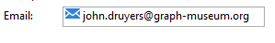

# Estructura del esquema{#schema-structure}

La estructura básica de un `<srcschema>` es la siguiente:

```
<srcSchema>
    <enumeration>
        ...          //definition of enumerations
    </enumeration>
   
    <element>         //definition of the root <element>    (mandatory)

        <compute-string/>  //definition of a compute-string
        <dbindex>
            ...        //definition of indexes
        </dbindex>
        <key>
            ...        //definition of keys
        </key>
        <sysFilter>
            ...           //definition of filters
        </sysFilter>
        <attribute>
            ...             //definition of fields
        </attribute>
    
            <element>           //definition of sub-<element> 
                  <attribute>           //(collection, links or XML)
                  ...                         //and additional fields
                  </attribute>
                ...
            </element>
      
    </element> 

        <methods>                 //definition of SOAP methods
            <method>
                ...
            </method>
            ...
    </methods>  
          
</srcSchema>
```

El documento XML de un esquema de datos debe contener **`<srcschema>`** el elemento raíz con los atributos **name** y **namespace** para rellenar el nombre del esquema y su área de nombres.

```
<srcSchema name="schema_name" namespace="namespace">
...
</srcSchema>
```

Utilice el siguiente contenido XML para ilustrar la estructura de un esquema de datos:

```
<recipient email="John.doe@aol.com" created="2009/03/12" gender="1"> 
  <location city="London"/>
</recipient>
```

Con su correspondiente esquema de datos:

```
<srcSchema name="recipient" namespace="cus">
  <element name="recipient">
    <attribute name="email"/>
    <attribute name="created"/>
    <attribute name="gender"/>
    <element name="location">
      <attribute name="city"/>
   </element>
  </element>
</srcSchema>
```

## Descripción {#description}

El punto de entrada del esquema es el elemento principal. Es fácil de identificar porque tiene el mismo nombre que el esquema y debe ser el elemento secundario del elemento raíz. La descripción del contenido comienza con este elemento.

En nuestro ejemplo, el elemento principal se representa con la línea siguiente:

```
<element name="recipient">
```

Los elementos **`<attribute>`** y **`<element>`** que siguen al elemento principal le permiten definir las ubicaciones y los nombres de los elementos de datos en la estructura XML.

En nuestro esquema de muestra, estos son:

```
<attribute name="email"/>
<attribute name="created"/>
<attribute name="gender"/>
<element name="location">
  <attribute name="city"/>
</element>
```

Deben respetarse las siguientes normas:

* Cada atributo **`<element>`** y **`<attribute>`** debe identificarse por su nombre mediante el atributo **name**.

   >[!IMPORTANT]
   >
   >El nombre del elemento debe ser conciso, preferiblemente en inglés, e incluir sólo caracteres autorizados de acuerdo con las reglas de nomenclatura XML.

* Sólo los elementos **`<element>`** pueden contener **`<attribute>`** elementos y **`<element>`** elementos en la estructura XML.
* Un elemento **`<attribute>`** debe tener un nombre único dentro de un **`<element>`**.
* Se recomienda el uso de **`<elements>`** en cadenas de datos de varias líneas.

## Tipos de datos {#data-types}

El tipo de datos se introduce mediante el atributo **type** en los elementos **`<attribute>`** y **`<element>`**.

Hay una lista detallada disponible en la descripción del elemento [`<attribute>`](../../configuration/using/schema/attribute.md) y el elemento [`<element>`](../../configuration/using/schema/element.md)).

Cuando este atributo no se rellena, **string** es el tipo de datos predeterminado a menos que el elemento contenga elementos secundarios. Si lo hace, solo se utiliza para estructurar los elementos jerárquicamente (**`<location>`** elemento en nuestro ejemplo).

Los siguientes tipos de datos son compatibles con los esquemas:

* **cadena**: cadena de caracteres. Ejemplos: un nombre, una ciudad, etc.

   El tamaño se puede especificar mediante el atributo **length** (valor predeterminado opcional &quot;255&quot;).

* **booleano**: Campo booleano. Ejemplo de valores posibles: true/false, 0/1, sí/no, etc.
* **byte**,  **abreviado**,  **largo**: enteros (1 byte, 2 bytes, 4 bytes). Ejemplos: edad, número de cuenta, número de puntos, etc.
* **doble**: Número de punto flotante con precisión de doble. Ejemplos: precio, tarifa, etc.
* **fecha**,  **fecha y hora**: fechas y fechas + horas. Ejemplos: fecha de nacimiento, fecha de compra, etc.
* **datetimenotz**: fecha + hora sin datos de huso horario.
* **timespan**: duraciones. Ejemplo: antigüedad.
* **memo**: campos de texto largos (varias líneas). Ejemplos: una descripción, un comentario, etc.
* **uuid**: Campos &quot;identificador único&quot; para admitir un GUID (solo compatible con Microsoft SQL Server).

   >[!NOTE]
   >
   >Para contener un campo **uid** en motores que no sean Microsoft SQL Server, se debe agregar y completar la función &quot;newuid()&quot; con su valor predeterminado.

Este es nuestro esquema de ejemplo con los tipos introducidos:

```
<srcSchema name="recipient" namespace="cus">
  <element name="recipient">
    <attribute name="email" type="string" length="80"/>
    <attribute name="created" type="datetime"/>
    <attribute name="gender" type="byte"/>
    <element name="location">
      <attribute name="city" type="string" length="50"/>
   </element>
  </element>
</srcSchema>
```

### Asignación de los tipos de datos de Adobe Campaign/DBMS {#mapping-the-types-of-adobe-campaign-dbms-data}

La siguiente tabla lista las asignaciones para los tipos de datos generados por Adobe Campaign para los diferentes sistemas de administración de bases de datos.

<table> 
 <tbody> 
  <tr> 
   <td> <strong>Adobe Campaign</strong><br /> </td> 
   <td> <strong>PosgreSQL</strong><br /> </td> 
   <td> <strong>Oracle</strong><br /> </td> 
   <td> <strong>Teradata</strong><br /> </td> 
   <td> <strong>DB2</strong><br /> </td> 
   <td> <strong>MS SQL</strong><br /> </td> 
  </tr> 
  <tr> 
   <td> Cadena<br /> </td> 
   <td> VARCHAR(255)<br /> </td> 
   <td> VARCHAR2 (NVARCHAR2 si Unicode)<br /> </td> 
   <td> VARCHAR (VARCHAR CHARACTER SET UNICODE if Unicode)<br /> </td> 
   <td> VARCHAR<br /> </td> 
   <td> VARCHAR (NVARCHAR si Unicode)<br /> </td> 
  </tr> 
  <tr> 
   <td> Boolean<br /> </td> 
   <td> SMALLINT<br /> </td> 
   <td> NUMBER(3)<br /> </td> 
   <td> NUMERIC(3)<br /> </td> 
   <td> SMALLINT<br /> </td> 
   <td> TINYINT<br /> </td> 
  </tr> 
  <tr> 
   <td> Byte<br /> </td> 
   <td> SMALLINT<br /> </td> 
   <td> NUMBER(3)<br /> </td> 
   <td> NUMERIC(3)<br /> </td> 
   <td> SMALLINT<br /> </td> 
   <td> TINYINT<br /> </td> 
  </tr> 
  <tr> 
   <td> Corto<br /> </td> 
   <td> SMALLINT<br /> </td> 
   <td> NUMBER(5)<br /> </td> 
   <td> SMALLINT<br /> </td> 
   <td> SMALLINT<br /> </td> 
   <td> SMALLINT<br /> </td> 
  </tr> 
  <tr> 
   <td> Duplicada<br /> </td> 
   <td> PRECISIÓN DEL doble<br /> </td> 
   <td> FLOAT<br /> </td> 
   <td> FLOAT<br /> </td> 
   <td> DOBLE<br /> </td> 
   <td> FLOAT<br /> </td> 
  </tr> 
  <tr> 
   <td> Largo<br /> </td> 
   <td> INTEGER<br /> </td> 
   <td> NUMBER(10)<br /> </td> 
   <td> INTEGER<br /> </td> 
   <td> INTEGER<br /> </td> 
   <td> INT<br /> </td> 
  </tr> 
  <tr> 
   <td> Int64<br /> </td> 
   <td> BIGINT<br /> </td> 
   <td> NUMBER(20)<br /> </td> 
   <td> NUMERIC(20)<br /> </td> 
   <td> BIGINT<br /> </td> 
   <td> BIGINT<br /> </td> 
  </tr> 
  <tr> 
   <td> Fecha<br /> </td> 
   <td> FECHA<br /> </td> 
   <td> FECHA<br /> </td> 
   <td> TIMESTAMP<br /> </td> 
   <td> FECHA<br /> </td> 
   <td> DATETIME<br /> </td> 
  </tr> 
  <tr> 
   <td> Hora<br /> </td> 
   <td> TIME<br /> </td> 
   <td> FLOAT<br /> </td> 
   <td> TIME<br /> </td> 
   <td> TIME<br /> </td> 
   <td> FLOAT<br /> </td> 
  </tr> 
  <tr> 
   <td> Datetime<br /> </td> 
   <td> TIMESTAMPZ<br /> </td> 
   <td> FECHA<br /> </td> 
   <td> TIMESTAMP<br /> </td> 
   <td> TIMESTAMP<br /> </td> 
   <td> MS SQL &lt; 2008: DATETIME<br /> MS SQL &gt;= 2012: DATETIMEOFFSET<br /> </td> 
  </tr> 
  <tr> 
   <td> Datetimenotz<br /> </td> 
   <td> TIMESTAMPZ<br /> </td> 
   <td> FECHA<br /> </td> 
   <td> TIMESTAMP<br /> </td> 
   <td> TIMESTAMP<br /> </td> 
   <td> MS SQL &lt; 2008: DATETIME<br /> MS SQL &gt;= 2012: DATETIME2<br /> </td> 
  </tr> 
  <tr> 
   <td> Timespan<br /> </td> 
   <td> PRECISIÓN DEL doble<br /> </td> 
   <td> FLOAT<br /> </td> 
   <td> FLOAT<br /> </td> 
   <td> DOBLE<br /> </td> 
   <td> FLOAT<br /> </td> 
  </tr> 
  <tr> 
   <td> Nota<br /> </td> 
   <td> TEXT<br /> </td> 
   <td> CLOB (NCLOB si Unicode)<br /> </td> 
   <td> CLOB (CLOB CHARACTER SET UNICODE if Unicode)<br /> </td> 
   <td> CLOB(6M)<br /> </td> 
   <td> TEXTO (NTEXT si Unicode)<br /> </td> 
  </tr> 
  <tr> 
   <td> Blob<br /> </td> 
   <td> BLOB<br /> </td> 
   <td> BLOB<br /> </td> 
   <td> BLOB<br /> </td> 
   <td> BLOB(4M)<br /> </td> 
   <td> IMAGEN<br /> </td> 
  </tr> 
 </tbody> 
</table>

## Propiedades {#properties}

Los elementos **`<elements>`** y **`<attributes>`** del esquema de datos se pueden enriquecer con diversas propiedades. Puede rellenar una etiqueta para describir el elemento actual.

### Etiquetas y descripciones {#labels-and-descriptions}

* La propiedad **label** permite introducir una breve descripción.

   >[!NOTE]
   >
   >La etiqueta está asociada al idioma actual de la instancia.

   **Ejemplo**:

   ```
   <attribute name="email" type="string" length="80" label="Email"/>
   ```

   La etiqueta se puede ver desde el formulario de entrada de la consola de cliente de Adobe Campaign:

   

* La propiedad **desc** permite introducir una descripción larga.

   La descripción se puede ver desde el formulario de entrada en la barra de estado de la ventana principal de la consola cliente de Adobe Campaign.

   >[!NOTE]
   >
   >La descripción está asociada al idioma actual de la instancia.

   **Ejemplo**:

   ```
   <attribute name="email" type="string" length="80" label="Email" desc="Email of recipient"/>
   ```

### Valores predeterminados {#default-values}

La propiedad **default** permite definir una expresión que devuelve un valor predeterminado al crear contenido.

El valor debe ser una expresión compatible con el lenguaje XPath. Para obtener más información sobre esto, consulte [Referencia con XPath](../../configuration/using/schema-structure.md#referencing-with-xpath).

**Ejemplo**:

* Fecha actual: **default=&quot;GetDate()&quot;**
* Contador: **default=&quot;&#39;FRM&#39;+CounterValue(&#39;myCounter&#39;)&quot;**

   En este ejemplo, el valor predeterminado se construye usando la concatenación de una cadena y llamando a la función **CounterValue** con un nombre de contador libre. El número devuelto se incrementa en uno en cada inserción.

   >[!NOTE]
   >
   >En la consola de cliente de Adobe Campaign, el nodo **[!UICONTROL Administration>Counters]** se utiliza para administrar contadores.

Para vincular un valor predeterminado a un campo, puede utilizar la `<default>  or  <sqldefault>   field.  </sqldefault> </default>`

`<default>` :: permite rellenar previamente el campo con un valor predeterminado al crear entidades. El valor no será un valor SQL predeterminado.

`<sqldefault>` :: permite tener un valor añadido al crear un campo. Este valor aparece como un resultado SQL. Durante una actualización de esquema, solo los nuevos registros se verán afectados por este valor.

### Enumeraciones {#enumerations}

#### Lista desglosada libre {#free-enumeration}

La propiedad **userEnum** permite definir una lista desglosada gratuita para memorizar y mostrar los valores introducidos mediante este campo. La sintaxis es la siguiente:

**userEnum=&quot;name of lista desglosada&quot;**

El nombre asignado a la lista desglosada se puede elegir libremente y compartir con otros campos.

Estos valores se muestran en una lista desplegable desde el formulario de entrada:


>[!NOTE]
>
>En la consola de cliente de Adobe Campaign, el nodo **[!UICONTROL Administration > Enumerations]** se utiliza para administrar listas desglosadas.

#### Establecer lista desglosada {#set-enumeration}

La propiedad **enum** permite definir una lista desglosada fija utilizada cuando se conoce con antelación la lista de los valores posibles.

El atributo **enum** hace referencia a la definición de una clase de lista desglosada rellenada en el esquema fuera del elemento principal.

Las listas desglosadas permiten al usuario seleccionar un valor de una lista desplegable en lugar de introducir el valor en un campo de entrada normal:


Ejemplo de una declaración de lista desglosada en el esquema de datos:

```
<enumeration name="gender" basetype="byte" default="0">    
  <value name="unknown" label="Not specified" value="0"/>    
  <value name="male" label="male" value="1"/>   
  <value name="female" label="female" value="2"/>   
</enumeration>
```

Se declara una lista desglosada fuera del elemento principal mediante el elemento **`<enumeration>`**.

Las propiedades de lista desglosada son las siguientes:

* **baseType**: tipo de datos asociados a los valores,
* **label**: descripción de la lista desglosada,
* **name**: nombre de la lista desglosada,
* **predeterminado**: valor predeterminado de la lista desglosada.

Los valores de lista desglosada se declaran en el elemento **`<value>`** con los atributos siguientes:

* **name**: nombre del valor almacenado internamente,
* **label**: se muestra mediante la interfaz gráfica.

#### lista desglosada dbenum {#dbenum-enumeration}

* La propiedad **dbenum** permite definir una lista desglosada cuyas propiedades son similares a las de la propiedad **enum**.

   Sin embargo, el atributo **name** no almacena el valor internamente, sino que almacena un código que le permite extender las tablas correspondientes sin modificar su esquema.

   Los valores se definen mediante el nodo **[!UICONTROL Administration>Enumerations]**.

   Esta lista desglosada se utiliza para especificar la naturaleza de las campañas, por ejemplo.

   

### Ejemplo {#example}

A continuación, se muestra un ejemplo de esquema con las propiedades rellenadas:

```
<srcSchema name="recipient" namespace="cus">
  <enumeration name="gender" basetype="byte">    
    <value name="unknown" label="Not specified" value="0"/>    
    <value name="male" label="male" value="1"/>   
    <value name="female" label="female" value="2"/>   
  </enumeration>

  <element name="recipient">
    <attribute name="email" type="string" length="80" label="Email" desc="Email of recipient"/>
    <attribute name="created" type="datetime" label="Date of creation" default="GetDate()"/>
    <attribute name="gender" type="byte" label="gender" enum="gender"/>
    <element name="location" label="Location">
      <attribute name="city" type="string" length="50" label="City" userEnum="city"/>
   </element>
  </element>
</srcSchema>
```

## Colecciones {#collections}

Una colección es una lista de elementos con el mismo nombre y el mismo nivel jerárquico.

El atributo **unbound** con el valor &quot;true&quot; permite rellenar un elemento de recopilación.

**Ejemplo**: definición del elemento de  **`<group>`** colección en el esquema.

```
<element name="group" unbound="true" label="List of groups">
  <attribute name="label" type="string" label="Label"/>
</element>
```

Con proyección del contenido XML:

```
<group label="Group1"/>
<group label="Group2"/>
```

## Referencia con XPath {#referencing-with-xpath}

El lenguaje XPath se utiliza en Adobe Campaign para hacer referencia a un elemento o atributo perteneciente a un esquema de datos.

XPath es una sintaxis que permite localizar un nodo en el árbol de un documento XML.

Los elementos se designan por su nombre y los atributos se designan por el nombre precedido del carácter “@”.

**Ejemplo**:

* **@email**: selecciona el correo electrónico,
* **location/@city**: selecciona el atributo &quot;city&quot; en el  **`<location>`** elemento
* **../@email**: selecciona la dirección de correo electrónico del elemento principal del elemento actual
* **grupo`[1]/@label`**: selecciona el atributo &quot;label&quot; que es el elemento secundario del primer elemento de  **`<group>`** recopilación
* **grupo`[@label='test1']`**: selecciona el atributo &quot;label&quot; que es el elemento secundario del  **`<group>`** elemento y contiene el valor &quot;test1&quot;

>[!NOTE]
>
>Se agrega una restricción adicional cuando la ruta cruza un subelemento. En este caso, la siguiente expresión debe colocarse entre corchetes:
>
>* **location/@** cityis no es válido; use  **`[location/@city]`**
>* **`[@email]`** y  **@** emailare equivalente
>


También es posible definir expresiones complejas, como las siguientes operaciones aritméticas:

* **@gender+1**: agrega 1 al contenido del atributo  **** genderattribute,
* **@email + &#39;(&#39;+@created+&#39;)&#39;**: construye una cadena tomando el valor de la dirección de correo electrónico agregada a la fecha de creación entre paréntesis (para el tipo de cadena, ponga la constante entre comillas).

Se han añadido funciones de alto nivel a las expresiones para enriquecer el potencial de este idioma.

Puede acceder a la lista de funciones disponibles mediante cualquier editor de expresiones en la consola cliente de Adobe Campaign:


**Ejemplo**:

* **GetDate()**: devuelve la fecha actual
* **Year(@created)**: devuelve el año de la fecha contenida en el atributo &quot;creado&quot;.
* **GetEmailDomain(@email)**: devuelve el dominio de la dirección de correo electrónico.

## Generación de una cadena mediante la cadena de cálculo {#building-a-string-via-the-compute-string}

Una **cadena de cálculo** es una expresión XPath que se utiliza para construir una cadena que representa un registro en una tabla asociada con el esquema. **La** cadena de cálculo se utiliza principalmente en la interfaz gráfica para mostrar la etiqueta de un registro seleccionado.

La **cadena de cálculo** se define mediante el elemento **`<compute-string>`** debajo del elemento principal del esquema de datos. Un atributo **expr** contiene una expresión XPath para calcular la visualización.

**Ejemplo**: cadena de cálculo de la tabla de destinatario.

```
<srcSchema name="recipient" namespace="nms">  
  <element name="recipient">
    <compute-string expr="@lastName + ' ' + @firstName +' (' + @email + ')' "/>
    ...
  </element>
</srcSchema>
```

Resultado de la cadena calculada para un destinatario: **Doe John (john.doe@aol.com)**

>[!NOTE]
>
>Si el esquema no contiene una cadena de cálculo, se rellena de forma predeterminada una cadena de cálculo con los valores de la clave principal del esquema.

