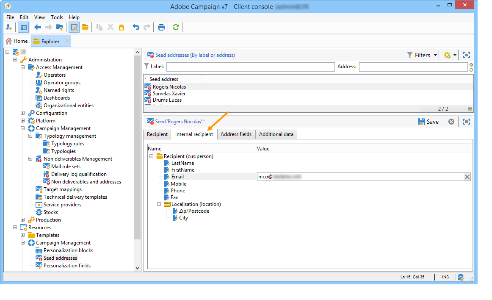

# Direcciones semilla{#seed-addresses}

Si la tabla de destinatarios es una tabla personalizada, se requieren configuraciones adicionales. Se debe ampliar el esquema **[!UICONTROL nms:seedMember]**. Se añade una pestaña adicional a las direcciones semilla para definir los campos adecuados, como se muestra a continuación:



Para obtener más información sobre el uso de las direcciones semilla, consulte [esta sección](../../delivery/using/about-seed-addresses.md).

## Implementación {#implementation}

El esquema **nms:seedMember** y el formulario vinculado que se incluye deben ampliarse para la configuración del cliente, a fin de hacer referencia a todos los campos necesarios. La definición del esquema contiene comentarios que detallan su modo de configuración.

Definición del esquema ampliado de la tabla de destinatarios:

```
<srcSchema label="Person" name="person" namespace="cus">
  <element autopk="true" label="Person" name="person">
      <attribute label="LastName" name="lastname" type="string"/>
      <attribute label="FirstName" name="firstname" type="string"/>
    <element label="Address" name="address">
      <attribute label="Email" name="addrEnv" type="string"/>
    </element>
    <attribute label="Code Offer" name="codeOffer" type="string"/>
  </element>
</srcSchema>
```

Siga estos pasos:

1. Cree una extensión del esquema **nms:seedMember**. Para obtener más información, consulte [Ampliación de un esquema](../../configuration/using/extending-a-schema.md).
1. En esta nueva extensión, agregue un nuevo elemento en la raíz de **[!UICONTROL seedMember]** con los siguientes parámetros:

   ```
   name="custom_customNamespace_customSchema"
   ```

   Este elemento debe contener los campos necesarios para exportar las campañas. Estos campos deben tener el mismo nombre que los campos correspondientes del esquema externo. Por ejemplo, si el esquema es **[!UICONTROL cus:person]** , el esquema **[!UICONTROL nms:seedMember]** debe ampliarse de la siguiente manera:

   ```
     <srcSchema extendedSchema="nms:seedMember" label="Seed addresses" labelSingular="Seed address" name="seedMember" namespace="cus">
     <element name="common">
       <element name="custom_cus_person">
         <attribute name="lastname" template="cus:person:person/@lastname"/>
         <attribute name="firstname" template="cus:person:person/@firstname"/>
         <attribute name="email" sqlname="myEmailField" template="cus:person:person/address/@addrEnv" xml="false"/>
       </element>
     </element>
     <element name="seedMember">
      <element aggregate="cus:seedMember:common"/>
     </element>
   </srcSchema>
   ```

   >[!NOTE]
   >
   >La extensión del esquema **nms:seedMember** debe cumplir con las estructuras de una campaña y un envío en Adobe Campaign.

   >[!IMPORTANT]
   >
   >
   >    
   >    
   >    * Durante la extensión, debe especificar un **SQL name (@sqlname)** para el campo &quot;correo electrónico&quot;. El nombre SQL debe diferir del &quot;sEmail&quot; reservado para el esquema de destinatario.
   >    * Debe actualizar la estructura de la base de datos con el esquema creado al ampliar **nms:seedMember**.
   >    * En la extensión **nms:seedMember**, el campo que contiene la dirección de correo electrónico debe tener **name=&quot;email&quot;** como atributo. El nombre SQL debe ser diferente de &#39;sEmail&#39; que ya se utiliza para el esquema de destinatario. Este atributo debe declararse inmediatamente en el elemento **`<element name="custom_cus_person" />`**.


1. Modifique el formulario **[!UICONTROL seedMember]** en consecuencia para definir una nueva pestaña &quot;Internal recipient&quot; en la ventana **[!UICONTROL Seed addresses]**. Para obtener más información, consulte [Estructura del formulario](../../configuration/using/form-structure.md).

   ```
   <container colcount="2" label="Internal recipient" name="internal"
                xpath="custom_cus_person">
       <input colspan="2" editable="true" nolabel="true" type="treeEdit">
         <container label="Recipient (cus:person)">
           <input xpath="@last name"/>
           <input xpath="@first name"/>
           <input xpath="@email"/>
         </container>
       </input>
     </container>
   ```

Si no se introducen todos los atributos de la dirección semilla, Adobe Campaign sustituye automáticamente los perfiles: se introducen automáticamente durante la personalización mediante datos de un perfil existente.
