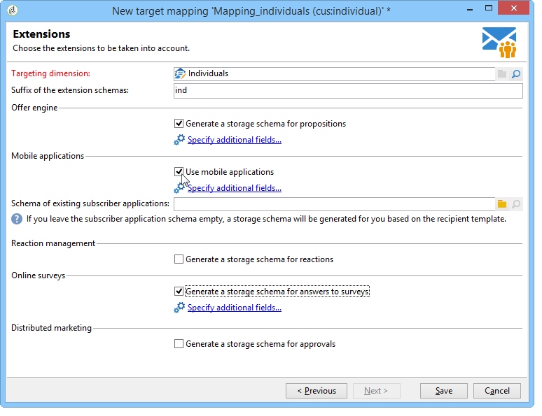

# Asignación de destino{#target-mapping}

La creación de la asignación de destino es necesaria en dos casos:

* si utiliza una tabla de destinatarios distinta de la proporcionada por Adobe Campaign,
* si configura una dimensión de filtrado diferente de la dimensión de segmentación estándar en la pantalla de asignación de destino.

El asistente de creación de asignación de destino le ayudará a crear todos los esquemas necesarios para utilizar la tabla personalizada.

## Creación y configuración de esquemas vinculados a la tabla personalizada {#creating-and-configuring-schemas-linked-to-the-custom-table}

Antes de crear una asignación de destino, son necesarias varias configuraciones para que Adobe Campaign funcione con un nuevo esquema de datos de destinatario.

Para ello, siga los siguientes pasos:

1. Cree un nuevo esquema de datos que integre los campos de la tabla personalizada que desea utilizar.

   Para obtener más información, consulte [Referencia de esquema (xtk:srcSchema)](../../configuration/using/about-schema-reference.md).

   En nuestro ejemplo, crearemos un esquema de cliente, una tabla muy sencilla que contiene los siguientes campos: ID, nombre, apellidos, dirección de correo electrónico, número de teléfono móvil. El objetivo es poder enviar alertas por correo electrónico o SMS a las personas almacenadas en esta tabla.

   Ejemplo de esquema (cus:individual)

   ```
   <srcSchema name="individual" namespace="cus" label="Individuals">
     <element name="individual">
       <key name="id" internal="true">
         <keyfield xpath="@id"/>
       </key>
       <attribute name="id" type="long" length="32"/>
       <attribute name="lastName" type="string" length="100"/>
       <attribute name="firstName" type="string" length="100"/>
       <attribute name="email" type="string" length="100"/>
       <attribute name="mobile" type="string" length="100"/>
     </element>
   </srcSchema>
   ```

1. Declare el esquema como una vista externa utilizando el atributo =&quot;true&quot;. Consulte [El atributo de vista](../../configuration/using/schema-characteristics.md#the-view-attribute).

   ```
    <srcSchema desc="External recipient table" namespace="cus" view="true"....>
      ...
    </srcSchema>
   ```

1. Si necesita añadir una dirección de correo postal, utilice el siguiente tipo de estructura:

   ```
   <element advanced="true" name="postalAddress" template="nms:common:postalAddress">
        <attribute expr="SubString(JuxtWords(Smart([../infos/@firstname]), Upper([../infos/@name])), 1, 80)"
                   name="line1"/>
        <attribute expr="Upper([../address/@line2])" name="line2"/>
        <attribute expr="Upper([../address/@line])" name="line3"/>
        <attribute expr="Upper([../address/@line])" name="line4"/>
        <attribute expr="Upper([../address/@line])" name="line5"/>
        <attribute expr="Upper([../address/@line])" name="line6"/>
        <attribute _operation="delete" name="line7"/>
        <attribute _operation="delete" name="addrErrorCount"/>
        <attribute _operation="delete" name="addrQuality"/>
        <attribute _operation="delete" name="addrLastCheck"/>
        <element expr="@line1+'n'+@line2+'n'+@line3+'n'+@line4+'n'+@line5+'n'+@line6"
                 name="serialized"/>
        <attribute expr="AllNonNull2([../address/@line], [../infos/@name])" name="addrDefined"/>
      </element>
   ```

1. Haga clic en el nodo **[!UICONTROL Administration > Campaign management > Target mappings]**.
1. Haga clic en el botón **New** para abrir el asistente de creación de asignación de destino.
1. Introduzca el campo **Label** y seleccione el esquema que acaba de crear en el campo **Targeting dimension**.

   

1. En la ventana **Edit address forms** , seleccione los campos del esquema que coinciden con las distintas direcciones de envío. Aquí, podemos asignar los campos **@email** y **@mobile**.

   

1. En la siguiente ventana **Storage** , introduzca el campo **Sufijo de los esquemas de extensión** para diferenciar los nuevos esquemas de los esquemas predeterminados que proporciona Adobe Campaign.

   Haga clic en **[!UICONTROL Define new additional fields]** para seleccionar la dimensión a la que desea dirigirse en el envío.

   De forma predeterminada, la gestión de exclusión se almacena en las mismas tablas que los mensajes. Marque la casilla **Generate a storage schema for tracking** si desea configurar el almacenamiento para el seguimiento vinculado a la asignación de destino.

   

   >[!IMPORTANT]
   >
   >Adobe Campaign no admite varios esquemas de destinatarios, conocidos como esquemas de segmentación, vinculados a los mismos esquemas de broadlog o trackinglog. De lo contrario, esto puede provocar anomalías en la reconciliación de datos posteriormente. Para obtener más información, consulte la página [Recomendaciones y limitaciones](../../configuration/using/about-custom-recipient-table.md) .

1. En la ventana **Extensions**, seleccione los esquemas opcionales que desea generar (la lista de esquemas disponibles depende de los módulos instalados en la plataforma de Adobe Campaign).

   

1. Haga clic en el botón **Save** para cerrar el asistente.

   El asistente utiliza el esquema de inicio para crear todos los demás esquemas necesarios para hacer que funcione la nueva asignación de destino.

   

## Uso de la asignación de destino {#using-target-mapping}

Existen dos formas de utilizar el nuevo esquema como destinatario de una entrega:

* Creación de una o más plantillas de envío basadas en la asignación
* Seleccione la asignación directamente durante la selección de destino al crear una entrega, como se muestra a continuación:


**Tema relacionado**

* [Responder rápidamente a las solicitudes de los clientes para acceder a sus datos](https://helpx.adobe.com/campaign/kb/simplifying-campaign-management-acc.html#Quicklyrespondtocustomerrequeststoaccesstheirdata)
