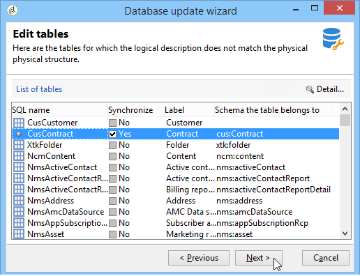

# Actualización de la estructura de la base de datos{#updating-the-database-structure}

Para aplicar las modificaciones realizadas a los esquemas, inicie el asistente para la actualización de la base de datos. Se puede acceder a este asistente mediante **[!UICONTROL Tools > Advanced > Update database structure]**. Comprueba si la estructura física de la base de datos coincide con su descripción lógica y ejecuta las secuencias de comandos de actualización SQL.

Los módulos de la base de datos se rellenan y activan automáticamente.

Las opciones **[!UICONTROL Add stored procedures]** y **[!UICONTROL Import initialization data]** se utilizan para iniciar las secuencias de comandos SQL iniciales y las paquetes de datos ejecutadas cuando se crea la base de datos.

Puede importar un conjunto de datos desde un paquete de datos externo. Para ello, seleccione **[!UICONTROL Import a package]** e introduzca el archivo XML del paquete.

Siga los pasos y la vista del script SQL de actualización de la base de datos:

>[!NOTE]
>
>Esto se encuentra en un campo de edición y se puede modificar para eliminar o agregar código SQL.

A continuación, inicie la actualización de la base de datos:

