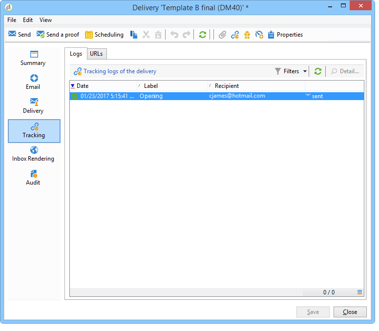

# Prueba AB: Análisis del resultado {#step-8--analyzing-the-result}

Una vez remitidos los envíos de prueba, se puede comprobar los destinatarios a los que se han enviado y si se han abierto o no.

* Para saber cuáles fueron los destinatarios objetivo, abra una entrega a través del panel de control de campañas y haga clic en la pestaña **[!UICONTROL Delivery]**.

  

* Para averiguar si la entrega se ha abierto, vaya a la pestaña **[!UICONTROL Tracking]**.

  

* Compare con el otro entrega.

  

En el ejemplo, la entrega B ha obtenido la mayor tasa de apertura. Esto significa que el contenido B se utilizará para la entrega final.

