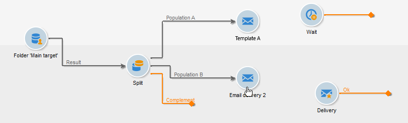

# Configurar los envíos en el flujo de trabajo {#step-4--configuring-the-deliveries-in-the-workflow}

Una vez que [se hayan creado las poblaciones](a-b-testing-uc-population-samples.md), puede configurar los envíos. En este caso de uso, las dos primeras entregas permiten enviar contenido diferente a las poblaciones A y B. La tercera entrega es la entrega posterior: se envía a los destinatarios que no pertenecen a A ni B. Su contenido se calcula mediante una secuencia de comandos y es idéntico a A o B, dependiendo de cuál obtuvo la tasa de apertura más alta. Es necesario configurar un periodo de espera para la tercera entrega, para averiguar el resultado de los envíos A y B. Esta es la razón por la que la tercera entrega incluye una actividad **[!UICONTROL Wait]**.

1. Vaya a la actividad **[!UICONTROL Split]** y vincule la transición destinada a la población A a uno de los envíos de correo electrónico que ya se encuentran en el flujo de trabajo.

   

1. Haga doble clic en la entrega para abrirlo.
1. En la lista desplegable, seleccione la plantilla para la entrega A.

   

1. Haga clic en **[!UICONTROL Continue]** para ver la entrega y, a continuación, guárdelo.

   

1. Vincule la transición de la actividad **[!UICONTROL Split]** de la población B al segundo entrega de correo electrónico.

   

1. Abra la entrega, seleccione la plantilla en la entrega B y, a continuación, guarde la entrega.

   

1. Vincule la transición destinada a la población restante a la actividad **[!UICONTROL Wait]**.

   

1. Abra la actividad **[!UICONTROL Wait]** y configure un periodo de espera de 5 días.

   

1. Vincule la actividad **[!UICONTROL Wait]** a la actividad **[!UICONTROL JavaScript code]**.

   

Ahora puede crear la secuencia de comandos. [Más información](a-b-testing-uc-script.md).
