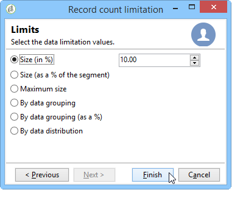

# Configuración de muestras de población {#step-2--configuring-population-samples}

## Configuración de la actividad de consulta {#configuring-the-query-activity}

* Haga doble clic en la actividad **[!UICONTROL Query]**.

   

* Haga clic en el vínculo **[!UICONTROL Edit query]** y seleccione los destinatarios a quienes desee dirigirse.

   

* Vincule la actividad **[!UICONTROL Query]** a la actividad **[!UICONTROL Split]**.

   

## Configuración de la actividad Split {#configuring-the-split-activity}

Esta actividad permite crear varias poblaciones: la que recibe la entrega A, la que recibe la entrega B y la población restante. El uso de la selección aleatoria permite seleccionar solo parte de la población de cada entrega.

1. Creación de la población A:

   * Haga doble clic en la actividad **[!UICONTROL Split]**.

      

   * En la pestaña existente, cambie la etiqueta a población A.

      

   * Seleccione la opción **[!UICONTROL Limit the selected records]**.

      

   * Haga clic en el vínculo **[!UICONTROL Edit]**, seleccione **[!UICONTROL Activate random sampling]** y haga clic en **[!UICONTROL Next]**.

      

   * Defina el umbral en 10 % y haga clic en **[!UICONTROL Finish]**.

      

1. Creación de la población B:

   * Haga clic en **[!UICONTROL Add]** para crear una nueva pestaña para la población B.

      

   * Limite la población al 10% como se mostró anteriormente.

      

1. Creación de la población restante:

   * Vaya a la pestaña **[!UICONTROL General]**.

      

   * Seleccione **[!UICONTROL Generate complement]**.

      

   * Cambie la etiqueta para especificar que esta población no incluye A ni B y haga clic en **[!UICONTROL OK]** para cerrar la actividad.

      

Ahora puede crear las dos plantillas de envío (consulte el [Paso 3: Creación de dos plantillas de envío](../../delivery/using/a-b-testing-uc-delivery-templates.md)).
