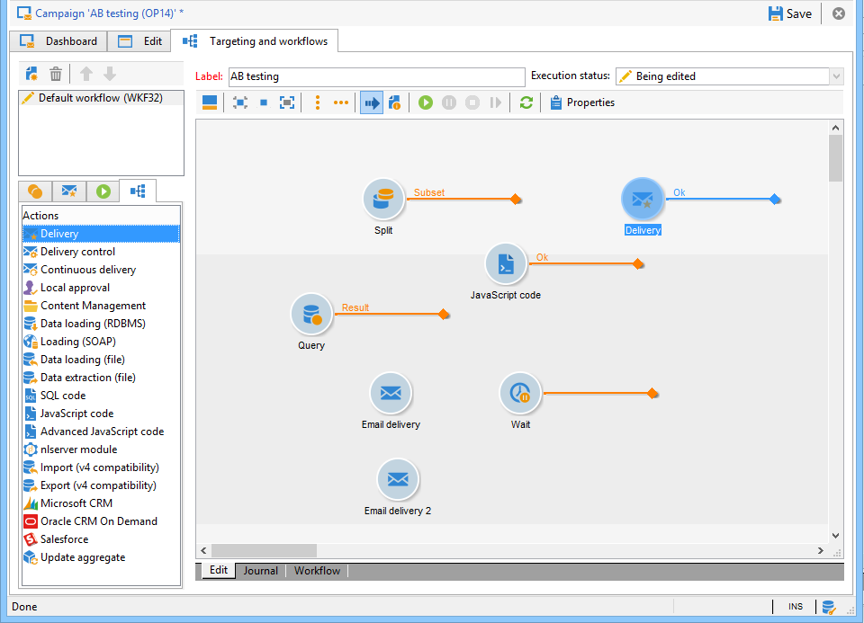

# Creación de un flujo de trabajo de objetivos {#step-1--creating-a-targeting-workflow}

Se debe crear el flujo de trabajo en la pestaña **[!UICONTROL Targeting and Workflows]** de una campaña. Se compone de una actividad **[!UICONTROL Query]**, una actividad **[!UICONTROL Split]** vinculada a dos actividades **[!UICONTROL Email delivery]**, una actividad **[!UICONTROL Wait]**, una actividad **[!UICONTROL JavaScript code]** y una actividad **[!UICONTROL Delivery]**.

1. Si aún no lo ha hecho, cree una campaña (para obtener más información, consulte esta [sección](../../campaign/using/setting-up-marketing-campaigns.md#creating-a-campaign)).

   

1. Vaya a la pestaña **[!UICONTROL Targeting and Workflows]**.

   

1. Cambie la etiqueta del flujo de trabajo existente o haga clic en **[!UICONTROL Add]** para crear una nueva (para obtener más información, consulte esta [sección](../../campaign/using/marketing-campaign-deliveries.md#selecting-the-target-population)).

   

1. Utilice el ratón para arrastrar y colocar actividades en el diagrama de flujo de trabajo, incluido una **[!UICONTROL Query]** (pestaña **[!UICONTROL Target]**), un **[!UICONTROL Split]** (pestaña **[!UICONTROL Target]**), dos **[!UICONTROL Email deliveries]**(pestaña **[!UICONTROL Deliveries]**), una actividad **[!UICONTROL Wait]** (pestaña **[!UICONTROL Flow Control]**), una actividad **[!UICONTROL JavaScript code]** (pestaña **[!UICONTROL Actions]**) y una actividad **[!UICONTROL Delivery]** (pestaña **[!UICONTROL Actions]**).

