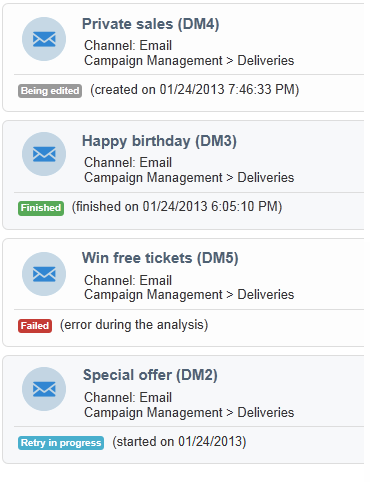

# Acceso a la información de los envíos{#accessing-deliveries-information}

## Acceso a la lista de envíos {#accessing-the-list-of-deliveries}

To access the list of deliveries, go to the **[!UICONTROL Campaigns]** universe and click the **[!UICONTROL Deliveries]** link.

If you use [the Explorer view](../../platform/using/adobe-campaign-workspace.md#about-adobe-campaign-explorer), you can access all deliveries via the **[!UICONTROL Campaign management > Deliveries]** node in the tree.

>[!NOTE]
>
>El espacio de trabajo de Adobe Campaign se muestra en [esta sección](../../platform/using/adobe-campaign-workspace.md).

Esta página permite acceder a una vista general de los envíos: muestra todos los envíos de la base de datos. Se puede ver su estado, su tasa de éxito y las fechas de modificación.

>[!NOTE]
>
>El filtrado de información se muestra en [esta sección](../../platform/using/filtering-options.md).

El asistente de envío permite configurar los envíos, iniciar el proceso de aprobación y enviarlos. El contenido del asistente depende del canal de comunicación (correo electrónico, móvil, push, correo postal) y de los derechos de los operadores.

Para manipular los envíos en la lista, haga clic en un envío. Se abre en una ventana nueva donde puede confirmar su envío o pausarlo, por ejemplo.

Dependiendo del escenario del ciclo de envío, los principales estados posibles son:

* Cancelado
* Error
* Pendiente
* Finalizado
* En pausa
* Reintento pendiente
* En curso
* Listo para distribución
* Preparación en curso
* Cálculo del destino
* Edición en curso

Cada estado tiene su propio color y etiqueta.

The drop-down list next to the **[!UICONTROL Create]** button enables you to filter deliveries based on their status.

## Acceso al calendario de envíos {#accessing-the-delivery-calendar}

To access the delivery calendar, go to the **[!UICONTROL Campaign]** universe and click the **[!UICONTROL Campaign calendar]** link. Este calendario muestra el desglose de las campañas a lo largo del tiempo. Se puede personalizar la pantalla por mes, semana o día.

Haga clic en el nombre de un envío para visualizar la información principal sobre el mismo. You can also open the campaign if necessary by clicking **[!UICONTROL Open]**.

## Acceso a la información de rendimiento de los envíos {#accessing-deliveries-throughput-information}

The information on the **[!UICONTROL Delivery throughput]** page concerns all the deliveries of the platform. Para medir la velocidad a la que se envían los mensajes, los criterios son la cantidad de mensajes enviados por hora y el tamaño de los mensajes (en bits por segundo). En el siguiente ejemplo, el primer gráfico muestra los envíos correctos en azul y la cantidad de envíos incorrectos en naranja.

Puede elegir el periodo de tiempo en el que se calcula el rendimiento. To do this, select the value from the drop-down list, and then click **[!UICONTROL Refresh]**.

>[!NOTE]
>
>En el caso de instalaciones alojadas o híbridas, si ha actualizado a la MTA mejorada, la página ya no mostrará el rendimiento a los destinatarios de correo electrónico. **[!UICONTROL Delivery throughput]** Mostrará la velocidad de transferencia para el reenvío de sus mensajes desde Campaign hasta el MTA mejorado.
>
>Para obtener más información sobre el MTA mejorado de Adobe Campaign, consulte este [documento](https://helpx.adobe.com/campaign/kb/campaign-enhanced-mta.html).