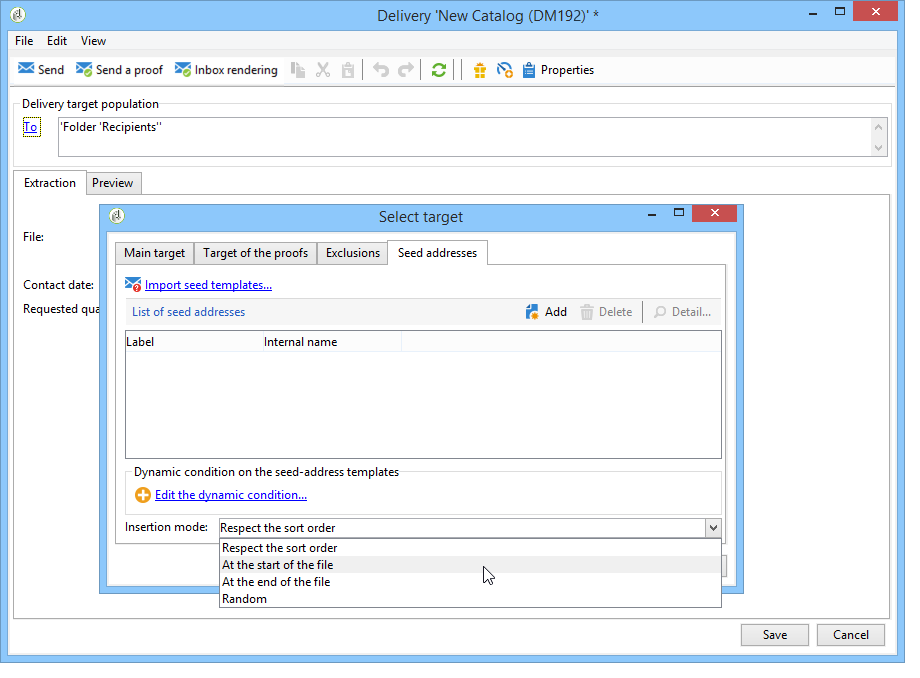

# Adición de direcciones semilla{#adding-seed-addresses}

## Direcciones semilla en una entrega {#seed-addresses-in-a-delivery}

Para añadir direcciones semilla específicas a una entrega, haga clic en el vínculo **[!UICONTROL To]** y después seleccione la pestaña **[!UICONTROL Seed addresses]**.

Hay tres modos de inserción posibles:

1. Introducción de direcciones semilla individuales.

   Para ello, haga clic en el botón **[!UICONTROL Add]** y defina el contenido de los campos de dirección. Repita este proceso para cada dirección.

1. Importación de plantillas de direcciones y adaptación a sus necesidades.

   Para ello, haga clic en el enlace **[!UICONTROL Import seed templates...]** y seleccione la carpeta que contiene las plantillas de dirección. Para obtener más información, consulte [esta sección](../../delivery/using/creating-seed-addresses.md#creating-seed-address-templates).

   Si es necesario, una vez añadidas, se puede hacer doble clic en ellas o hacer clic en el botón **[!UICONTROL Detail...]** para adaptar el contenido de cada dirección.

1. Creación de una condición para seleccionar de forma dinámica los directorios de control que desea insertar.

   Para ello, haga clic en el enlace **[!UICONTROL Edit the dynamic condition...]** e introduzca los parámetros de selección de las direcciones semilla. Por ejemplo, puede incluir todas las direcciones semilla que contenga una carpeta específica o las pertenecientes a un departamento específico de su organización.

   En esta sección se presenta un ejemplo de esto: [Caso de uso: selección de direcciones semilla en los criterios](../../delivery/using/use-case--selecting-seed-addresses-on-criteria.md).

>[!NOTE]
>
>Esta opción se usa cuando la tabla de destinatarios utilizada no es la tabla predeterminada **nms:recipient** y está utilizando la funcionalidad de renderización de la bandeja de entrada proporcionada con el módulo **[!UICONTROL Deliverability]** de Adobe Campaign.
>
>Para obtener más información, consulte [Uso de una tabla de destinatarios externa](../../delivery/using/using-an-external-recipient-table.md) y la documentación sobre la [Renderización de la bandeja de entrada](../../delivery/using/inbox-rendering.md).

Para las entregas, también se puede personalizar la forma en que se insertan las direcciones en los archivos de extracción. De forma predeterminada, se insertan en el orden de clasificación del archivo de salida, pero se puede elegir insertarlos al final o al principio del archivo o aleatoriamente entre los receptores del destino principal.

## Direcciones semilla en una campaña {#seed-addresses-in-a-campaign}

Para añadir direcciones semilla a un destinatario para una campaña, seleccione la operación y haga clic en la pestaña **[!UICONTROL Edit]**.

Haga clic en el enlace **[!UICONTROL Advanced campaign settings...]** y luego en la pestaña **[!UICONTROL Seed addresses]**, como se muestra a continuación:

Las direcciones semilla insertadas desde la campaña se añaden al objetivo de cada envío de la campaña.
