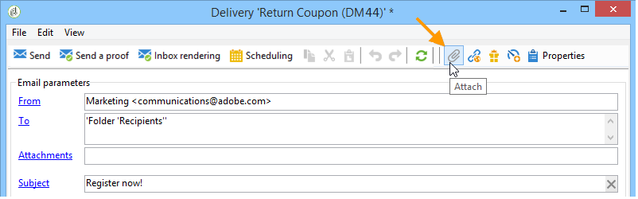
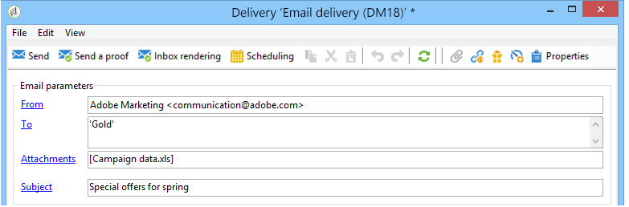
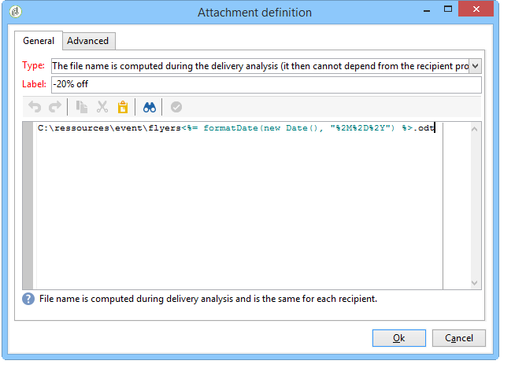
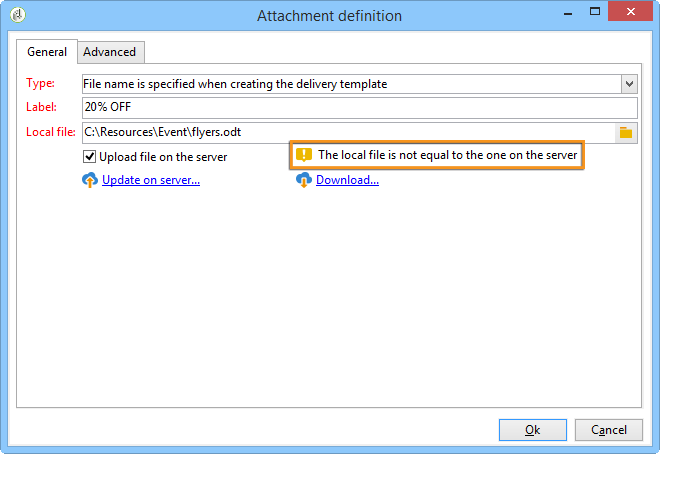

# Archivos adjuntos{#attaching-files}

## Acerca de los archivos adjuntos por correo electrónico {#about-email-attachments}

Puede adjuntar uno o varios archivos a un envío de correo electrónico. Hay dos casos posibles:

* Seleccione un archivo y adjúntelo al envío tal cual.
* Personalice el contenido del archivo adjunto para cada destinatario. In this case, you need to create a **calculated attachment**: the name of the attachment is computed at the time of delivery for each message depending on the recipient. El contenido también se puede personalizar y convertir en formato PDF en el momento del envío si tiene la opción **Impresión digital de variable**.

>[!NOTE]
>
>Este tipo de configuración se suele aplicar a las plantillas de envío. For more on this, refer to [About templates](../../delivery/using/about-templates.md).

## Adjuntar un archivo local {#attaching-a-local-file}

Para adjuntar un archivo local a una entrega, siga los pasos a continuación.

>[!NOTE]
>
>Puede adjuntar varios archivos a una entrega. Los archivos adjuntos pueden tener cualquier formato, incluido el formato compactado.

1. Haga clic en el **[!UICONTROL Attachments]** vínculo.
1. Haga clic en el **[!UICONTROL Add]** botón y, a continuación, haga clic **[!UICONTROL File...]** para seleccionar el archivo que se adjuntará al envío.

También puede arrastrar y soltar directamente el archivo en el campo de envío **[!UICONTROL Attachments]** , o bien utilizar el icono **[!UICONTROL Attach]** de la barra de herramientas del asistente de envío,

1. Una vez seleccionado el archivo, se carga inmediatamente en el servidor para que esté disponible en el momento de la entrega. Se muestra en el **[!UICONTROL Attachments]** campo.

## Creación de archivos adjuntos calculados {#creating-a-calculated-attachment}

Al crear un archivo adjunto calculado, el nombre del archivo adjunto se puede calcular durante el análisis o el envío de cada mensaje y puede depender del destinatario. También se puede personalizar y convertir a PDF.

Para crear un archivo adjunto personalizado, siga estos pasos:

1. Haga clic en el **[!UICONTROL Attachments]** vínculo.
1. Haga clic en el **[!UICONTROL Add]** botón y seleccione **[!UICONTROL Calculated attachment]**.
1. Select the type of calculation from the **[!UICONTROL Type]** drop-down list:

Estas son las opciones disponibles:

* **El nombre del archivo se especifica al crear la plantilla de envío.**
* **El contenido del archivo se personaliza y se convierte a PDF durante el envío de cada mensaje.**
* **El nombre del archivo se calcula durante el análisis del envío (no puede depender del perfil del destinatario).**
* **El nombre del archivo se calcula en el momento del envío para cada destinatario (puede depender del destinatario).**

### Adjuntar un archivo local {#attach-a-local-file}

If the attachment is a local file, select the option: **[!UICONTROL File name is specified when creating the delivery template]**. El archivo se selecciona localmente y se carga en el servidor. Siga estos pasos:

1. Select the file to upload in the **[!UICONTROL Local file]** field.
1. Especifique la etiqueta si es necesario. La etiqueta sustituye al nombre de archivo cuando se visualiza en los sistemas de mensajería. Si no se especifica nada, se utiliza el nombre de archivo de forma predeterminada.

   

1. Si es necesario, seleccione **[!UICONTROL Upload file on the server]** y haga clic en **[!UICONTROL Update on server]** para iniciar la transferencia.

   

   A continuación, el archivo está disponible en el servidor para asociarlo a los diferentes envíos creados a partir de esta plantilla.

### Adjuntar un mensaje personalizado {#attach-a-personalized-message}

The option **[!UICONTROL The file content is personalized and converted into PDF format at the time of delivery for each message]** lets you select a fine with personalization fields, such as the last name and first name of the intended recipient.

Para este tipo de archivos adjuntos, aplique los siguientes pasos de configuración:

1. Seleccione el archivo que desea subir.

   >[!NOTE]
   >
   >El archivo de origen debe crearse en LibreOffice. La instancia debe configurarse en consonancia con los requisitos previos detallados en [esta sección](../../installation/using/before-starting.md).

1. Especifique la etiqueta si es necesario.
1. Seleccione **[!UICONTROL Upload file on the server]** y, a continuación, haga clic **[!UICONTROL Update on server]** para iniciar la transferencia.
1. Puede mostrar una previsualización. Para ello, seleccione un destinatario.

   

1. Analice su envío y, a continuación, inícielo.

   Cada destinatario recibe un PDF personalizado adjunto al envío.

   

### Adjuntar un archivo calculado {#attach-a-calculated-file}

Puede calcular el nombre del archivo adjunto durante la preparación del envío. Para ello, seleccione la opción **[!UICONTROL The file name is calculated during delivery analysis (it cannot depend on the recipient)]**.

>[!NOTE]
>
>Esta opción solo se utiliza cuando el envío se realiza mediante un proceso externo o un flujo de trabajo.

1. Especifique la etiqueta que desea aplicar al archivo adjunto.
1. Especifique la ruta de acceso del archivo y su nombre exacto en la ventana de definición.

   >[!CAUTION]
   >
   >El archivo debe estar presente en el servidor.

   

1. Analice y, a continuación, inicie su envío.

   El nombre de archivo se puede ver en el “log” de análisis.

   

### Adjuntar un archivo personalizado {#attach-a-personalized-file}

Al seleccionar los datos adjuntos, puede elegir la opción **[!UICONTROL The file name is calculated during delivery for each recipient (it can depend on the recipient)]**. A continuación, puede asignar los datos de personalización del destinatario con el nombre del archivo que se va a enviar.

>[!NOTE]
>
>Esta opción solo se utiliza cuando el envío se realiza mediante un proceso externo o un flujo de trabajo.

1. Especifique la etiqueta que desea aplicar al archivo adjunto.
1. Especifique la ruta de acceso del archivo y su nombre exacto en la ventana de definición. Si el nombre de archivo es personalizado, puede utilizar los campos personalizados para los valores relevantes.

   

   >[!CAUTION]
   >
   >El archivo debe estar presente en el servidor.

1. Analice y, a continuación, inicie su envío.

   En el ejemplo que se muestra a continuación, el archivo adjunto se eligió en función del nombre definido con los campos de combinación.

   

### Configuración de archivos adjuntos {#attachment-settings}

For the first two options, you can choose **[!UICONTROL Upload file on the server]** by selecting the appropriate option. El **[!UICONTROL Update the file on the server]** vínculo le permite empezar a cargar.

Un mensaje le informa de que el archivo se ha cargado en el servidor:

Al tratar de cambiar el archivo, aparece un mensaje de advertencia:

The **[!UICONTROL Advanced]** tab lets you define advanced options on attached files:

* Puede definir opciones de filtro para evitar enviar el archivo adjunto a todos los destinatarios. The option **[!UICONTROL Enable filtering of recipients who will receive the attachment]** activates an input field used to define a recipient selection script, which must be entered in JavaScript.
* Puede crear una secuencia de comandos del nombre del archivo para personalizarlo.

   Introduzca el texto en la ventana y utilice los campos personalizados disponibles en la lista desplegable. En el ejemplo siguiente, el nombre de archivo está personalizado para contener la fecha del día y el nombre del destinatario.

   
