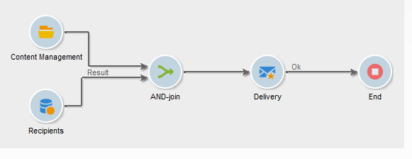
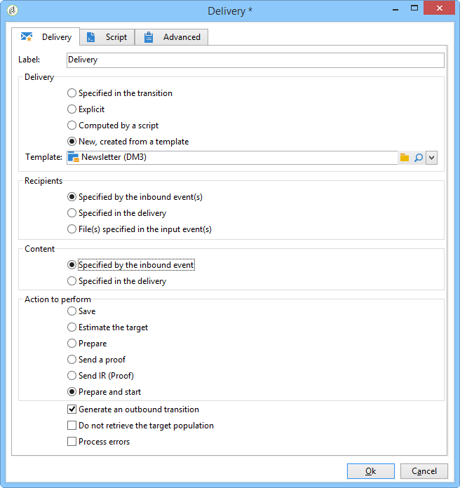
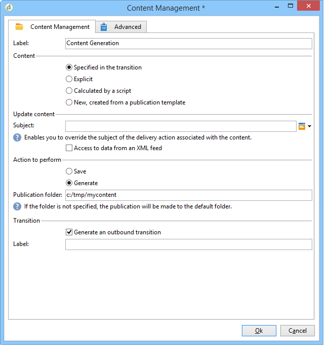

# Automatización mediante flujos de trabajo{#automating-via-workflows}

## Actividad de gestión de contenido {#content-management-activity}

La creación, edición y publicación de contenido puede automatizarse mediante un flujo de trabajo configurado a través de la interfaz de cliente de Adobe Campaign.

Se accede a la actividad de **Gestión de contenido** a través de la barra de herramientas **[!UICONTROL Tools]** del diagrama de flujo de trabajo.

Las propiedades de actividad se dividen en cuatro pasos:

* **[!UICONTROL Content]** : permite introducir contenido existente o crear contenido,
* **[!UICONTROL Update content]** : permite modificar el asunto del contenido o actualizar el contenido a través de un flujo de datos XML,
* **[!UICONTROL Action to execute]**: le permite guardar o generar contenido,
* **[!UICONTROL Transition]** : permite elegir si generar o no una transición de salida y asignarle un nombre.


### Content {#content}

* **Especificado por la transición**

   El contenido que se va a utilizar se había creado anteriormente. Los procesos afectan a la instancia de contenido propagada por el evento entrante. Se accede al identificador de contenido a través de la variable “contentId” del evento.

* **Explícito**

   Permite elegir el contenido creado anteriormente.

* **Calculado por una secuencia de comandos**

   Selecciona una instancia de contenido basándose en una plantilla JavaScript. El código que se va a evaluar permite recuperar el identificador de contenido.

* **Nuevo, creado mediante una plantilla de publicación**

   Crea un nuevo contenido a través de una plantilla de publicación. La instancia de contenido se guarda en la carpeta rellenada “Cadena”.

### Actualización del contenido {#update-the-content}

* **Asunto**

   Permite modificar el asunto de la acción de entrega al publicar.

* **Acceso a los datos desde una fuente XML**

   El contenido se actualiza desde una fuente XML desde un origen externo. Se debe introducir una dirección URL para la descarga de datos.

   Se puede utilizar una hoja de estilo XSL para transformar los datos XML entrantes.

### Acción que quiere ejecutar {#action-to-execute}

* **Guardar**

   Guarda el contenido creado o modificado. El identificador del contenido guardado se propaga en la variable “contentId” del evento saliente.

* **Generación**

   Genera los archivos de salida para cada una de las plantillas de transformación con una publicación de tipo “Archivo”. La transición saliente se activa para cada archivo generado, con los siguientes parámetros: el identificador del contenido guardado en la variable “contentId” y el nombre de archivo en la variable “filename”.

### Transición {#transition}

La opción **Generar una transición de salida** le permite añadir una transición de salida a la actividad **[!UICONTROL Content management]** para vincular una nueva actividad a la ejecución del flujo de trabajo. Tras comprobar esta opción, introduzca una etiqueta para la transición.

## Ejemplos {#examples}

### Automatización de la creación y la entrega de contenido {#automating-content-creation-and-delivery}

El siguiente ejemplo automatiza la creación y la entrega de un bloque de contenido.



El contenido se configura mediante la actividad “Gestión de contenido”:


Se crea una nueva instancia de contenido mediante el modelo de publicación y la carpeta de cadena de contenido.

En nuestro ejemplo, hemos sobrecargado al asunto de la entrega. Se tiene en cuenta en lugar del introducido en la plantilla **[!UICONTROL Delivery]**.

El contenido se rellena automáticamente mediante una fuente XML procedente de la URL introducida:

```
<?xml version='1.0' encoding='ISO-8859-1'?>
<book name="Content automation test" date="2008/06/08" language="eng" computeString="Content automation test">
  <section id="1" name="Introduction">
    <page>Introduction to input forms.</page>
  </section>
</book>
```

El formato de datos no coincide con el esquema de datos introducido en la plantilla de publicación (**cus:book** en nuestro ejemplo); el elemento **`<section>`** debe reemplazarse con el elemento **`<chapter>`**. Necesitamos aplicar la hoja de estilo “cus:book-workflow.xsl” para realizar los cambios necesarios.

Código fuente de la hoja de estilo XSLT utilizada:

```
<?xml version="1.0" encoding="utf-8"?>
<xsl:stylesheet version="1.0" xmlns:xsl="http://www.w3.org/1999/XSL/Transform">
 <xsl:output indent="yes" method="xml"  encoding="ISO-8859-1"/>

 <xsl:template match="text()|@*"/>

  <xsl:template match="*">
    <xsl:variable name="element.name" select="name(.)"/>
    <xsl:element name="{$element.name}">
      <xsl:copy-of select="text()|@*"/>
      <xsl:apply-templates/>
    </xsl:element>
  </xsl:template>

  <xsl:template match="book">
  <book name="test">
     <xsl:apply-templates/>
    <book>
 </xsl:template>

  <xsl:template match="section">
    <chapter>
      <xsl:for-each select="@*">
        <xsl:copy-of select="."/>
      </xsl:for-each>
       <xsl:apply-templates/>
    </chapter>
  </xsl:template>
  
</xsl:stylesheet>
```

La acción final de la actividad es guardar la instancia de contenido y continuar con la siguiente tarea.

El establecimiento de destinos se realiza mediante la actividad **Query**.

Se ha añadido una actividad **AND-join** para asegurarse de que la entrega solo se inicia una vez que se hayan completado la consulta de destino y las actualizaciones de contenido.

La acción de entrega se configura mediante la actividad **Delivery**:



Se crea una nueva acción de entrega basada en una plantilla.

La plantilla de entrega de la actividad se utiliza para seleccionar las plantillas de transformación de la plantilla de publicación. La generación de contenido tiene en cuenta todas las plantillas HTML y plantillas de texto sin plantillas de entrega o aquellas a las que se hace referencia con la misma plantilla que la actividad.

El destino al que se envía se introduce a través del evento entrante.

El contenido de la entrega se rellena mediante el evento entrante.

El último paso para completar la actividad son la preparación y el inicio de la entrega.

### Creación de contenido y posterior publicación {#creating-content-and-publishing-it-later}

En este ejemplo se crea un bloque de contenido y se inicia la publicación de archivos después de un tiempo específico de retardo.


La primera tarea **Content management** crea un entorno de contenido.


>[!NOTE]
>
>La pestaña **[!UICONTROL Publication]** de la ventana de plantillas de transformación debe rellenarse con la ubicación del destino que se va a generar.

Se añade una actividad de espera para pausar la siguiente transición durante una semana.


Durante este periodo, el contenido se introduce manualmente.

La siguiente tarea inicia la generación de contenido.



El contenido que se va a publicar se introduce mediante la nueva transición.

La última acción es generar el contenido forzando el directorio de publicación.

La actividad **JavaScript Code** recupera el nombre completo de cada archivo generado.


### Creación de la entrega y su contenido {#creating-the-delivery-and-its-content}

Este ejemplo utiliza el mismo concepto que el primero; solo genera la acción de entrega en el primer paso.


La primera tarea de **Create delivery** crea la acción de entrega.

La actividad de ramificación permite iniciar el cálculo de segmentación y la creación de la instancia de contenido al mismo tiempo.

Una vez ejecutadas las tareas, el cuadro AND-join activa la tarea de **Delivery** para iniciar la entrega creada previamente para el contenido y el destino.


La acción de entrega que se va a iniciar se rellena mediante la transición.

El destino al que se envía se introduce a través del evento entrante.

El contenido de la entrega se rellena mediante el evento entrante.

La acción final de la actividad es la preparación y el inicio de la entrega.

### Importación de contenido desde FTP {#importing-content-from-ftp}

Si el contenido de su entrega está disponible en un archivo HTML ubicado en servidores FTP o SFTP, puede cargar fácilmente este contenido en los envíos de Adobe Campaign. Consulte [este ejemplo](../../workflow/using/loading-delivery-content.md).

### Importación de contenido desde el conector Amazon Simple Storage Service (S3){#importing-content-from-amazon-simple-storage-service--s3--connector}

Si el contenido de su entrega está ubicado en bloques de Amazon Simple Storage Service (S3), puede cargar fácilmente este contenido en los envíos de Adobe Campaign. Consulte [este ejemplo](../../workflow/using/loading-delivery-content.md).

## Actualización semiautomática {#semi-automatic-update}

Los datos de contenido se pueden actualizar en modo “semiautomático”. Los datos se recuperan de una fuente XML mediante una URL.

La activación de la recuperación de datos se realiza manualmente a través del formulario de entrada.

El objetivo es declarar un campo **de tipo** editBtn **`<input>`** en el formulario. Este control consiste en un área de edición y un botón para iniciar el procesamiento.

El área de edición permite rellenar datos de variables que se utilizan para construir la dirección URL de la fuente XML de los datos que se van a recuperar.

El botón ejecuta el método SOAP **GetAndTransform** rellenado en la etiqueta **`<input>`**.

La declaración de control del formulario es la siguiente:

```
<input type="editbtn" xpath="<path>">
  <enter>
    <soapCall name="GetAndTransform" service="ncm:content">
      <param exprIn="<url>" type="string"/>
      <param exprIn="'xtk:xslt|<style sheet>'" type="string"/>
      <param type="DOMElement" xpathOut="<output path>"/>
    </soapCall>
  </enter>
</input>
```

El método **GetAndTransform** debe declararse en el elemento **`<enter>`** de la etiqueta **`<input>`**. Esta etiqueta toma como parámetro la URL de recuperación de datos XML desde una expresión creada dinámicamente. El segundo parámetro de la función es opcional y hace referencia a una hoja de estilo utilizada para una transformación intermedia cuando los datos XML entrantes no tienen el mismo formato que el contenido.

La salida actualiza el contenido en función de la ruta introducida en el último parámetro.

**Para ilustrar este ejemplo, comenzamos desde el esquema “cus:book”**.

Se añade un formulario semiautomático de entrada de control de edición de actualizaciones:


```
<input label="File name" type="editbtn" xpath="/tmp/@name">
  <enter>
    <soapCall name="GetAndTransform" service="ncm:content">
      <param exprIn="'https://myserver.adobe.com/incoming/' + [/tmp/@name] + '.xml'" type="string"/>
      <param exprIn="'xtk:xslt|cus:book-workflow.xsl'" type="string"/>
      <param type="DOMElement" xpathOut="."/>
    </soapCall>
  </enter>
</input>
```

El área de edición permite introducir el nombre del archivo que se va a recuperar. La dirección URL se construye a partir de este nombre, por ejemplo: https://myserver.adobe.com/incomin/data.xml

El formato de los datos que se van a recuperar es el mismo que en el ejemplo 1 de automatización del flujo de trabajo. Se puede utilizar la hoja de estilo “cus:book-workflow.xsl” vista en ese ejemplo.

El resultado de la ejecución del trabajo actualiza la instancia de contenido desde la ruta “.”.
