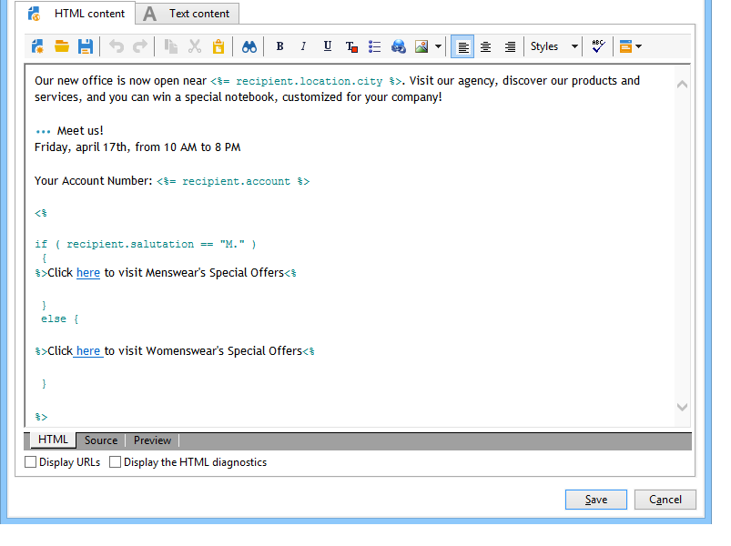
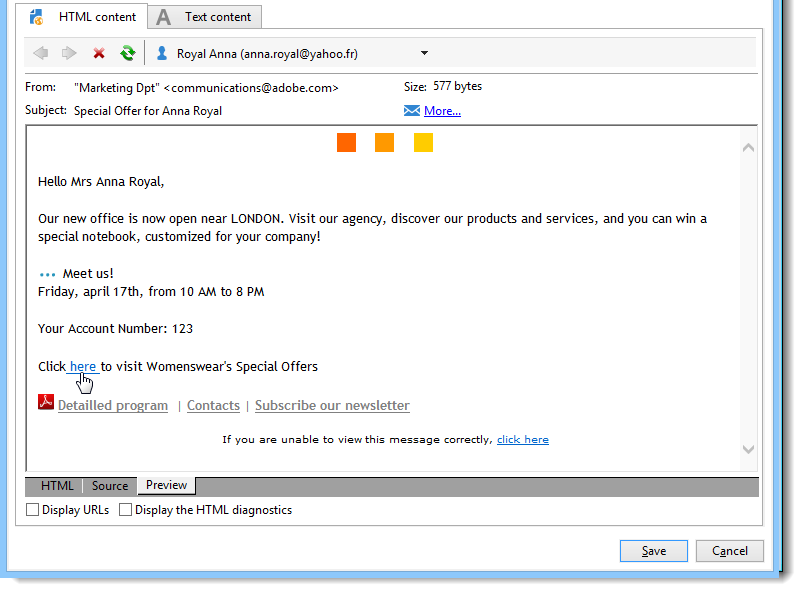

# Contenido condicional{#conditional-content}

Al configurar los campos de contenido condicional, se puede crear una personalización dinámica basada en el perfil del destinatario, por ejemplo. Los bloques de texto o las imágenes se sustituyen cuando se cumple una condición concreta.

 [Descubra esta función en vídeo](#conditionnal-content-video)


## Uso de condiciones en un correo electrónico {#using-conditions-in-an-email}

En el siguiente ejemplo, puede aprender a crear un mensaje personalizado de forma dinámica según el género y los intereses del destinatario.

* Mostrar &quot;Mr.&quot; o &quot;Ms.&quot; según el valor del campo **[!UICONTROL Gender]** (M o F) en la fuente de datos,
* Conjunto personalizado de un boletín u ofertas promocionales según los intereses indicados o detectados:

   * Interés 1 -- > Bloque 1
   * Interés 2 -- > Bloque 2
   * Interés 3 -- > Bloque 3
   * Interés 4 -- > Bloque 4

Para crear contenido condicional según el valor de un campo, aplique los pasos siguientes:

1. Haga clic en el icono de personalización y seleccione **[!UICONTROL Conditional content > If]**.

   

   Los elementos de personalización se insertan en el cuerpo del mensaje. Ahora debe configurarlos.

1. A continuación, rellene los parámetros de la expresión **if**.

   Para ello:

   * Seleccione el primer elemento de la expresión, **`<field>`** (de forma predeterminada, este elemento se resalta al insertar la expresión **if**), y haga clic en el icono de personalización para reemplazarlo por el campo de prueba.

      

   * Reemplace **`<value>`** por el valor del campo para el que se debe cumplir la condición. Este valor debe estar entre comillas.
   * Especifique el contenido que desea que se inserte cuando se cumpla la condición. Este contenido puede consistir en un texto, una imagen, un formulario, un vínculo de hipertexto, etc.

      

1. Haga clic en la pestaña **[!UICONTROL Preview]** para ver el contenido del mensaje según el destinatario de la entrega:

   * Selección de un destinatario para el cual la condición es verdadera:

      

   * Selección de un destinatario para el cual la condición no es verdadera:

      

Se pueden añadir otros casos y definir contenido diferente según los valores de uno o varios campos. Para ello, utilice **[!UICONTROL Conditional content > Else]** y **[!UICONTROL Conditional content > Else if]**. Estas expresiones se configuran del mismo modo que la expresión **if**.



>[!CAUTION]
>
>Para respetar la sintaxis de JavaScript, los caracteres **%> &lt;%** deben eliminarse después de añadir las condiciones **Else** y **Else if**

Haga clic en **[!UICONTROL Preview]** y seleccione un destinatario para ver el contenido condicional.



## Creación de un correo electrónico multilingüe {#creating-multilingual-email}

En el siguiente ejemplo, puede aprender a crear un correo electrónico multilingüe. El contenido se muestra en un idioma o en otro según el idioma preferido del destinatario.

1. Cree un correo electrónico y seleccione la población objetivo. En este ejemplo, la condición para mostrar una versión o la otra se basa en el valor **Language** del perfil del destinatario. En este ejemplo, estos valores se establecen en **EN**, **FR** y **ES**.
1. En el contenido HTML del correo electrónico, haga clic en la pestaña **[!UICONTROL Source]** y pegue el código siguiente:

   ```
   <% if (language == "EN" ) { %>
   <DIV id=en-version>Hello <%= recipient.firstName %>,</DIV>
   <DIV>Discover your new offers!</DIV>
   <DIV><a href="https://www.adobe.com/products/en">www.adobe.com/products/en</A></FONT></DIV><%
    } %>
   <% if (language == "FR" ) { %>
   <DIV id=fr-version>Bonjour <%= recipient.firstName %>,</DIV>
   <DIV>Découvrez nos nouvelles offres !</DIV>
   <DIV><a href="https://www.adobe.com/products/fr">www.adobe.com/products/fr</A></DIV><%
    } %>
    <% if (language == "ES" ) { %>
   <DIV id=es-version><FONT face=Arial>
   <DIV>Olà <%= recipient.firstName %>,</DIV>
   <DIV>Descubra nuestros nuevas ofertas !</DIV>
   <DIV><a href="https://www.adobe.com/products/es">www.adobe.com/products/es</A></DIV>
   <% } %>
   ```

1. Pruebe el contenido de los correos electrónicos en la pestaña **[!UICONTROL Preview]** seleccionando destinatarios con diferentes idiomas preferidos.

   >[!NOTE]
   >
   >Como no se ha definido ninguna versión alternativa en el contenido de correo electrónico, asegúrese de filtrar la población de destino antes de enviar el correo electrónico.

## Videotutorial {#conditionnal-content-video}

Aprenda a añadir contenido condicional a un envío con el ejemplo de una newsletter multilingüe.

>[!VIDEO](https://video.tv.adobe.com/v/24926?quality=12)

Hay disponibles más vídeos de procedimientos para Campaign Classic [aquí](https://experienceleague.adobe.com/docs/campaign-classic-learn/tutorials/overview.html?lang=es).
